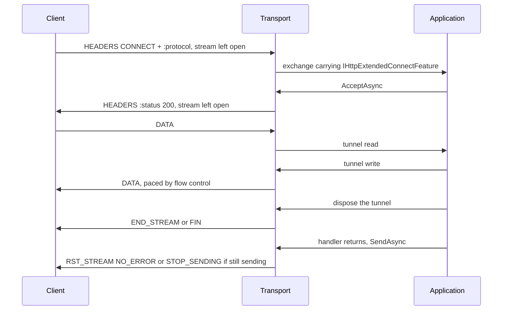

# Assimalign.Cohesion.Http.Connections design

Design decisions and ownership boundaries for `Assimalign.Cohesion.Http.Connections`.

[Overview](index.md) · [Examples](examples/index.md)

## Design and boundaries

The package consumes `IConnection` and `IMultiplexedConnection` rather than owning a second
transport stack. Protocol handling uses the core feature and interceptor seams, allowing optional
concerns to attach without reverse references from the transport.

A host drives each connection context in a loop and finalizes every exchange exactly once through
`SendAsync`: HTTP/1.1 exchanges one at a time, HTTP/2 and HTTP/3 exchanges concurrently, bounded by
stream admission. After an application fault, `HttpContextTransportExtensions.HasResponseStarted`
tells the host whether a replacement response can still be sent or the exchange must be reset. All
three versions enforce `MaxRequestBodySize` with `413`: HTTP/1.1 and HTTP/3 dispatch at the request
head and read the body lazily, while HTTP/2 freezes the cap at dispatch and enforces it on receipt.

## Graceful close: the host contract

A host stops a connection in two steps (#146). `IHttpConnectionContext.BeginGracefulClose` starts a
lame-duck close: the connection takes no new exchange and announces the close the way its version
requires, while every exchange already yielded keeps its request body and its `SendAsync`.
`ReceiveAsync` then ends on its own once nothing more can arrive, so a host's receive loop
completes without being cancelled. When the host stops waiting, it cancels the token it enumerates
`ReceiveAsync` with: every exchange the connection yielded observes `RequestCancelled`, on all three
versions. The call returns at once; a frame it needs is written in the background, and the
connection's disposal waits for it. Calls after the first do nothing.

| Version | Announcement | New work after the call | `ReceiveAsync` ends |
| --- | --- | --- | --- |
| HTTP/1.1 (RFC 9112 §9.6) | `Connection: close` on the response to the exchange in flight | not read; an idle keep-alive wait ends at once without a response, but a request whose head started to arrive is read and answered with `Connection: close` | after the exchange in flight, or at once when idle |
| HTTP/2 (RFC 9113 §6.8) | `GOAWAY(NO_ERROR)` carrying the highest stream accepted | a new stream, or one whose header block was still arriving, is refused with `RST_STREAM(REFUSED_STREAM)` | once the contexts already queued are read |
| HTTP/3 (RFC 9114 §5.2) | `GOAWAY` carrying the first stream not accepted, once the accept loop has stopped | not accepted; a request whose head was still arriving is reset with `H3_REQUEST_REJECTED` | after the requests already published |

The seam is a member of the context contract rather than a capability interface a host type-tests
for: every context this package produces implements it, and a host that drains should not have to
discover whether it can. `HttpConnectionContext` declares it abstract, so an implementation outside
this repository must add it. Two alternatives were rejected: a second token on `ReceiveAsync`,
because on HTTP/1.1 and HTTP/3 the enumeration token already is each exchange's abort token and a
token cannot carry the announcement a version needs; and draining inside disposal only, because
disposal must be bounded and a host disposes a connection only after its own exchanges are done.

Two version details make the contract hold:

- **HTTP/1.1** — the read-timeout phase is an interlocked latch, so the close and the first octet
  of a racing request cannot both win: either the wait is reclaimed as idle, or the request that
  started to arrive is read under its request-headers deadline and answered with
  `Connection: close`. A response head committed before the close began goes out without
  `Connection: close`; the connection still ends after it, which RFC 9112 §9.5 permits at any time.
- **HTTP/2** — a frame pump stopped by cancellation aborts every live stream, a fully received
  request included, so cancelling the receive token cancels every exchange the connection yielded,
  as HTTP/1.1 and HTTP/3 already did. The teardown (`GracefulCloseAsync`) begins the close itself
  when no host did, and its own drain stays bounded.

`Web.Hosting`'s `WebApplicationServer` is the reference host: its lame-duck drain begins every
connection's graceful close when a stop begins and cancels the receive token only when the stop's
budget runs out.

## Serving HTTP/1.1 and HTTP/2 on one TLS listener (ALPN)

An `https` origin is expected to answer HTTP/2 and HTTP/1.1 on one port: the client offers the
protocols it speaks in the TLS handshake through ALPN (RFC 7301), the server selects one, and the
connection speaks it (RFC 9113 §3.2 identifies HTTP/2 over TLS as `h2`).
`UseHttp1AndHttp2(listener, configureHttp1, configureHttp2)` registers such a listener;
`UseHttp1AndHttp2(listener)` uses default options, and both have a `Func<IConnectionListener>`
form whose listener is created, and its capabilities validated, when the `HttpConnectionListener`
is constructed. Each protocol keeps its own options, captured at registration like those of
`UseHttp1`/`UseHttp2`, and both share the listener-wide interceptors. The registration's gate adds
one capability: ALPN is a TLS extension, so the listener must report `Security == Tls`, else an
`ArgumentException` names the mismatch.

Each connection is dispatched by the protocol its handshake negotiated, read through the contracts
library's `ITlsConnectionInfo`:

| Negotiated | Served |
|---|---|
| `h2` | HTTP/2 |
| `http/1.1` | HTTP/1.1 |
| none: the client sent no ALPN extension, or the connection does not implement `ITlsConnectionInfo` | HTTP/1.1, what a client that does not negotiate expects of an `https` origin |
| anything else, which the server offered through an application-supplied list (`acme-tls/1`, say) | the connection is closed; the listener keeps serving other connections |

The registration carries an internal `HttpAlpnConnectionFactory` in place of a single protocol's
factory. It holds the HTTP/1.1 and the HTTP/2 factory and picks one per connection; a factory that
cannot serve a connection returns `null`, and that one connection is disposed instead of being
treated as a listener fault. The `Alt-Svc` value is pushed into both inner factories, so an HTTP/1.1
and an HTTP/2 response from the endpoint advertise the same h3 alternative, and the listener
reports both protocols in `HttpConnectionListener.Protocols`.

- **The transport owns the choice.** Picking the connection parser is transport work; the host only
  exposes the surface (`Web.Hosting`'s `UseHttps`).
- **Not preface sniffing.** Detecting the HTTP/2 connection preface is how prior knowledge works on
  cleartext (RFC 9113 §3.3). On a TLS connection the handshake has already decided, and RFC 9113
  §3.2 makes ALPN the way HTTP/2 starts for `https`.
- **Unknown protocols close rather than fall back to HTTP/1.1.** RFC 7301 §3.2 binds the connection
  to the protocol the handshake selected; speaking HTTP/1.1 on it would answer a client that agreed
  to something else.
- **TLS only.** A cleartext listener has no ALPN, so the registration rejects it; HTTP/2 prior
  knowledge and the deprecated `h2c` upgrade on a shared cleartext port are not supported. The
  single-protocol registrations ignore ALPN: `UseHttp1` and `UseHttp2` on a TLS listener serve their
  one protocol whatever was negotiated, so their TLS options should offer only that protocol.
- **The HTTP/2-over-TLS profile of RFC 9113 §9.2** (TLS 1.2 or later, the TLS 1.2 cipher-suite
  blocklist) is left to the TLS options; the transport does not inspect the negotiated version or
  suite before serving `h2`.

## Accept-side isolation: where the handshake runs (#1304)

The transport listener keeps one connection's failure away from the accept loops here. A TLS
handshake never runs in an accept loop in this package. The TLS-layered listener (`UseTls`) runs
each connection's handshake on its own task, at most `TlsServerOptions.MaxConcurrentHandshakes` at
a time, and `AcceptAsync` returns only connections whose handshake completed.
- **A failed TLS handshake** closes that connection, is reported by the
  `Assimalign.Cohesion.Connections` event source, and never reaches the accept loop. Failures
  include garbage bytes, a client the certificate policy refuses, and a silent client that times
  out.
- **QUIC handshakes** are contained the same way by the QUIC driver, which reports them from its
  own event source.
- **A client that resets while queued** is skipped by the TCP driver (#1308). Windows fails that
  accept with `ConnectionReset`.

So a slow client never delays another client's accept, and one client never stops an endpoint.

That is the contract of `AcceptAsync` on both listener shapes: a listener contains each
connection's failure, so whatever escapes it is the listener's own. The accept loops rely on it:

- **An exception from `AcceptAsync` is fatal to the `HttpConnectionListener`.** The accept loop
  completes the backlog channel with the listener's exception before it cancels the internal
  dispose token. It also records the exception, so accepts that begin after the cancellation
  rethrow it too. The host therefore sees the transport's root-cause exception from
  `AcceptOrListenAsync`, never a bare `ObjectDisposedException`.
- **Only this listener's own cancellation ends a loop quietly.** Before #1304 any
  `OperationCanceledException` did, so a TLS handshake that timed out inside the transport's
  `AcceptAsync` silently ended that endpoint's accepts. A cancellation this listener did not request
  is now the transport's failure. The Web server's accept loop applies the same rule (#1310).

Rejected: classifying exceptions in the accept loop and continuing on the ones that look like a
connection's. The loop cannot tell them apart:
- A handshake timeout throws `OperationCanceledException`, the type a disposed in-memory listener
  throws.
- Garbage bytes throw `IOException`, the family of transport I/O failures.

A wrong guess either stops the server or spins on a dead listener. The component that ran the
handshake knows which failure it was, so it decides.

## The TLS session on every exchange

Every exchange that arrived over TLS carries the core's `IHttpTlsConnectionFeature`: the client
certificate, the TLS protocol version, the cipher suite, and the application protocol ALPN
selected. The transport does not run TLS, so it copies these from the connection that did, through
`ITlsConnectionInfo`; a connection that does not implement it (cleartext, or secured by a layer that
does not report its handshake) gives its exchanges no feature.

| Version | Source of the session |
|---|---|
| HTTP/1.1, HTTP/2 | the accepted `IConnection`, which the TLS layer secured |
| HTTP/3 | the accepted `IMultiplexedConnection`: QUIC's own TLS 1.3 handshake (RFC 9001) |

The internal `HttpTlsConnectionFeature` is built once per connection when its context opens and set
on each exchange as the exchange is produced: after the request-parse interceptors have run and
before the response interceptors' `BeforeResponse`, so response hooks and middleware see it and
request-parse hooks do not. One immutable instance serves all of a connection's exchanges, which is
safe for concurrent HTTP/2 and HTTP/3 streams. It is not disposable, because an exchange's disposal
walk disposes the disposable features it carries and the session outlives every exchange: the
certificate belongs to the connection, which disposes it when it is disposed. The session is fixed
at the handshake; there is no renegotiation or post-handshake client authentication, which HTTP/2
forbids anyway (RFC 9113 §9.2.1, §9.2.3).

## Response interceptors per exchange: the fast path

The listener partitions its interceptors by their declared `HttpInterceptorScopes` once, and the
response-scoped machinery — the raw response body sink and the exchange control — exists only for an
exchange that has a response interceptor. A request-parse hook can also add an interceptor to its
own exchange's response phase (`HttpExchangeInterceptorRequestContext.AddResponseInterceptor`).
Each transport resolves the exchange's response interceptors at setup (the listener's, then the
added ones, each once) and builds the sink and control only when that list is not empty. So the
protocol-upgrade interceptor `Web.Hosting` installs by default, which declares the request scope and
joins the response phase only of an HTTP/1.1 upgrade or `CONNECT`, costs an ordinary exchange
nothing on any version. While that interceptor declared both scopes, every exchange on every version
built a sink, an exchange control and a response context for it; the transport's tests now pin the
fast path for an ordinary request on all three versions and for an HTTP/2 and HTTP/3 extended
CONNECT.

## Trailers on HTTP/2 and HTTP/3

Trailers (RFC 9110 §6.5) are HTTP semantics, decided apart from gRPC (decision 18, the Http area's
ADR 2 in `cohesion/docs/libraries/Http/DECISIONS.md`). Every version surfaces a request's trailer
section on `Request.Trailers`, a supported collection that stays empty until the body has been read
to its end: HTTP/1.1 for a chunked request, HTTP/3 from a trailing HEADERS frame, and HTTP/2 as
below. HTTP/2 and HTTP/3 also send response trailers; HTTP/1.1 does not.

**HTTP/2 request trailers: every field block is decoded (#1314).** HPACK is stateful (RFC 7541): a
field block can add entries to the connection's dynamic table, and later blocks reference them, so
RFC 9113 §4.3 requires every block to be decoded. A trailing HEADERS frame used to be appended to
the stream's header buffer after the head was decoded and never decoded itself, so a trailer field
the client indexed left the server's decoder out of step for every later request on the connection.
The frame pump now treats the trailer section as a field block of its own:

- **Accumulation.** A HEADERS frame that arrives once the head is in (it must carry `END_STREAM`)
  starts a fresh block under the head's raw-size bound, the CONTINUATION-flood defence;
  CONTINUATION frames extend it.
- **Decoding** happens in frame order as soon as `END_HEADERS` completes the block, whether or not
  the application ever reads the body. The whole block is decoded before any field is judged, so a
  malformed section still leaves the decoder in step.
- **Validation.** `HttpTrailerFieldRules`, shared with HTTP/3, rejects a pseudo-header, an uppercase
  field name, a connection-specific field, and the fields RFC 9110 §6.5.1 excludes from trailers. A
  CONNECT stream carries only DATA after its head, so any trailer section on it is malformed. A
  violation fails the body pipe with an `IOException` first, then resets the stream with
  `PROTOCOL_ERROR`; the connection keeps serving.
- **Exposure.** The pump parks the validated fields on the stream; the request body copies them into
  `Request.Trailers` when its reader reaches the clean end of the body, on the reader's own thread.
- **Limits.** The decoded section counts against `MaxRequestHeaderListSize` on its own. Going over
  leaves the dynamic table indeterminate, so it is the connection error `ENHANCE_YOUR_CALM`, as for a
  head; a block that is not valid HPACK is `COMPRESSION_ERROR`.

Two alternatives fail on HPACK: decoding at the body read, as HTTP/3 does (QPACK inserts on its
encoder stream, so an unread section can be skipped; HPACK inserts inside the blocks), and validating
while decoding (rejecting a field mid-block abandons the rest of the block, so every violation would
cost the connection). A handler that answers without reading the whole body makes the server reset
the stream with `NO_ERROR`, and the client may already have sent its trailers, so the connection
remembers the most recent 128 streams it reset while the peer was still sending, and decodes and
drops a trailer section that arrives for one of them. HTTP/3 applies the same validation, which now
rejects the whole RFC 9110 §6.5.1 set rather than only connection-specific fields, `Content-Length`
and `Host`.

**Response trailers (#1315).** The fields an application stages on `Response.Trailers` before the
response completes go out after the body, on the buffered and the streaming path alike:

| Path | HTTP/2 (RFC 9113 §8.1) | HTTP/3 (RFC 9114 §4.1) |
|---|---|---|
| Buffered `SendAsync` | HEADERS, DATA frames without `END_STREAM`, then the trailer HEADERS [+ CONTINUATION] block carrying `END_STREAM`. With no content: HEADERS, then the trailer block. | HEADERS, DATA, then a HEADERS frame, then the FIN. |
| Streaming sink | The trailer HEADERS block carries `END_STREAM` in place of the empty DATA frame. | A HEADERS frame after the last DATA frame, then the FIN. |

- **No trailers, no change.** The send path writes a trailer section only when the collection holds
  a field, so a response that never staged one goes out byte for byte as before.
- **Refused when added.** A pseudo-header, a connection-specific field, or a field RFC 9110 §6.5.1
  prohibits in trailers throws `ArgumentException` from `Add` or the indexer.
- **When they are read.** The buffered path reads them at `SendAsync`, the streaming path when the
  sink completes, so a field added later is not sent. The transport adds no `Trailer` header; an
  application that wants the declaration sets it.
- **HEAD** sends no trailer section, though the collection stays supported, so a handler shared with
  GET stages trailers without branching on the method. **CONNECT** reports the collection
  unsupported, because a tunnel carries only DATA. A transport-generated `413` drops staged trailers.
- **HTTP/1.1 keeps `IsSupported = false`** (decision 18): a buffered HTTP/1.1 response carries
  `Content-Length`, and HTTP/1.1 clients rarely consume chunked trailers.

## Connection-specific fields in HTTP/2 and HTTP/3 response heads

RFC 9113 §8.2.2 and RFC 9114 §4.2 make a message carrying `Connection`, `Keep-Alive`,
`Proxy-Connection`, `Transfer-Encoding` or `Upgrade` malformed, and allow `TE` only as `trailers`;
a client may reset a stream that carries one. An application, middleware written for HTTP/1.1, or a
proxy can set these fields, so the HTTP/2 and HTTP/3 encoders skip them while they encode a response
head (#1328):

- **One rule, every head.** `HttpResponseFieldRules.IsSendable` covers the buffered head, the
  streamed head, early hints and every other interim response, and an extended CONNECT tunnel's
  `200`. `TE: trailers` is the one value kept.
- **The wire, not the collection.** The field is skipped without being removed from
  `Response.Headers`, so a component that set it and reads it back still sees it.
- **Dropped, not refused.** A head that carries such a field is still sent: the field means nothing
  on these versions, and a response built without knowing the version should not fail on one of
  them. Trailers differ, because the trailer collection exists only where HTTP/2 or HTTP/3 sends it,
  so it refuses such a field when it is staged.
- **Transport-built heads** carry only fields the transport chose, and HTTP/1.1, where these fields
  have meaning, does not use the rule.

## HTTP/2 frames and request bodies

**A frame is written in one piece (#1326).** `Http2FrameWriter` hands each frame to the connection's
stream in a single write — header, fixed fields and payload together — and writes a HEADERS frame
with all of its CONTINUATION frames as one write too. The connection's pipe copies a write's octets
before it waits for room, and a cancelled token cuts the wait short, not the copy, so a frame written
as two writes could be cut between them: the peer would read a header that claims a payload that
never follows and misread every later frame, tearing down all of the connection's streams. A header
block cut after its HEADERS frame breaks RFC 9113 §6.10 the same way. With one write per frame and
per block, a caller's token is observed only before a frame starts or after its last octet is handed
over. The cost is one pooled buffer and one copy per frame.

**A body cut off by a reset faults (#1327).** Only `END_STREAM` completes a request body cleanly
(RFC 9113 §8.1). A body cut off by a peer `RST_STREAM`, the server's own reset, or the loss of the
connection fires the stream's abort first and then fails the body pipe with an `IOException`.
Completing the pipe first used to wake a parked reader with a clean end of the body, so a truncated
upload, with or without a `content-length`, read as complete. A reader now sees an
`OperationCanceledException` or the pipe's `IOException`, never a clean end, and the request's
trailer section is published only at a clean end. HTTP/3 needed no change: its body reads the
request stream directly, and a reset or a closed connection fails that read.

## HTTP/3: a client's cancellation fires `RequestCancelled` (#1329)

A client cancels an HTTP/3 request by resetting the request stream (`RESET_STREAM`) and stopping the
response (`STOP_SENDING`), usually with `H3_REQUEST_CANCELLED` (RFC 9114 §4.1.1). HTTP/3 has no
frame pump that would see either signal, so an application that was neither reading nor writing
used to keep working on a request whose client had gone, where HTTP/2's `RST_STREAM` fires
`RequestCancelled` at once. The signal now comes from the connection drivers: a multiplexed stream's
`ConnectionClosed` fires when its peer abandons the stream, and `Http3Context` links it with the
receive token into the source behind `RequestCancelled`.

- **Either direction cancels.** A `RESET_STREAM` alone, a `STOP_SENDING` alone, and both fire the
  token. A pipeline that honors it unwinds, and the host resets the exchange
  (`H3_REQUEST_CANCELLED`) instead of answering it.
- **The server's own reset fires it too**, as HTTP/2's reset fires its abort.
- **A completed exchange is left alone.** A clean FIN is a half-close, not an abort, and the server
  stopping or releasing the stream after the response is a local operation, so neither fires the
  token.
- **Connection loss** cancels an exchange in flight on the QUIC driver, whose stream halves fault
  when the connection is lost.

## Extended CONNECT: the tunnel

Extended CONNECT (RFC 8441 for HTTP/2, RFC 9220 for HTTP/3) lets a client run another protocol —
most commonly WebSocket — over one stream by sending a `CONNECT` that also carries `:protocol`. The
transport validates it and installs the core's `IHttpExtendedConnectFeature` at dispatch, so
response interceptors and the application see it from the start; ordinary requests and a classic
`CONNECT` carry none. The feature used to travel as a `:protocol` string under an `IHttpContext.Items`
key; a string cannot carry an accept call, so that bridge is gone (#1316). `AcceptAsync` turns the
exchange's stream into a duplex tunnel (RFC 8441 §5, RFC 9220 §3). The sequence shows a tunnel's
life from the request to the end of the exchange.

- **Accepting** works at most once, never after the final response started and never on a cancelled
  exchange (`InvalidOperationException`), and never on a stream already gone (`IOException`). The
  head is a `200` with the headers the application set, minus `Content-Length` and the
  connection-specific fields; it gets no `Alt-Svc` advertisement.
- **Takeover.** Accepting registers the tunnel before the head is written, so the exchange reports a
  takeover: the raw response sink refuses to commit a head, `SendAsync` finalizes the tunnel instead
  of writing the application's response, and the interceptors' response-head and after-response
  hooks do not run, as for an HTTP/1.1 upgrade. A host whose handler faults after accepting resets
  the stream rather than writing a `500`.
- **Reads** drain the transport's own request body, outside the body-size cap and the
  `Content-Length` rule (RFC 9110 §9.3.6). A read returns 0 only at the peer's `END_STREAM` or FIN; a
  reset or a torn-down connection is an `IOException`.
- **Writes** are unbuffered. HTTP/2 splits a write into `DATA` frames under both send windows and
  flushes at once; HTTP/3 frames `DATA` into the request stream's output, paced by QUIC's flow
  control. A write on a reset stream faults, and cancellation is honored only while a write waits.
- **Closing.** Disposing ends the server's side: an empty `DATA` frame with `END_STREAM`, or the
  HTTP/3 FIN. `Dispose` starts the close and returns, because the BCL WebSocket disposes its stream
  synchronously; `DisposeAsync` and `SendAsync` wait for it.
- **Ending the exchange.** When the handler returns, `SendAsync` ends a tunnel left open, then stops a
  client still sending: `RST_STREAM(NO_ERROR)` on HTTP/2, `STOP_SENDING(H3_NO_ERROR)` on HTTP/3. A
  cancelled exchange, or a tunnel whose head never reached the wire, is reset instead
  (`RST_STREAM(CANCEL)`, `H3_REQUEST_CANCELLED`). No second head is ever written.
- **Lifetime.** An open tunnel is an in-flight exchange: it holds its stream against
  `SETTINGS_MAX_CONCURRENT_STREAMS` or QUIC's stream limit, and a graceful close waits for it only
  within the drain window.

**Known limitation: half-close on the QUIC driver.** Completing a QUIC stream's output — the FIN —
disposes the stream, which also stops its read side, so on real QUIC a server that ends its side
first cannot read what the client still sends. A WebSocket closes after its close handshake, when
nothing more is expected, so it is unaffected. A write-only half-close needs a per-direction
completion on `IConnection`, follow-up work in `Assimalign.Cohesion.Connections`. The in-memory
driver half-closes exactly.

## Diagnostics

This package raises no events and has no event source. Until #1039 it carried an empty placeholder,
`HttpTransportEventSource`: the right name, but no singleton and no events. It was deleted rather
than filled, because what an HTTP-level source could report is either reported elsewhere already or
needs a design of its own:

| What an operator wants | Where it comes from |
| --- | --- |
| Per-request latency, status, route, errors and trace context | The Web server's `ActivitySource` and `Meter`, `Assimalign.Cohesion.Web.Hosting` (#1064). The host sees the whole exchange and how its pipeline ended; the transport sees neither. |
| Connection lifetimes and counts | Each connection driver's event source (`Assimalign.Cohesion.Connections.Tcp`, `.Quic`, `.NamedPipes`). An HTTP/1.1 or HTTP/2 connection is one driver connection and an HTTP/3 connection is one QUIC connection, so an HTTP-level `Opened`/`Closed` pair and a second `current-connections` counter would count the same connections twice under two names. |
| TLS handshakes | The runtime's `System.Net.Security` source. A handshake that failed or timed out, and the connection closed for it: `Assimalign.Cohesion.Connections` (`UpgradeFailed`) for TCP endpoints, `Assimalign.Cohesion.Connections.Quic` (`HandshakeFailed`) for HTTP/3. |
| Requests this package answers itself before dispatch (400, 408, 413, 414, 431), and protocol errors (HTTP/2 `GOAWAY` and `RST_STREAM` codes, the flood guards' `ENHANCE_YOUR_CALM`, HTTP/3 error codes) | Not reported yet. |

The last row is the remaining gap, and filling a placeholder would not close it. It needs an error
vocabulary per protocol, a choice between events and metric instruments, and hooks in all three
transports. If that work lands as events, it adds a source named
`Assimalign.Cohesion.Http.Connections` that follows the repository's event-source rule. Until then
an assembly that raises nothing has no event source, so no empty provider advertises a name that
tools can enable and that never reports anything.

## Dependency boundary

The declared build inputs are `Assimalign.Cohesion.Connections`, `Assimalign.Cohesion.Http`. The
[overview](index.md#dependencies) distinguishes project references, package references, shared
source, and analyzer inputs.

## Sources

- **Source** — `cohesion/libraries/Http/Assimalign.Cohesion.Http.Connections/src/Assimalign.Cohesion.Http.Connections.csproj`.

- **Source** — `cohesion/libraries/Directory.Build.props`.

- **Source** — `cohesion/libraries/Http/Assimalign.Cohesion.Http.Connections/docs/DESIGN.md`.

- **Source** — `cohesion/libraries/Http/README.md`.

- **Source** — `cohesion/libraries/Http/Assimalign.Cohesion.Http.Connections/src`.

- **Source** — `cohesion/docs/libraries/Http/DECISIONS.md`.
