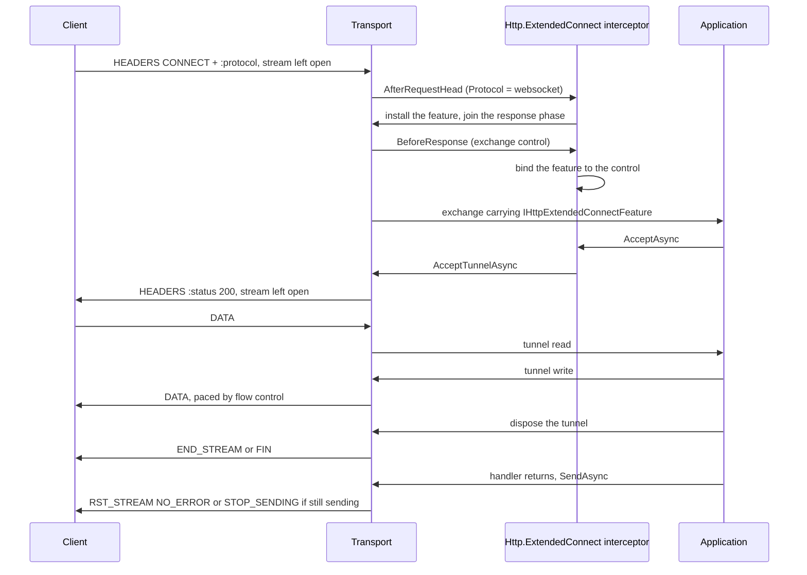

# Assimalign.Cohesion.Http.Connections design

Design decisions and ownership boundaries for `Assimalign.Cohesion.Http.Connections`.

[Overview](index.md) · [Examples](examples/index.md)

## Design and boundaries

The package consumes `IConnection` and `IMultiplexedConnection` rather than owning a second
transport stack. Protocol handling uses the core feature and interceptor seams, allowing optional
concerns to attach without reverse references from the transport.

A host drives each connection context in a loop and finalizes every exchange exactly once through
`SendAsync`: HTTP/1.1 exchanges one at a time, HTTP/2 and HTTP/3 exchanges concurrently, bounded by
stream admission. After an application fault, `HttpContextTransportExtensions.HasResponseStarted`
tells the host whether a replacement response can still be sent or the exchange must be reset. All
three versions enforce `MaxRequestBodySize` with `413`: HTTP/1.1 and HTTP/3 dispatch at the request
head and read the body lazily, while HTTP/2 freezes the cap at dispatch and enforces it on receipt.
Since #1085 every version also enforces `KeepAliveTimeout`, `RequestHeadersTimeout` and
`MinRequestBodyDataRate` (see
[connection timeouts and data rates](#http2-and-http3-connection-timeouts-and-data-rates-1085)).

## Graceful close: the host contract

A host stops a connection in two steps (#146). `IHttpConnectionContext.BeginGracefulClose` starts a
lame-duck close: the connection takes no new exchange and announces the close the way its version
requires, while every exchange already yielded keeps its request body and its `SendAsync`.
`ReceiveAsync` then ends on its own once nothing more can arrive, so a host's receive loop
completes without being cancelled. When the host stops waiting, it cancels the token it enumerates
`ReceiveAsync` with: every exchange the connection yielded observes `RequestCancelled`, on all three
versions. The call returns at once; a frame it needs is written in the background, and the
connection's disposal waits for it. Calls after the first do nothing.

| Version | Announcement | New work after the call | `ReceiveAsync` ends |
| --- | --- | --- | --- |
| HTTP/1.1 (RFC 9112 §9.6) | `Connection: close` on the response to the exchange in flight | not read; an idle keep-alive wait ends at once without a response, but a request whose head started to arrive is read and answered with `Connection: close` | after the exchange in flight, or at once when idle |
| HTTP/2 (RFC 9113 §6.8) | `GOAWAY(NO_ERROR)` carrying the highest stream accepted | a new stream, or one whose header block was still arriving, is refused with `RST_STREAM(REFUSED_STREAM)` once its header block is decoded | once the contexts already queued are read |
| HTTP/3 (RFC 9114 §5.2) | `GOAWAY` carrying the first stream not accepted, once the accept loop has stopped | not accepted; a request whose head was still arriving is reset with `H3_REQUEST_REJECTED` | after the requests already published |

The seam is a member of the context contract rather than a capability interface a host type-tests
for: every context this package produces implements it, and a host that drains should not have to
discover whether it can. `HttpConnectionContext` declares it abstract, so an implementation outside
this repository must add it. Two alternatives were rejected: a second token on `ReceiveAsync`,
because on HTTP/1.1 and HTTP/3 the enumeration token already is each exchange's abort token and a
token cannot carry the announcement a version needs; and draining inside disposal only, because
disposal must be bounded and a host disposes a connection only after its own exchanges are done.

Two version details make the contract hold:

- **HTTP/1.1** — the read-timeout phase is an interlocked latch, so the close and the first octet
  of a racing request cannot both win: either the wait is reclaimed as idle, or the request that
  started to arrive is read under its request-headers deadline and answered with
  `Connection: close`. A response head committed before the close began goes out without
  `Connection: close`; the connection still ends after it, which RFC 9112 §9.5 permits at any time.
- **HTTP/2** — a frame pump stopped by cancellation aborts every live stream, a fully received
  request included, so cancelling the receive token cancels every exchange the connection yielded,
  as HTTP/1.1 and HTTP/3 already did. The teardown (`GracefulCloseAsync`) begins the close itself
  when no host did, and its own drain stays bounded.

`Web.Hosting`'s `WebApplicationServer` is the reference host: its lame-duck drain begins every
connection's graceful close when a stop begins and cancels the receive token only when the stop's
budget runs out.

## Serving HTTP/1.1 and HTTP/2 on one TLS listener (ALPN)

An `https` origin is expected to answer HTTP/2 and HTTP/1.1 on one port: the client offers the
protocols it speaks in the TLS handshake through ALPN (RFC 7301), the server selects one, and the
connection speaks it (RFC 9113 §3.2 identifies HTTP/2 over TLS as `h2`).
`UseHttp1AndHttp2(listener, configureHttp1, configureHttp2)` registers such a listener;
`UseHttp1AndHttp2(listener)` uses default options, and both have a `Func<IConnectionListener>`
form whose listener is created, and its capabilities validated, when the `HttpConnectionListener`
is constructed. Each protocol keeps its own options, captured at registration like those of
`UseHttp1`/`UseHttp2`, and both share the listener-wide interceptors. The registration's gate adds
one capability: ALPN is a TLS extension, so the listener must report `Security == Tls`, else an
`ArgumentException` names the mismatch.

Each connection is dispatched by the protocol its handshake negotiated, read through the contracts
library's `ITlsConnectionInfo`:

| Negotiated | Served |
|---|---|
| `h2` | HTTP/2 |
| `http/1.1` | HTTP/1.1 |
| none: the client sent no ALPN extension, or the connection does not implement `ITlsConnectionInfo` | HTTP/1.1, what a client that does not negotiate expects of an `https` origin |
| anything else, which the server offered through an application-supplied list (`acme-tls/1`, say) | the connection is closed; the listener keeps serving other connections |

The registration carries an internal `HttpAlpnConnectionFactory` in place of a single protocol's
factory. It holds the HTTP/1.1 and the HTTP/2 factory and picks one per connection; a factory that
cannot serve a connection returns `null`, and that one connection is disposed instead of being
treated as a listener fault. The `Alt-Svc` value is pushed into both inner factories, so an HTTP/1.1
and an HTTP/2 response from the endpoint advertise the same h3 alternative, and the listener
reports both protocols in `HttpConnectionListener.Protocols`.

- **The transport owns the choice.** Picking the connection parser is transport work; the host only
  exposes the surface (`Web.Hosting`'s `UseHttps`).
- **Not preface sniffing.** Detecting the HTTP/2 connection preface is how prior knowledge works on
  cleartext (RFC 9113 §3.3). On a TLS connection the handshake has already decided, and RFC 9113
  §3.2 makes ALPN the way HTTP/2 starts for `https`.
- **Unknown protocols close rather than fall back to HTTP/1.1.** RFC 7301 §3.2 binds the connection
  to the protocol the handshake selected; speaking HTTP/1.1 on it would answer a client that agreed
  to something else.
- **TLS only.** A cleartext listener has no ALPN, so the registration rejects it; HTTP/2 prior
  knowledge and the deprecated `h2c` upgrade on a shared cleartext port are not supported. The
  single-protocol registrations ignore ALPN: `UseHttp1` and `UseHttp2` on a TLS listener serve their
  one protocol whatever was negotiated, so their TLS options should offer only that protocol.
- **The HTTP/2-over-TLS profile of RFC 9113 §9.2** (TLS 1.2 or later, the TLS 1.2 cipher-suite
  blocklist) is left to the TLS options; the transport does not inspect the negotiated version or
  suite before serving `h2`.

## Accept-side isolation: where the handshake runs (#1304)

The transport listener keeps one connection's failure away from the accept loops here. A TLS
handshake never runs in an accept loop in this package. The TLS-layered listener (`UseTls`) runs
each connection's handshake on its own task, at most `TlsServerOptions.MaxConcurrentHandshakes` at
a time, and `AcceptAsync` returns only connections whose handshake completed.
- **A failed TLS handshake** closes that connection, is reported by the
  `Assimalign.Cohesion.Connections` event source, and never reaches the accept loop. Failures
  include garbage bytes, a client the certificate policy refuses, and a silent client that times
  out.
- **QUIC handshakes** are contained the same way by the QUIC driver, which reports them from its
  own event source.
- **A client that resets while queued** is skipped by the TCP driver (#1308). Windows fails that
  accept with `ConnectionReset`.
- **Running out of descriptors or buffers** does not reach the accept loop either: the TCP driver
  waits and retries, from 5 ms doubling to 1 s, so clients that hold enough connections open slow
  accepts down until some close instead of stopping the endpoint (#1312).

So a slow client never delays another client's accept, and one client never stops an endpoint.

That is the contract of `AcceptAsync` on both listener shapes: a listener contains each
connection's failure, so whatever escapes it is the listener's own. The accept loops rely on it:

- **An exception from `AcceptAsync` is fatal to the `HttpConnectionListener`.** The accept loop
  completes the backlog channel with the listener's exception before it cancels the internal
  dispose token. It also records the exception, so accepts that begin after the cancellation
  rethrow it too. The host therefore sees the transport's root-cause exception from
  `AcceptOrListenAsync`, never a bare `ObjectDisposedException`.
- **Only this listener's own cancellation ends a loop quietly.** Before #1304 any
  `OperationCanceledException` did, so a TLS handshake that timed out inside the transport's
  `AcceptAsync` silently ended that endpoint's accepts. A cancellation this listener did not request
  is now the transport's failure. The Web server's accept loop applies the same rule (#1310).

Rejected: classifying exceptions in the accept loop and continuing on the ones that look like a
connection's. The loop cannot tell them apart:
- A handshake timeout throws `OperationCanceledException`, the type a disposed in-memory listener
  throws.
- Garbage bytes throw `IOException`, the family of transport I/O failures.

A wrong guess either stops the server or spins on a dead listener. The component that ran the
handshake knows which failure it was, so it decides.

## The TLS session on every exchange

Every exchange that arrived over TLS has a connection info that also implements the contracts
library's `ITlsConnectionInfo`: the client certificate, the TLS protocol version, the cipher suite,
and the application protocol ALPN selected. The transport does not run TLS, so it copies these from
the connection that did, through that same interface; a connection that does not implement it
(cleartext, or secured by a layer that does not report its handshake) gives its exchanges a plain
`HttpConnectionInfo`.

| Version | Source of the handshake facts |
|---|---|
| HTTP/1.1, HTTP/2 | the accepted `IConnection`, which the TLS layer secured |
| HTTP/3 | the accepted `IMultiplexedConnection`: QUIC's own TLS 1.3 handshake (RFC 9001) |

The transport installs no HTTP TLS feature. It depends only on `Assimalign.Cohesion.Connections`
and core Http, and references neither the TLS layer nor the HTTP TLS feature package
(`Assimalign.Cohesion.Http.Tls`). Applications read the session as `context.TlsConnection` from
`Http.Tls`, which builds its `IHttpTlsConnectionFeature` from this facet on first read. Code that
needs only the raw facts reads `context.ConnectionInfo is ITlsConnectionInfo`.

**Where it is published.** The internal `HttpTlsConnectionInfo` derives from `HttpConnectionInfo`
and implements `ITlsConnectionInfo`. `HttpTlsConnectionInfo.Create` returns it when the accepted
connection reports a handshake and a plain `HttpConnectionInfo` otherwise, and it is called wherever
the transport builds a connection info:

- **HTTP/1.1 and HTTP/2** build one when the connection context opens
  (`HttpStreamConnectionContext`). Every exchange on the connection shares it.
- **HTTP/3** builds one per request stream, because each carries the stream's endpoints. The facet's
  values come from the multiplexed connection, captured once when `Http3ConnectionContext` opens.

The same instance goes to the request-parse interceptors' context, the exchange, and the response
interceptors' context. Request-parse hooks therefore see the session from `AfterRequestHead`
onward, through their context's `ConnectionInfo`. When the transport attached a feature instead,
those hooks could not see it, because they run before the exchange exists.

**Why a facet and not a feature.** Core Http holds base contracts only, and a concern-specific
feature lives in its own package (owner decision 20, 2026-10-09). The transport could install a
feature only by referencing the package that declares it. `Http.Connections` is a member of every
area's framework, so that reference would add the package to 18 framework lists, and it would make
the transport reference a feature package. A facet needs neither: the contracts library already
declares `ITlsConnectionInfo`, and the transport already references it. The per-exchange
`Features.Set` the transport used to make is gone too, so an exchange that never reads the session
pays nothing for it.

**Sharing and ownership.** The snapshot is immutable, which is safe for concurrent HTTP/2 and HTTP/3
streams. It copies the four values and never references the connection that ran the handshake:
`QuicMultiplexedConnection` is public, and a handler that could cast the connection info back to it
could open streams. The certificate is the connection's own instance, which the connection disposes
when it is disposed, so code that keeps it beyond the exchange copies it. A context wrapper that
returns a new connection info object hides the facet; the shipped wrappers forward the inner
context's object. The session is fixed at the handshake; there is no renegotiation or
post-handshake client authentication, which HTTP/2 forbids anyway (RFC 9113 §9.2.1, §9.2.3).

## Response interceptors per exchange: the fast path

The listener partitions its interceptors by their declared `HttpInterceptorScopes` once, and the
response-scoped machinery — the raw response body sink and the exchange control — exists only for an
exchange that has a response interceptor. A request-parse hook can also add an interceptor to its
own exchange's response phase (`HttpExchangeInterceptorRequestContext.AddResponseInterceptor`).
Each transport resolves the exchange's response interceptors at setup (the listener's, then the
added ones, each once) and builds the sink and control only when that list is not empty. So the
protocol-upgrade interceptor `Web.Hosting` installs by default, which declares the request scope and
joins the response phase only of an HTTP/1.1 upgrade or `CONNECT`, costs an ordinary exchange
nothing on any version. While that interceptor declared both scopes, every exchange on every version
built a sink, an exchange control and a response context for it. The extended CONNECT interceptor
the Web host also installs by default follows the same pattern and joins only an HTTP/2 or HTTP/3
extended CONNECT (see [the tunnel](#extended-connect-the-tunnel)).
`HttpExchangeResponseInterceptorTests` pins the fast path for an ordinary request on all three
versions under the Web host's three default interceptors, and pins that an HTTP/2 and HTTP/3
extended CONNECT joins the response phase.

## Sizing the feature collection: `ExchangeFeatureCapacity` (#1381)

Every exchange's collection is created at one of three sites: the HTTP/1.1 parser and
`HttpRequestInterceptorPipeline` (HTTP/2 and HTTP/3) when an interceptor is registered, or the
exchange context's constructor on the zero-interceptor fast path. All three size it for
`HttpConnectionListenerOptions.ExchangeFeatureCapacity`, a listener-wide count of the features an
ordinary exchange is expected to carry, snapshotted with the interceptors when the
`HttpConnectionListener` is constructed. The default, `0`, leaves the collection to grow as before,
and a negative value throws `ArgumentOutOfRangeException`. The parse-time collection becomes the
exchange's own, so it is sized for every feature the exchange will carry, not only the hooks'.

The seam is generic on purpose (owner decisions 20 and 36): the transport learns a number, not which
features a host installs. A host that stamps the same features onto every exchange sets it;
Web.Hosting does, from its application features plus the four it always installs. Without it, a host
stamping eight features onto a collection that grows from three slots pays for the 3-, 7- and
17-slot dictionaries on every exchange. With it, the collection allocates one dictionary of the
right size.

A feature beyond the count still works, but the dictionary grows from the size the count chose, and
that overflow can cost more than never presizing. An unsized dictionary grows through 3, 7, 17, 37,
89 and on, each the runtime's smallest table prime at least twice the last. A size between two of
those grows to another size between them: sized for 11, a twelfth feature grows the dictionary to 23
slots, and the dictionary allocates 1,136 B in all where an unsized one holding twelve allocates
992 B. Sized at one of the chain's own sizes, an overflow grows exactly as an unsized dictionary does
and never costs more. The transport takes the count as given; a host that cannot count every feature
an exchange carries rounds it up to the chain itself, as Web.Hosting does.

## The request method is kept as sent (#1301)

The method is parsed the same way on every version: the request-line token, or the `:method` field,
goes through `HttpMethod.GetCanonicalizedValue`, which keeps it as sent and matches the standard
methods byte for byte (RFC 9110 §9.1; see the core's
[case-sensitive methods](../assimalign-cohesion-http/design.md#methods-are-case-sensitive-rfc-9110-91)).
`get`, `head` and `connect` are unknown extension methods, so HTTP/1.1 sends a body for `head`, and
HTTP/2 and HTTP/3 treat a `connect` that carries `:scheme` and `:path` as the ordinary request their
pseudo-header checks, which already compared `CONNECT` ordinally, took it for. On HTTP/1.1,
`connect host:port` used to become a `CONNECT` tunnel and is now rejected as a malformed
request-target (authority-form on a method that is not `CONNECT`), and `options *` is rejected the
same way, because asterisk-form belongs to `OPTIONS` alone. Before #1301 the token was upper-cased
here, and the transport applied semantics an intermediary in front of it did not.

## Trailers on HTTP/2 and HTTP/3

Trailers (RFC 9110 §6.5) are HTTP semantics, decided apart from gRPC (decision 18, the Http area's
ADR 2 in `cohesion/docs/libraries/Http/DECISIONS.md`). Every version surfaces a request's trailer
section on `Request.Trailers`, a supported collection that stays empty until the body has been read
to its end: HTTP/1.1 for a chunked request, HTTP/3 from a trailing HEADERS frame, and HTTP/2 as
below. HTTP/2 and HTTP/3 also send response trailers; HTTP/1.1 does not.

**HTTP/2 request trailers: every field block is decoded (#1314).** HPACK is stateful (RFC 7541): a
field block can add entries to the connection's dynamic table, and later blocks reference them, so
RFC 9113 §4.3 requires every block to be decoded. A trailing HEADERS frame used to be appended to
the stream's header buffer after the head was decoded and never decoded itself, so a trailer field
the client indexed left the server's decoder out of step for every later request on the connection.
The frame pump now treats the trailer section as a field block of its own:

- **Accumulation.** A HEADERS frame that arrives once the head is in (it must carry `END_STREAM`)
  starts a fresh block under the head's raw-size bound, the CONTINUATION-flood defence;
  CONTINUATION frames extend it.
- **Decoding** happens in frame order as soon as `END_HEADERS` completes the block, whether or not
  the application ever reads the body. The whole block is decoded before any field is judged, so a
  malformed section still leaves the decoder in step.
- **Validation.** `HttpTrailerFieldRules`, shared with HTTP/3, rejects a pseudo-header, a field that
  breaks the field syntax — a name that is not a lowercase token, a value with a control character
  or edge whitespace (#1376) — a connection-specific field, and the fields RFC 9110 §6.5.1 excludes
  from trailers. A CONNECT stream carries only DATA after its head, so any trailer section on it is
  malformed. A violation fails the body pipe with an `IOException` first, then resets the stream
  with `PROTOCOL_ERROR`; the connection keeps serving.
- **Exposure.** The pump parks the validated fields on the stream; the request body copies them into
  `Request.Trailers` when its reader reaches the clean end of the body, on the reader's own thread.
- **Limits.** The decoded section counts against `MaxRequestHeaderListSize` on its own. Going over
  leaves the dynamic table indeterminate, so it is the connection error `ENHANCE_YOUR_CALM`, as for a
  head; a block that is not valid HPACK is `COMPRESSION_ERROR`.

Two alternatives fail on HPACK: decoding at the body read, as HTTP/3 does (QPACK inserts on its
encoder stream, so an unread section can be skipped; HPACK inserts inside the blocks), and validating
while decoding, as the request head did before #1322 (rejecting a field mid-block abandons the rest
of the block, so every violation would cost the connection). A handler that answers without reading
the whole body makes the server reset the stream with `NO_ERROR`, and the client may already have
sent its trailers, so the connection remembers the most recent 128 streams it reset or refused, and
decodes and drops a trailer section that arrives for one of them. Since #1074 that is every such
stream, not only one whose peer was still sending: the RFC's rule has no such condition. DATA frames
on such a stream are ignored the same way, and still credited back to the connection window, and a
WINDOW_UPDATE on any retired stream is ignored (see
[frames after a reset](#http2-refused-streams-and-frames-after-a-reset)).

**One trailer rule set for every version.** `HttpTrailerFieldRules` is the single rule set for a
received trailer section, so a section one version accepts no version refuses. Every version
rejects a connection-specific field and the fields RFC 9110 §6.5.1 excludes from trailers (framing,
routing, request modifiers, authentication, response controls, content processing, `Trailer`
itself, and the cookie fields). Every version also applies the core field syntax to a trailer field
as to a header field: a token name, and a value with no control character but HTAB (#1341 on
HTTP/1.1, #1376 on HTTP/2 and HTTP/3, `HttpReceivedFieldRules`). HTTP/2 and HTTP/3 also reject a
pseudo-header and an uppercase name, two rules of their field-section syntax; HTTP/1.1's own syntax
rule — a token name with nothing before the colon — is its header section's (see
[HTTP/1.1 field lines](#http11-field-lines-and-malformed-bodies)). Each version reports a violation
through its own malformed-message path: a stream `PROTOCOL_ERROR` on HTTP/2, `H3_MESSAGE_ERROR` on
HTTP/3, and on HTTP/1.1 a failed body read, after which the transport answers `400` and closes the
connection. Before #1314, HTTP/3 rejected only connection-specific fields, `Content-Length` and
`Host`; before #1319, HTTP/1.1 rejected only `Content-Length`, `Transfer-Encoding` and `Host`, so a
trailer section carrying, say, `Authorization` or `Keep-Alive` was accepted over HTTP/1.1 and
refused over HTTP/2 and HTTP/3.

**Response trailers (#1315).** The fields an application stages on `Response.Trailers` before the
response completes go out after the body, on the buffered and the streaming path alike:

| Path | HTTP/2 (RFC 9113 §8.1) | HTTP/3 (RFC 9114 §4.1) |
|---|---|---|
| Buffered `SendAsync` | HEADERS, DATA frames without `END_STREAM`, then the trailer HEADERS [+ CONTINUATION] block carrying `END_STREAM`. With no content: HEADERS, then the trailer block. | HEADERS, DATA, then a HEADERS frame, then the FIN. |
| Streaming sink | The trailer HEADERS block carries `END_STREAM` in place of the empty DATA frame. | A HEADERS frame after the last DATA frame, then the FIN. |

- **No trailers, no change.** The send path writes a trailer section only when the collection holds
  a field, so a response that never staged one goes out byte for byte as before.
- **Refused when added.** A pseudo-header, a name that is not a token, a connection-specific field,
  a field RFC 9110 §6.5.1 prohibits in trailers, or a value with a control character but HTAB
  (#1183) throws `ArgumentException` from `Add` or the indexer. The encoders check the field syntax
  again (see [response field syntax](#response-field-syntax-refused-before-a-byte-is-written-1183)).
- **When they are read.** The buffered path reads them at `SendAsync`, the streaming path when the
  sink completes, so a field added later is not sent. The transport adds no `Trailer` header; an
  application that wants the declaration sets it.
- **HEAD** sends no trailer section, though the collection stays supported, so a handler shared with
  GET stages trailers without branching on the method. **CONNECT** reports the collection
  unsupported, because a tunnel carries only DATA. A transport-generated `413`, `408` or `431` drops
  staged trailers.
- **HTTP/1.1 keeps `IsSupported = false`** (decision 18): a buffered HTTP/1.1 response carries
  `Content-Length`, and HTTP/1.1 clients rarely consume chunked trailers.

## Connection-specific fields in HTTP/2 and HTTP/3 response heads

RFC 9113 §8.2.2 and RFC 9114 §4.2 make a message carrying `Connection`, `Keep-Alive`,
`Proxy-Connection`, `Transfer-Encoding` or `Upgrade` malformed, and allow `TE` only as `trailers`;
a client may reset a stream that carries one. An application, middleware written for HTTP/1.1, or a
proxy can set these fields, so the HTTP/2 and HTTP/3 encoders skip them while they encode a response
head (#1328):

- **One rule, every head.** `HttpResponseFieldRules.IsSendable` covers the buffered head, the
  streamed head, early hints and every other interim response, and an extended CONNECT tunnel's
  `200`. `TE: trailers` is the one value kept.
- **The wire, not the collection.** The field is skipped without being removed from
  `Response.Headers`, so a component that set it and reads it back still sees it.
- **Dropped, not refused.** A head that carries such a field is still sent: the field means nothing
  on these versions, and a response built without knowing the version should not fail on one of
  them. Trailers differ, because the trailer collection exists only where HTTP/2 or HTTP/3 sends it,
  so it refuses such a field when it is staged.
- **Transport-built heads** (the HTTP/2 `413` or `408`, the HTTP/3 status-only response) carry only
  fields the transport chose, and HTTP/1.1, where these fields have meaning, does not use the rule.

## Response field syntax: refused before a byte is written (#1183)

Until #1183 a response field went to the wire as the application wrote it. The HTTP/1.1 writer
formatted `{name}: {value}\r\n`, so a value with CR or LF that an application reflected from the
request — a redirect `Location` built from the query, a `Content-Disposition` file name — ended its
line early and started a header, or a whole second response, of its own (CWE-113: cache poisoning,
session fixation, XSS). HTTP/2 and HTTP/3 encoded the same value into a field section that RFC 9113
§8.2.1 and RFC 9114 §4.2 make malformed, and that a downgrading intermediary may split. The
`Http.ProtocolUpgrade` 101 writer did the same outside the transport.

**The rule (decision 27).** Every head writer applies the core field rule
(`HttpFieldNormalization`, #1341; see the core's [field syntax](../assimalign-cohesion-http/design.md#field-syntax))
to each field line as it encodes it, through `HttpResponseFieldRules.EnsureValidName` and
`EnsureValidValue`:

- **A name is a token** (RFC 9110 §5.1). That refuses SP, HTAB, `:`, CR, LF, every other control
  character, and non-ASCII, and with them a name that starts with `:`, which an application could
  otherwise use to append a pseudo-header after the regular fields.
- **A value holds no control character but HTAB** (`IndexOfInvalidControlCharacter`): CR, LF, and
  NUL, and also `%x01-08`, `%x0B-1F`, and DEL. A sender may not generate a value outside
  `field-content` (RFC 9110 §2.2, §5.5); the latitude §5.5 gives is a recipient's, and the HTTP/1.1
  reader rejects the same characters (#1341), so a Cohesion-to-Cohesion hop would answer the value
  with `400` anyway.
- **Not refused:** SP or HTAB at a value's ends, which split nothing and are not part of the value
  (RFC 9110 §5.5); obs-text (`%x80-FF`); and a character above `U+00FF`, which every encoder already
  writes as `?`. HTTP/2 and HTTP/3 field names are lowercased by the encoders, so uppercase is not
  refused.
- **Trimmed on HTTP/2 and HTTP/3:** those versions have no optional whitespace around a value, and
  a value that starts or ends with SP or HTAB makes the whole response malformed (RFC 9113 §8.2.1;
  RFC 9114 §10.3 through `field-content`), so a strict client resets the stream. The HPACK and QPACK
  encoders send every value of a head, interim, or trailer section without it
  (`HttpResponseFieldRules.TrimEdgeWhitespace`): the value an HTTP/1.1 recipient reads once it
  strips the same whitespace, so all three versions deliver one value, and the server no longer
  sends what its own decoders refuse (#1376). HTTP/1.1 writes the value as given; its recipient does
  the stripping. Refusing the value instead would turn a handler that reflects `"v "` into a `500`
  on HTTP/2 and HTTP/3 alone.

**Where.** At encode time, in each writer, never only in the header collection:
`IHttpHeaderCollection` is an interface anyone can implement, and an `HttpHeaderValue` built over an
array shares that array with its caller. The writers are `Http1MessageWriter` (final and interim
heads, buffered and streamed), `HPackEncoder.EncodeResponseHeaders` /
`EncodeInterimResponseHeaders` / `EncodeTrailers`, `Http3HeaderCodec.EncodeResponseHeaders` /
`EncodeInterimResponseHeaders` / `EncodeTrailers` (so every buffered, streamed, interim, tunnel and
trailer section), and `Http.ProtocolUpgrade`'s `Http1ProtocolUpgrade`. A connection-specific field
the HTTP/2 and HTTP/3 encoders drop (#1328) is still checked, so a value that would split an
HTTP/1.1 head is refused on every version alike. HTTP/1.1 sends no response trailers (decision 18),
so its writer checks heads only.

**The failure mode.** A refused field throws `HttpInvalidResponseFieldException`, an `HttpException`
whose `Code` is `HttpErrorCode.InvalidResponseField`. Its message names the offending character in
hex and never quotes the name or the value, either of which may hold CR, LF, or NUL and forge a log
line. Each writer encodes the whole head in memory first, and each path encodes before it commits
any exchange state:

| Path | Refused where | State it leaves |
|---|---|---|
| Buffered `SendAsync`, every version | `SendAsync` throws | nothing written; the response neither claimed (HTTP/2) nor marked started, so `HasResponseStarted` stays `false`; HTTP/2 keeps the exchange running, slot included, and HTTP/3 keeps it running, its request stream counted as in flight for the keep-alive, until it is finalized again or disposed; the `Content-Length` synthesized from the refused body is removed from the headers again, so a replacement that keeps the other headers and changes the body is framed by its own body (a stale length would misframe an HTTP/1.1 keep-alive connection, and make an HTTP/2 or HTTP/3 response malformed) |
| Streamed head (the raw body sink's first write or flush) | the write throws | nothing written; the sink returns to unstarted, and HTTP/1.1 withdraws the `Transfer-Encoding: chunked` it added, so a buffered response sent in its place is framed by `Content-Length` alone |
| Interim (`103`, `100`) | `WriteInterimResponseAsync` throws | nothing written; the final response is unaffected |
| Extended CONNECT tunnel accept (HTTP/2, HTTP/3) | `AcceptTunnelAsync` throws | nothing written; unclaimed, unstarted, the staged status restored; the accept is spent |
| `Http.ProtocolUpgrade` accept | `AcceptAsync` throws | nothing written; the connection not taken over and the response headers untouched; the accept is spent |
| Buffered trailer section | `SendAsync` throws | as for the buffered head: the trailers are encoded first and the head last, both before the commit, so a refused trailer section is thrown before the head synthesizes a `Content-Length` (the encoders keep no state, so the order changes no octet) |
| Streamed trailer section | `SendAsync` throws | the head and body are already out, so the response can be neither completed nor replaced: the transport resets the stream (HTTP/2 `RST_STREAM(INTERNAL_ERROR)`, HTTP/3 `H3_INTERNAL_ERROR`, RFC 9113 §7, RFC 9114 §8.1) before the refusal propagates, and the peer never sees `END_STREAM` or a FIN on a response that lost its trailers |

A head refused before the commit is therefore a replaceable response: the host replaces it and sends
again, exactly as it answers a pipeline fault before the response started (see
[Design and boundaries](#design-and-boundaries)). `Web.Hosting` does so with a bodyless `500`,
clearing the staged trailers as well. The trailer store also checks the field syntax when a trailer
is staged (`HttpTrailerFieldRules.EnsureSendable`, an `ArgumentException` where the mistake is made);
the encode-time check is what holds when an array-backed value changes after staging.

**Alternatives rejected.**
- **Validate in `HttpHeaderCollection` at set time**, as Kestrel's response header dictionary does.
  It catches the mistake earliest, but any other `IHttpHeaderCollection`, an interim collection the
  application builds, and array-backed values bypass it, and decision 27 asks for the writer to hold
  the line.
- **Replace CR, LF, and NUL with SP**, which RFC 9110 §5.5 allows a recipient. A sender that
  rewrites a value silently changes what the application meant, and the application never learns it
  reflected unvalidated input.
- **Answer `500` inside the transport.** The transport would hide the fault from the host, which
  owns the response policy and its diagnostics; it throws instead, before anything is on the wire,
  and leaves the choice to the host.

## Received field syntax on HTTP/2 and HTTP/3 (#1376)

Until #1376 the HTTP/2 and HTTP/3 decoders checked a received field name only for uppercase letters,
and no value at all, in a head or a trailer section. CR, LF, NUL, `:`, and SP reached
`IHttpRequest.Headers`, although RFC 9113 §8.2.1 and RFC 9114 §4.2 make such a request malformed. A
value with CR or LF that an application reflects into a response is now refused by the response
writers (#1183), so it became a remote `500`, and HTTP logging recorded the raw line breaks.
HTTP/1.1 had refused the same characters since #1341.

**The rule.** `HttpReceivedFieldRules`, one class for both versions, applies the core field rule
(`HttpFieldNormalization`) to every decoded field line: `HPackDecodedHeaders` for an HTTP/2 head,
`Http3HeaderCodec.BuildRequestHead` for an HTTP/3 head, and `HttpTrailerFieldRules.AddReceivedFields`
for a trailer section on either.

- **A regular field name** is a token with no uppercase letter. A token already excludes `:`, SP,
  every control character, the delimiters `"(),/;<=>?@[\]{}`, and anything outside VCHAR, so this
  is RFC 9113 §8.2.1's character exclusions and RFC 9110's `field-name` grammar at once. A name that
  starts with `:` goes to the pseudo-header rules instead, which accept only the request
  pseudo-headers (§8.3), and a trailer section carries none.
- **Every value**, a pseudo-header's included, has no NUL, CR, or LF and no SP or HTAB at either end
  (`IsValidFieldValue`, RFC 9113 §8.2.1, RFC 9114 §4.2, §10.3). `:authority` reached `Host`
  unchecked before.
- **No other control character but HTAB** either (`IndexOfInvalidControlCharacter`). RFC 9110 §5.5
  lets a recipient keep one, and the issue asked only for the RFC 9113 minimum, but every response
  writer refuses to send one (#1183) and the HTTP/1.1 reader rejects one (#1341). Accepting it here
  would let a request that HTTP/1.1 answers with `400` reach the application over HTTP/2 or HTTP/3,
  and turn an application that echoes it into a `500`.
- **Cost: two scans per accepted field.** The name is scanned once against a lowercase `tchar` set,
  and the value once for a control character (which covers NUL, CR, and LF), after which only its
  two end characters are read. The core `IsValidFieldName` runs only to describe a refused name, and
  a test pins the lowercase set to it so the two cannot drift.

**The failure.** A violation throws `InvalidDataException`: the request is malformed, a stream error
that costs that request alone. HTTP/2 resets the stream with `PROTOCOL_ERROR` before the request
reaches the application, or, for a trailer section, fails the body read and resets the stream
(RFC 9113 §8.1.1); the block was decoded to its end first, so the HPACK state stays in step. HTTP/3
resets the request stream with `H3_MESSAGE_ERROR` (RFC 9114 §4.1.2). Sibling streams and the
connection carry on. A message never quotes a name that is not a token or any value: it names the
offending character in hex, as the HTTP/1.1 reader does.

**A trailer section is judged whole before any of it is published.** HTTP/2 always collected a
section into a collection of its own and published it once valid; HTTP/3 added each field to
`Request.Trailers` as it checked it, so a section `x-a: 1`, `x-b: a\0b` reset the stream but left
`x-a` behind. `Http3HeaderCodec.AddTrailers` now validates into a temporary collection and copies it
over only when the whole section passed, so on both versions a malformed section publishes none of
its fields.

## HTTP/2 frames and request bodies

**A frame is written in one piece (#1326).** `Http2FrameWriter` hands each frame to the connection's
stream in a single write — header, fixed fields and payload together — and writes a HEADERS frame
with all of its CONTINUATION frames as one write too. The connection's pipe copies a write's octets
before it waits for room, and a cancelled token cuts the wait short, not the copy, so a frame written
as two writes could be cut between them: the peer would read a header that claims a payload that
never follows and misread every later frame, tearing down all of the connection's streams. A header
block cut after its HEADERS frame breaks RFC 9113 §6.10 the same way. With one write per frame and
per block, a caller's token is observed only before a frame starts or after its last octet is handed
over. The cost is one pooled buffer and one copy per frame.

**A body cut off by a reset faults (#1327).** Only `END_STREAM` completes a request body cleanly
(RFC 9113 §8.1). A body cut off by a peer `RST_STREAM`, the server's own reset, or the loss of the
connection fires the stream's abort first and then fails the body pipe with an `IOException`.
Completing the pipe first used to wake a parked reader with a clean end of the body, so a truncated
upload, with or without a `content-length`, read as complete. A reader now sees an
`OperationCanceledException` or the pipe's `IOException`, never a clean end, and the request's
trailer section is published only at a clean end. HTTP/3 needed no change: its body reads the
request stream directly, and a reset or a closed connection fails that read.

**A cancelled send resets the stream (#1075).** Cancelling the `SendAsync` token cancels the wait
with `OperationCanceledException`, and once the application's final response is claimed it also
resets the stream with `RST_STREAM(CANCEL)` before the exception propagates — on the buffered path,
when the streaming sink's completion is cancelled, and when the wait for an extended CONNECT tunnel's
end is cancelled (`FinishTunnelAsync`; that end is written in the background, and nothing else would
remove the stream). The stream can carry no other response, so before #1075 it stayed open with no
response: it held its concurrency slot for the life of the connection, the graceful-close drain
waited its whole five-second window for it, and the peer was left with a half-open stream. The reset
removes the stream, which releases the drain and returns its receive-window debt, and the exchange
gives its slot back when `SendAsync` ends (see
[a reset stream keeps its slot](#http2-a-reset-stream-keeps-its-slot-until-its-exchange-ends-1072)).
Send credit reserved for a frame that never reached the wire was already returned by the writer.
Nothing is sent for a stream already reset, or one the transport answered itself with its `413` or
`408`.

- **No reset after `END_STREAM`.** A cancellation can land after the frame that carries
  `END_STREAM` was handed to the transport: in that frame's own write, since only a write's wait is
  cut short, or in the flush after it. The response is then complete, and a `RST_STREAM(CANCEL)`
  after it would be a frame on a closed stream, which RFC 9113 §5.1 forbids sending (a peer MAY
  treat it as a connection error `STREAM_CLOSED`, killing its sibling streams). So the writers
  record the end (`Http2Stream.CompleteResponse`) as they hand that frame over, under the write
  gate, and a cancelled send whose response completed ends the stream like any completed response:
  it is removed, or reset with `NO_ERROR` when the peer is still sending (RFC 9113 §8.1), and only
  the `OperationCanceledException` reports the cancellation. A tunnel's end can get out while the
  reset waits for the write gate, so `EmitRstStreamAsync` repeats the check under the gate for an
  abandoned response.
- **A reset with a cancelled token is still written.** The caller of the reset is often the one
  that gave up: the cancelled send above, or a host that resets an exchange with its own, already
  cancelled, stop token (Web.Hosting does, once its stop budget runs out). The write gate refuses a
  cancelled token at once, so the reset used to be dropped while the stream was removed, and the
  peer never learned the stream had ended. `EmitRstStreamAsync` now writes the frame, and the
  connection `WINDOW_UPDATE` that returns the stream's receive debt, on a token bounded by a fixed
  two-second window when the caller's token was already cancelled, so a transport that takes nothing
  cannot hold the caller. The removal after a complete response (`FinishCompletedResponseAsync`)
  writes its `WINDOW_UPDATE` on the same terms: the removal credits the debt to the connection
  window at once, so a dropped frame would leave the peer's connection send window short by it for
  the rest of the connection.

**Each stream has one final-response owner.** RFC 9113 §8.1: a stream carries exactly one final
response. The application claims it when its buffered send or its streaming head commit starts the
final response; the transport claims it only to answer a request it rejects itself (`413`, or the
`408` of the minimum data rate). The frame pump, the body reader and the application race for the
claim, so it is taken with `Interlocked`, and the loser writes nothing: an application whose claim
fails discards its response, and a rejection that finds the application's response under way resets
the stream instead of sending its status. A transport claim stores the status it answers with in the
owner field itself, so the claim and its status are one compare-exchange and no reader sees one
without the other. `SendAsync` copies that status onto the exchange's `StatusCode` when it finds the
stream answered by the transport, before it returns without writing, as HTTP/1.1 and HTTP/3 do when
they replace a staged response with their own. Without it a host reported whatever the exchange held
instead: a Web host whose pipeline faulted on the failed read had staged its `500`, so a slow HTTP/2
upload answered `408` on the wire was recorded as a `500` server error in its telemetry.

## HTTP/2 request heads (RFC 9113 §8.3)

`HPackDecoder.DecodeRequestHeaders` decodes the whole field block first, then folds the field lines
into the request's fields (#1322). Two kinds of failure come out of it, reported differently:

- **The block cannot be decompressed** — an index of zero or past the dynamic table, a Huffman
  string with an EOS symbol or with padding longer than seven bits or not all 1 bits, an integer
  over 31 bits, a string length past the end of the block, or a dynamic table size update that
  follows a field line or exceeds the `SETTINGS_HEADER_TABLE_SIZE` the server advertised (RFC 7541).
  The connection ends with `GOAWAY(COMPRESSION_ERROR)` (RFC 9113 §4.3), because its decoder state
  can no longer be trusted. A decoded list over `SETTINGS_MAX_HEADER_LIST_SIZE` is the one
  exception: `ENHANCE_YOUR_CALM`. The same mapping covers a trailer section and the block of a
  refused or reset stream.
- **A decoded field breaks a field rule** — an empty name, a name that is not a lowercase token or a
  value with a control character or edge whitespace (#1376, see
  [received field syntax](#received-field-syntax-on-http2-and-http3-1376)), a connection-specific
  field, `TE` other than `trailers`, a pseudo-header field after a regular field, or one not defined
  for requests. The request is malformed, so its stream is reset with `RST_STREAM(PROTOCOL_ERROR)`
  (RFC 9113 §8.1.1, #1332): the request never reaches the application, and the connection keeps
  serving its other streams, which is safe because the block was decoded to its end. This used to
  close the connection, so one client's malformed request took down every request multiplexed with
  it — a proxy's connection, for one.

A repeated field folds as on HTTP/3: a list field appends through
`HttpFieldNormalization.CombineFieldValue`, and the crumbs of a split `Cookie` (§8.2.3) collect in
`HttpCookieCrumbs` and are joined with `"; "` once, when `DecodeRequestHeaders` completes the
section. Joining crumb by crumb copied the growing cookie per crumb, quadratic in the crumb count
under a raised `MaxRequestHeaderListSize` (#1082; see
[decoded field-section size](#http3-decoded-field-section-size-1082)).

Whether the pseudo-header fields make a complete request is judged afterwards, with the whole block
decoded (#1321). In order:

| Rule | Applies to | Failure |
| --- | --- | --- |
| No pseudo-header field repeats (§8.3) | every request | stream `PROTOCOL_ERROR` |
| `:protocol` is not empty, appears only on CONNECT, and that CONNECT then carries `:scheme`, `:path` and `:authority` (RFC 8441 §4, RFC 9110 §5.6.2) | a request with `:protocol` | stream `PROTOCOL_ERROR` |
| A `:path` that is present is not empty (§8.3.1) | every request | stream `PROTOCOL_ERROR` |
| `:method` is present (§8.3.1) | every request | stream `PROTOCOL_ERROR` |
| `:scheme` and `:path` are present (§8.3.1) | every request but a classic CONNECT (§8.5) | stream `PROTOCOL_ERROR` |
| `:path` decodes to a legal path (#937) | every request | stream `PROTOCOL_ERROR` |

Nothing is defaulted. A missing `:method` used to become `GET` and a missing `:path` `/`, so a head
without its pseudo-header fields reached the application as `GET /`. `OPTIONS` for the server as a
whole carries `:path: *` and is dispatched with the path `*`, as asterisk-form is on HTTP/1.1; a
classic CONNECT carries only `:method` and `:authority`, and its path is the root. HTTP/3 applies the
equivalent rules in its QPACK field-section codec.

**HEADERS padding (#1320).** Only the field block fragment reaches the HPACK decoder: the frame
reader strips a HEADERS frame's Pad Length octet and PRIORITY fields, and the trailing padding is
stripped before the fragment is appended, so the decoder never sees framing octets and the
raw-size cap counts only the block. Padding longer than the octets left after the fixed fields is a
connection `PROTOCOL_ERROR` (RFC 9113 §6.2).

## HTTP/2: refused streams and frames after a reset

**Refused streams (#1317).** A stream is refused when it would exceed
`SETTINGS_MAX_CONCURRENT_STREAMS`, or when it arrives after a graceful close began. Refusal does not
skip the stream's header block: a refused request's head can add entries to the dynamic table that
later requests reference, so the block, CONTINUATION frames included, is decoded first, and
`RST_STREAM(REFUSED_STREAM)` goes out once that decode is done. A refused head used to go undecoded,
so every later request on the connection could decode against a stale table. The refused id also
counts as seen (RFC 9113 §5.1.1): DATA or a trailer section the client already sent lands on a
closed stream rather than an idle one, which was a connection `PROTOCOL_ERROR`. A refused stream is
remembered with the streams the server reset, so those frames are handled like any frame on such a
stream; until #1074 only a refused stream whose head did not end the stream was remembered. `GOAWAY`
still announces the highest *accepted* stream (RFC 9113 §6.8), so the peer may retry every refused
stream.

**Frames on a stream the server reset (#1318, #1074).** A stream the server reset or refused ignores
the peer's later frames with no reply, since the peer sent them before the reset reached it
(RFC 9113 §5.1) — whether or not the peer was still sending when the stream was reset (#1074). DATA
on it is discarded, but its cost is credited back to the connection's receive window (RFC 9113
§6.9), so a benign race does not shrink the window. Any other retired stream still answers DATA with
`RST_STREAM(STREAM_CLOSED)`. A WINDOW_UPDATE on any retired stream, reset or ended by both sides, is
ignored whatever its increment: the stream lookup comes before the zero-increment check, because a
zero increment is a stream error only on a stream that is still open (#1074). Before #1074 a zero
increment on a stream the server reset after the request had ended, a `GET` the application
cancelled say, drew a second `RST_STREAM(PROTOCOL_ERROR)`.

**Exchange tokens (#1307).** `Http2Stream.CreateContextAsync` takes no connection token, so the abort
token an exchange observes is its stream's own, and no exchange builds a linked token source that
would outlive it. After many sequential exchanges on one connection, cancelling the connection's
token reaches none of the completed ones.

## HTTP/2: the reset budget counts the server's resets (#1072)

Rapid reset (CVE-2023-44487) has a client open a stream and immediately `RST_STREAM` it. Each cycle
costs the client one HEADERS and one RST_STREAM but makes the server allocate, dispatch, and tear
down a stream — and because the stream is closed, it never counts against `MAX_CONCURRENT_STREAMS`.
Its server-reset variant, **MadeYouReset (CVE-2025-8671)**, gets the same effect without sending
`RST_STREAM`: the client sends a frame that breaks a stream rule (a zero-increment `WINDOW_UPDATE`,
an overrun window, a malformed trailer section), and the server resets the stream itself.
`Http2Limits.MaxResetStreamsPerWindow` (200 per 5 s `FloodDetectionWindow` by default) escalates to
`GOAWAY(ENHANCE_YOUR_CALM)`, and it counts the resets the peer causes, in two ways:

- **The peer's own `RST_STREAM`** on a stream the server has actually opened (or recently retired),
  in `ProcessRstStreamFrameAsync` — rapid reset.
- **A `RST_STREAM` the server sends because of the peer's frame** — every stream error the frame
  pump raises and answers with a reset, in `TryProcessFrameAsync`: a zero-increment `WINDOW_UPDATE`,
  an overrun flow-control window, a malformed request head or trailer section. This is MadeYouReset.
  Before #1072 these resets were free, so a client could churn streams at any rate without sending a
  single `RST_STREAM`.

Four deliberate exclusions keep the accounting honest:

- A `RST_STREAM` on a never-opened (idle) stream is a *different* violation — the RFC 9113 §6.4
  `PROTOCOL_ERROR` — and is excluded so the two failure modes stay distinct.
- A **refusal** (`REFUSED_STREAM`, over the concurrency cap or during a graceful close) does not
  count. The refused stream started no work, and the peer may retry it, so a compliant client that
  races a slot still held by a reset exchange (see below) is not pushed toward `ENHANCE_YOUR_CALM`.
  The option's documentation said refusals counted; the code never counted them, and the
  documentation now says so.
- A request a **request-parse interceptor rejects** (Http.DigestFields' `400` for a malformed
  `Content-Digest`, say) does not count either, although the pump raises it as a stream error. The
  rejection is the server's policy, taken before the request is dispatched, so it starts no work and
  orphans no handler: it costs what a refusal costs. Its reset carries `CANCEL` so as not to blame
  the peer, and no other stream error the pump raises carries `CANCEL`, so the exclusion is by code.
  A client whose requests a policy keeps rejecting would otherwise draw `GOAWAY(ENHANCE_YOUR_CALM)`
  after 200 of them in five seconds, which kills its healthy streams too. #1072 counted them at
  first; its review took them out.
- The server's resets on its **own** account — the `RST_STREAM(NO_ERROR)` that stops an undrained
  body after a complete response (RFC 9113 §8.1), the `CANCEL` the application requests, the reset
  after the transport's `413` or `408` — are not raised as stream errors, so ordinary server
  operation cannot trip the peer-abuse detector.

## HTTP/2: a reset stream keeps its slot until its exchange ends (#1072)

`SETTINGS_MAX_CONCURRENT_STREAMS` is meant to bound the work in flight on a connection. A reset — the
peer's, or one the server sends — removes the stream from the stream table at once, but the exchange
it carried keeps running when its handler ignores `RequestCancelled`. Before #1072 admission counted
the stream table alone, so a client could reset streams whose handlers ignore cancellation and open
new ones, and the running handlers grew without limit, only as fast as the reset budget allowed
(CVE-2023-44487, and CVE-2025-8671 through server resets).

Admission now counts the stream table plus `_retiredExchangeSlots`: the streams that left the table
while their exchange was still running. Each stream carries one exchange state (`none`, `running`,
`finishing`, `retired`), changed with `Interlocked`:

- **When an exchange starts running.** The frame pump sets the stream `running` (`BeginExchange`) as
  it hands the exchange to the host, and attaches the exchange to the connection. It takes no lock:
  until the host has the exchange, only the pump can remove its stream.
- **Removal.** `RemoveStreamAsync` turns a `running` exchange `retired` and counts its slot in
  `_retiredExchangeSlots`, under `_syncRoot`, the lock admission reads. That covers a peer reset, a
  reset the server sends, the transport's own `413` or `408`, and any other removal while the
  handler may still run.
- **A response the send path completes.** Once `SendAsync` has put the response's `END_STREAM` out,
  it sets the exchange `finishing` before it removes the stream (or resets it with `NO_ERROR`), so
  the removal gives the slot back at once. The peer has `END_STREAM`, so under RFC 9113 §5.1.2 the
  stream no longer counts for it, and the handler has returned. A client that keeps exactly
  `MAX_CONCURRENT_STREAMS` requests in flight (a gRPC channel, `h2load -m N`, a browser draining its
  queue) opens its next stream at once, while the after-response hooks may still run; holding the
  slot through those hooks refused that stream.
- **When it ends.** `SendAsync` ends the exchange when it returns or throws, whatever it wrote — for
  a reset stream that is the call that observes the reset. A `SendAsync` that refuses the head or a
  buffered trailer section (#1183) does not end it: nothing is on the wire, the caller may still
  send a replacement, and the exchange keeps running, slot included, until it is finalized again or
  disposed. Disposing the exchange ends it too, so a host that never calls `SendAsync` for a reset
  exchange still gives the slot back. `EndExchange` is idempotent, and takes the lock only to give
  back a `retired` slot.
- **Never dispatched.** A stream reset or refused before the pump handed its exchange over holds no
  slot after its removal: nothing runs for it.

`finishing` is set by the send path, not derived from the response having ended. A `HEAD` response
streamed through the raw sink ends the stream with its HEADERS frame while the handler that wrote it
keeps running, and an extended CONNECT tunnel can end the server's side the same way. A peer that
resets such a stream would otherwise free a slot the handler still uses.

The host's side of the bargain is in `IHttpConnectionContext.ReceiveAsync`'s contract: every
exchange it yields is finalized with `SendAsync` or disposed, also after its `RequestCancelled`
fired. A host that drops a reset exchange without either never gets its slot back, and once
`MaxStreamsPerConnection` such slots are held, the connection refuses every new stream for the rest
of its life.

The cost is that a client cancelling requests whose handlers are slow to stop sees
`REFUSED_STREAM` until they stop. That is the RFC's own signal that the request was not processed
and may be retried (RFC 9113 §8.7); the refusal does not count toward the reset budget (above), so
it never escalates to `GOAWAY`. A client whose streams end with a complete response never pays it.

## HTTP/2 and HTTP/3 connection timeouts and data rates (#1085)

### The holes this closes

`KeepAliveTimeout`, `RequestHeadersTimeout` and `MinRequestBodyDataRate` live on the shared
`HttpConnectionListenerLimits`, but only HTTP/1.1 read them. Each was a Slowloris an unauthenticated
client could run against the other two versions:

- **HTTP/2.** The preface was read with no deadline, so a connection that sent nothing, or sent its
  preface and opened no stream, held its host's `MaxConcurrentConnections` slot until the server
  stopped. A HEADERS frame without END_HEADERS stalled the whole connection (RFC 9113 §6.10) for as
  long as the peer liked. A stream whose peer never sent its body held a handler, and up to
  `MaxStreamsPerConnection` of them a connection; flow control bounds the memory, not the time.
- **HTTP/3.** A connection with no request stream was bounded only by QUIC's idle timeout, which any
  packet resets, PING included. A request stream that never sent its HEADERS frame held a QUIC
  stream credit, and a body that never arrived held its handler.

The limits keep their names and defaults, and each version now enforces all three. `Web.Hosting`
already copied `Limits:KeepAliveTimeout` and `Limits:RequestHeadersTimeout` onto its HTTP/2 and
HTTP/3 endpoints, so configuration needs no change.

| Limit | HTTP/2 | HTTP/3 |
|---|---|---|
| `KeepAliveTimeout` | Idle while the stream table is empty and no exchange keeps a retired slot, measured from acceptance (the preface and the client's SETTINGS arrive under it) or the end of the last exchange, whichever is later. A stream that never became an exchange does not restart it. `GOAWAY(NO_ERROR)`, or no frame at all before the preface | Idle while no request stream is in flight, measured from the start of the receive loop or the end of the last exchange, whichever is later. Graceful close: `GOAWAY`, the receive enumeration ends, and the host closes the QUIC connection with `H3_NO_ERROR` |
| `RequestHeadersTimeout` | From a HEADERS frame's header to END_HEADERS: request heads, trailer sections, and blocks on refused or reset streams. `GOAWAY(ENHANCE_YOUR_CALM)` | From the request stream's acceptance until its field section has decoded. That stream alone is reset with `H3_REQUEST_REJECTED` |
| `MinRequestBodyDataRate` | The stream's body reader, from its first read; a low connection receive window excuses at most the grace period of its waits. `408` and `RST_STREAM(NO_ERROR)` before the response starts; `RST_STREAM(CANCEL)` after | The lazy body, from its first read. `STOP_SENDING(H3_NO_ERROR)` at the deadline, then `408` from the send path while the head is uncommitted |
| `MinResponseDataRate` | Not enforced; flow control paces the writer | Not enforced; QUIC flow control paces the writer |

Whichever deadline fires, the connection's receive enumeration ends or the stream is answered, so
the host releases what it held: its connection slot, or the stream's exchange.

### HTTP/2: one deadline per connection (`Http2ConnectionTimeout`)

The frame pump bounds every inbound read, the preface included, with one `CancellationTokenSource`
linked to its own token. The deadline it carries moves with the connection's state, as
`Http1ReadTimeout`'s moves through an HTTP/1.1 request:

- **Keep-alive.** The connection is busy by the count that admits streams against
  `SETTINGS_MAX_CONCURRENT_STREAMS`: the streams in the table plus the exchanges that kept a slot
  after their stream was reset (#1072). A stream the server resets therefore keeps the connection
  busy exactly as long as it keeps its slot. The count changes under the connection's lock, wherever
  the table or a retired slot changes. When it reaches zero the deadline is armed from the later of
  the connection's acceptance and the end of its last exchange: the moment a stream the pump handed
  to the host left the count, as it left the table or gave back its retired slot
  (`OnExchangeLeft`). A stream that never became an exchange — refused, reset for a malformed head,
  or rejected by a request-parse interceptor — keeps the connection busy while it lasts but does not
  move the deadline, so a peer that opens one every so often cannot keep an idle connection open.
  PING, SETTINGS and WINDOW_UPDATE frames do not move it either, so a chatty peer is reclaimed like a
  silent one.
- **Request headers.** The header of a HEADERS frame starts the deadline before the frame's payload
  is read, so a field block trickled inside one frame is bounded as well as one whose CONTINUATION
  never comes. After each frame, the pump ends it unless a continuation is pending. A block that ends
  without opening a stream returns the connection to the keep-alive deadline as it stood, so blocks
  on a refused or reset stream cannot keep an idle connection open.

A deadline can fire while the pump processes a frame rather than while it reads one. The HPACK
decode, the request-parse interceptors (which run inline in the pump) and the `413` or `RST_STREAM`
writes they cause all happen between reads, after a head that arrived in time. So which deadline
fired is settled when the pump next takes the deadline's token, not from the connection's state when
a read fails. If the deadline the connection now carries has elapsed, it is the one that fired, and
the read fails with it. If it has not (the field block ended in time, or the connection is busy with
the stream it opened), the cancelled source is replaced by a fresh one and the pump reads on: nothing
was read under the old one. The payload of a frame takes the token afresh too, so a keep-alive
deadline that fired just as a HEADERS frame's header arrived does not fail the block that header
started as a request-headers timeout.

When a read is cancelled by the deadline while it waits, the connection always ends: the read may
have consumed part of a frame. While a read waits, only the pump could change which deadline is
carried, so that deadline is the one that fired. The request-headers deadline ends the connection
with `GOAWAY(ENHANCE_YOUR_CALM)`. The block holds the whole connection, and RFC 9113 §10.5 lets an
endpoint treat activity that ties up its resources as that connection error, the code every other
HTTP/2 limit escalates to. Requests already received in full stay answerable, as after any
connection error. The keep-alive deadline begins a graceful close, which writes `GOAWAY(NO_ERROR)`
with the last accepted stream (RFC 9113 §6.8, §9.1), and stops. Before the preface has arrived
nothing is written: the server's SETTINGS must be its first frame (RFC 9113 §3.4).

### HTTP/2: the request-body rate

`Http2RequestBodyStream` holds the body to `MinRequestBodyDataRate` with the shared
`MinDataRateGate`, started at the first read. The time charged is the time the reader waits for DATA
its pipe does not hold yet, bounded by what is left of the peer's allowance. Every octet delivered
extends the allowance, whenever it arrived.

Part of a wait may not be the peer's fault. A peer cannot send a stream's DATA while the
connection-level receive window is exhausted, and on this server that window refills only as other
streams' handlers consume their bodies (RFC 9113 §6.9). The connection therefore keeps a clock of the
window's low periods: the window is low while it cannot carry one full frame (less than the
`SETTINGS_MAX_FRAME_SIZE` the server advertises, 16,384 octets, and never more than half the initial
65,535). The clock is updated under the connection's lock wherever the window changes. A reader
reads it at the start and end of each wait, and the wait is charged less the time the window spent
low while it ran. The rest of the wait is charged, so a wait that began while the window was low is
not excused whole once the window recovers.

The excuse is bounded: each request body is excused for at most the rate's grace period in total,
and every wait after that is charged whatever the window. Without the bound the window would be the
peer's to hold. It is 65,535 octets, the size of one stream's window, so a client that sends a full
window of DATA on one stream whose handler never reads its body (an SSE or long-poll handler, a
push-only tunnel) pins it for as long as that stream lives. Every other stream's waits would then go
uncharged, and their bodies could trickle at an octet a minute: the Slowloris the rate exists to
stop. While the window is low and some excuse is left, a wait may run past the reader's allowance on
what remains of it, but no longer than a second at a time. The reader then looks at the window
again, so it neither spins nor waits long after the window recovers. A larger connection window,
announced with a WINDOW_UPDATE on stream 0, would let more than one stream hold back unread DATA
before the others are excused. It would not bound the excuse, and it would raise each connection's
buffered-memory bound, so it is left out.

When the allowance is spent, the reader has the connection answer the stream the way it answers a
body over the size cap (`RejectRequestBodyAsync`). Before the response starts, the transport claims
it, writes `408` with END_STREAM, and resets the stream with `NO_ERROR`, which RFC 9113 §8.1 lets a
server send after a complete response. Once the application's response is under way the stream is
reset with `CANCEL`. The read then fails with an `IOException`. The stream keeps its concurrency slot
until its exchange ends, like every stream the server resets. `SendAsync` sets the exchange's
`StatusCode` to the `408` it finds there, so a host reports the status that went on the wire, not the
`500` its fault boundary staged for the failed read (see
[HTTP/2 frames and request bodies](#http2-frames-and-request-bodies)).

The rate is per stream, and the connection keeps serving its other streams. A CONNECT stream's DATA
is tunnel traffic, which may idle, so it gets no gate.

### HTTP/3: the keep-alive

QUIC's idle timeout cannot do this job: any packet resets it, PING included. The HTTP layer counts
the request streams in flight instead. The accept loop counts a bidirectional stream when it accepts
one. The stream stops counting when its head yields no exchange (reset, rejected, or answered
`431`), or when the exchange it yielded ends: its `SendAsync` returns or throws, or the exchange is
disposed (`Http3Context.TryEndExchange` makes that once). A `SendAsync` that refuses the head or a
buffered trailer section (#1183) does not end the exchange: nothing is on the wire, the caller may
still send a replacement, and until it does the stream keeps counting, as an HTTP/2 stream keeps its
slot. The idle period is measured from the later of the receive loop's start and the end of the last
exchange, so only an exchange's end moves it. A stream whose head yielded no exchange stops counting
without moving it, and a peer cannot keep an idle connection open by opening an empty or malformed
request stream every so often. At zero an `ITimer` is armed for what is left of `KeepAliveTimeout`,
at once when nothing is. When it fires it re-checks the count and how long the connection has been
idle, then begins a graceful close: no further stream is accepted, the `GOAWAY` announces the first
unprocessed stream, and the receive enumeration ends. The host then disposes the connection, which
closes it with `H3_NO_ERROR` (RFC 9114 §5.2). The QUIC driver's own idle and handshake timeouts are
unchanged beneath it.

### HTTP/3: the request-headers deadline

The head read's linked `CancellationTokenSource` gets `CancelAfter(RequestHeadersTimeout)` when the
stream is accepted. QUIC opens a stream with its first octets, so that is the HTTP/1.1 first-octet
rule. The deadline covers the HEADERS frame and its QPACK decode, including a decode blocked on
encoder-stream insertions that never come, and is disarmed once the field section has decoded. A
deadline that fired before the disarm still rejects the request. The rejection takes the teardown
path that already existed: the stream alone is reset with `H3_REQUEST_REJECTED`, since no
application processing happened and the client may retry (RFC 9114 §4.1.1).

### HTTP/3: the request-body rate

`Http3RequestBodyStream` starts its gate at the first read of a request body (never a tunnel's).
Each read is bounded by what is left of the allowance and charged the time it took; DATA octets
delivered extend the allowance. When the allowance runs out:

- On a stream that carries codes (the QUIC and in-memory drivers), the deadline stops the stream
  with `STOP_SENDING(H3_NO_ERROR)`, which fails the pending read. Cancelling the read would make the
  QUIC driver stop the stream with its default code, `H3_REQUEST_CANCELLED`, and .NET's `HttpClient`
  reports that as a failed request even after a complete response. RFC 9114 §4.1 asks for
  `H3_NO_ERROR` when the server needs no more of a request it will answer. On a stream without codes
  the deadline cancels the read.
- The body records `408` as its rejection, like an over-cap body's `413`, and fails the read with an
  `Http3LimitExceededException`. A deadline that fires just as a read completes is latched the same
  way, and the next read reports it.
- The send path answers the rejection: `408` while the response head is uncommitted, replacing
  whatever the application staged, and a reset with `H3_REQUEST_CANCELLED` once a streamed head is on
  the wire (#1084).

### Not covered

- **`MinResponseDataRate` on HTTP/2 and HTTP/3.** A peer that grants no flow-control credit holds a
  response writer for as long as its exchange runs. HTTP/1.1 enforces the response rate on its
  streaming sink only, so the buffered paths of all three versions share the gap. The gap pins the
  whole connection, not just the writer. A client that advertises `SETTINGS_INITIAL_WINDOW_SIZE=0` on
  HTTP/2, or grants no QUIC stream credit on HTTP/3, parks the response of a single GET to any
  endpoint with a non-empty body. The exchange never ends, so the connection stays busy: the
  keep-alive deadline never arms, and the request-headers and body-rate deadlines have nothing left
  to bound.
- **A per-request opt-out from `MinRequestBodyDataRate` on HTTP/2 and HTTP/3.** The rate now applies
  to every non-tunnel request body on all three versions, with no seam for one request to lower or
  lift it: `MaxRequestBodySize` is the only body limit seeded into
  `HttpExchangeInterceptorRequestContext`. A body that idles for a legitimate reason —
  client-streaming or duplex calls, a long-lived telemetry upload, one message every ten seconds —
  fails once an idle gap outlasts what is left of its allowance, about the grace period plus the
  octets already received over the rate (5 s plus 1 s per 240 octets by default). It fails with `408`
  and `RST_STREAM(NO_ERROR)` on HTTP/2, or `408` and `STOP_SENDING(H3_NO_ERROR)` on HTTP/3, or with a
  reset (`CANCEL`, `H3_REQUEST_CANCELLED`) once the response has started. Before #1085 such a body
  was served on HTTP/2 and HTTP/3. The only remedy is listener-wide: a longer grace period or a lower
  rate, which weakens the defence for every other request, or `null`, which removes it. The shape
  the remedy should take follows decision 20: the transport seeds the rate into the parse context as
  it seeds `MaxRequestBodySize`, freezes it at the first body read, and the `Http.RequestLimits`
  package exposes a typed feature over it (Kestrel's `IHttpMinRequestBodyDataRateFeature`). It is
  not done here because the context lives in core `Assimalign.Cohesion.Http` and `HttpMinDataRate`
  in this package, so the seam needs a decision on where the value type lives.
- **Automatic `Expect: 100-continue` on HTTP/2 and HTTP/3.** The body rate starts at the first read,
  as on HTTP/1.1, so a client that waits for `100 Continue` gets the grace period and then a `408`.
  `curl` and `HttpClient` stop waiting after about a second.
- **Unidirectional streams.** A peer stream whose type octets never arrive is not timed. It holds one
  of the peer's few unidirectional-stream credits, and the keep-alive closes a connection that
  carries nothing else.
- **`SETTINGS_TIMEOUT`.** RFC 9113 §6.5.3 lets the server close a connection whose peer never
  acknowledges its SETTINGS. The keep-alive bounds such a connection while it is idle.

### AOT posture

No reflection or code generation. The deadlines are `CancellationTokenSource.CancelAfter` and
`TimeProvider.CreateTimer`, and the rate gates are `MinDataRateGate`'s arithmetic over
`TimeProvider` ticks.

## HTTP/1.1 field lines and malformed bodies

**Field lines (#1333).** A field line whose name is not a token is answered `400 Bad Request`: the
reader rejects whitespace before the colon, an empty name, a line that starts with whitespace
(obsolete line folding, RFC 9112 §5.2), and a line with no colon. RFC 9112 §5.1 makes the `400` a
must for whitespace before the colon: a field name that one parser trims and another keeps is how
requests are smuggled. The name is no longer trimmed, and an empty one, which used to throw out of
the reader past its error handling, is a `400` like the rest. A trailer section uses the same
parser, so its lines follow the same syntax and the
[one trailer rule set](#trailers-on-http2-and-http3).

**A malformed chunked body (#1333).** The first framing error the chunked decoder meets — a broken
chunk framing or a malformed trailer section — fails the read and latches the body as malformed:

- **The body is never read again, so it is never drained.** The drain used to resume decoding where
  the read had failed, so the octets after a bad chunk-size line — `0`, an empty line, then
  `GET /next ...` — read like a last chunk and a fresh request, and the connection served a request
  the original framing never delimited.
- **The transport answers `400` with `Connection: close`** in place of whatever the application
  staged, when the response has not started; a response already on the wire is finished, and the
  connection still closes after it. That is HTTP/1.1's counterpart of the stream reset HTTP/2 and
  HTTP/3 send for a malformed request.
- **A body the application never read to its end** is found malformed by the drain instead, after
  its response, and the connection closes.

## HTTP/1.1: request-line octets and field values (#1341)

`ReadLineAsync` ends a line only at CRLF, so a bare CR or a bare LF stays inside the line it arrived
in. An intermediary that ends the line at a bare LF (RFC 9112 §2.2 lets it) reads
`X-Trace: a<LF>Transfer-Encoding: chunked` as two fields where this server would read one. So each
kind of line is checked once read, before any part of it is interpreted. A violation in the head is a
`400` through `Http1BadRequestException`. One in the body, a chunk-size line or a trailer, fails the
body read with an `InvalidDataException`, which the transport also answers with `400`. Either way the
connection closes:

- **The request line** is `method SP request-target SP HTTP-version`, so every octet is a VCHAR or
  SP (RFC 9112 §3). Any other octet is rejected before the line is split: a tab, a bare CR or LF,
  NUL, DEL, or anything above `0x7F`. Before this check, the line was decoded as ASCII, which turned
  each octet above `0x7F` into `?`. `HttpRequestTarget` then split at that `?`, so `GET /admin\xFFx`
  was routed as the path `/admin` with the query `x`. An intermediary forwarding the raw octets saw
  another path. Other malformed request lines (a wrong part count, an unsupported version, a bad
  target) still drop the connection as a wire-level failure.
- **A field value** loses SP and HTAB at either end and nothing else (RFC 9112 §5.1, RFC 9110
  §5.6.3). `string.Trim()` used to strip every Unicode whitespace character as well: a vertical tab,
  a form feed, a bare CR, a no-break space. Another parser keeps those as part of the value. What
  remains may hold no control character but HTAB, so NUL, a bare CR, a bare LF, and DEL are rejected
  (RFC 9110 §5.5). `Http1FieldLine` applies the core field rule,
  `HttpFieldNormalization.IsValidFieldName` and `IndexOfInvalidControlCharacter`, which the response
  writers (#1183) and the HTTP/2 and HTTP/3 decoders (#1376) share. A trailer line goes through the
  same parser and fails the body read with an `InvalidDataException`. The transport then answers it
  with `400`, like any other malformed chunked body.
- **A chunk-size line** is `chunk-size [chunk-ext]`, and a chunk extension is BWS, tokens, and quoted
  strings (RFC 9112 §7.1.1), so it holds no control character but HTAB either. Each part of the line
  is checked once, before the extension is dropped: the framing line reader refuses a bare CR or LF
  anywhere in it (see [chunk framing limits](#http11-chunk-framing-limits-1375)), the size must be
  HEXDIG only, and `Http1ChunkExtensions` applies the core token rule to each name and token value
  and `IndexOfInvalidControlCharacter` to each quoted string. Without these, `2;<LF>xx` was read here
  as the size 2 with an ignored extension, while a hop that ends the line at the bare LF reads the
  size line `2;` and then the data `xx`; `5<CR>` passed as 5 because `TrimEnd()` stripped the bare
  CR. The BWS before `;` is trimmed as SP and HTAB only, so `5\xA0;x` is not the size 5.
- **Lines are decoded as Latin-1**, one character per octet, so obs-text (`%x80-FF`, RFC 9110 §5.5)
  reaches a field value intact: a no-break space is `U+00A0`, not `?`. The trailer reader already
  decoded this way.
- **Every reader of a value trims SP and HTAB only**, not just `Http1FieldLine`. The Latin-1 decode
  makes this load-bearing: `string.Trim()` and `StringSplitOptions.TrimEntries` strip `U+0085` and
  `U+00A0` too, which the ASCII decode used to turn into `?`. Each list parser splits at commas and
  trims `Http1FieldLine.OptionalWhitespace` from each element: `Transfer-Encoding` and
  `Content-Length` in `Http1MessageBodyReader`, and the `Connection` and `Expect` options and the
  `100-continue` length check in `Http1MessageReader`. So `Transfer-Encoding: chunked\xA0` names an
  unknown coding and `Content-Length: \x855` is not a decimal, and both are rejected before
  dispatch. A Unicode trim framed them as chunked and as 5, while a hop that compares the value
  exactly saw an unknown coding and an invalid length. `Http.ProtocolUpgrade` and `Http.WebSockets`
  parse their tokens the same way.
- **A `Host` value holds VCHARs only.** It is `uri-host [":" port]` (RFC 9110 §7.2), and RFC 9112
  §3.2 requires a `400` for a `Host` field with an invalid value. So any other octet is answered with
  `400` through `Http1BadRequestException`: an interior SP or HTAB, or obs-text.
  `Host: api.test\xA0` would otherwise reach `HttpHost`, and a host allowlist could read it as
  `api.test` while a front end that routes on the raw value saw another host. `HttpHost` itself also
  trims SP and HTAB only, for the HTTP/2 and HTTP/3 `:authority`.

A rejection message never quotes text that can still hold a control character. A request-line,
field-line, chunk-size, or `Host` rejection gives the offending octet in hex, and a field-line one
names the field, which is a token: the raw text can hold CR, LF, or NUL, and a log that copied it
would be open to injection. A chunk-size line, a chunk terminator, and malformed chunk extensions are
rejected without quoting any of the line. A message that does quote a value, such as a bad transfer
coding or length, quotes one these checks have already passed.

## HTTP/1.1: chunk framing limits (#1375)

The request line and each header line are read line by line under the head limits, before dispatch.
A chunked body has the same shape after dispatch: its chunk-size lines (chunk extensions included)
and its trailer section are read line by line too, by the application or by the keep-alive drain.
`Http1Limits` bounds them, and every body-phase limit is answered after dispatch:

| Limit | Default | Enforced by | Rejection |
|---|---|---|---|
| `MaxChunkFramingLineSize` | 8 KB | `Http1RequestBodyStream` chunk framing-line read; twice it bounds the body's unpaid chunk framing | `400` for a chunk-size line (extensions included) or a body over its framing budget, `431` for a trailer field line, after dispatch (#1375) |
| `MaxRequestBodySize` | ~28.6 MB (`null` = unbounded) | `Http1RequestBodyStream` (frozen at first read) | `413` Content Too Large (§15.5.14), after dispatch (#1339) |
| `MinRequestBodyDataRate` | 240 B/s, 5 s grace (`null` = off) | `Http1RequestBodyStream` | `408` Request Timeout (§15.5.9), after dispatch (#1339) |

- **Bounded framing lines.** Every framing line is read into one reused buffer under a cap, and the
  first octet past it fails the read, so a line that never ends costs at most the cap. A chunk-size
  line, chunk extensions included, is capped by `MaxChunkFramingLineSize` and rejected as malformed
  (`400`); a chunk terminator may hold nothing but its CRLF; a trailer field line is capped as
  described below. Before the cap, a chunk extension or trailer line was appended to a
  `StringBuilder` for as long as the peer sent it, on any route, since the keep-alive drain reads a
  body the application never touched.
- **A framing budget for the whole body.** RFC 9112 §7.1.1 asks a server to limit the *total* length
  of a request's chunk extensions, and a per-line cap does not: a line just under the cap before
  every one-octet chunk is about 8 KB of framing per data octet, so the body-size cap, which counts
  data only, let a client make the server read about 240 GB of framing at the default 28.6 MB, one
  octet at a time, on any route. The stream keeps Go's chunked-reader budget: each chunk-size line is
  charged its octets plus four (its CRLF and the CRLF that ends its chunk's data), each chunk pays
  back 16 octets plus twice its size, the unpaid excess never goes below zero, and a body whose
  excess passes twice `MaxChunkFramingLineSize` (16 KB by default, Go's figure) is malformed
  (`400`). Leading zeros in a chunk-size are charged the same way. Ordinary framing never
  accumulates: a line of up to 14 octets is paid for by a one-octet chunk, and a long extension is
  paid for by a chunk about half its length. The budget derives from the line cap rather than adding
  a limit, so a listener that raises the cap for long extensions raises the total with it.
- **A framing line ends only at CRLF, and chunk extensions keep to their grammar.** A bare CR or a
  bare LF anywhere in a chunk-size line, a chunk terminator or a trailer field line fails the body as
  malformed (`400`). RFC 9112 §2.2 lets a recipient take a bare LF for a line's end and requires a
  bare CR to be treated as invalid or as a space; the reader used to keep both inside the line, which
  is neither. That was a smuggling vector: in `2;\nxx\r\n45\r\n0\r\n\r\nGET /smuggled ...` the
  reader took `2;\nxx` for one line, a 2-octet chunk `45`, then a last chunk, and left the smuggled
  request on the connection, while an intermediary that ends the line at the LF reads a 2-octet chunk
  `xx` and a 0x45-octet chunk that holds the smuggled request. A trailer line `X-A: 1\n` followed by
  CRLF split the same way, ending the trailer section early for such an intermediary. Chunk
  extensions are still ignored, but `Http1ChunkExtensions` checks them against RFC 9112 §7.1.1:
  `*( BWS ";" BWS token [ BWS "=" BWS ( token / quoted-string ) ] )`, where BWS is spaces and tabs
  only. Any other octet, every control character but a tab in BWS or a quoted-string, an empty name
  or value, an unclosed quoted-string, or whitespace that ends the line, fails the body the same way.
  The octet classes are the core field rule (#1341): a name or token value is
  `HttpFieldNormalization.IsValidFieldName`, and a quoted string's content, its quoted pairs
  included, passes `IndexOfInvalidControlCharacter`. Only spaces and tabs may stand between the
  chunk-size and its first `;`; a vertical tab or a no-break space there was trimmed as whitespace
  before. This reader is the one place a bare CR or LF in a framing line is refused; control
  characters other than CR and LF inside a trailer field *value* are left to the field-value rule
  the header section gets (#1341), and nothing else rechecks the chunk-size line.
- **The trailer section is held to the header section's bounds.** Each field line counts against
  `MaxRequestHeaderCount` and, with its CRLF, against `MaxRequestHeadersTotalSize`, repeated names
  included, and no line may exceed `MaxChunkFramingLineSize` or what is left of the section's size.
  A breach fails the read with `Http1LimitExceededException(431)`, latched like the other limits
  (see [a body over a limit](#http11-a-body-over-a-limit-is-rejected-by-the-transport-1339)).
  Repeated fields are gathered per name and published once the section ends, one entry per name with
  its values in arrival order, so a section of repeats costs time linear in its size (combining on
  each repeat copied the values so far every time), and a section that fails is never published in
  part.

The drain reads framing lines under the same caps as the application. A drain that meets an
over-long chunk extension or trailer line, a trailer section over its bounds, or a body over its
framing budget stops at the breach, returns `false`, and the connection closes; it never reads on to
find where the line ends. The response the application sent before the drain is not changed.

## HTTP/1.1: a body over a limit is rejected by the transport (#1339)

The head limits (`414` / `431`) and the head-arrival timeout are detected *before* the request is
dispatched, so the transport emits a clean bodyless status response and closes. The body-size
(`413`) and request-body data-rate (`408`) violations are detected *after* dispatch, on the streamed
body read. The read fails with an `Http1LimitExceededException` and the body stream latches its
status, so `SendAsync` answers that status itself, with `Connection: close`, when the response has
not started, and the connection closes either way. A host's exception boundary no longer turns the
failed read into a `500`.

- **What is latched.** Each `Http1LimitExceededException` the stream throws latches its status in
  `RejectedStatusCode`: `413` for a declared `Content-Length` or an accumulated chunked body over
  the frozen cap, `408` for a read that fell below the minimum data rate, `431` for a trailer section
  over its bounds (#1375). `Http1Context.RequestBodyRejectedStatusCode` reports it beside the `400`
  of a malformed body.
- **How it is answered.** `SendAsync` takes one branch for both: the status replaces a response that
  has not started, `Connection: close` included, and sets the exchange's `StatusCode` so a host
  reports what went on the wire; an application that staged that same status itself keeps its
  representation. A response already on the wire is finished as it is, and the connection still
  closes after it.
- **A started response is truncated.** A host whose fault boundary *resets* an exchange that
  faulted after its response started (Web.Hosting does) still truncates it: that is the HTTP/1.1
  form of the stream reset HTTP/2 and HTTP/3 send, and completing the chunked framing would pass a
  cut-off response off as whole. Before this, the read only threw, so a host answered `500` (HTTP/2
  and HTTP/3 already answered `413`).
- **A rejected body stays rejected.** A later read fails with the same status without touching the
  wire.

**A rejected body is never drained.** A chunked body breaks its cap at a chunk-size line, before
that chunk's data, so a drain that resumed there read the data as framing: `40`, then `0`, an empty
line and `GET /smuggled ...` served a request smuggled inside the rejected chunk. A `Content-Length`
body over the cap was drained in full, past the cap it had just been rejected for. The
`RejectedStatusCode` latch makes the drain return `false` at once, as `IsMalformed` does.

**Nor is a body whose read stopped inside its framing.** A read that fails while a chunk terminator,
a chunk-size line or the trailer section is in progress, an application's cancelled read among them,
has consumed part of a line, and the decoder keeps no partial line. A drain that resumed there would
read the rest of the line as a line of its own: the rest of `40` is `0`, a last chunk, and the
chunk's data, from its leading CRLF, then reads as the end of a trailer section and a new request.
The stream latches the interruption, the drain returns `false`, and a later read fails with an
`IOException` instead of resuming mid-line. The response status is left alone, since the client did
nothing wrong. A read cancelled inside a chunk's data consumed nothing of it, so the drain still
resumes that one.

## HTTP/1.1: reporting the client fault (#1340)

The `400`, `408`, `413` and `431` above reach the wire, but the read that found them only throws: an
`InvalidDataException` for a malformed body, an `IOException` (`Http1LimitExceededException`) for a
broken limit. Code that observes that exception, such as a host's fault boundary, its access log or
its telemetry, could not tell the client's fault from the application's, so a Web host logged it at
`Error`, ran the application's fault observer and staged a `500` that the transport then replaced.
Any client could cause that at will.

`Http1ExchangeControl.ClientFaultStatusCode` reports the latched status, the same
`Http1Context.RequestBodyRejectedStatusCode` that `SendAsync` answers with. It is the core
report-don't-throw member `IHttpExchangeControl.ClientFaultStatusCode` (owner decision 28, after
decision 20's seam rule; see the core's
[client-fault report](../assimalign-cohesion-http/design.md#the-client-fault-report)), so a feature
package reads it from the control its response interceptor captures, as it reads the other probes.
The exception types are unchanged: the body is a `Stream`, and a reader that catches
`InvalidDataException` or `IOException` keeps working.

- **A body cut short is a client fault too.** A peer that closes the connection before the body its
  framing declared is complete (a `Content-Length` body short of its length, or a chunked body cut
  off inside a chunk or a framing line, before its last chunk) fails the read with an
  `EndOfStreamException` and latches `Http1RequestBodyStream.IsIncomplete`, which
  `RequestBodyRejectedStatusCode` maps to `400`. Without it nothing was latched, so the cheapest way
  around the report was `Content-Length: 100`, one octet and a half-close: the host logged the
  exchange at `Error`, ran its fault observer, and wrote its `500` onto the half-closed connection.
  RFC 9112 §8 lets a server answer an incomplete request with an error before it closes the
  connection, Kestrel's `UnexpectedEndOfRequestContent` answers `400` the same way, and the peer that
  closed only its sending side can still read the answer. The exception type stays
  `EndOfStreamException`, and the body is not read or drained again.
- **When it reports.** `null` until a read fails on the client's side, then the latched status for
  the rest of the exchange. A read cancelled by the application, or one that stopped inside the
  framing because of it, is not a client fault and reports nothing. A body the application never
  read is found malformed, over its limit or cut short only by the drain, after the response, so its
  report comes too late for the pipeline; the connection still closes.
- **Where it does not report.** `Http2ExchangeControl` and `Http3ExchangeControl` keep the
  interface's default, `null`, until #1378 (Stage 12) reports their rejections.
- **Who reads it.** `Web.Hosting` installs a request-scoped interceptor that adds itself to the
  response phase of an HTTP/1.1 request declaring a body and publishes the report as
  `IWebClientFaultFeature` ([`Web.Server`](../../../resources/web/assimalign-cohesion-web-server/index.md)).
  Every other exchange keeps this transport's fast path.
  [Web.Hosting's design](../../../resources/web/assimalign-cohesion-web-hosting/design.md) carries
  the consumers.

## Query parameters with an empty name

All three versions parse a request's query through the core's `HttpQuery.Parse`, which now skips a
parameter with an empty name (`?=1`, a bare `=`) instead of throwing (#1323). The throw happened
while the transport read the request head, so one `=` failed the client's connection or stream and
was logged as a server defect. The parameter stays visible in the raw query.

## HTTP/3: a client's cancellation fires `RequestCancelled` (#1329)

A client cancels an HTTP/3 request by resetting the request stream (`RESET_STREAM`) and stopping the
response (`STOP_SENDING`), usually with `H3_REQUEST_CANCELLED` (RFC 9114 §4.1.1). HTTP/3 has no
frame pump that would see either signal, so an application that was neither reading nor writing
used to keep working on a request whose client had gone, where HTTP/2's `RST_STREAM` fires
`RequestCancelled` at once. The signal now comes from the connection drivers: a multiplexed stream's
`ConnectionClosed` fires when its peer abandons the stream, and `Http3Context` links it with the
receive token into the source behind `RequestCancelled`.

- **Either direction cancels.** A `RESET_STREAM` alone, a `STOP_SENDING` alone, and both fire the
  token. A pipeline that honors it unwinds, and the host resets the exchange
  (`H3_REQUEST_CANCELLED`) instead of answering it.
- **The server's own reset fires it too**, as HTTP/2's reset fires its abort.
- **A completed exchange is left alone.** A clean FIN is a half-close, not an abort, and the server
  stopping or releasing the stream after the response is a local operation, so neither fires the
  token.
- **Connection loss** cancels an exchange in flight on the QUIC driver, whose stream halves fault
  when the connection is lost.

## HTTP/3: error codes on the wire (#1080)

The transport decides every RFC 9114 §8.1 code, and the codes reach the wire through the connection
contracts' code-carrying aborts. The QUIC and in-memory drivers implement both facets, and the
transport finds them with a type test:

- **`STOP_SENDING`** is `IMultiplexedStreamAbort.AbortRead(code)` on the request stream.
- **A reset** is `AbortWrite(code)` and `AbortRead(code)`, then
  `IConnection.Abort(Http3StreamException)`. The abort keeps its job of ending the stream's
  lifecycle and firing the exchange's `RequestCancelled`, and the directions already carry the code,
  so the driver's default never reaches the wire (`Http3ConnectionContext.ResetStream`).
- **A connection error** is `IMultiplexedConnectionAbort.Abort(code, Http3ConnectionException)`, so
  the QUIC `CONNECTION_CLOSE` carries the error's code (`AbortConnection`).

On a stream or connection without the facets, such as a test double or a third-party transport, the
code travels only as the reason, and the driver sends its own default. The in-memory driver reports a
code to the peer as `ConnectionResetException.ApplicationErrorCode`, which is how the in-memory tests
assert codes. A real QUIC peer sees `QuicException.ApplicationErrorCode`, which
`Http3ErrorCodeRoundTripTests` asserts.

Before #1080 the contract could not carry a code, so the QUIC driver sent its configured defaults:
`H3_REQUEST_CANCELLED` on every reset and `STOP_SENDING`, and `H3_NO_ERROR` on every connection
close. .NET's `HttpClient` fails a request whose upload is stopped with anything but `H3_NO_ERROR`,
even after the complete response arrived, so the transport drained up to 64 KiB of an unread upload
for up to five seconds before ending each response, and a larger upload still failed at the client.
The drain is gone: `STOP_SENDING(H3_NO_ERROR)` is what the client expects, at any upload size, with
no wait.

**Refusing the rest of a request.** If the request was not read to its end when the response ends,
the transport refuses the rest with `STOP_SENDING(H3_NO_ERROR)` after the response body is flushed
(on the streamed path, before its trailers and final flush) and before the FIN, and reads nothing
more (`Http3RequestBodyStream.RefuseRemainder`); RFC 9114 §4.1 permits stopping the request before
the response completes. A body read still in flight — a handler that left one running past its
response — fails instead of waiting for octets the client will no longer send. A buffered response,
a streamed response (`CompleteFramedAsync`), a transport-written rejection, and the end of an
extended CONNECT tunnel all refuse before their FIN.

A request the handler never read may still have ended. A GET's FIN usually arrives with its HEADERS
frame, and nothing reads past HEADERS for a bodiless request. So when no read is in flight and the
stream sits on a frame boundary, `RefuseRemainder` first reads one frame header without waiting. If
the FIN is already buffered, the read completes at once with no frame and the request has ended
cleanly. Nothing is refused then: no `STOP_SENDING`, and with the QPACK dynamic table enabled no
Stream Cancellation (RFC 9204 §4.4.2), which would otherwise cost every GET a write on the
connection-wide decoder stream. A probe that would have to wait is failed by the stop itself. On a
stream without the code-carrying facet it is cancelled instead, so it never waits for the peer.

**Order on the QUIC driver.** Completing a QUIC stream's `Output` or `Input` disposes the whole QUIC
stream (its pipes are created with `leaveOpen: false`, see #1330), and the disposal stops a read
direction still open with the default code. So the refusal goes out after the response body is
flushed and before the FIN, and the input pipe is released after the FIN (`StopReading`): abort
reading, finish the response, then end the sending direction cleanly.

**A rejection after a streamed head (#1084).** When the application, or a hook, committed a streamed
response head through the raw sink before the body was rejected, no status can follow, and completing
the response would hand the client a whole-looking response to a request the server refused to
receive. `SendAsync` consults the body's rejection on both streamed paths, as on the buffered one,
and resets the stream with `H3_REQUEST_CANCELLED` instead of finishing the sink (RFC 9114 §4.1.1:
processing began, so not `H3_REQUEST_REJECTED`). HTTP/2 resets with `CANCEL` in the same case. A
streamed response that carries the rejection status itself is complete and finishes normally. The
`408` of the minimum data rate (#1085) takes the same path.

The signals and their RFC 9114 §8.1 codes:

| Situation | Signal | Code | Why |
|---|---|---|---|
| Complete response sent; request not read to its end, and its FIN not yet arrived | `STOP_SENDING` | `H3_NO_ERROR` | RFC 9114 §4.1: the server does not need the rest of a request it fully answered |
| Unknown or reserved unidirectional stream type | `STOP_SENDING` | `H3_STREAM_CREATION_ERROR` | RFC 9114 §6.2: abort reading, with the code the RFC recommends; the connection is unaffected |
| Application cancelled the exchange (`IHttpContext.Cancel`) | reset (both directions) | `H3_REQUEST_CANCELLED` | §4.1.1: processing began, so never `H3_REQUEST_REJECTED`, which promises the request was not processed |
| Request body rejected (`413`, `408`, `431`) after a streamed response head was committed (#1084) | reset (both directions) | `H3_REQUEST_CANCELLED` | §4.1.1: no status can follow the head, and the response cannot be whole without the request the server refused |
| Refused before dispatch — an interceptor rejection, teardown before dispatch, or assembled but never handed over | reset | `H3_REQUEST_REJECTED` | §4.1.1: no application processing, so the peer may retry |
| Request head not arrived and decoded within `RequestHeadersTimeout` (#1085) | reset | `H3_REQUEST_REJECTED` | §4.1.1: the request never reached the application, so the peer may retry; the connection keeps serving |
| Request body below `MinRequestBodyDataRate` (#1085) | `STOP_SENDING` at the deadline, then `408` while the response head is uncommitted | `H3_NO_ERROR` | §4.1: the server needs no more of a request it will answer; RFC 9110 §15.5.9 |
| No request stream in flight for `KeepAliveTimeout` (#1085) | `GOAWAY`, then connection close | `H3_NO_ERROR` | §5.2: a graceful close |
| Malformed request (field section, `:path`, Content-Length, trailers) | reset | `H3_MESSAGE_ERROR` | §4.1.2 |
| HEADERS frame longer than `MaxRequestHeadersFrameSize` | reset | `H3_FRAME_ERROR` | §7.1 names invalid frame sizes; a local limit leaves connection state intact, so the error is scoped to the stream (§8) |
| Request head decoded past `MaxFieldSectionSize` | `431` response, then `STOP_SENDING` unless the request's FIN is already buffered | `H3_NO_ERROR` | §4.2.2 lets the server answer 431; the request was never dispatched |
| Trailer section decoded past `MaxFieldSectionSize` after the response head was committed | reset | `H3_MESSAGE_ERROR` | §10.5.1 lets an oversized section be treated as malformed (§4.1.2); no status can follow a committed head |
| Stream ended before its HEADERS frame | reset | `H3_REQUEST_INCOMPLETE` | §8.1 |
| A frame truncated by the stream's end | connection close | `H3_FRAME_ERROR` | §7.1 requires a connection error |
| DATA before HEADERS; DATA or HEADERS after the trailer section; HEADERS after a CONNECT head; a control, push, reserved HTTP/2, or PRIORITY_UPDATE frame on a request stream | connection close | `H3_FRAME_UNEXPECTED` | §4.1, §4.4, §7.2.x, §7.2.8, RFC 9218 §7.2 |
| QPACK decompression failure | connection close | `QPACK_DECOMPRESSION_FAILED` | RFC 9204 §2.2 |

An unknown or reserved unidirectional stream type is not a connection error, but its recipient must
abort reading or discard the data (RFC 9114 §6.2): the transport stops reading with
`STOP_SENDING(H3_STREAM_CREATION_ERROR)` and releases the stream. A stream that ends before its
type, or whose type cannot be read, is released the same way.

## HTTP/3: decoded field-section size (#1082)

`Http3Limits.MaxRequestHeadersFrameSize` bounds the encoded HEADERS frame, but QPACK expands: a
one-octet static reference such as `accept: */*` decodes to a field, and the references to one large
dynamic-table entry cost an octet each. Before #1082 nothing bounded the decoded section. One 32 KB
frame of one-octet references decoded to about 32,000 fields. Combining them as one repeated field
cost about 0.85 s of CPU and 4 GB of allocation per request, on any HTTP/3 listener, from an
unauthenticated client.

`Http3QPackOptions.MaxFieldSectionSize` (16 KB by default, the HTTP/2 `MaxRequestHeaderListSize`
default) is the bound:

- **Counting.** Each field costs its name length plus its value length plus 32 octets (RFC 9114
  §4.2.2). Strings decode as Latin-1, so the lengths are the octet counts. The overhead bounds the
  field count too: 16 KB admits at most 512 fields, so no separate count cap is needed.
- **Advertised.** The value goes out as `SETTINGS_MAX_FIELD_SECTION_SIZE` (0x06) in the server's
  opening SETTINGS (RFC 9114 §7.2.4.1). Without it a peer may assume the size is unlimited.
- **Enforced inside the decoder.** `QPackFieldSectionDecoder` adds each field's size as the field
  resolves and throws before the field joins the decoded list. The decode stops at the field that
  crosses the limit and never reads the rest. Request heads and trailer sections share one check on
  both profiles. A decode only reads the dynamic table, so stopping one is stream-scoped. A section
  that referenced the table gets the Stream Cancellation any abandoned decode gets, and no Section
  Acknowledgment: acknowledging a section the decoder did not finish would let a peer that tracks its
  references close the connection with `QPACK_DECODER_STREAM_ERROR`.
- **One value per connection.** `Http3ConnectionContext` copies its `Http3QPackOptions` when the
  connection opens (`Http3QPackOptions.Snapshot`). The SETTINGS written when the receive loop starts,
  the static-only decode, and `QPackDecoderState` all read that copy, so a connection enforces
  exactly what it advertised. A host that changes the listener's options affects only connections
  opened afterwards.
- **The response.** The decoder throws `Http3LimitExceededException` carrying
  `431 Request Header Fields Too Large`, which RFC 9114 §4.2.2 lets a server send and which HTTP/1.1
  sends for the same condition. A request head over the limit is never dispatched: the transport
  writes a bodyless `431`, then refuses the rest of the stream as for any refused request:
  `STOP_SENDING` with `H3_NO_ERROR`, unless the request's FIN is already buffered. A trailer section
  over the limit fails the body read and is recorded like an over-cap body. `SendAsync` then answers
  `431` if the response head is uncommitted. If the head is already on the wire, no status can
  follow it, so the stream is reset with `H3_MESSAGE_ERROR`: RFC 9114 §10.5.1 lets a peer treat a
  section over the advertised size as malformed. The connection and its other streams are unaffected
  in every case.

The option lives on `Http3QPackOptions`, not `Http3Limits`, because it is a decoder setting
advertised in the same SETTINGS frame as `QPACK_MAX_TABLE_CAPACITY` and enforced by the same decoder.
The limit is distinct from `MaxRequestHeadersFrameSize`, the encoded HEADERS payload cap. Inside the
transport the encoded cap travels as `maxHeadersFrameSize` (`Http3RequestStreamReader`,
`Http3RequestBodyStream`) and the decoded one as `maxFieldSectionSize` (`QPackFieldSectionDecoder`),
so neither is wired where the other belongs. The server records the peer's own
`SETTINGS_MAX_FIELD_SECTION_SIZE` but does not check its response heads or trailers against it,
although RFC 9114 §4.2.2 says an endpoint SHOULD NOT send a field section over that size.

**Repeated fields combine in linear time.** The limit makes the quadratic combine cheap at 16 KB, but
a host may raise it, as it may raise HTTP/2's `MaxRequestHeaderListSize`. Two changes keep the
combine linear at any limit, on both versions. `HttpHeaderValue.Concat` (core Http) now appends in
amortized constant time. `HttpFieldNormalization.CombineFieldValue` still joins a cookie crumb onto
the whole value so far, so `Http3HeaderCodec` and HTTP/2's `HPackDecodedHeaders` both collect a
section's crumbs in `HttpCookieCrumbs` and join them with `"; "` once, at the end of the section. The
joined cookie keeps the position of its first crumb. Trailer sections need neither: `Cookie` is
prohibited there (RFC 9110 §6.5.1).

## Extended CONNECT: the tunnel

Extended CONNECT (RFC 8441 for HTTP/2, RFC 9220 for HTTP/3) lets a client run another protocol —
most commonly WebSocket — over one stream by sending a `CONNECT` that also carries `:protocol`. The
transport recognizes and validates it, and lets the application accept the stream as a duplex
tunnel, which is what WebSockets on HTTP/2 and HTTP/3 run over (the Http area's ADR 1).

**A mechanism on the exchange control, a feature in a package.** The transport installs no extended
CONNECT feature and references no feature package. It offers two generic seam members from the core
(the core's [extended CONNECT seam](../assimalign-cohesion-http/design.md#the-extended-connect-seam);
owner decision 20, #1368):

- **The validated `:protocol`.** Once a head passes validation, the decoded `:protocol` rides the
  request head (`TransportHttpRequestHead.Protocol`), and `HttpRequestInterceptorPipeline` hands it
  to the request-parse hooks as `HttpExchangeInterceptorRequestContext.Protocol`. It is `null` on
  every other request, HTTP/1.1 included. `Http2Context` and `Http3Context` keep it as
  `ExtendedConnectProtocol`.
- **The tunnel accept.** `Http2ExchangeControl` and `Http3ExchangeControl` implement
  `IHttpExchangeControl.CanAcceptTunnel` and `AcceptTunnelAsync` for an exchange that carries a
  `:protocol`. `Http1ExchangeControl` reports `false` and refuses: an HTTP/1.1 `CONNECT` takes the
  connection over through `TakeOver` instead.

`Assimalign.Cohesion.Http.ExtendedConnect` turns them into `IHttpExtendedConnectFeature`: its
interceptor installs the feature when a head hook sees `Protocol`, adds itself to that exchange's
response phase, and binds the feature to the control in `BeforeResponse`, before the application
observes the exchange. The `context.ExtendedConnect` / `context.IsExtendedConnect` accessors read it.
Without that interceptor on the listener, an extended CONNECT reaches the application as an ordinary
`CONNECT`. Joining the response phase gives an extended CONNECT exchange the raw response body sink
and the exchange control; that is the price of one WebSocket handshake, and an ordinary exchange
keeps the [fast path](#response-interceptors-per-exchange-the-fast-path). Recognition, validation,
and the `IsExtendedConnect` / `ValidateExtendedConnect` rules are shared between HTTP/2 and HTTP/3
through `HttpFieldNormalization`, so both versions behave identically. A classic `CONNECT` (no
`:protocol`) has no `Protocol` and cannot accept a tunnel.

**Deterministic validation (RFC 8441 §4, RFC 9220).**

- A **present but empty** `:protocol` is malformed on every method. A protocol name is a token,
  `1*tchar` (RFC 9110 §5.6.2), so `""` names no protocol (#1369). Only an absent field means "not an
  extended CONNECT"; before #1369 an empty value passed as absent, and on a `GET` the exchange
  controls then reported `CanAcceptTunnel`.
- `:protocol` on a **non-CONNECT** request is malformed.
- An extended CONNECT (CONNECT + `:protocol`) MUST also carry `:scheme`, `:path`, and `:authority`;
  a missing one is malformed.
- `:protocol` MUST NOT appear more than once.

A violation fails deterministically — never a silent downgrade. It is a malformed request, so both
versions reset only the offending stream and keep serving the connection: HTTP/2 with
`RST_STREAM(PROTOCOL_ERROR)` (RFC 9113 §8.1.1, as for the other pseudo-header rules; until #1369 it
closed the connection with `GOAWAY(PROTOCOL_ERROR)`), HTTP/3 with `H3_MESSAGE_ERROR` (RFC 9114
§4.1.2). As defense in depth the exchange controls do not trust the head alone: they decide at
dispatch, through `HttpFieldNormalization.IsExtendedConnect`, that the exchange is a `CONNECT` with
a non-empty `:protocol`. For anything else `CanAcceptTunnel` is `false` and `AcceptTunnelAsync`
refuses it as not an extended CONNECT.

**Advertising is unconditional.** HTTP/2 advertises `SETTINGS_ENABLE_CONNECT_PROTOCOL = 1` in its
initial SETTINGS (RFC 8441 §3), and HTTP/3 sends the same setting in the SETTINGS frame on the
server's own control stream, a unidirectional stream it opens (RFC 9220 §3), whether or not the
listener registered the extended CONNECT interceptor. A listener without it still receives extended CONNECT requests,
validates them, and surfaces them as ordinary `CONNECT` requests with no `context.ExtendedConnect`,
so a WebSocket over HTTP/2 or HTTP/3 cannot be accepted there. The Web host registers the
interceptor by default.

**The tunnel.** `AcceptTunnelAsync` turns the exchange's stream into a duplex tunnel (RFC 8441 §5,
RFC 9220 §3). The accept rules both versions share live in `HttpExtendedConnectRules` (the refusals
and the `200` head) and `HttpExtendedConnectStream`; `Http2ExchangeControl` and
`Http3ExchangeControl` run the accept, and the `Http2ConnectionContext` / `Http3ConnectionContext`
partials (`*.ExtendedConnect.cs`) and the per-version tunnel streams do the wire work. The sequence
shows a tunnel's life from the request to the end of the exchange.

- **Accepting.** The guards run in a fixed order before anything is written: at most once (the
  attempt latches even when a later guard refuses it), never on a cancelled exchange, never after
  the final response started — each an `InvalidOperationException` — and never on a stream already
  gone (HTTP/2 reset; HTTP/3 reset or connection closed), an `IOException`. An exchange that is not
  an extended CONNECT is refused first, without latching. Then the head is prepared, the HTTP/2
  stream's final response is claimed, the final response is marked started, the tunnel is
  registered, the head is written, and the head is marked committed. The head is a `200` with the
  headers the application set, minus `Content-Length` and the connection-specific fields; it gets
  no `Alt-Svc` advertisement. A response field the head cannot carry is refused before the stream
  is claimed (see
  [response field syntax](#response-field-syntax-refused-before-a-byte-is-written-1183)).
- **Takeover.** Accepting registers the tunnel before the head is written, so the exchange reports a
  takeover: the raw response sink refuses to commit a head, `SendAsync` finalizes the tunnel instead
  of writing the application's response, and the interceptors' response-head and after-response
  hooks do not run, as for an HTTP/1.1 upgrade. A host whose handler faults after accepting resets
  the stream rather than writing a `500`.
- **Reads** drain the transport's own request body, outside the body-size cap and the
  `Content-Length` rule (RFC 9110 §9.3.6). A read returns 0 only at the peer's `END_STREAM` or FIN; a
  reset or a torn-down connection is an `IOException`.
- **Writes** are unbuffered. HTTP/2 splits a write into `DATA` frames under both send windows and
  flushes at once; HTTP/3 frames `DATA` into the request stream's output, paced by QUIC's flow
  control. A write on a reset stream faults, and cancellation is honored only while a write waits.
- **Closing.** Disposing ends the server's side: an empty `DATA` frame with `END_STREAM`, or the
  HTTP/3 FIN. `Dispose` starts the close and returns, because the BCL WebSocket disposes its stream
  synchronously; `DisposeAsync` and `SendAsync` wait for it.
- **Ending the exchange.** When the handler returns, `SendAsync` ends a tunnel left open, then stops a
  client still sending: `RST_STREAM(NO_ERROR)` on HTTP/2, `STOP_SENDING(H3_NO_ERROR)` on HTTP/3. On
  HTTP/3 the stop goes out before the FIN, because on the QUIC driver the FIN releases the stream. A
  cancelled exchange, or a tunnel whose head never reached the wire, is reset instead
  (`RST_STREAM(CANCEL)`, `H3_REQUEST_CANCELLED`). No second head is ever written.
- **Lifetime.** An open tunnel is an in-flight exchange: it holds its stream against
  `SETTINGS_MAX_CONCURRENT_STREAMS` or QUIC's stream limit, and a graceful close waits for it only
  within the drain window.

**Known limitation: half-close on the QUIC driver.** Completing a QUIC stream's output — the FIN —
disposes the stream, which also stops its read side, so on real QUIC a server that ends its side
first cannot read what the client still sends. A WebSocket closes after its close handshake, when
nothing more is expected, so it is unaffected. A write-only half-close needs the QUIC driver to
complete only the write direction when the output completes (#1330). It builds on the per-direction,
code-carrying abort that #1080 added to the connection contracts, which already puts `H3_NO_ERROR`
on the wire (see [error codes on the wire](#http3-error-codes-on-the-wire-1080)). The in-memory
driver half-closes exactly.

## Diagnostics

This package raises no events and has no event source. Until #1039 it carried an empty placeholder,
`HttpTransportEventSource`: the right name, but no singleton and no events. It was deleted rather
than filled, because what an HTTP-level source could report is either reported elsewhere already or
needs a design of its own:

| What an operator wants | Where it comes from |
| --- | --- |
| Per-request latency, status, route, errors and trace context | The Web server's `ActivitySource` and `Meter`, `Assimalign.Cohesion.Web.Hosting` (#1064). The host sees the whole exchange and how its pipeline ended; the transport sees neither. |
| Connection lifetimes and counts | Each connection driver's event source (`Assimalign.Cohesion.Connections.Tcp`, `.Quic`, `.NamedPipes`). An HTTP/1.1 or HTTP/2 connection is one driver connection and an HTTP/3 connection is one QUIC connection, so an HTTP-level `Opened`/`Closed` pair and a second `current-connections` counter would count the same connections twice under two names. |
| TLS handshakes | The runtime's `System.Net.Security` source. A handshake that failed or timed out, and the connection closed for it: `Assimalign.Cohesion.Connections` (`UpgradeFailed`) for TCP endpoints, `Assimalign.Cohesion.Connections.Quic` (`HandshakeFailed`) for HTTP/3. |
| Requests this package answers itself before dispatch (400, 408, 413, 414, 431), and protocol errors (HTTP/2 `GOAWAY` and `RST_STREAM` codes, the flood guards' `ENHANCE_YOUR_CALM`, HTTP/3 error codes) | Not reported yet. |

The last row is the remaining gap, and filling a placeholder would not close it. It needs an error
vocabulary per protocol, a choice between events and metric instruments, and hooks in all three
transports. If that work lands as events, it adds a source named
`Assimalign.Cohesion.Http.Connections` that follows the repository's event-source rule. Until then
an assembly that raises nothing has no event source, so no empty provider advertises a name that
tools can enable and that never reports anything.

## Dependency boundary

The declared build inputs are `Assimalign.Cohesion.Connections`, `Assimalign.Cohesion.Http`. The
[overview](index.md#dependencies) distinguishes project references, package references, shared
source, and analyzer inputs.

## Sources

- **Source** — `cohesion/libraries/Http/Assimalign.Cohesion.Http.Connections/src/Assimalign.Cohesion.Http.Connections.csproj`.

- **Source** — `cohesion/libraries/Directory.Build.props`.

- **Source** — `cohesion/libraries/Http/Assimalign.Cohesion.Http.Connections/docs/DESIGN.md`.

- **Source** — `cohesion/libraries/Http/README.md`.

- **Source** — `cohesion/libraries/Http/Assimalign.Cohesion.Http.Connections/src`.

- **Source** — `cohesion/docs/libraries/Http/DECISIONS.md`.

- **Source** — `cohesion/libraries/Http/Assimalign.Cohesion.Http.Connections/src/Abstractions/IHttpConnectionContext.cs`.

- **Source** — `cohesion/libraries/Http/Assimalign.Cohesion.Http.Connections/src/HttpConnectionListenerOptions.cs`.

- **Source** — `cohesion/libraries/Http/Assimalign.Cohesion.Http.Connections/src/HttpConnectionListenerLimits.cs`.

- **Source** — `cohesion/libraries/Http/Assimalign.Cohesion.Http.Connections/src/Options/Http1ConnectionListenerOptions.cs`.

- **Source** — `cohesion/libraries/Http/Assimalign.Cohesion.Http.Connections/src/Options/Http3QPackOptions.cs`.
