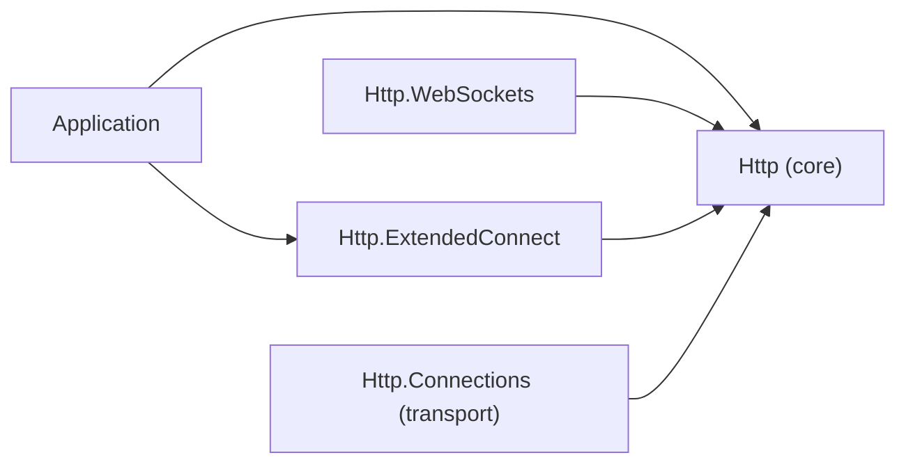

# Assimalign.Cohesion.Http.ExtendedConnect design

Design decisions and ownership boundaries for `Assimalign.Cohesion.Http.ExtendedConnect`.

[Overview](index.md) · [Examples](examples/index.md)

## Design and boundaries

The package gives applications the HTTP/2 and HTTP/3 *extended CONNECT* mechanism (RFC 8441,
RFC 9220) as a feature on `IHttpContext`: detect that an exchange is an extended CONNECT, read the
requested protocol, and accept the exchange's stream as a duplex tunnel for that protocol. WebSocket
(`:protocol = websocket`) is the common case, and the reason the tunnel exists (the Http area's
ADR 1, `cohesion/docs/libraries/Http/DECISIONS.md`). In the graph an arrow means "references".

| Type | Package | Role |
| --- | --- | --- |
| `IHttpExtendedConnectFeature` | core `Assimalign.Cohesion.Http` | The contract: `Protocol` and `AcceptAsync`. |
| `HttpExtendedConnectExtensions` | this package | `context.ExtendedConnect` (the feature, or `null`) and `context.IsExtendedConnect`. |
| `Http2ExtendedConnectFeature`, `Http3ExtendedConnectFeature` | `Assimalign.Cohesion.Http.Connections` (internal) | The implementations, installed by the transport. |

The package surfaces its types under the `Assimalign.Cohesion.Http` namespace, not the assembly
name, so the `IHttpContext` extension members are discoverable without an extra `using`, as in the
sibling `Http.ProtocolUpgrade` package.

## Why the contract lives in the core and the accessors here

A feature contract belongs with the package that produces the capability (see
[the core's TLS connection feature](../assimalign-cohesion-http/design.md#the-tls-connection-feature)).
Accepting a tunnel means writing a `200` HEADERS block without ending the stream and framing `DATA`
under the stream's flow control: only the transport can do that, so the transport is the producer,
and it references no feature package. The contract therefore lives in the core, beside
`IHttpTlsConnectionFeature`, and the transport installs its own implementation on the exchange's
feature collection (#1316). This package keeps the application-facing accessors.
`Http.WebSockets`, which bootstraps a WebSocket over the tunnel on HTTP/2 and HTTP/3, reads the core
contract from the exchange's features and does not reference this package.

Until the tunnel existed the feature only reported `:protocol`, and the transport published that
string under an `IHttpContext.Items` key that this package turned into a feature on every read. A
string published one way cannot carry an accept call, so the bridge was removed: the accessors are
now plain feature reads that return the same instance every time, and an `Items` value models
nothing.

## Accepting the tunnel

`AcceptAsync` answers the request and surrenders the stream; the interface carries the full
contract:

- **The head.** A `200` with the headers the application set before accepting, without `END_STREAM`
  on HTTP/2 or a FIN on HTTP/3. `Content-Length` and `Transfer-Encoding` are removed (RFC 9110
  §9.3.6), and so are connection-specific fields (RFC 9113 §8.2.2, RFC 9114 §4.2), which a client
  would reject; an application that set the HTTP/1.1 WebSocket fields still gets a valid head.
- **Reads** return the client's `DATA` and return 0 once the client ends its side.
- **Writes** go out as `DATA` at once, unbuffered, and wait while the peer's flow-control windows are
  exhausted.
- **Disposing** ends the server's side: `END_STREAM` on HTTP/2, a FIN on HTTP/3.
- **Failures.** A peer reset or a lost connection faults pending and later reads and writes with an
  `IOException`, never a clean end of stream.
- **Guards.** Accepting twice, accepting after the response started, or accepting a cancelled
  exchange throws `InvalidOperationException`.

Accepting takes the exchange over, as an HTTP/1.1 protocol upgrade does: the transport no longer
writes the application's response, and the exchange interceptors' response-head and after-response
hooks do not run. A WebSocket therefore behaves the same on all three versions. The transport's
[design](../assimalign-cohesion-http-connections/design.md#extended-connect-the-tunnel) covers the
wire behavior.

## Validation lives in the transport

Whether a request *is* a valid extended CONNECT is decided in the transport, using the shared
`HttpFieldNormalization.ValidateExtendedConnect` rule (RFC 8441 §4, RFC 9220 §3): `:protocol` is only
valid on `CONNECT`, and an extended CONNECT must also carry `:scheme`, `:path`, and `:authority`. A
malformed extended CONNECT is rejected at the wire layer and never reaches this package. When
`ExtendedConnect` is not `null`, `Protocol` is non-empty and the request was well-formed.

## Non-goals

- **No WebSocket framing.** The tunnel carries raw octets. RFC 6455 framing comes from the BCL
  (`WebSocket.CreateFromStream` over the accepted stream), and the WebSocket handshake and policy
  belong to `Http.WebSockets` and `Web.WebSockets`.
- **No classic CONNECT.** A `CONNECT` without `:protocol` is an ordinary request; opaque TCP
  tunneling to the request's authority is not implemented, and no feature is installed for it.
- **No client-side initiation.** This is the server-side surface; it does not build extended CONNECT
  requests.

## AOT posture

Pure managed code with no reflection, dynamic code generation, or runtime type inspection. The
accessors are one feature lookup each, so the package is trimming- and NativeAOT-safe.

## Dependency boundary

The declared build inputs are `Assimalign.Cohesion.Http`. The [overview](index.md#dependencies)
distinguishes project references, package references, shared source, and analyzer inputs.

## Sources

- **Source** — `cohesion/libraries/Http/Assimalign.Cohesion.Http.ExtendedConnect/src/Assimalign.Cohesion.Http.ExtendedConnect.csproj`.

- **Source** — `cohesion/libraries/Directory.Build.props`.

- **Source** — `cohesion/libraries/Http/Assimalign.Cohesion.Http.ExtendedConnect/docs/OVERVIEW.md`.

- **Source** — `cohesion/libraries/Http/Assimalign.Cohesion.Http.ExtendedConnect/docs/DESIGN.md`.

- **Source** — `cohesion/libraries/Http/README.md`.

- **Source** — `cohesion/libraries/Http/Assimalign.Cohesion.Http.ExtendedConnect/src`.

- **Source** — `cohesion/libraries/Http/Assimalign.Cohesion.Http/src/Abstractions/IHttpExtendedConnectFeature.cs`.
