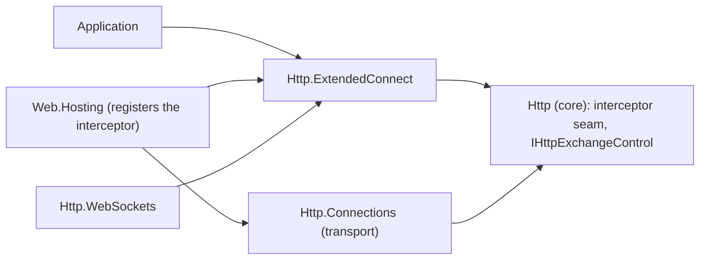

# Assimalign.Cohesion.Http.ExtendedConnect design

Design decisions and ownership boundaries for `Assimalign.Cohesion.Http.ExtendedConnect`.

[Overview](index.md) · [Examples](examples/index.md)

## Design and boundaries

The package gives applications the HTTP/2 and HTTP/3 *extended CONNECT* mechanism (RFC 8441,
RFC 9220) as a feature on `IHttpContext`: detect that an exchange is an extended CONNECT, read the
requested protocol, and accept the exchange's stream as a duplex tunnel for that protocol. WebSocket
(`:protocol = websocket`) is the common case, and the reason the tunnel exists (the Http area's
ADR 1, `cohesion/docs/libraries/Http/DECISIONS.md`). In the graph an arrow means "references". The
transport and this package never reference each other: they meet on the core's interceptor seam.

| Type | Visibility | Role |
| --- | --- | --- |
| `IHttpExtendedConnectFeature` | public | The contract: `Protocol` and `AcceptAsync`. |
| `HttpExtendedConnect` | public | `CreateInterceptor()`, the entry point a listener registers. |
| `HttpExtendedConnectExtensions` | public | `context.ExtendedConnect` (the feature, or `null`) and `context.IsExtendedConnect`. |
| `HttpExtendedConnectInterceptor` | internal | Installs the feature on an extended CONNECT and binds it to the exchange control. |
| `HttpExtendedConnectFeature` | internal | The feature: `Protocol`, and an `AcceptAsync` that calls the control's `AcceptTunnelAsync`. |

The package surfaces its types under the `Assimalign.Cohesion.Http` namespace, not the assembly
name, so the `IHttpContext` extension members are discoverable without an extra `using`, as in the
sibling `Http.ProtocolUpgrade` package, and is recorded as a deliberate deviation in the csproj.

## Why an interceptor installs the feature

The wire work belongs to the transport: accepting a tunnel writes a `200` HEADERS block without
ending the stream, through the connection's shared HPACK or QPACK state, and frames `DATA` under the
stream's flow control. The application-facing contract belongs here. The core holds neither; it holds
the generic seams the two meet on (owner decision 20, 2026-10-09, #1368):

- **`HttpExchangeInterceptorRequestContext.Protocol`** is the validated `:protocol` the transport hands
  the request-parse hooks, `null` on any other request. A hook cannot tell an extended CONNECT from a
  classic one by the method alone.
- **`IHttpExchangeControl.CanAcceptTunnel` and `AcceptTunnelAsync`** are the transport's one-shot
  accept: commit the `200` head without ending the stream, take the exchange over, return the duplex
  tunnel. HTTP/1.1's control reports `false`, since its `CONNECT` and upgrades take the whole
  connection over through `TakeOver` (`Http.ProtocolUpgrade`).

This is the shape [`Http.ProtocolUpgrade`](../assimalign-cohesion-http-protocolupgrade/design.md)
already has over `TakeOver`, and the one `IHttpExchangeControl`'s remarks prescribe: one generic
control instead of a per-capability contract. #1316 moved the feature contract into the core when it
added `AcceptAsync`, so that the transport, which references no feature package, could install its
own implementation. #1368 returned it to this package, its preview.1 home: the transport now installs
no feature, and still references no feature package.

## The interceptor

`HttpExtendedConnect.CreateInterceptor()` returns a new instance on each call. It is not a singleton,
but it is stateless, so the listener that registers it shares it across all of its exchanges, and
per-exchange state lives in the exchange's features. It declares `HttpInterceptorScopes.Request`:

1. **`AfterRequestHead`.** On an HTTP/2 or HTTP/3 `CONNECT` whose `Protocol` is set, it installs an
   unbound `HttpExtendedConnectFeature` and adds itself to that exchange's response phase
   (`AddResponseInterceptor`). Installing at head time keeps the feature visible to every later hook,
   including the listener's own response interceptors, which run before the ones an exchange adds.
2. **`BeforeResponse`.** It binds the feature to `context.Control` when the control reports
   `CanAcceptTunnel`, and otherwise removes it, so `context.ExtendedConnect` never surfaces a feature
   whose accept could not work. The hook is CPU-only, as the interceptor contract requires on the
   HTTP/2 frame pump.

`AfterRequestHead` tests `Protocol` first, then the version, then the method, so every other exchange
pays one null check there, plus the dispatch of the interceptor's inherited no-op `BeforeRequestBody`
and `AfterRequestBody` hooks, and the interceptor allocates nothing for it. It never joins that
exchange's response phase, so the transport builds no response sink or exchange control for it. Like
any request-scoped interceptor, it does make the transport build its per-exchange request-parse
context; the Web host's other default interceptors are request-scoped too, so that context exists
there already. An extended CONNECT does pay for the sink and the control, once per WebSocket
handshake: the response phase is how the feature reaches the control.

**The registration is a dependency.** The feature exists only on a listener that registers the
interceptor. The HTTP/2 and HTTP/3 transports advertise `SETTINGS_ENABLE_CONNECT_PROTOCOL = 1`
regardless, so a listener without it receives extended CONNECT requests and surfaces them as ordinary
`CONNECT` requests: WebSockets over HTTP/2 and HTTP/3 cannot be accepted there. The Web host
registers it by default, after the protocol-upgrade interceptor (`Web.Hosting`'s
[design](../../../resources/web/assimalign-cohesion-web-hosting/design.md#default-interceptors)); a
host that clears `options.Interceptors` loses it, as it loses HTTP/1.1 WebSockets with the upgrade
interceptor. Because the advertisement is unconditional, a listener that registers
`HttpProtocolUpgrade` but not `HttpExtendedConnect` receives HTTP/2 and HTTP/3 extended CONNECT
handshakes and dispatches them as plain `CONNECT` requests it cannot answer with a tunnel: a
WebSocket client that chose HTTP/2 or HTTP/3 on the strength of the setting then fails, instead of
falling back to HTTP/1.1, where that listener would have served it.

## Behavior change from 10.0.0-preview.1

Checked against the `v10.0.0-preview.1` tag:

- **The listener must register the interceptor.** In preview.1 the HTTP/2 and HTTP/3 transports
  published the `:protocol` value under the `IHttpContext.Items` key `":protocol"`, and
  `context.ExtendedConnect` built the feature from a non-empty string on every read. A non-empty value
  had been validated; an empty one passed validation on any method and was published too, and the
  accessor ignored it (#1369 now rejects it). Extended CONNECT detection therefore worked on a bare
  listener, with nothing registered, although the feature could only report `Protocol`. The
  transport now publishes nothing to `Items`, and the feature exists only on a listener that
  registers `HttpExtendedConnect.CreateInterceptor()`. The Web host registers it by default; a
  listener built directly on `Http.Connections` must add it, and code that read
  `Items[":protocol"]` reads `context.ExtendedConnect` instead.
- **`IHttpExchangeControl` gained `CanAcceptTunnel` and `AcceptTunnelAsync`.** The interface
  shipped in preview.1 with `HasResponseStarted`, `CanWriteInterimResponse`,
  `WriteInterimResponseAsync`, `CanTakeOver` and `TakeOver`. The new members are plain interface
  members without default implementations (the core's
  [design](../assimalign-cohesion-http/design.md#the-extended-connect-seam)), so an implementation
  outside this repository is a source break: it no longer compiles until it adds both.
- **`IHttpExtendedConnectFeature` gained `AcceptAsync`.** It shipped in preview.1 with `Protocol`
  only, so an outside implementation, such as a test double, has the same source break.

## Accepting the tunnel

`AcceptAsync` calls the bound control's `AcceptTunnelAsync`, which answers the request and surrenders
the stream; the interface carries the full contract:

- **The head.** A `200` with the headers the application set before accepting, without `END_STREAM`
  on HTTP/2 or a FIN on HTTP/3. `Content-Length` and `Transfer-Encoding` are removed (RFC 9110
  §9.3.6), and so are connection-specific fields (RFC 9113 §8.2.2, RFC 9114 §4.2), which a client
  would reject; an application that set the HTTP/1.1 WebSocket fields still gets a valid head.
- **Reads** return the client's `DATA` and return 0 once the client ends its side.
- **Writes** go out as `DATA` at once, unbuffered, and wait while the peer's flow-control windows are
  exhausted.
- **Disposing** ends the server's side: `END_STREAM` on HTTP/2, a FIN on HTTP/3.
- **Failures.** A peer reset or a lost connection faults pending and later reads and writes with an
  `IOException`, never a clean end of stream.
- **Guards.** The transport checks them, in this order, before writing anything: a second accept
  attempt, accepting a cancelled exchange, or accepting after the response started throws
  `InvalidOperationException`; accepting a stream the peer reset, or on a closed connection, throws
  `IOException`. The first attempt latches before the later guards run, so an attempt that fails
  still uses the accept up: `CanAcceptTunnel` is then `false`, and another call throws. The feature
  adds no rule of its own, so the order is the same on every path.

Accepting takes the exchange over, as an HTTP/1.1 protocol upgrade does: the transport no longer
writes the application's response, and the exchange interceptors' response-head and after-response
hooks do not run. A WebSocket therefore behaves the same on all three versions. The transport's
[design](../assimalign-cohesion-http-connections/design.md#extended-connect-the-tunnel) covers the
wire behavior.

The accessors are plain feature reads that return the same instance every time. Before the tunnel
existed, the transport published `:protocol` as an `IHttpContext.Items` string that this package
turned into a feature on every read; a string cannot carry an accept call, so that bridge is gone and
an `Items` value models nothing.

## Validation lives in the transport

Whether a request *is* a valid extended CONNECT is decided in the transport, using the shared
`HttpFieldNormalization.ValidateExtendedConnect` rule (RFC 8441 §4, RFC 9220 §3): a `:protocol` that
is present must not be empty (a protocol name is a token, `1*tchar`, RFC 9110 §5.6.2; #1369), it is
only valid on `CONNECT`, and an extended CONNECT must also carry `:scheme`, `:path`, and
`:authority`. A malformed extended CONNECT is rejected at the wire layer and never reaches this
package: only the offending stream is reset, with `RST_STREAM(PROTOCOL_ERROR)` on HTTP/2 and
`H3_MESSAGE_ERROR` on HTTP/3, and the connection keeps serving. The transport sets `Protocol` on the
request context only after that check, so when `ExtendedConnect` is not `null`, `Protocol` is
non-empty and the request was well-formed. The interceptor still tests for a non-empty `Protocol` on
a `CONNECT`, and the transport's exchange controls refuse a tunnel for anything else, so neither
relies on the validator alone.

## Non-goals

- **No WebSocket framing.** The tunnel carries raw octets. RFC 6455 framing comes from the BCL
  (`WebSocket.CreateFromStream` over the accepted stream), and the WebSocket handshake and policy
  belong to `Http.WebSockets` and `Web.WebSockets`.
- **No classic CONNECT.** A `CONNECT` without `:protocol` is an ordinary request; opaque TCP
  tunneling to the request's authority is not implemented, and no feature is installed for it.
  `AcceptTunnelAsync` is the stream tunnel such a feature would need on HTTP/2 and HTTP/3 (RFC 9113
  §8.5), so it would be a package change, not a core one.
- **No client-side initiation.** This is the server-side surface; it does not build extended CONNECT
  requests.

## AOT posture

Pure managed code with no reflection, dynamic code generation, or runtime type inspection. The
interceptor's hooks are a null check, a version and a method check, a feature set and a type test,
and the accessors are one feature lookup each, so the package is trimming- and NativeAOT-safe.

## Dependency boundary

The declared build inputs are `Assimalign.Cohesion.Http`. The [overview](index.md#dependencies)
distinguishes project references, package references, shared source, and analyzer inputs.

## Sources

- **Source** — `cohesion/libraries/Http/Assimalign.Cohesion.Http.ExtendedConnect/src/Assimalign.Cohesion.Http.ExtendedConnect.csproj`.

- **Source** — `cohesion/libraries/Directory.Build.props`.

- **Source** — `cohesion/libraries/Http/Assimalign.Cohesion.Http.ExtendedConnect/docs/OVERVIEW.md`.

- **Source** — `cohesion/libraries/Http/Assimalign.Cohesion.Http.ExtendedConnect/docs/DESIGN.md`.

- **Source** — `cohesion/libraries/Http/README.md`.

- **Source** — `cohesion/libraries/Http/Assimalign.Cohesion.Http.ExtendedConnect/src`.

- **Source** — `cohesion/libraries/Http/Assimalign.Cohesion.Http.ExtendedConnect/src/Abstractions/IHttpExtendedConnectFeature.cs`.

- **Source** — `cohesion/libraries/Http/Assimalign.Cohesion.Http.ExtendedConnect/src/HttpExtendedConnect.cs`.

- **Source** — `cohesion/libraries/Http/Assimalign.Cohesion.Http/docs/DESIGN.md`.

- **Source** — `cohesion/resources/Web/Assimalign.Cohesion.Web.Hosting/docs/DESIGN.md`.
