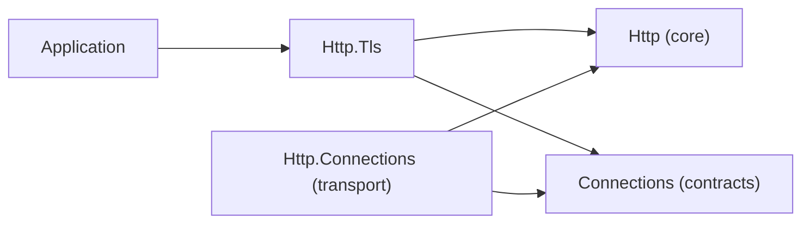

# Assimalign.Cohesion.Http.Tls design

Design decisions and ownership boundaries for `Assimalign.Cohesion.Http.Tls`.

[Overview](index.md) · [Examples](examples/index.md)

## Purpose

Tell a handler how the connection its exchange arrived on is secured: the client certificate
(`null` when the client presented none), the TLS protocol version, the cipher suite, and the
application protocol ALPN selected (RFC 7301). The package declares `IHttpTlsConnectionFeature` and
the `context.TlsConnection` accessor. It covers HTTP/1.1 and HTTP/2 over the TLS layer, and HTTP/3
over QUIC, which carries TLS 1.3 itself (RFC 9001). A cleartext exchange has no session, and the
accessor returns `null` for it.

The values belong to the connection, not the request: every exchange on a connection observes the
same session. A client certificate exists only when the server's TLS options requested one in the
handshake (RFC 8446 §4.3.2). HTTP/2 rules out asking later (RFC 9113 §9.2.3), so there is no
"renegotiate for a certificate" member.

## Shape

An arrow means "references". The transport and this package never reference each other: they meet
on the contracts library's `ITlsConnectionInfo`, which the transport publishes and this package
reads.

| Type | Package | Role |
| --- | --- | --- |
| `IHttpTlsConnectionFeature` | this package | The contract: `ClientCertificate`, `Protocol`, `CipherSuite`, `ApplicationProtocol`. |
| `HttpTlsConnectionExtensions` | this package | `context.TlsConnection`: the installed feature, or one built from the facet, or `null`. |
| `HttpTlsConnectionFeature` | this package (internal) | The feature the accessor builds, a copy of the facet's four values. |
| `ITlsConnectionInfo` | `Assimalign.Cohesion.Connections` | The handshake facet. A TLS connection implements it, and the transport's connection info carries it. |
| `HttpTlsConnectionInfo` | `Assimalign.Cohesion.Http.Connections` (internal) | The transport's connection info for a TLS exchange: the endpoints plus a snapshot of the facet. |

The package surfaces its types under the `Assimalign.Cohesion.Http` namespace, not the assembly
name. The `IHttpContext` extension member is then discoverable without an extra `using`, and code
written while the feature lived in core Http compiles unchanged. This matches `Http.Cookies` and
`Http.ExtendedConnect` and is recorded as a deliberate deviation in the csproj.

## How the session reaches a handler

1. **The transport publishes facts, not a feature.** When `Http.Connections` builds an exchange's
   `HttpConnectionInfo` and the accepted connection implements `ITlsConnectionInfo`, it builds an
   internal subclass that also implements `ITlsConnectionInfo` and copies the four values. That
   happens once per connection for HTTP/1.1 and HTTP/2, and once per request stream for HTTP/3,
   which already built a connection info per stream. The transport sets nothing on `Features`.
2. **The accessor builds the feature on first read.** `context.TlsConnection` returns the
   `IHttpTlsConnectionFeature` already in `Features`, if there is one. Otherwise, when
   `context.ConnectionInfo is ITlsConnectionInfo`, it builds the internal feature from the facet,
   installs it with `Features.Set`, and returns it, so later reads return the same instance. A
   cleartext exchange returns `null` and installs nothing. This is the `request.Cookies` pattern
   from `Http.Cookies`.
3. **A feature installed before the first read wins.** Because `Features` is read first, a
   middleware can supply its own implementation. One example is a session reconstructed from the
   client certificate a TLS-terminating proxy forwards. Trusting that proxy is the middleware's
   decision. The override is order-dependent, so install it before anything reads
   `context.TlsConnection`. After a read, the built feature is cached under the name
   `Assimalign.Cohesion.Http.TlsConnection`, and `IHttpFeatureCollection.Set` replaces by name:
   - an override registered under that name replaces the cached feature;
   - `Features.Set<IHttpTlsConnectionFeature>(null)` removes the first installed implementation,
     which is the cached feature, so an override under any other name installed after the removal
     wins (with no override, the next read builds a fresh feature from the facet);
   - an override under another name installed beside the cached feature leaves both installed, and
     the accessor's `Get<IHttpTlsConnectionFeature>()` returns whichever the collection enumerates
     first. That is not guaranteed to be the override.

   The Http.Tls suite pins the first two paths and the pre-read install.

The transport hands one connection info instance to the request-parse hooks, the exchange, and the
response hooks. So the facet is visible from the first `AfterRequestHead` hook onward, through the
interceptor context's `ConnectionInfo`. When the transport attached a feature instead, request-parse
hooks could not see the session, because they run before the exchange exists. The Http.Connections
suite covers this on all three versions.

An exchange that never reads the session pays for no feature object. The per-exchange `Features.Set`
the transport used to make is gone.

## Why the transport publishes a facet and this package owns the contract

Core Http holds base contracts and generic seams only. A concern-specific feature lives in its own
package (owner decision 20 of the Stage 10 review, 2026-10-09). A transport publishes connection
facts as facets on its connection info, or offers wire mechanisms through `IHttpExchangeControl`.
The feature packages own the application-facing contracts (core Http DESIGN, "Where things live").

The facet is the idiom the Connections contracts library already documents for this data: a
consumer finds `ITlsConnectionInfo` with a type test on the object it holds (Connections DESIGN,
"Handshake facts"). The transport extends that one hop, from the connection to the exchange's
connection info, without referencing an HTTP TLS type.

Alternatives rejected:

- **The contract in core Http**, where #1065 first placed it. The transport could then install the
  feature without referencing a feature package, but core would carry a concern-specific contract,
  which owner decision 20 rules out.
- **A contract-only package the transport references.** `Http.Connections` is a member of every
  area's framework (17 private entries and a public one in App.Web), so a transport reference would
  add the package to all 18 framework lists. It would also make the transport reference a feature
  package, the reverse of core's layering table. The facet costs one App.Web entry.
- **An `Items`-key bridge.** A session of four typed values, one of them a certificate with an
  owner, would travel as an untyped object, and the package would only cast it back.
- **New members on `IHttpConnectionInfo`.** Adding members to the interface breaks every
  implementation, test doubles included, while a TLS session is optional by construction.

`ITlsConnectionInfo` stays in the Connections contracts library. The TLS layer and the QUIC driver
both implement it, and HTTP reads it to choose the protocol through ALPN. Moving it into
`Connections.Security` would make all three depend on the `SslStream` layer.

## The facet travels with the connection info object

The facet is an implicit contract: it is visible only while code passes the transport's connection
info object along. A context wrapper that returns a new `IHttpConnectionInfo` hides it unless that
object implements `ITlsConnectionInfo` too. The shipped wrapper contexts (`Web.RequestTimeouts`,
`Web.Rewrite`, and `Web.Compression`'s request decompression) forward the inner context's
connection info, so the facet survives them. `IHttpConnectionInfo`'s documentation states the
convention.

## Ownership and lifetime

The certificate belongs to the connection, which disposes it when the connection closes. Both the
transport's snapshot and the feature hold that same instance and copy the other three values. The
feature is therefore not disposable: an exchange's disposal walk disposes the disposable features it
carries, and this one must survive the exchange. Code that keeps the certificate beyond the exchange
copies it.

The transport's snapshot never references the connection that ran the handshake.
`QuicMultiplexedConnection` is public, so a handler that could cast the connection info back to it
could open streams that only the transport may open.

## Behavior change from the core placement

The transport no longer installs the feature, so `Features.Get<IHttpTlsConnectionFeature>()`
returns `null` until `context.TlsConnection` has been read. Code reads the session through the
accessor, or reads the facet directly with `context.ConnectionInfo is ITlsConnectionInfo`. Neither
type shipped in v10.0.0-preview.1, so nothing released breaks. A binary built against core Http
while the types lived there has to be rebuilt, because they moved assembly while keeping their
namespace.

## What it does not do

It reports; it does not decide. Requesting, requiring, and validating client certificates is the
server's TLS configuration
([`Assimalign.Cohesion.Connections.Security`](../../connections/assimalign-cohesion-connections-security/index.md)'s
`TlsServerOptions`, exposed on `Web.Hosting`'s endpoints). Authenticating a request from the
certificate belongs to an authentication handler, which does not exist yet.

## AOT posture

Pure managed code with no reflection, dynamic code generation, or runtime type inspection beyond one
interface type test. The accessor is one feature lookup and, on first read, one allocation, so the
package is trimming- and NativeAOT-safe.

## Dependency boundary

The declared build inputs are `Assimalign.Cohesion.Http`, `Assimalign.Cohesion.Connections`. The
[overview](index.md#dependencies) distinguishes project references, package references, shared
source, and analyzer inputs.

## Sources

- **Source** — `cohesion/libraries/Http/Assimalign.Cohesion.Http.Tls/src/Assimalign.Cohesion.Http.Tls.csproj`.

- **Source** — `cohesion/libraries/Http/Assimalign.Cohesion.Http.Tls/docs/DESIGN.md`.

- **Source** — `cohesion/libraries/Http/Assimalign.Cohesion.Http/docs/DESIGN.md`.

- **Source** — `cohesion/libraries/Connections/Assimalign.Cohesion.Connections/docs/DESIGN.md`.

- **Source** — `cohesion/libraries/Http/README.md`.

- **Source** — `cohesion/libraries/Http/Assimalign.Cohesion.Http.Tls/src`.
