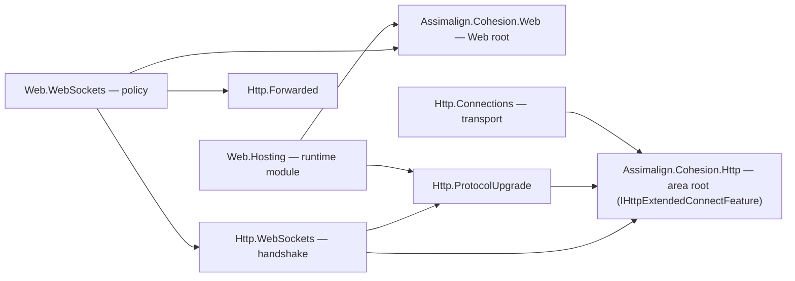
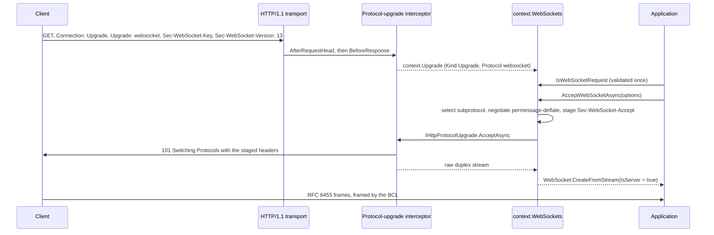
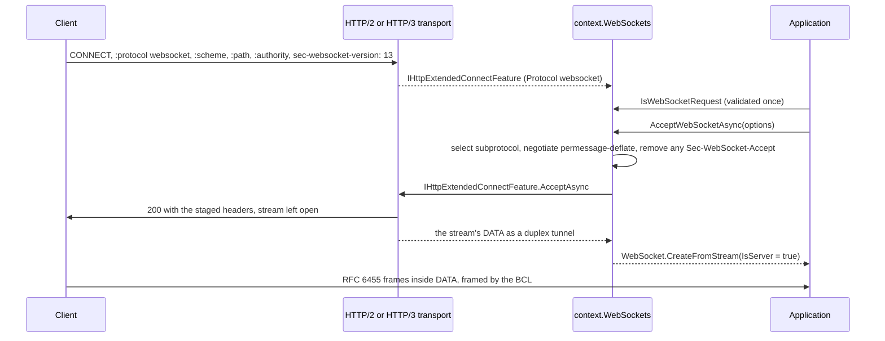

# Assimalign.Cohesion.Http.WebSockets design

Design decisions and ownership boundaries for `Assimalign.Cohesion.Http.WebSockets`.

[Overview](index.md) · [Examples](examples/index.md)

## Design intent

Server WebSockets for the HTTP family, as the Http area's ADR 1 decided
(`cohesion/docs/libraries/Http/DECISIONS.md`, plan §7.4 decision 16). The package owns the
**opening handshake** and its **negotiation**, then hands the connection to the BCL's RFC 6455
implementation: an application receives a `System.Net.WebSockets.WebSocket` from
`WebSocket.CreateFromStream` with `IsServer = true`. Cohesion writes no frame codec; the masking,
control-frame, close-code, UTF-8 and permessage-deflate rules are the BCL's, and the end-to-end tests
assert them on the wire.

What the package owns:

- **Detection and validation** of a handshake attempt on every protocol (the HTTP/1.1 upgrade of
  RFC 6455, the HTTP/2 and HTTP/3 extended CONNECT of RFC 8441 and RFC 9220), with the refusals
  RFC 6455 §4.2 prescribes: `400` for a malformed handshake, `426` with `Sec-WebSocket-Version: 13`
  for another version.
- **`Sec-WebSocket-Accept`** on HTTP/1.1, Base64(SHA-1(key + the RFC 6455 GUID)), through
  `SHA1.HashData`.
- **Subprotocol selection** (`Sec-WebSocket-Protocol`).
- **permessage-deflate negotiation** (RFC 7692), opt-in, mapped onto `WebSocketDeflateOptions`.
- **The request surface**: `context.WebSockets` with `HandshakeStatus`, `IsWebSocketRequest`,
  `RequestedProtocols`, `AcceptWebSocketAsync` and `RejectHandshake`.

Policy is not here. Which origins may open a socket, the keep-alive defaults a deployment wants, and
closing sockets when the server drains belong to
[`Assimalign.Cohesion.Web.WebSockets`](../../../resources/web/assimalign-cohesion-web-websockets/index.md),
which decorates this package's feature. The protocol is L1; the policy is the web server's.

## Family map

The handshake rides two seams that already existed: the HTTP/1.1 protocol-upgrade takeover and the
HTTP/2 and HTTP/3 extended CONNECT tunnel. An arrow means "references".

| Package | Role |
| --- | --- |
| `Assimalign.Cohesion.Http.WebSockets` | This package: the handshake on each protocol, subprotocols, permessage-deflate, the accept call |
| `Assimalign.Cohesion.Http.ProtocolUpgrade` | The HTTP/1.1 upgrade the handshake rides: detection, the `101`, and the raw-stream takeover |
| `Assimalign.Cohesion.Http` | The area root; holds `IHttpExtendedConnectFeature`, the HTTP/2 and HTTP/3 tunnel the handshake rides |
| `Assimalign.Cohesion.Http.Connections` | The transport: installs `IHttpExtendedConnectFeature` on every valid extended CONNECT, writes the `200`, carries the tunnel |
| `Assimalign.Cohesion.Web.WebSockets` | `UseWebSockets` and `MapWebSocket`: the origin check, keep-alive and compression defaults, and the drain close |
| `Assimalign.Cohesion.Web.Hosting` | Installs the protocol-upgrade interceptor by default and publishes the drain signal |

`Http.ExtendedConnect` is not referenced. #1316 moved `IHttpExtendedConnectFeature` into the area
root, because its producer is the transport; the handshake reads it from the exchange's features,
and `Http.ExtendedConnect` adds only the `context.ExtendedConnect` accessor, which this package does
not need.

## The HTTP/1.1 handshake

A handshake attempt is an HTTP/1.1 upgrade whose `Upgrade` token is `websocket`. The
protocol-upgrade interceptor already requires `Connection: Upgrade` and an `Upgrade` header before it
surfaces `context.Upgrade`, and it surfaces only HTTP/1.1 exchanges whose connection can be taken
over. Its `Protocol` is the first `Upgrade` token, the one a `101` switches to, so a request that
prefers another protocol (`Upgrade: h2c, websocket`) is not an attempt. The sequence shows an
accepted handshake.

The attempt is validated in this order, which gives the client the most useful refusal:

1. **The method is `GET`, with no content** (§4.2.1 item 1), otherwise `Invalid`. Once the
   connection switches, every octet after the head belongs to the WebSocket, so a declared body
   (`Content-Length` other than `0`, or `Transfer-Encoding`) would be read as frames.
2. **`Sec-WebSocket-Version` lists `13`** (§4.2.1 item 6), otherwise `UnsupportedVersion`. A missing
   version is unsupported too. The version is checked before the key because a client of an earlier
   draft sends neither, and the `426` tells it which version to retry with (§4.4).
3. **`Sec-WebSocket-Key` is one field line whose trimmed value is 24 characters of base64 decoding
   to 16 bytes** (§4.2.1 item 5, §11.3.1), otherwise `Invalid`. The length check excludes interior
   whitespace, which `Convert.TryFromBase64String` would otherwise skip.
4. **`Sec-WebSocket-Protocol`, if present, is a list of tokens** (§4.1, §11.3.4), otherwise
   `Invalid`. The list may span several field lines, and empty elements are ignored (RFC 9110
   §5.6.1).

`RejectHandshake` stages the refusal: `400` for `Invalid`; for `UnsupportedVersion`, `426` with
`Sec-WebSocket-Version: 13`, plus `Upgrade: websocket` and `Connection: Upgrade`, because RFC 9110
§15.5.22 requires a `426` to name the protocol and §7.8 requires `Upgrade` to travel with the
`upgrade` connection option. A valid handshake has nothing to refuse; it is refused by not accepting
it, and the throw says so.

## The HTTP/2 and HTTP/3 handshake

A handshake attempt is an extended CONNECT (RFC 8441 §4, RFC 9220 §3) whose `:protocol` is
`websocket`, compared case-insensitively as on HTTP/1.1. The transport installs
`IHttpExtendedConnectFeature` on every exchange that is a valid extended CONNECT (it has already
checked `:scheme`, `:path` and `:authority`, and advertised `SETTINGS_ENABLE_CONNECT_PROTOCOL`) and
on no other, so the feature's presence is the attempt's shape check. The method is tested first,
which keeps the feature lookup off every request that is not a `CONNECT`. An extended CONNECT for
another protocol, and a classic `CONNECT` without `:protocol`, are not attempts.

RFC 8441 §5 keeps the version, the subprotocols and the extensions, and retires the key and the
accept value, whose job `:protocol` does. So the validation is shorter:

1. **`Sec-WebSocket-Version` lists `13`**, otherwise `UnsupportedVersion`.
2. **`Sec-WebSocket-Protocol`, if present, is a list of tokens**, otherwise `Invalid`.

There is no method or content rule (the transport established the `CONNECT`, and the stream's
`DATA` is the tunnel), and a `Sec-WebSocket-Key` the client sends is ignored. The accept stages the
same `Sec-WebSocket-Protocol` and `Sec-WebSocket-Extensions` as on HTTP/1.1 and removes any
`Sec-WebSocket-Accept` the application staged; the transport answers `200` and strips what a tunnel
cannot carry. A `426` carries `Sec-WebSocket-Version: 13` only: `Upgrade` and `Connection` are
connection-specific, which HTTP/2 and HTTP/3 prohibit (RFC 9113 §8.2.2, RFC 9114 §4.2), and an
HTTP/2 client treats a response that carries them as malformed.

Nothing needs registering for these protocols: the transport surfaces extended CONNECT on its own,
unlike HTTP/1.1's opt-in protocol-upgrade interceptor.

## The accept

`AcceptWebSocketAsync` checks, in order:

1. the handshake is valid (`InvalidOperationException` otherwise);
2. the selected subprotocol, if any, is one the client offered, compared ordinally
   (`ArgumentException`, because RFC 6455 §4.1 has the client fail the connection otherwise);
3. the accept has not already run (`InvalidOperationException`, `Interlocked`).

The subprotocol check comes before the single-shot claim, so a caller that passed a bad subprotocol
can still accept.

It then stages the handshake's own response fields, and removes any stale value the application
staged, so the response always matches the socket: `Sec-WebSocket-Protocol`,
`Sec-WebSocket-Extensions`, and the protocol's fields (`Sec-WebSocket-Accept` on HTTP/1.1, removed
on HTTP/2 and HTTP/3). Every other header and cookie the application set rides the success response.
On HTTP/1.1 the protocol-upgrade takeover writes the `101` (scrubbing body framing, claiming the
connection before it writes) and returns the raw stream, positioned at the first octet after the
request head, so frames the client pipelined behind the handshake are not lost. On HTTP/2 and HTTP/3
the transport's tunnel accept writes the `200` and returns the stream's `DATA` as a duplex stream.
Either stream goes to `WebSocket.CreateFromStream`, and the socket owns it.

The exchange must keep running for as long as the socket is open: when the exchange completes, the
server ends the connection (HTTP/1.1) or the stream (HTTP/2, HTTP/3). That is the same contract
ASP.NET Core has, and the reason the policy layer's drain close is tied to the exchange.

## Subprotocols

The client's offer is exposed as `RequestedProtocols`, in its order of preference; the application
chooses. No helper picks for it: the right order (the client's preference or the server's) is the
application's decision, and a one-line loop over `RequestedProtocols` expresses either.

## permessage-deflate

Compression is negotiated only when the accept asks for it
(`HttpWebSocketAcceptOptions.DangerousEnableCompression`); otherwise the offer is ignored and the
socket is uncompressed. The name follows ASP.NET Core's: compressing data an attacker controls
together with a secret leaks the secret through the compressed size (CRIME, BREACH).

The parser follows RFC 6455 §9.1's grammar: comma-separated extensions, each a token with
`;`-separated parameters whose values are tokens or quoted strings, across any number of field
lines. A comma inside a quoted value does not split an extension. The first permessage-deflate offer
the server can honor wins (RFC 7692 §5); every other is declined, never an error:

| Offer | Response | `WebSocketDeflateOptions` |
| --- | --- | --- |
| `server_no_context_takeover` | echoed (§7.1.1.1); also sent when the accept sets `DisableServerContextTakeover` | `ServerContextTakeover = false` |
| `client_no_context_takeover` | echoed (§7.1.1.2), so the client must reset and the inflater can drop its window | `ClientContextTakeover = false` |
| `server_max_window_bits=N` | `server_max_window_bits=min(N, ServerMaxWindowBits)` (§7.1.2.1); also sent when the server's limit is below 15 | `ServerMaxWindowBits` |
| `server_max_window_bits=8` | offer declined: zlib cannot produce an 8-bit window | — |
| `client_max_window_bits=N`, N from 9 to 15 | echoed (§7.1.2.2) | `ClientMaxWindowBits = N` |
| `client_max_window_bits` without a value, or `=8` | not echoed: §7.1.2.2 lets the server ignore it, and a 15-bit inflater reads any smaller window | `ClientMaxWindowBits = 15` |
| an unknown parameter, a parameter twice, a value where none belongs, a malformed value | offer declined (§5.1) | — |

`client_max_window_bits` is never sent unless the client offered it (§7.1.2.2's MUST NOT), and the
response's parameter names are lower case, which the BCL client compares ordinally.

## Protocols

Everything protocol-specific sits behind one internal seam, `HttpWebSocketBootstrap`: how a protocol
asks for a WebSocket, which handshake fields it uses, the protocol's own fields of a `426`, and how
it hands over the stream. `HttpWebSocketBootstrap.Select` picks the bootstrap for an exchange:
`Http1WebSocketBootstrap` for the HTTP/1.1 upgrade, `ExtendedConnectWebSocketBootstrap` for the
HTTP/2 and HTTP/3 extended CONNECT. The version rule, the subprotocols, permessage-deflate and the
framing are shared, in `HttpWebSocketFeature`, so the public surface is the same on every protocol
and an application's endpoint does not branch on it.

HTTP/2 support matters because browsers prefer it: a browser on an HTTP/2 connection that advertises
`SETTINGS_ENABLE_CONNECT_PROTOCOL` uses RFC 8441 rather than opening an HTTP/1.1 connection. The two
HTTP/2-and-later protocols share one bootstrap because the transport's `IHttpExtendedConnectFeature`
already hides how each frames the tunnel.

## Lifecycle and ownership

- **`context.WebSockets` reads the installed feature**; on the first read of a handshake attempt it
  validates the handshake once and installs the result, so every later read, a policy decorator's
  included, shares one single-shot accept. An ordinary request installs nothing and reads one
  shared, immutable answer.
- **The accepted `WebSocket` owns the stream** and disposes it. The transport still owns the
  connection (HTTP/1.1) or the stream (HTTP/2, HTTP/3) and ends it when the exchange ends, so an
  application that forgets to dispose leaks nothing past the exchange.

## Error model

No exception type of its own. Misuse is an `InvalidOperationException` (accepting an invalid
handshake, accepting twice, refusing a valid one) or an `ArgumentException` (an unoffered
subprotocol); out-of-range options are an `ArgumentOutOfRangeException` from their setters. Protocol
violations after the accept are the BCL's `WebSocketException`, raised from the receive that met
them, after the BCL sent the close frame RFC 6455 prescribes (`1002`, `1007`).

## AOT posture

No reflection and no runtime code generation. The handshake is header parsing over spans,
`SHA1.HashData` and `Convert`; the framing is the BCL's, which is NativeAOT-compatible. The Web
NativeAOT guard publishes and runs a compressed WebSocket echo over HTTP/1.1 and over an HTTP/2
extended CONNECT.

## Non-goals

- **A frame codec.** Decision 16 chose the BCL's (Http ADR 1, option A).
- **An origin check.** The cross-site WebSocket hijacking defense is policy: `Web.WebSockets`
  refuses cross-site handshakes by default. An application that uses this package on its own and
  serves browsers checks `Origin` before accepting.
- **A client.** `System.Net.WebSockets.ClientWebSocket` is the client.
- **Message-size limits.** The application reads with the buffers it chooses; a per-message limit
  is recorded as "to revisit" in Http ADR 1.

## Dependency boundary

The declared build inputs are `Assimalign.Cohesion.Http`, `Assimalign.Cohesion.Http.ProtocolUpgrade`.
The [overview](index.md#dependencies) distinguishes project references, package references, shared
source, and analyzer inputs.

## Sources

- **Source** — `cohesion/libraries/Http/Assimalign.Cohesion.Http.WebSockets/src/Assimalign.Cohesion.Http.WebSockets.csproj`.

- **Source** — `cohesion/libraries/Http/Assimalign.Cohesion.Http.WebSockets/docs/DESIGN.md`.

- **Source** — `cohesion/docs/libraries/Http/DECISIONS.md`.

- **Source** — `cohesion/libraries/Http/README.md`.

- **Source** — `cohesion/libraries/Http/Assimalign.Cohesion.Http.WebSockets/src`.
