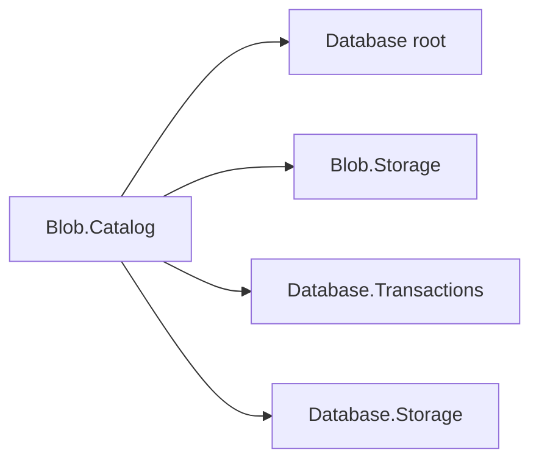

# Assimalign.Cohesion.Database.Blob.Catalog design

This page describes the boundaries and implementation shape of `Assimalign.Cohesion.Database.Blob.Catalog`.

> **Status:** Partial.

The catalog keeps container definitions and blob properties as first-class versioned records. It
shares one `Blob.Storage` file set and one `TransactionCoordinator` with the content chains. This gives
metadata and content a single commit decision, including after a crash. There is no independent
catalog transaction and no separate catalog journal.

The family dependencies are shown below; each arrow means a project references another project.

| Package | Role |
| --- | --- |
| `Assimalign.Cohesion.Database.Blob.Catalog` | Metadata format, directory, snapshot selection |
| `Assimalign.Cohesion.Database.Blob.Storage` | Metadata record access and chunk storage |
| `Assimalign.Cohesion.Database.Transactions` | Shared coordinator, snapshots, undo and purge ledger |
| `Assimalign.Cohesion.Database.Storage` | Pages, page CRC, storage brackets and journal |
| `Assimalign.Cohesion.Database` | Shared object ownership vocabulary |

## Directory and visibility

At open, the catalog scans only owner-zero metadata pages into a directory from ordinal container
names and `(container identity, blob name)` pairs to version locations. Chunk pages have nonzero
owners. Listing consults this directory and rereads candidate metadata through `Blob.Storage`; it
never scans chunk content. Each reread takes the kernel page path, including CRC validation.
Candidate writer stamps and logical identities must still match, so reclaimed slots or pages cannot
make stale directory entries address a different record. Lookups discard reclaimed references and
remove directory keys whose final reference has been reclaimed. Listing performs the same cleanup
across the selected metadata names. Live malformed records raise a catalog error; a checksum-valid
but malformed record is not treated as missing.

Writers acquire model locks in the engine before reaching the catalog. A save tombstones the
snapshot-visible old metadata record and inserts the new version in one coordinator physical
statement bracket. The shared ledger records both changes. The new directory entry is published only
after that bracket succeeds. Snapshot selection admits the writer and excludes visible deleters.
`Rollback` clears old tombstones and removes newly created records; directory lookups observe those
physical changes directly. Snapshot-safe purge later reclaims obsolete records.

`Open`-time recovery scrubs uncommitted stamps before loading the directory. Metadata that references
an unfinished chain is therefore absent after restart. The factory retains neither storage nor
coordinator ownership; the engine controls their lifecycle. This assembly contains no local pager,
journal, transaction manager, or model-lock implementation.

## Metadata disk format, version 1

Every record is one slotted-page record in the owner-zero record space. Multibyte numeric values use
little endian. Offsets are zero based. All records begin with the shared 16-byte
`RecordVersionStamp`: unsigned 64-bit writer sequence at offset 0, unsigned 64-bit deleter sequence
at offset 8; zero deleter means no tombstone. Offset 16 is the one-byte record kind (`1` container,
`2` blob); offset 17 is the one-byte format version (`1`).

Strings consist of a signed 32-bit UTF-8 byte length followed by exactly that many bytes; `-1`
represents null. UTF-8 is strict. Names must be non-null and contain a non-whitespace character.
Identities occupy 16 bytes in .NET `Guid.ToByteArray()` ordering: the first 4, 2, and 2 byte
components are little endian, followed by the final 8 bytes in display order. Identities cannot be
empty. All fields below occur sequentially starting at offset 18.

| Container field | Encoding |
| --- | --- |
| Container identity | 16-byte GUID |
| `Name` | Non-null string |
| Owner | One byte: `0` Adhoc, `1` Schema |
| Owning schema | Nullable string; required and nonempty for Schema ownership |

| Blob field | Encoding |
| --- | --- |
| Container identity | 16-byte GUID |
| `Name` | Non-null string |
| Content length | Signed 64-bit nonnegative byte count |
| Content type | Nullable string |
| Entity tag | Unsigned 64-bit value |
| Created time | Signed 64-bit UTC ticks since 0001-01-01, then signed 16-bit offset minutes |
| Modified time | Same 10-byte encoding as created time |
| Content checksum | Unsigned 32-bit CRC-32 |
| Head location | Unsigned 64-bit packed chunk record reference, as defined by `Blob.Storage` |

A head of zero is valid exactly when content length is zero. There is no trailing padding or
extension area. Unknown versions, kinds, invalid ownership, truncated fields, or trailing bytes
raise `BlobCatalogException`. Kernel corruption and I/O errors remain kernel errors and are never
interpreted as absent metadata. Individual metadata records must fit one kernel page; the content
they reference has no corresponding one-page limit.

The [Blob.Storage design](../assimalign-cohesion-database-blob-storage/design.md) defines location
packing and the separate chunk record format. The Blob engine preserves the original created time
across replacements and enforces `DROP CONTAINER` ownership restrictions. The catalog intentionally
has no provisioning, hosting, wire protocol, or security policy.

## Verification and compatibility

Co-located Shouldly tests cover ordinal prefix/container isolation, complete metadata and ownership
round trips, old snapshots, logical rollback, purge, and restart from live copies of the data and
journal before disposal. The restart case retains committed metadata and removes an uncommitted
replacement and unpublished name. Unsupported disk versions and malformed live metadata records are
rejected. Serialization uses explicit BCL primitives with no reflection or generated runtime code.

## Declared dependencies

| Reference | Kind |
|---|---|
| `Assimalign.Cohesion.Database` | `CohesionProjectReference` |
| `Assimalign.Cohesion.Database.Blob.Storage` | `CohesionProjectReference` |
| `Assimalign.Cohesion.Database.Storage` | `CohesionProjectReference` |
| `Assimalign.Cohesion.Database.Transactions` | `CohesionProjectReference` |

[Assembly overview](index.md) · [Examples](examples/index.md)

## Sources

- **Primary source** — `cohesion/resources/Database/Assimalign.Cohesion.Database.Blob.Catalog/docs/DESIGN.md`.
- **Source** — `cohesion/resources/Database/Assimalign.Cohesion.Database.Blob.Catalog/src/Assimalign.Cohesion.Database.Blob.Catalog.csproj`.
