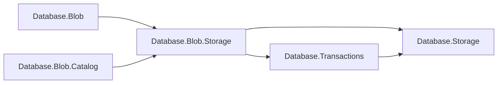
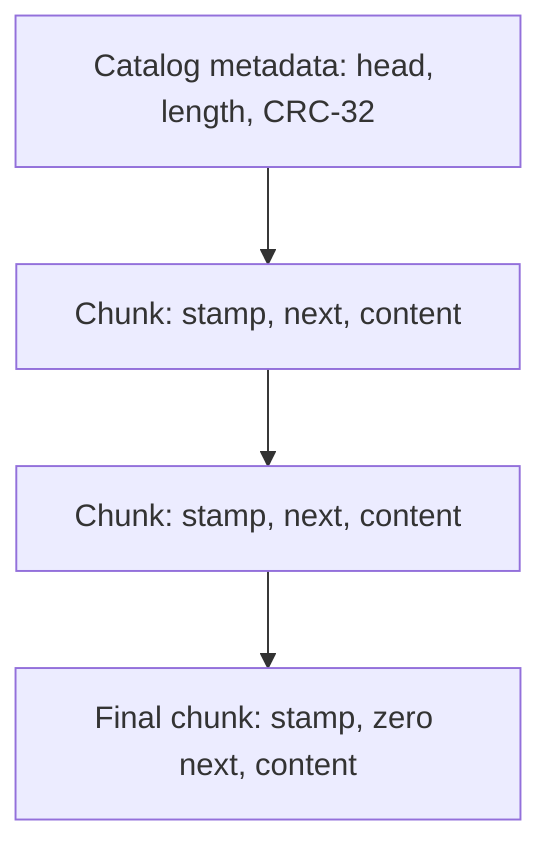

# Assimalign.Cohesion.Database.Blob.Storage design

This page describes the boundaries and implementation shape of `Assimalign.Cohesion.Database.Blob.Storage`.

> **Status:** Partial.

## Shared kernel composition

`BlobStorage` derives from the shared `Storage` implementation. It adds record encoding and bounded
content streams; it does not implement another allocator, page cache, journal, lock manager, or
recovery system. `BlobTransactionRecordSpace` implements the existing `ITransactionRecordSpace` seam
for the coordinator's `RecordSpaceVersionStore`. All catalog records and chunk records begin with
the same 16-byte writer/deleter prefix.

These references explain the package boundary.

The engine and catalog reference Blob storage. Blob storage references shared `Storage` and
Transactions, and Transactions references `Storage`. The feature has no Hosting, ApplicationModel, or
wire-client reference.

## File and record format

A database has the kernel's data, journal, and backup streams. Data pages are 8192 bytes, with the
unchanged 96-byte kernel page header and four-byte slotted record directory entries. Kernel page CRC
covers every persisted page, including the chunk header and content. Blob adds no separate physical
file header.

Catalog records occupy owner-zero data pages. Chunk pages use the creating transaction sequence with
bit 63 set as their owner ID; this separates payload pages from metadata. Several writes in one
transaction can share that owner. Owner IDs are locality hints, never content identity or visibility
proofs.

Every integer in a chunk record is unsigned little-endian unless stated otherwise. The chunk format
is version 1:

| Record byte offset | Size | Meaning |
| --- | --- | --- |
| 0 | 8 | Writer transaction sequence |
| 8 | 8 | Deleter sequence, zero when not tombstoned |
| 16 | 1 | Record kind: `3` for a chunk (`1` and `2` belong to catalog records) |
| 17 | 1 | Chunk format version: `1` |
| 18 | 2 | Payload byte count, between 1 and 8064 |
| 20 | 8 | `Next` chunk's packed location, zero at the end |
| 28 | Payload byte count | Content bytes |

A packed location contains the page number in its high 48 bits and the zero-based slot in its low 16
bits. Data pages start at page 1, so zero is an unambiguous null location. The maximum record is
8092 bytes: 8064 content bytes and the 28-byte chunk header. There is no padding inside a record. No
empty chunk is emitted. Empty content is represented by a zero head, zero length, and zero CRC-32.

The catalog stores the head, signed nonnegative 64-bit total length, and IEEE CRC-32. The CRC uses
reflected polynomial `0xEDB88320`, initial register `0xFFFFFFFF`, and final complement; ASCII
`123456789` yields `0xCBF43926`. The checksum describes content bytes only, in chain order. A read
checks page CRC through the kernel, validates each chunk's kind/version/length/link, and checks the
complete content checksum when it reaches the catalog length. Early termination, an extra link after
the declared length, a cycle, or a checksum mismatch is corruption. Closing a partially consumed
download does not claim that the unread suffix's aggregate checksum was checked.

The head references the first chunk; every nonfinal chunk references the next.

## Upload and publication

An upload retains one 8064-byte content buffer, the head and tail locations, a length counter, and
an incremental CRC register. Filling or flushing the buffer creates a chunk through
`TransactionCoordinator.ApplyStatementAsync`. In that same bounded physical bracket it patches the
preceding unpublished chunk's next pointer. The version ledger records the new chunk under the
caller's logical transaction. No whole-object byte array or list of chunk payloads is retained.

Disposal flushes the final buffer and invokes the engine's completion callback. That callback
publishes the metadata head and commits an automatic transaction; an explicit session transaction
retains publication until its own commit. The old chain remains untouched for readers. `Flush` alone
never publishes metadata. The kernel's logical commit record makes all preceding physical brackets
durable. A write/flush error or lifetime cancellation poisons the stream and invokes the abort
callback once. Disposing a poisoned stream cannot publish it.

`Read` and write streams are sequential and do not support seeking or concurrent operations on one
stream. Metadata publication, overwrite locking, and session lifetime checks belong to the engine. A
read stream's caller retains its logical snapshot until stream disposal, including across a
concurrent overwrite/delete.

## Deletion and bounded recovery

`TombstoneContentAsync` marks each old chunk in a separate physical bracket under the deleting
logical context. The catalog tombstone shares that logical context, so rollback restores both.
Committed tombstones are reclaimed only after every snapshot that could see their content has
closed. The shared `DeleteRecord` returns an empty page to the free-space map at physical commit;
rollback restores the page and its owner membership. Reused pages can belong to another upload.

The version store batches undo, pruning, and recovery scrub at 64 mutations per physical bracket so
their retained before-images cannot grow to object size. Journal recovery streams page images and
retains only transaction identities and winning image LSNs per page. Live ledger entries and page
directories still use memory proportional to chunk count, approximately one entry per 8 KB; payload
memory is bounded independently of the object length.

On reopen, physical kernel recovery runs first with checkpoint deferred. The coordinator then scrubs
chunks and metadata stamped by uncommitted writers, including uploads whose physical chunk brackets
had committed before the crash. The final recovery checkpoint occurs only after that classification
and scrub. No partially written chain gains a visible metadata head.

## Verification and scope

The co-located suite exercises chunk boundaries, CRC, cancellation, snapshot retention, page reuse,
and a crash image containing committed and abandoned chains. The in-memory crash-image test uses an
ordinary journal flush before cloning serialized bytes: its MemoryStreams provide no durable-flush
contract. It verifies recovery replay and abandoned-chunk cleanup rather than physical persistence.
The engine's executable fixture additionally round-trips a file-backed object larger than a
constrained managed heap and reopens its files. The code uses static calls and BCL types, with no
reflection or `Microsoft.Extensions.*`. Container ownership, listing, security, transport, and
schema provisioning are outside this package.

## Declared dependencies

| Reference | Kind |
|---|---|
| `Assimalign.Cohesion.Database.Storage` | `CohesionProjectReference` |
| `Assimalign.Cohesion.Database.Transactions` | `CohesionProjectReference` |

[Assembly overview](index.md) · [Examples](examples/index.md)

## Sources

- **Primary source** — `cohesion/resources/Database/Assimalign.Cohesion.Database.Blob.Storage/docs/DESIGN.md`.
- **Source** — `cohesion/resources/Database/Assimalign.Cohesion.Database.Blob.Storage/src/Assimalign.Cohesion.Database.Blob.Storage.csproj`.
