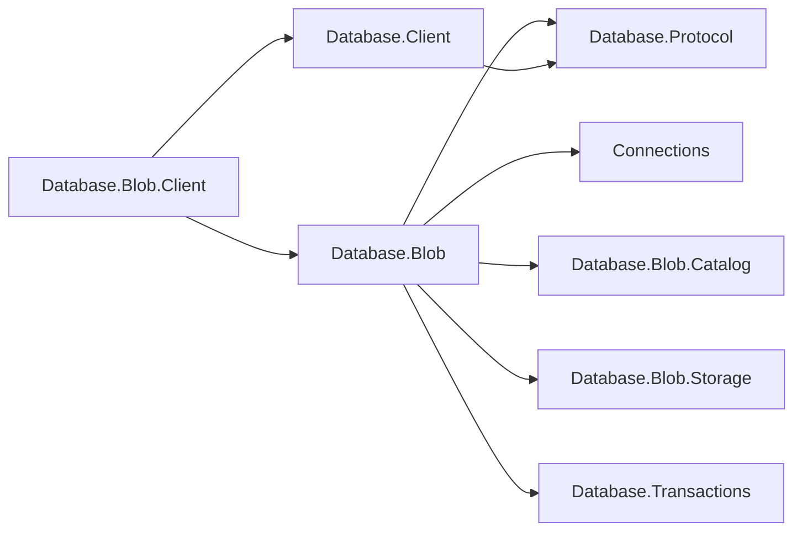
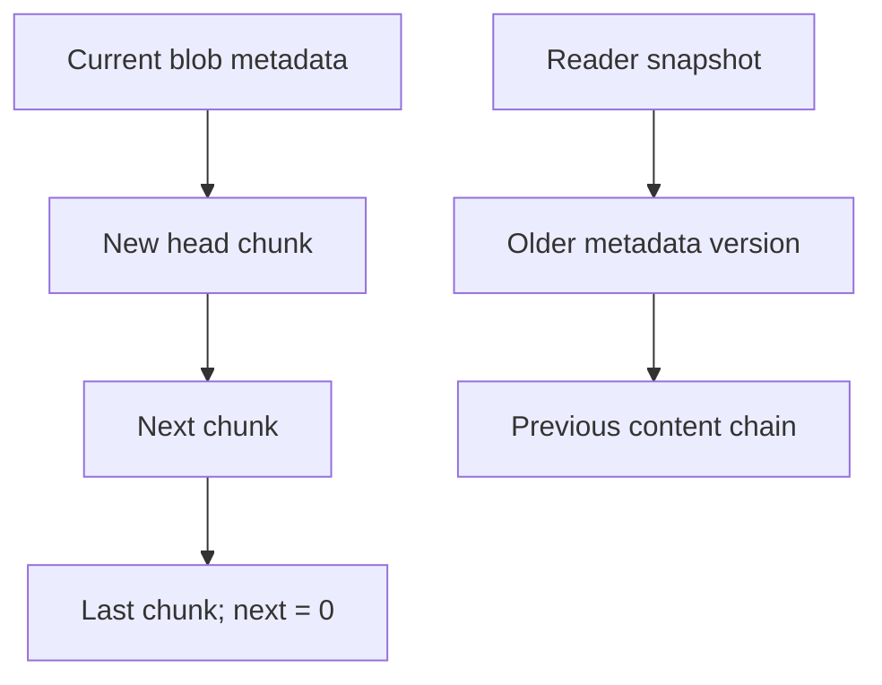
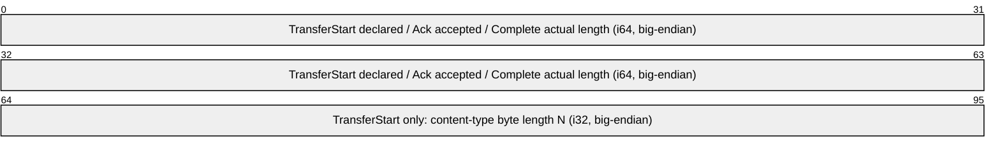
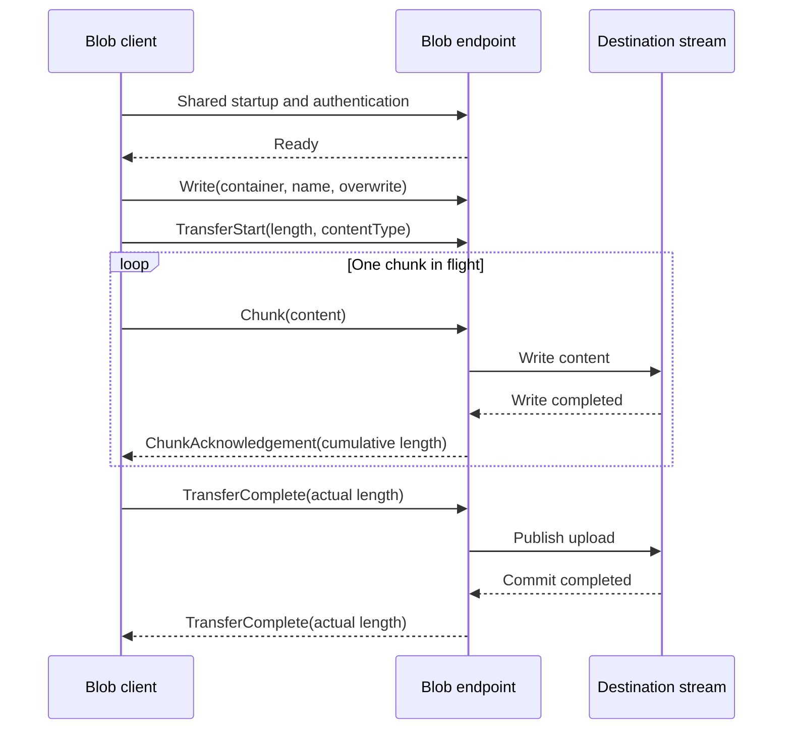

# Assimalign.Cohesion.Database.Blob design

This page describes the boundaries and implementation shape of `Assimalign.Cohesion.Database.Blob`.

> **Status:** Partial.

## String comparison and collation (#1025)

Blob remains ordinal-only. Container and blob names, equality, sorted listings, and prefix filtering
use case-sensitive .NET ordinal string rules, with no case or accent folding. Administrative
database lookup remains ordinal-ignore-case. Blob content is opaque bytes and is never
linguistically compared. SQL database defaults and column/expression `COLLATE` have no effect on
names, metadata, or content; configurable blob-name collation is deferred.

## Composition and lifetime

The engine owns one `Blob.Storage` file set, one `TransactionCoordinator`, and one Blob.Catalog per
logical database. Metadata and content share the same data file and journal. This differs from
`Key`-Value's separate catalog file because a blob's head pointer must have the same commit decision
as its chunk chain. All paging, CRC checks, page allocation, WAL records, recovery, transaction
coordination, locks, and version reclamation come from the shared kernels.

The model client depends on the engine-owned message family and the shared connection client; the
engine server depends only on transport abstractions. These are reference directions.

| Package | Responsibility |
| --- | --- |
| `Assimalign.Cohesion.Database.Blob` | `Database`/session/container lifetimes, ownership, publication, Blob wire family and server |
| `Assimalign.Cohesion.Database.Blob.Client` | Typed streaming operations over shared connection exchanges |
| `Assimalign.Cohesion.Connections` | Generic connection and listener contracts; no concrete transport |
| `Assimalign.Cohesion.Database.Protocol` | Shared framing, handshake, versioning, errors and family-bound channels |
| `Assimalign.Cohesion.Database.Blob.Catalog` | Metadata versions, directory and ordered listings |
| `Assimalign.Cohesion.Database.Blob.Storage` | Stream adapters and chunk encoding |
| `Assimalign.Cohesion.Database.Transactions` | MVCC contexts, coordinator, locks and version ledger |
| `Assimalign.Cohesion.Database.Storage` | Shared page pool, allocator, WAL, CRC and physical recovery |

Engine creation starts four dedicated background threads: checkpoint, WAL flush, page write-back,
and version purge. Each worker is exposed through `Workers`. The engine reports Running until
disposal or a worker fault; an unexpected worker fault reports Faulted. Disposal is idempotent,
stops and joins every worker, then aborts active transactions and durably closes all open databases.
It attempts every database close even if one fails. Synchronous and grouped commit modes both wait
for durable commit; grouped commits use the engine's flush signal and the kernel's bounded self-help
window.

File-backed databases use `<RootPath>/<database>/blob.dat`, `blob.log`, and `blob.bak`. `Database`
names are single file-name components, compared ignoring case; invalid path components are rejected.
`Database` enumeration includes persisted databases and opens them through recovery. `TryGetDatabase`
addresses the open instance set. Container and blob names are ordinal and case-sensitive; a slash in
a blob name is ordinary name content, never a database selector.

## Chunk chain and disk compatibility

A visible catalog metadata version references the head of an immutable content chain. Each chunk
references its successor; zero ends the chain. Empty objects have zero head and length. Replacement
metadata references a new chain; readers holding an older snapshot continue to reference the old
chain until their streams close. The diagram shows those references.

The authoritative byte layouts are documented in
[Blob.Storage DESIGN](../assimalign-cohesion-database-blob-storage/design.md) and
[Blob.Catalog DESIGN](../assimalign-cohesion-database-blob-catalog/design.md) . Both use kernel
slotted pages and a 16-byte prefix: little-endian UInt64 writer at offset 0 and UInt64 deleter at
offset 8. The record kind at offset 16 distinguishes container metadata (1), blob metadata (2), and
chunks (3). Metadata uses owner-zero pages; content uses nonzero owners. Packed locations store the
page identifier in the high 48 bits and slot in the low 16 bits. The catalog carries content length,
content type, original creation and latest modification timestamps, a durable unique entity tag,
CRC-32 and the head location. The chunk format specifies its own format byte and link/payload
offsets in the storage document.

## Atomic publication and recovery

An upload holds one logical `ITransactionContext`. Each full chunk applies in a small physical
statement bracket through `TransactionCoordinator.ApplyStatementAsync`; each created record is
tracked by the shared version store. The stream holds one chunk buffer, not the object. `Flush` can
persist chunks while leaving them unpublished. Successful disposal finishes the last chunk,
tombstones replaced content, saves metadata, and commits the automatic transaction. Inside an
explicit transaction it only finishes the statement; transaction commit publishes all its changes
together. Entity tags reserve values from the durable storage sequence allocator, so repeated writes
in one transaction also get distinct tags.

Failure or cancellation aborts the logical transaction. On restart the shared page recovery replays
physical brackets, then the coordinator classifies logical transactions and scrubs uncommitted
writer stamps before catalog loading. Checkpoints go through the coordinator so the checkpoint
record preserves every active logical sequence across WAL truncation. A crash after some chunk
brackets commit therefore leaves no visible partial blob. The metadata directory is rebuilt from
metadata pages after recovery and listing never scans content pages.

Deletion tombstones metadata and all chunks in the same logical transaction. Version purge reclaims
them after every reader snapshot that could see them ends, returning empty pages to the kernel
free-space map. Undo, purge, and recovery operate in bounded physical batches, and the kernel reads
recovery journal frames sequentially rather than retaining their page images. The version ledger and
page directory retain small per-record/page identifiers; the payload itself stays on disk.
File-backed storage is required when content exceeds available memory.

## Sessions, concurrency and ownership

The existing `IDatabaseSession.Database` seam returns a session-bound `IBlobDatabase` facade. It
does not add a session parameter to the settled Blob interfaces. Containers from that view use the
same coordinator and explicit transaction. Direct engine database instances and their containers
instead use automatic transactions. Session disposal invalidates bound containers and streams.
Snapshot and ReadCommitted isolation are supported; unsupported isolation is rejected rather than
weakened. `Read` operations pin the selected snapshot until stream disposal. An explicit ReadCommitted
operation also retains a fixed snapshot pin so an earlier writer committing during download cannot
advance the purge horizon past its selected content.

Mutations take the shared lock manager's database exclusive lock before physical application. This
conservative first version serializes writers for the upload lifetime; snapshot readers continue
concurrently. Under that lock, the engine compares snapshot-visible metadata with the latest state
and rejects stale writes. A session admits only one active operation/stream. This avoids overlapping
uploads in the same transaction replacing the same original version.

Containers carry stable identities distinct from their names, so a dropped and recreated container
cannot be addressed through an obsolete handle. Runtime creation marks them Adhoc. Dropping a
Schema-owned container throws `DatabaseObjectLockedException` with its name, owning schema, and
`DROP CONTAINER`, matching SQL's ownership semantics. There is no Blob schema provisioner; tests
directly save a Schema marker through the catalog.

## Verification and limits

### Container ownership discovery (C2)

`IBlobDatabase.GetContainersAsync`, `IBlobContainer.GetBlobsAsync`, and
`IBlobContainer.GetPropertiesAsync` already provide object discovery. Ownership is the only
additional surface: the `IBlobContainer.GetOwnershipAsync()` extension reads a read-only property
bag containing `OWNER` (`DatabaseObjectOwner.Adhoc` or `DatabaseObjectOwner.Schema`) and
`OWNING_SCHEMA` (the compiled schema name, or null). These names and meanings match SQL's
`COHESION_SCHEMA.OBJECT_OWNERSHIP`; the existing container handle supplies the object identity. No
public interface changes, replacement listing API, or Blob statement language are introduced.

The extension reads the container's current catalog version through the same operation snapshot as
blob reads. Explicit Snapshot transactions retain their visibility; ReadCommitted operations read
fresh metadata. Automatic operations read current committed metadata. Results are detached read-only
dictionaries, never stored metadata copies that require synchronization. Mutation through
`IDictionary` (assignment, add, remove, or clear) throws the documented BCL diagnostic
`NotSupportedException`; its explanatory message is localized by the runtime. There is no ownership
write operation.

Ownership remains scoped to the handle's database and session. The stable container id is checked
before reading, so a dropped and recreated container cannot be inspected through a stale handle;
disposed sessions and canceled operations retain their ordinary diagnostics. An external
`IBlobContainer` implementation that does not support this engine extension receives
`DatabaseException` with "This blob container does not support ownership discovery."

The Shouldly suites cover chunk boundaries, empty objects, replacements, metadata/prefix listing,
page and content CRC, snapshots, rollback, stale writers, cancellation, ownership, logical database
lifecycle and scope guards. A child process round-trips a 128 MiB object with a 64 MiB managed heap
and reopens the persisted object. A separate fixture is killed with unfinished replacement and
new-object chains after checkpoint/write-back passes; restart keeps the committed object and hides
both unfinished writes.

## Blob wire family

The model package owns the Blob message family; `Database.Protocol` supplies framing and the
immutable family seam. `BlobProtocol.Family` binds one `ProtocolChannel` to Blob for its entire
lifetime. The listener endpoint selects this family before reading startup; no model discriminator
is added to the handshake. All family identifiers below are model-scoped: another model may use the
same byte on its own endpoint, but the Blob channel cannot switch interpreters during a session. An
independent client must connect to a configured Blob endpoint and complete the shared Startup →
Authenticate → AuthenticateResponse → Ready exchange before sending a Blob request. Startup selects
the database; container and object names never select or switch databases.

The shared envelope uses frame bytes 0–3 for a big-endian UInt32 payload byte count, frame byte 4
for the message type, and frame byte 5 onward for exactly that many payload bytes. The shared
envelope caps payloads at 16 MiB. Blob content instead uses nonempty chunks of at most 65,536 bytes,
so an object can exceed both a frame and available memory. No object-sized allocation or seeking is
needed by either transfer helper. The sender retains one reusable 65,536-byte array; the receiver
materializes and writes one bounded frame at a time. Incoming framing still enforces the shared 16
MiB ceiling before allocation, and Blob decoding rejects a content frame larger than its stricter
65,536-byte bound.

Version 1.0 defines the following complete payload layouts. Integers are big-endian. A `text` field
is an Int32 UTF-8 byte length followed by exactly that many UTF-8 bytes, without a terminator. Each
text field is limited to 65,535 bytes, and invalid UTF-8, negative lengths, missing bytes, and
trailing bytes are protocol violations. Container and object names must be nonempty and compare
ordinally, case-sensitively. No Unicode normalization is applied.

| Byte | Message | Direction | Payload in order |
| --- | --- | --- | --- |
| 64 | `Read` | Client → server | `text container`, `text name` |
| 65 | `Write` | Client → server | `text container`, `text name`, UInt8 overwrite (`0` or `1`) |
| 66 | `TransferStart` | Content sender → receiver | Int64 length (`-1` unknown, otherwise nonnegative), `text contentType` (empty means unspecified) |
| 67 | `Chunk` | Content sender → receiver | 1–65,536 raw content bytes; no inner prefix |
| 68 | `TransferComplete` | Content sender → receiver, or server → client upload acknowledgement | Int64 actual content byte count, nonnegative |
| 69 | `ChunkAcknowledgement` | Content receiver → sender | Int64 cumulative accepted content byte count, nonnegative |
| 70 | `Delete` | Client → server | `text container`, `text name` |
| 71 | `GetProperties` | Client → server | `text container`, `text name` |
| 72 | `List` | Client → server | `text container`, `text prefix` (empty selects every object) |
| 73 | `Properties` | Server → client | `text name`, Int64 nonnegative length, UInt8 content-type presence (0 or 1), optional `text contentType`, UInt64 ETag, Int64 creation UTC ticks, Int64 modification UTC ticks, UInt32 CRC-32 |
| 74 | `OperationComplete` | Server → client | Int64 nonnegative result count |

Payload offsets restart at byte 0 after the shared five-byte frame header. `TransferStart` type 66
uses payload bytes 0–7 for a signed big-endian Int64 declared length (`-1` for unknown or a
nonnegative value), bytes 8–11 for a signed big-endian Int32 content-type byte length `N` from 0
through 65,535, and exactly `N` strict UTF-8 bytes starting at byte 12; its payload is therefore
exactly `12 + N` bytes. `TransferComplete` type 68 ends after payload byte 7 and uses that same
eight-byte signed big-endian Int64 slot for a nonnegative actual byte count. `ChunkAcknowledgement`
type 69 also ends after payload byte 7 and uses the slot for a nonnegative cumulative accepted byte
count. These decoders reject missing or trailing bytes. `Chunk` type 67 does not use this integer
shape: its whole payload is 1–65,536 raw content bytes at offsets 0 through `N - 1`, with no inner
length prefix.

This packet view shows the fixed transfer-control fields shared by those three control messages and
the `TransferStart` -only extension; its UTF-8 tail and the raw `Chunk` variant are specified above.

Properties timestamps are ticks since 0001-01-01 UTC, limited to the `DateTime` range. Content-type
presence distinguishes null from an explicitly empty string. ETags retain all 64 bits. `Delete`
returns completion count 0 (absent) or 1 (deleted). Property reads return either completion count 0,
or one Properties frame followed by completion count 1. Listings emit one Properties frame per
object in ordinal name order, then completion with the exact object count. An error replaces
completion; no partial listing is a successfully completed result.

`Read` returns `TransferStart`, zero or more chunks, and `TransferComplete`. A `Write` request is
immediately followed by that transfer in the opposite direction. The sender waits for a
`ChunkAcknowledgement` after every chunk before reading more source content. The receiver writes the
chunk to its destination before acknowledging the cumulative count. Duplicate, out-of-order, or
incorrect acknowledgement counts fail the transfer. This one-chunk window bounds content in flight
even on transports without backpressure, including `Connections.InMemory`. The accepted tradeoff is
one round trip per chunk; a future window extension would require explicit negotiation rather than
silently increasing memory requirements.

The receiver checks cumulative content against a declared nonnegative length before writing an
excess chunk and checks completion against both the actual count and the declared count. With
unknown length, the completion count still must equal actual received bytes. Empty objects send
start and completion with no chunks. Chunk acknowledgement means the destination accepted the bytes;
it never means the object was published or durably committed. On upload, after receiving and
verifying `TransferComplete`, the server publishes through its storage transaction, then sends its
own `TransferComplete` with the verified length as the success acknowledgement.

This exchange shows the upload request, the bounded content flow, and publication acknowledgement:

Only one request or transfer is active per connection; no transfer IDs or multiplexing exist. Shared
Ping/Pong are used between operations. A shared Error frame may terminate an exchange;
`BlobProtocolTransfer` converts it to `ProtocolException` including its stable code and message. Any
unexpected frame, EOF before completion, malformed payload, source failure, destination failure, or
cancellation aborts the transfer. Discard that connection instead of attempting to resume at an
uncertain frame boundary. A server must abort the associated upload transaction, never publish a
partial destination through successful stream disposal. Connection closure also cancels a sender
waiting for acknowledgement. Callers should supply cancellation deadlines.

`BlobProtocolTransfer` owns only the content sequence. It neither authenticates nor dispatches
requests, commits destination storage, sends the final publication acknowledgement, closes the
channel, or disposes caller streams. `ReceiveAsync` returns the content type and verified actual
length, replacing an initially unknown length. Reader/writer overloads consume the shared
`IDatabaseProtocolExchange` frame endpoints without requiring ownership of its `ProtocolChannel`. The
overload accepting pre-read metadata resumes immediately after a validated TransferStart; the server
uses it to open storage with the declared content type before accepting content. The caller must
retain exclusive access throughout and discard the exchange after failure. No concrete transport is
referenced here. Public codecs use explicit binary operations and strict UTF-8, with no reflection
or object serialization. Shared protocol version remains 1.0 because these are first-use Blob
endpoint messages and SQL/`Key`-Value payloads and identifiers remain unchanged.

`BlobProtocolTests` use `Connections.InMemory` for authenticated request/transfer exchanges in both
directions. A generated non-seekable source and validating non-seekable destination move 16 MiB +
173 bytes without owning payload arrays. They verify content and a maximum 65,536-byte gap between
source reads and destination acceptance, even though that transport has no automatic pipe
backpressure. Additional tests fix independent wire vectors and cover empty/unknown lengths, short
reads, malformed encodings, completion-count mismatches, and cancellation while awaiting an
acknowledgement. Existing Blob test source files are unchanged.

Names and metadata must fit one kernel record. Streams are sequential and not thread-safe.
Applications must dispose them; no finalizer commits a forgotten upload. Blob has no query language,
built-in authorization policy, replication, or compiled schema provisioning here. Public interfaces
remain unchanged, and the builder verb references only the area root seam.

## Server lifecycle and failure semantics

`BlobDatabaseServer` owns one generic `IConnectionListener` and a concurrent session table. It
follows the SQL/Graph per-model server placement rather than depending on a shared server
implementation. The engine stays owned by the composition root. Start binds the listener; a bind
failure attempts listener cleanup and is terminal. Stop and disposal are idempotent; restart
requires a fresh server and listener. The server context exposes the engine and a point-in-time
active-session snapshot. Non-running `EngineState` rejects startup, handshakes, newly accepted
connections, and new object operations with an unavailable response where possible.

A connection must finish startup and authentication within AuthenticationTimeout. The configured
authenticator receives the selected database, claimed principal and opaque evidence. Only after
successful authentication does the server create an engine session. All request handlers access
`(IBlobDatabase)session.Database`; request payloads cannot switch databases, create/drop them, or
address another engine. MaxSessions includes connections awaiting authentication. Over-limit
connections receive Unavailable without becoming sessions. Rejection work is tracked and drained; a
blocked rejection write is bounded to five seconds and aborts on hard shutdown.

IdleTimeout applies while awaiting the next request, not to an active transfer. Shared Ping/Pong is
available between requests. Soft shutdown stops acceptance and idle/handshake waits; an active
exchange may finish, including transaction publication and its acknowledgement. Once
ShutdownDrainTimeout expires (or the Stop token is canceled after shutdown starts), the server
cancels active operations and aborts every remaining connection, then awaits cleanup before
releasing its listener. All three timeout options accept Timeout.InfiniteTimeSpan. An infinite
shutdown drain intentionally waits indefinitely for active work. An unexpected accept-loop failure
is rethrown by Stop only after accepted sessions and rejection work have drained or been aborted and
the listener has been released.

Every upload runs inside an explicit existing engine transaction. After validating TransferStart,
the server opens the session-bound destination using its content type and overwrite flag. It
consumes the existing one-chunk-window transfer helper. Only a verified TransferComplete permits
successful destination disposal and transaction commit. Failures roll back before destination
disposal, so stream finalization cannot accidentally publish a partial object. `New` failed objects
remain absent; failed replacements leave the previous committed object readable. The terminal upload
acknowledgement is sent only after commit succeeds. Loss of that acknowledgement can leave the
client uncertain even though the complete object committed; there is no exactly-once retry or
transfer-resumption guarantee.

Downloads read properties and content in one Snapshot transaction so a concurrent replacement cannot
mix old metadata with new bytes. Disposal releases the read snapshot. EOF before a valid
TransferComplete is always failure. Engine/storage errors during an exchange send the shared
ExecutionFailure error and close the session; protocol violations send ProtocolViolation and close
it. A broken transport may prevent delivery of the error itself, in which case the client still
observes premature closure rather than successful EOF. Every failure, caller cancellation, or early
client stream disposal discards the connection, allowing server lifetime cancellation to abort work.
Already delivered download bytes are provisional until successful EOF.

The Blob server tests cover all five operations against another database and another server with
matching names, authenticator evidence, session limits, idle/authentication timeouts, terminal
lifecycle, engine-state rejection, both drain phases, and a blocked over-limit rejection. The client
suite supplies in-memory end-to-end failure cases and the constrained-heap wire round trip.

## Phase 29: deferred hosting composition

The owner-approved `Database` hosting composition
(`cohesion/docs/programs/DATABASE_HOSTING_DESIGN.md`) is implemented as
`AddBlob((context, engine) => ...)` on `IDatabaseApplicationBuilder`. This replaces
`AddBlobDatabase`. The model callback runs during application `Build` and receives an
`IBlobDatabaseEngineBuilder`. It configures the complete option set, including
`FileSystemPath? RootPath`, durability, storage strategy, identity and worker intervals; it neither
binds configuration nor accesses a service container. Retained builder options and factories reject
mutation after the first engine `Build` attempt.

`AddWorker` and `AddServer` take factories whose engine argument exists before the factory runs. The
engine schedules custom workers through the common `IDatabaseEngineWorker.Run` contract; this is the
concrete generic consumer that earns `IDatabaseEngineBuilder`. There are no additional strongly
typed factory overloads: a model-specific factory can cast its argument, while ordinary workers
remain portable across models. The engine owns successful factory products and cleans them up on
subsequent construction failure. Nested servers must front that exact engine. The application
snapshots each engine's Servers for start/stop; disposing the engine disposes its servers and custom
workers.

`BlobDatabaseEngine.Create(options)` remains the standalone entry point. `Application` factory
registrations are application-owned; instance registrations remain caller-owned, including their
nested components. All four named database operations now take `DatabaseName`, with the existing
implicit string conversion preserving ordinary literal call sites. Empty/default names are rejected.

The explicit requirement for StorageStrategy supersedes the draft's statement that this model lacks
a storage injection parameter. `IBlobStorageStrategy` provides create/open/drop, existence and
discovery using the existing `BlobStorage` product. It overrides RootPath without allocating default
files; returned storage is engine-owned and the strategy itself is borrowed. Durability is supplied
explicitly, and opening must defer checkpointing until engine recovery. Default file/memory
selection remains unchanged.

`BlobDatabaseEngine.CreateBuilder()` exposes the model builder for the concrete hosting builder's
`AddEngine(name, build => ...)` overload. The consumer assigns resolved configuration/service
values, registers nested server/worker factories, and returns `Build()`; the model package still
never sees DI. There is no generic production orchestration over `IDatabaseEngineBuilder`; the base
contract supports model-agnostic worker composition, demonstrated by tests exercising the public
factory through that base interface.

## Declared dependencies

| Reference | Kind |
|---|---|
| `Assimalign.Cohesion.Database` | `CohesionProjectReference` |
| `Assimalign.Cohesion.Connections` | `CohesionProjectReference` |
| `Assimalign.Cohesion.Database.Protocol` | `CohesionProjectReference` |
| `Assimalign.Cohesion.Database.Storage` | `CohesionProjectReference` |
| `Assimalign.Cohesion.Database.Transactions` | `CohesionProjectReference` |
| `Assimalign.Cohesion.Database.Blob.Storage` | `CohesionProjectReference` |
| `Assimalign.Cohesion.Database.Blob.Catalog` | `CohesionProjectReference` |

[Assembly overview](index.md) · [Examples](examples/index.md)

## Sources

- **Primary source** — `cohesion/resources/Database/Assimalign.Cohesion.Database.Blob/docs/DESIGN.md`.
- **Source** — `cohesion/resources/Database/Assimalign.Cohesion.Database.Blob/src/Assimalign.Cohesion.Database.Blob.csproj`.
