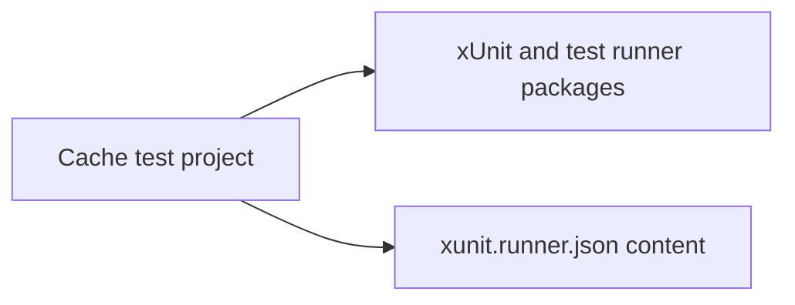

# Assimalign.Cohesion.Database.Cache design

This page describes the boundaries and implementation shape of `Assimalign.Cohesion.Database.Cache`.

> **Status:** Not yet implemented.

Cache is deferred behind the `Key`-Value engine and currently has no implemented engine, persistence,
or lifecycle. Its empty source and test stubs do not define the future Cache model architecture.

The only build correction in Phase 2 is the test project's item classification: `xunit.runner.json`
is content rather than a C# compile item. The stub test remains unchanged. Future runtime
implementation must compose the shared `Database` kernel and follow the resource-area reference rules.

The test project references runner packages; runner configuration is a content file owned by that
project. This diagram shows those existing build dependencies.

[Assembly overview](index.md) · [Examples](examples/index.md)

## Sources

- **Primary source** — `cohesion/resources/Database/Assimalign.Cohesion.Database.Cache/docs/DESIGN.md`.
- **Source** — `cohesion/resources/Database/Assimalign.Cohesion.Database.Cache/src/Assimalign.Cohesion.Database.Cache.csproj`.
