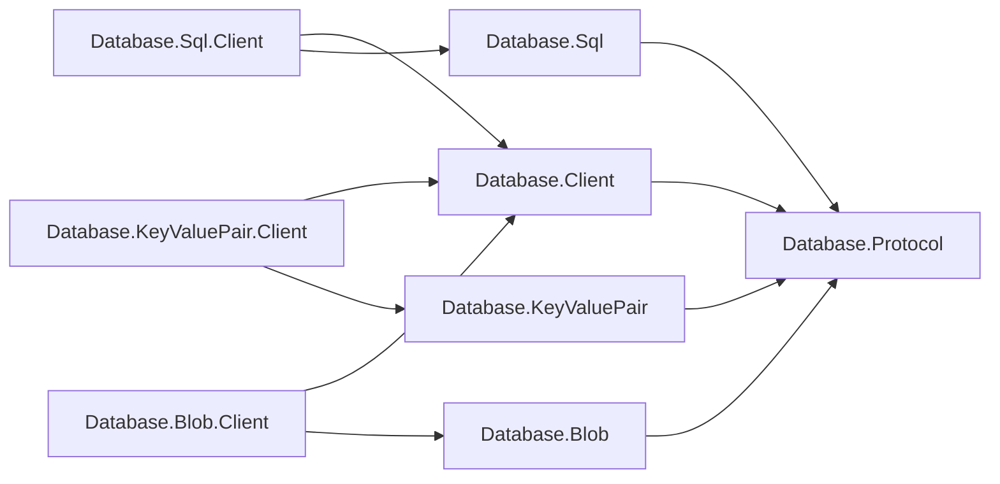
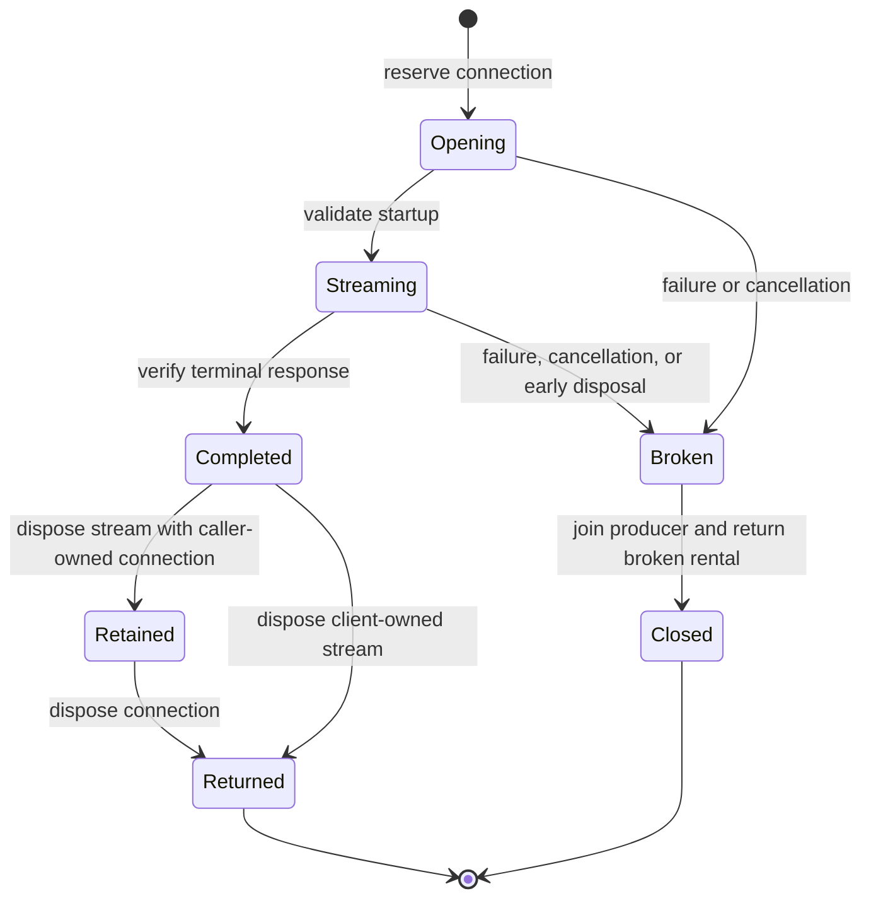

# Assimalign.Cohesion.Database.Client design

This page describes the boundaries and implementation shape of `Assimalign.Cohesion.Database.Client`.

> **Status:** Implemented.

The shared client owns transport dialing, startup/authentication, framing, pooling, and connection
health. Model clients own request encoding, response validation, and result materialization. The
shared client references no model package and imposes no result shape.

## Family boundary

Clients depend on shared mechanism and their own model's wire codecs:

| Package | Responsibility |
| --- | --- |
| `Database.Client` | Dial, handshake, bounded pooling, framed exchange lifetime |
| `Database.Protocol` | Framing, shared messages, immutable family binding |
| `Database.Sql.Client` | SQL parameter encoding, decoding, and materialization |
| `Database.KeyValuePair.Client` | `Key`-value encoding, decoding, and materialization |
| `Database.Blob.Client` | Blob transfer validation, acknowledgements, and typed metadata responses |
| Model packages | Model identifiers and payload codecs |

`DatabaseClientOptions.Family` is mandatory. The pool captures the exact immutable
`ProtocolMessageFamily` instance before dialing. Every connection uses a `ProtocolChannel` bound to
that family throughout its lifetime. An `IDatabaseProtocolExchange<TResult>` supplies its required
family and consumes one exchange through the channel reader and writer. A different family instance
is rejected before execution, including a family that reuses the same identifier bytes.

The materialized operation returns only after consuming the complete response and must not retain or
dispose the borrowed reader/writer. SQL and `Key`-Value materialize; Blob uploads transfer bounded
chunks from caller-owned streams. Downloads use the shared streaming exchange described below. Model
payloads, result shapes, and acknowledgement rules remain owned by their model packages.

## Lifecycle and errors

Creation performs no I/O. Rent opens or reuses an authenticated session. Disposing a healthy rental
returns it to an idle stack; `MaxPoolSize` bounds rentals and exhausted rents wait. Disposing the
client closes idle connections; outstanding rentals close when returned. Closure sends best-effort
`Terminate`.

The pool does not infer connection health from an error code. On failure,
`IDatabaseProtocolExchange<TResult>.IsResponseComplete` certifies that the exchange consumed the
entire response and left the server session ready for another request. Its default is false, so an
exchange that supplies no evidence is discarded after failure. Successful return already guarantees
a complete response; existing successful exchanges do not need to implement this property. Framing
violations, transport failure, and an unfinished response invalidate the connection.

SQL and `Key`-Value reset the signal before each request and set it only after decoding a terminal
response. Their server implementations send `ParseFailure` and `ExecutionFailure` as complete
statement responses before any result frames and return to their ready loop; the model exchanges
certify that initial response phase before throwing the unchanged `DatabaseClientException`. Other
server errors terminate those sessions. This knowledge belongs to the statement exchange, not to a
pool-wide list of safe codes. Blob failures do not certify completion: a transfer can leave unread
frames even when its error code is `ExecutionFailure`. Wire codes and messages reach callers
unchanged, independently of the health decision.

Handshake rejections preserve their wire code in `DatabaseClientException`. Idle server-side
evictions remain discoverable at next use; rent-time pings are future work.

Only one exchange may use a connection at a time. An overlapping exchange is rejected before it
writes any frames. Disposing a connection cancels and joins its current operation before returning
the rental, so an active exchange cannot enter the idle pool. Disposal and failure release each
rental exactly once.

`IDatabaseConnection.AbortAsync` explicitly discards a rental when a model cannot reset its
application-level session state. It marks the connection unusable before cancelling/joining any
active exchange and disposing the rental, so the pool closes its transport instead of reusing the
session. This is non-cancellable and idempotent on the current rental. It makes no claim about
whether the server completed an unacknowledged command; transaction outcome and reconciliation
remain model concerns.

## Streaming exchange and ownership

`IDatabaseStreamingExchange` supplies the exact `Family`, an `OpenAsync` phase that writes the
request and validates startup metadata, and a `CopyToAsync` phase that copies content into a
borrowed destination and verifies the terminal response. The shared client owns the asynchronous
producer, bounded handoff, cancellation, read stream, and connection lifetime. The model owns
framing semantics, metadata, counts, and acknowledgements; it never owns the handoff queue or
producer task. Startup failures reach the opening call. After startup, failures reach stream reads.
Streaming frame adapters normalize completed transport pipes that report `InvalidOperationException`
into transport failures. This normalization is confined to streaming frame I/O; materialized SQL and
`Key`-Value exchanges retain their existing transport exception behavior, and caller stream exceptions
are unchanged.

There are two deliberate ownership forms. `IDatabaseConnection.ExecuteStreamingAsync` uses a
caller-owned rental and preserves that rental after verified completion and stream disposal,
allowing another operation on the same typed connection. A failed or abandoned transfer invalidates
and returns that rental immediately. The `IDatabaseClient.ExecuteStreamingAsync` extension rents on
the caller's behalf; its returned stream owns that rental until disposal or failure. Verified EOF
alone does not return a client-owned stream's healthy rental: the caller must dispose the stream.
These forms serve Blob's existing connection API and model clients that expose a download directly
from their pooled client.

The destination copies content into chunks no larger than 65,536 bytes and writes them through a
single-slot bounded queue. Backpressure stops the producer when the consumer's current chunk and
queued chunk have not advanced. Content memory stays bounded by those chunks, a pending destination
chunk, and model/transport buffers, independent of transfer length. The producer must finish
validating the terminal response before the stream can report EOF. A recorded failure is sticky: it
takes precedence over buffered content and subsequent reads keep reporting it.

The opening token remains active throughout the transfer. Canceling any asynchronous read cancels
the whole producer, including a destination write blocked on a full queue. Early synchronous or
asynchronous stream disposal cancels and joins the producer and closes the unfinished connection;
completed stream disposal preserves connection health. Disposal suppresses recorded transfer errors
because reads carry those errors. Streams are read-only and sequential, reject overlapping reads,
and do not support length or seeking.

The lifecycle below distinguishes verified completion from release of the rental. `For` a caller-owned
connection, healthy stream disposal retains the rental until connection disposal; for a client-owned
stream, it returns the rental to the pool.

The completion signal serves SQL, `Key`-Value, Blob, and future exchanges with their own terminal
semantics. The streaming contract and its two ownership forms serve Blob and test-level model
consumers; future Documents and Graph clients implement only their startup and content protocol. No
Blob-specific type enters the shared contract, and those clients need not copy Blob's former
lifetime machinery.

## Settings and compatibility

Connection strings carry database, principal, endpoint, and pool size. Drivers are typed
`IConnectionFactory` options, composed statically. Typed endpoints also support in-memory
transports. The endpoint selects the model; startup carries no model discriminator.

SQL and `Key`-Value wire bytes stay at version 1.0. Moving APIs is a managed API migration: direct SQL
callers import `Database.Sql.Client` and bind `SqlProtocol.Family`, or use the existing typed
client. `DatabaseClientResult` and `DatabaseClientColumn` now live in the SQL client's namespace.
`New` model clients implement the generic exchange interface using their model's exact family.

No reflection, code generation, driver discovery, model parser, or model result policy is required.
The streaming path adds no dependencies or shipped-library `InternalsVisibleTo` grants and remains
compatible with `net10.0` and NativeAOT. TLS remains a connection-factory concern.

## Declarative command delivery

`DatabaseCommandClient.Create(Uri controlPlaneAddress, string bearerToken, HttpMessageInvoker transport)`
accepts a caller-owned transport, including its TLS trust policy. Disposing the returned client does
not dispose that transport; the caller retains it until requests finish and disposes it afterward.
The two-argument factory still creates a transport owned and disposed by the client. Both overloads
perform the same endpoint and credential validation; a null supplied transport throws
`ArgumentNullException`. The client does not discover application trust.

`IDatabaseCommandClient` is the separate HTTP admin command contract. `DatabaseCommandClient.Create`
accepts the full manifest control-plane URI (including its path) and an opaque bootstrap bearer.
`SendCommandAsync` posts the camel-case id/kind/owner/key/payload envelope to commands; payload is
base64. `DeleteCommandAsync` sends DELETE to the same route and envelope. Both return package-local
`ResourceCommandObservation` with Status and Detail, retaining actionable provider refusal text.
Transport failures propagate; HTTP refusals become Rejected observations. Serialization uses
explicit Utf8JsonWriter/JsonDocument access. The caller disposes the client; redirect following and
cookies are disabled. No runtime Hosting or ApplicationModel dependency was added.

## Declared dependencies

| Reference | Kind |
|---|---|
| `Assimalign.Cohesion.Database` | `CohesionProjectReference` |
| `Assimalign.Cohesion.Database.Protocol` | `CohesionProjectReference` |
| `Assimalign.Cohesion.Connections` | `CohesionProjectReference` |

[Assembly overview](index.md) · [Examples](examples/index.md)

## Sources

- **Primary source** — `cohesion/resources/Database/Assimalign.Cohesion.Database.Client/docs/DESIGN.md`.
- **Source** — `cohesion/resources/Database/Assimalign.Cohesion.Database.Client/src/Assimalign.Cohesion.Database.Client.csproj`.
