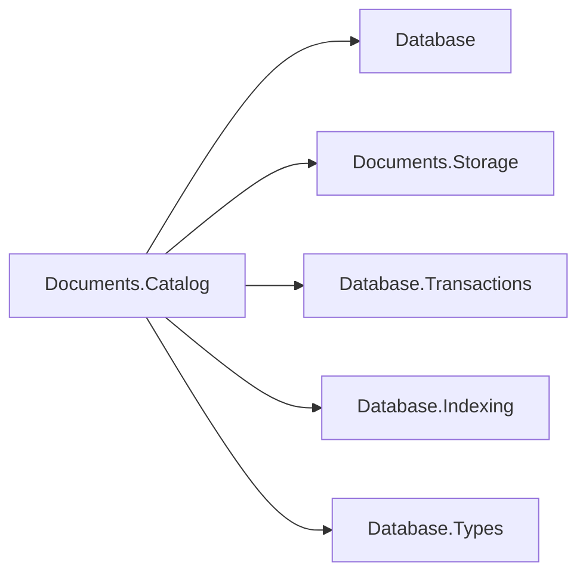

# Assimalign.Cohesion.Database.Documents.Catalog design

This page describes the boundaries and implementation shape of `Assimalign.Cohesion.Database.Documents.Catalog`.

> **Status:** Partial.

## Family and responsibilities

Documents.Catalog depends on the `Database` root for ownership vocabulary, `Documents.Storage` for
record/content access, `Database.Transactions` for MVCC and statement brackets, `Database.Indexing` for
B+Trees, and `Database.Types` for scalar key encoding. The engine depends on this package and owns
sessions, OQL planning/execution, lock acquisition, ownership enforcement, and commit/rollback.
There is no Hosting or ApplicationModel dependency and no compiled-schema provisioning.

The dependency diagram shows the same reference direction as the prose.

`IDocumentCatalog` is a new Documents-owned interface. The pre-existing engine, collection, session,
storage-kernel, transaction, and index interfaces are unchanged. Public metadata records are
immutable values; the implementation and codecs are internal.

## Snapshot directory and ownership

Opening scans only owner-zero metadata pages, building directories keyed by ordinal collection name,
`(collectionId, documentId)`, and `(collectionId, indexName)`. Directories retain physical version
references. Every lookup rereads record stamps and identity: rollback, purge, and slot reuse cannot
silently stale the directory. CRC and I/O failures propagate. Reclaimed slots and reused identities
invalidate cached references. Reads choose the newest visible writer whose deleter is not visible.
Enumeration is ordinal name/identity order, independent of insertion, page allocation, or B+Tree
scan order.

Collections carry `DatabaseObjectOwner` plus an optional owning schema. `Schema` requires a nonempty
schema name. The engine creates live-session collections as `Adhoc` and rejects `DROP COLLECTION`,
OQL `CREATE INDEX`, and OQL `DROP INDEX` against a schema-owned collection with
`DatabaseObjectLockedException`, naming the collection, schema, and requested operation. Catalog
metadata can be directly marked for enforcement tests; this is not a compiled-schema deployment
facility.

The caller holds appropriate shared-kernel locks and checks latest committed metadata before a
write. In particular, a transaction whose snapshot predates a changed index definition must be
rejected for mutation: maintaining its obsolete index set would miss newly committed indexes. The
engine performs this check. Catalog methods are lower-level composition seams, like Blob's catalog,
and do not acquire model locks themselves.

## Record format, version 1

Every record starts with UInt64 writer at offset 0, UInt64 deleter at 8, byte kind at 16, byte
format version at 17. All integers are little-endian. Strings are Int32 UTF-8 byte length followed
by those bytes; length -1 means null where explicitly allowed. Strings use strict UTF-8. GUIDs are
the 16 bytes produced by `Guid.ToByteArray()` (the .NET mixed-endian layout). These choices are
explicit so a reader in another language can decode the format without .NET serialization.

The fields below appear consecutively beginning at offset 18. No trailing fields are accepted.

| Kind | Owner pages | Payload fields, in order |
| --- | --- | --- |
| 1 collection | 0 | GUID collection identity; string name; byte owner; nullable string owning schema |
| 2 document | 0 | GUID collection identity; string document identity; UInt64 version; UInt64 head; Int64 byte length; UInt32 IEEE CRC-32 |
| 4 index definition | 0 | GUID collection identity; string index name; string field path; UInt64 physical generation identity |
| 5 physical registration | 1 | UInt64 physical generation identity; Int64 root page; string index name |

Kind 3 content chunks use the format in
[Documents.Storage](../assimalign-cohesion-database-documents-storage/design.md) . Collection IDs
cannot be empty, names cannot be blank, document versions start at 1, content heads cannot be zero,
and document lengths must be positive and fit in an Int32. Owner is the underlying
`DatabaseObjectOwner` byte (`Adhoc = 0`, `Schema = 1`). Unknown kinds, versions, invalid
references, duplicate physical generations, and malformed payloads fail closed.

Catalog metadata records fit one slotted-page record. Identity/name/path sizes are consequently
bounded by `SlottedPage.MaxRecordSize`; very long metadata is rejected by the shared storage layer.
`Document` content has its separate multi-page chunk mechanism.

## `Index` definition and key semantics

`Index` definitions are lower-level catalog mutations, not a second public engine entry point. The
Documents planner turns OQL `CREATE INDEX` and `DROP INDEX` expressions into catalog-operation
plans, and the plan executor invokes this package under the statement's `ITransactionContext` after
lock acquisition and ownership enforcement. `IDocumentDatabase` therefore needs no index members,
and the catalog and B+Tree updates retain the same transaction as the DDL statement.

Each index is a nonunique B+Tree over one case-sensitive field path. The catalog stores that path in
a lossless canonical form matching OQL's document-path segments. Identifier-safe object names use
dotted syntax and nonnegative Int32 array subscripts use numeric brackets, for example
`customer.address.zip` or `items[0].price`. Property names that need escaping, including a root
name containing punctuation, use bracket-string segments with doubled single quotes, for example
`customer['address.line']` or `['root.name']`. The planner also recognizes the preceding extension
API's unquoted, delimiter-free segment encoding when it reads persisted definitions, so an upgrade
does not turn an existing usable index into a scan. Paths do not support wildcards, array expansion,
compound keys, unique constraints, or expression indexes. The field path must exist and resolve to a
boolean, decimal-domain number, or string to produce an entry. Missing fields, null, arrays, and
objects produce no key; the planner uses a collection scan for null/non-scalar predicates.

Booleans use `DatabaseKeyWriter.AppendBoolean`. Every numeric spelling normalizes to decimal and
uses `AppendDecimal`, so `1` and `1.00` are identical index keys. Strings encode UTF-16 code units
as big-endian bytes, then use the shared writer's escaped binary component. This exactly matches
OQL's ordinal UTF-16 string comparison, including supplementary characters versus BMP values. The
type tags give mixed types a deterministic physical ordering; OQL retains its residual predicate and
does not treat that physical tag ordering as a cross-type relational comparison. An encoded key
larger than the shared B+Tree's 1,024-byte limit rejects the write/build before metadata
replacement. There is no lossy truncation or omitted oversized key.

`Index` leaf entry references are packed metadata page/slot locations. Leaf entries carry writer and
deleter stamps through the existing index API. `Create` builds the tree immediately while the caller
holds the logical database's exclusive writer lock, preserving each visible source document's writer
stamp. The new index definition is invisible to snapshots predating its creation; those snapshots
use scans.

## Mutation, rollback, and recovery

Saving a document prepares old and new scalar keys, then one shared physical statement bracket
tombstones prior metadata, inserts new metadata, tombstones old index entries, inserts new index
entries, and persists changed root registrations. Deletion tombstones metadata and keys in one
bracket. The surrounding logical transaction also owns all chunk writes/tombstones. The catalog
publishes its in-memory reference only after the physical bracket succeeds. The shared version
ledger records record and index mutations, so logical rollback erases the writer's keys and restores
old tombstones. The caller aborts the logical operation after failure.

Physical tree generations use reserved storage sequences and are never reused. `Root` registrations
carry writer/deleter zero because they describe current physical topology, including nodes holding
uncommitted versions. `Root` splits and registration updates share one physical bracket. A failure
reattaches the manager from physically restored registrations. Undo adapters resolve the current
tree instead of holding a stale manager object. Current B+Tree erase/purge removes leaf entries
without merging nodes or collapsing roots, so undo does not change the persisted root.

Dropping an index tombstones its definition and keeps the physical tree for readers with older
snapshots. Recreating the name allocates a new physical generation. Tree reclamation for dropped or
rolled-back definitions is deferred; the shared index manager has no tree-page vacuum yet. This
costs disk space, but never rebuilds a live index or exposes a dropped definition.

Recovery order is physical storage redo, coordinator `AnalyzeAndScrub` over stamped records, catalog
open (including physical registrations), `RecoverIndexesAsync` using the same abandoned writer set,
and finally coordinator `CompleteRecovery`. `Root` registrations survive logical scrub so every tree
can be scrubbed before the journal's proof is checkpointed away. No query-time repair or lazy index
rebuild is used. Tests exercise split roots, committed and abandoned updates, logical rollback,
snapshot-pinned versions, mixed shapes, and a serialized restart image. The restart test uses an
ordinary journal flush before cloning its memory streams; it verifies recovery and index scrub
without claiming physical durable-flush support.

## Compatibility and error model

Adding/removing fields, changing scalar type, or replacing an object with an array is supported
without schema migration. Each change creates a new version and updates affected scalar indexes.
On-disk record-layout changes require a new format version and explicit migration support; unknown
versions are rejected. Former raw, unstamped `DocumentStorage` stub files are unsupported as engine
databases. Catalog format failures raise `DocumentCatalogException`; shared storage corruption
remains a storage exception. Invalid JSON/numeric-domain input is rejected by the validated storage
write helper before publication. Public package APIs require no reflection, dynamic code generation,
or Microsoft.Extensions dependencies.

## Declared dependencies

| Reference | Kind |
|---|---|
| `Assimalign.Cohesion.Database` | `CohesionProjectReference` |
| `Assimalign.Cohesion.Database.Documents.Storage` | `CohesionProjectReference` |
| `Assimalign.Cohesion.Database.Storage` | `CohesionProjectReference` |
| `Assimalign.Cohesion.Database.Transactions` | `CohesionProjectReference` |
| `Assimalign.Cohesion.Database.Indexing` | `CohesionProjectReference` |
| `Assimalign.Cohesion.Database.Types` | `CohesionProjectReference` |

[Assembly overview](index.md) · [Examples](examples/index.md)

## Sources

- **Primary source** — `cohesion/resources/Database/Assimalign.Cohesion.Database.Documents.Catalog/docs/DESIGN.md`.
- **Source** — `cohesion/resources/Database/Assimalign.Cohesion.Database.Documents.Catalog/src/Assimalign.Cohesion.Database.Documents.Catalog.csproj`.
