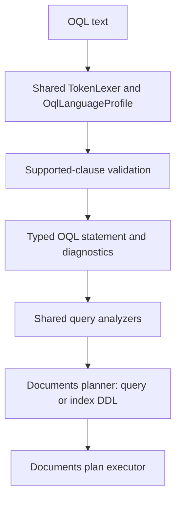

# Assimalign.Cohesion.Database.Documents.Language design

This page describes the boundaries and implementation shape of `Assimalign.Cohesion.Database.Documents.Language`.

> **Status:** Partial.

The package owns the document model's OQL grammar, statement and expression trees, diagnostics, and
conformance corpus. `OqlQueryParser` derives from the shared `QueryParser` and declares
`OqlLanguageProfile.Instance` as its profile. The shared `TokenLexer` provides tokenization; there
is no alternate lexer or duplicated keyword configuration.

## Family and pipeline

`Database.Documents.Language` references only `Assimalign.Cohesion.Database.Language`.
`Database.Documents` consumes its AST for logical planning, physical index selection or index
catalog changes, and execution. This package has no catalog, storage, hosting, or ApplicationModel
dependency.

Parsing runs shared lexing, capability validation, statement/expression parsing, then shared
analyzers. Malformed input remains an `OqlQueryStatement` with error diagnostics; consumers must
reject statements containing errors before planning.

The diagram shows the common parse-plan-execute flow. Both `SELECT` and index DDL remain on this
path; DDL is not dispatched through a separate engine API.



## Supported-clause matrix

The profile's supported set is deliberately the executable subset of `OqlClauses`. Lexical
recognition preserves the established vocabulary so rejected constructs receive `COHDBL001`;
recognizing a token does not make its operation supported.

| Clause | Supported | Shape or reason |
| --- | --- | --- |
| `SELECT` | Yes | One or more projected expressions, optional `AS` output names; `*` returns the source document |
| `FROM` | Yes | Exactly one unqualified collection or reserved `COHESION_SCHEMA` source and optional iteration variable, with or without `AS` |
| `WHERE` | Yes | Scalar comparison and Boolean document filtering |
| `GROUP BY` | Yes | One or more grouping expressions |
| `HAVING` | Yes | `Group` filtering, including aggregate calls |
| `ORDER BY` | Yes | One or more expressions, each optionally `ASC` or `DESC` |
| `CREATE INDEX` | Yes | One named, nonunique index over one document path in one collection |
| `DROP INDEX` | Yes | One named index in one collection; the `ON` qualifier is required |
| `DEFINE` | No | Named query definitions are not planned |
| `ELEMENT` | No | Singleton extraction is not planned |
| `FLATTEN` | No | Collection expansion is not planned |
| `SUBQUERY` | No | A nested `SELECT` reports this capability name at the inner keyword |

Only `COUNT`, `SUM`, `AVG`, `MIN`, and `MAX` are callable. Each takes one expression; `COUNT(*)`
also counts documents. Aggregate placement, grouping consistency, and value semantics are validated
by the Documents planner/executor. `DISTINCT`, `ALL`, `IN`, `EXISTS`, `LIKE`, `BETWEEN`,
collection constructors/quantifiers, `ABS`, and other reserved but unimplemented operations produce
`COHDBL001`. Unknown function calls likewise produce `COHDBL001` naming the function. There is no
implied support for the full ODMG specification.

## Grammar, statement, and expression trees

```text
statement    := (query | create-index | drop-index) [';']
query        := SELECT projection (',' projection)* FROM collection [AS? identifier]
                [WHERE expression] [GROUP BY expression (',' expression)*]
                [HAVING expression] [ORDER BY ordering (',' ordering)*]
create-index := CREATE INDEX identifier ON collection '(' path ')'
drop-index   := DROP INDEX identifier ON collection
collection   := identifier | COHESION_SCHEMA '.' identifier
projection   := expression [AS identifier]
ordering     := expression [ASC | DESC]
path         := identifier ('.' identifier | '[' integer ']' | '[' string ']')*
```

`CREATE INDEX` and `DROP INDEX` intentionally use SQL's familiar shape because ODMG defines no
index-DDL syntax. The create form accepts the same document-path grammar as query expressions, so an
index can target a nested object field or array element. The path is relative to each document;
there is no iteration alias in an index statement. `Index` and collection names follow the same
identifier quoting and case-preservation rules as query collection names.

`OqlQueryStatement` wraps one top-level `OqlExpression`: `OqlSelectExpression`,
`OqlCreateIndexExpression`, or `OqlDropIndexExpression`. `Index` creation retains its target as an
`OqlPathExpression`, rather than flattening the path during parsing, so the planner receives the
same segment model used by query predicates.

Keywords and function names are case-insensitive. Collection and property names preserve case.
Double quotes delimit identifiers; single quotes delimit strings, with a doubled single quote
representing one quote. Property names after a dot may use a reserved word; bracket strings address
arbitrary property names. Array indices are nonnegative, zero-based 32-bit integers. Parentheses
group expressions. `$name`, `$1`, and `@name` all produce parameter names without the prefix.
Empty identifiers and empty parameter names are syntax errors.

Literal nodes hold a string, Boolean, decimal, or null; `NIL` is a synonym for null. `Decimal` and
scientific notation use invariant culture and reject invalid/out-of-range decimal values. Numeric
query literals therefore have a bounded decimal range even when JSON can represent a larger number.
The parser does not silently round a literal to an infinity or coerce it to text.

Operator precedence, lowest first: `OR`, `AND`, comparisons and null tests, addition/subtraction,
multiplication/division/remainder, unary signs. `NOT` binds around comparisons, so `NOT age < 18`
means `NOT (age < 18)`. Comparison operators are `=`, `!=`, `<>`, `<`, `<=`, `>`, and `>=`;
the AST normalizes `<>` to `!=`. Null tests are unary `IS NULL` and `IS NOT NULL` nodes. Arithmetic
supports `+`, `-`, `*`, `/`, and `%`.

The parser is a partial class, split into dispatch/token handling, SELECT clauses, index DDL, and
expression parsing, following `SqlQueryParser`. Parser-produced list properties are read-only
snapshots; AST nodes retain source spans and the top-level expression retains the original statement
text. Locations use zero-based UTF-16 offsets with exclusive ends and one-based line numbers. Nested
expressions are capped at 128 recursive parse levels; rejection is a diagnostic, not a
stack-overflow exception. Concurrent calls on one parser are serialized. The parser owns no
disposable resources beyond those used by the shared analyzer pipeline.

## `Diagnostic` contract

| Code | Meaning |
| --- | --- |
| `COHDBL001` | A recognized clause or operation lies outside the executable profile |
| `OQL0001` | Empty statement, including whitespace/comment-only text |
| `OQL0002` | Syntax error, missing token, invalid identifier/path, or multiple statements |
| `OQL0003` | Unterminated quoted text or block comment |
| `OQL0004` | Invalid or out-of-range numeric literal |
| `OQL0005` | Expression nesting exceeds the supported depth |
| `OQL0006` | Invalid aggregate argument count or star operand |

Every error has an absolute start/end span and source line. End-of-input errors use the source
length for both offsets. Capability validation precedes statement parsing so an unsupported
construct receives the shared capability diagnostic instead of an accidental generic syntax error.
Quotes, comments, and property names after dots are not mistaken for clauses. Malformed index DDL
produces `OQL0002` at the missing or invalid token; it does not escape the parser as an exception.

## Scope, index DDL, and mutations

OQL's scope was deliberately expanded from query-only to include index DDL. Documents and SQL now
manage secondary indexes through their language pipelines, and callers no longer need document index
extension members that switch on internal database implementations. This is an intentional
language-design change, not an accidental departure from the earlier query-only boundary. It is
limited to `CREATE INDEX` and `DROP INDEX`: both are parsed, planned, and executed by the Documents
engine in the same change that adds them to `OqlLanguageProfile`.

An OQL statement cannot name a server or switch databases. `FROM other.collection` is invalid
syntax; quoted collection names remain a single opaque identifier. The only qualified source syntax
is the reserved `COHESION_SCHEMA.<name>` namespace in the current database. The engine resolves
`COHESION_SCHEMA.INDEXES` and `COHESION_SCHEMA.OBJECT_OWNERSHIP` to virtual document collections
computed from its statement catalog snapshot. Their qualified names are case-insensitive, including
fully quoted names. Their document fields retain ordinary case-sensitive OQL path semantics. No
catalog or storage dependency is added to this parser.

The same source syntax is parsed in index DDL so supported mutations receive the engine's stable
`System collection '<canonical source>' is read-only.` diagnostic instead of an accidental syntax or
missing-collection error. Projection, filtering, grouping, and ordering reuse ordinary SELECT
syntax; no separate metadata API or statement class is introduced. The engine design documents the
field shapes, snapshot visibility, and read-only rules. `CREATE DATABASE`, `DROP DATABASE`, `USE`
, and other SQL data-mutation/transaction commands are unsupported. Multiple statements per parse
are rejected. Logical database creation and deletion remain engine-side C# operations.

OQL still has no document data-mutation syntax. `Document` insert/replacement and delete use the
frozen `IDocumentCollection.PutAsync` and `DeleteAsync` contracts, including their transaction and
expected-version semantics. No existing public interface was widened for index management or a
second data-mutation language. The Documents engine design states query ordering, mixed-shape
behavior, index-DDL ownership, and aggregate/mutation semantics.

## Verification and extension

`OqlQueryParserTests` and `OqlIndexDdlParserTests` contain valid and malformed query/index-DDL
corpora plus structural AST, exact diagnostic span, precedence, nested-path/array, parameter, scope,
and recursion-limit checks. Profile tests assert every supported capability and every deferred OQL
clause. Existing lexer conformance remains unchanged, including recognition of unsupported reserved
vocabulary.

A new clause requires parser, planner, executor, conformance tests, and a matrix entry together;
only then may it join the profile's supported set. The package uses static code and BCL values, with
no reflection, runtime discovery, or `Microsoft.Extensions.*` dependencies, and remains NativeAOT
compatible.

## Declared dependencies

| Reference | Kind |
|---|---|
| `Assimalign.Cohesion.Database.Language` | `CohesionProjectReference` |

[Assembly overview](index.md) · [Examples](examples/index.md)

## Sources

- **Primary source** — `cohesion/resources/Database/Assimalign.Cohesion.Database.Documents.Language/docs/DESIGN.md`.
- **Source** — `cohesion/resources/Database/Assimalign.Cohesion.Database.Documents.Language/src/Assimalign.Cohesion.Database.Documents.Language.csproj`.
