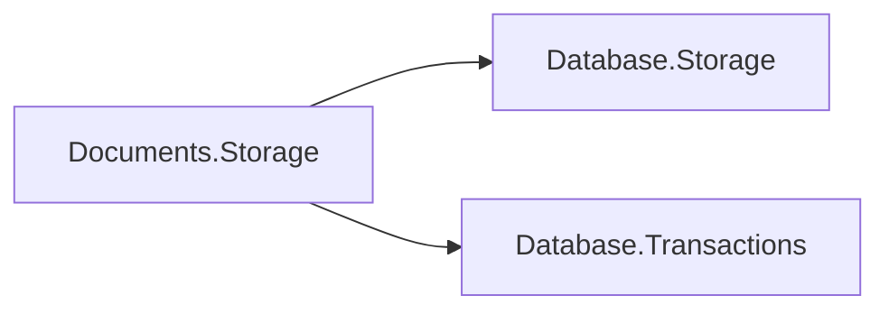

# Assimalign.Cohesion.Database.Documents.Storage design

This page describes the boundaries and implementation shape of `Assimalign.Cohesion.Database.Documents.Storage`.

> **Status:** Partial.

## Composition and lifecycle

`Documents.Storage` depends on `Database.Storage` for pages, checksums, file headers, journaling,
write-back, and physical recovery, and on `Database.Transactions` for logical transactions and
record-version bookkeeping. It duplicates none of those mechanisms. The engine supplies one
coordinator for one storage instance. Catalog metadata and content occupy the same file set.

The dependency direction is shown below; both arrows mean references.

`Create` initializes a shared-kernel file set with model `Document`. The engine opens with
`checkpointOnOpen: false`, constructs the coordinator, calls `AnalyzeAndScrub`, opens the catalog
and scrubs its indexes, and only then calls `CompleteRecovery`. Checkpointing earlier would discard
the commit evidence needed to distinguish abandoned logical writes. Engine disposal aborts active
logical contexts before durably flushing storage. `Storage` owns the passed streams.

## Serialization rules, version 1

Content is exactly one UTF-8 JSON value, without a BOM, comments, or trailing commas. Objects,
arrays, strings, booleans, JSON null, and numbers are accepted at the root or nested. Maximum
nesting depth is 128. `Object` field names are ordinal and case-sensitive; duplicate names in any
object are rejected, including names that become equal after JSON escape decoding. `Object` field
order, array order, whitespace, string escape spelling, and numeric spelling round-trip byte for
byte. Unicode escapes use the BCL JSON reader's validation and decoding semantics.

Numbers must be exactly representable by `System.Decimal`. Validation first parses a decimal, then
compares normalized signed significands and base-10 exponents against the original token. Rounding
and underflow are rejected: for example, `1e-100` and excess nonzero fractional precision are
unsupported. Numerically equal spellings such as `1`, `1.0`, and `1e0` remain byte-distinct
content but compare equally in OQL and indexes. Signed zero compares equal to zero. NaN and infinity
are not JSON and are rejected. Timestamps and binary content have no implicit type; applications may
encode them as ordinary strings or arrays.

Validation occurs before any chunk write in `WriteContentAsync`. A malformed write creates no
chunks. `ReadContent` verifies the length, chain topology, complete checksum, and JSON rules. It
returns an independent byte array; changing it cannot mutate storage. The implementation uses
`JsonDocument` and explicit scalar handling; it does not use reflection, runtime activation,
`JsonSerializer` type discovery, or dynamic code generation.

## Physical record envelope

All integers in record envelopes are little-endian. Offsets below are relative to the start of a
slotted-page record, not the physical page. Shared page headers, CRCs, slot directories, journaling,
and allocation are specified by `Database.Storage`. The writer/deleter prefix follows
[Database.Transactions](../assimalign-cohesion-database-transactions/design.md) .

| Offset | Bytes | Meaning |
| --- | --- | --- |
| 0 | 8 | Logical writer sequence, UInt64 |
| 8 | 8 | Logical deleter sequence, UInt64; zero means not tombstoned |
| 16 | 1 | Record kind: 1 collection, 2 document metadata, 3 content chunk, 4 index definition, 5 physical tree registration |
| 17 | 1 | Record-format version, currently 1 |

Collection, document, and index-definition metadata use owner-zero pages and the formats in
[Documents.Catalog](../assimalign-cohesion-database-documents-catalog/design.md) . Physical tree
registrations use owner-one pages, writer/deleter zero, and physical statement atomicity; logical
metadata controls whether a tree is queryable.

## Chunk-chain format

Kind 3 contains this complete header followed by raw JSON bytes:

| Offset | Bytes | Meaning |
| --- | --- | --- |
| 0 | 18 | Common stamped envelope above; kind 3, version 1 |
| 18 | 2 | Payload length, UInt16 |
| 20 | 8 | Packed next chunk location, UInt64; zero marks the final chunk |
| 28 | payload length | Consecutive slice of the original UTF-8 content |

Payload capacity is `SlottedPage.MaxRecordSize - 28` (8,064 bytes with the current kernel page
layout). A packed location stores the page in its high 48 bits and slot in its low 16 bits:
`(pageId << 16) | slotIndex`. Zero cannot identify a content record. Chunk pages use owner
`writerSequence | (1UL << 63)`, isolating streaming content from owner-zero metadata scans.

The catalog stores the first location, total byte length, and IEEE CRC-32 over all content bytes.
CRC-32 uses polynomial `0xedb88320`, initial state `0xffffffff`, and final bitwise complement.
Every chunk payload must fit the advertised remaining length. Only the chunk exhausting that length
may have a zero next pointer; a truncated chain, unexpected continuation, or checksum disagreement
is corruption. A valid JSON document is nonempty, so its reference always has a nonzero head and
positive length, at most `Int32.MaxValue`. Streaming primitives can represent an empty byte chain,
but catalog publication rejects it as a document.

A write buffers one chunk, inserts it in a shared physical statement bracket, and links the previous
tail in that same bracket. All chunks and the later metadata version carry the same logical writer.
They remain invisible until the transaction commits. Replacing/deleting content tombstones every old
chunk through `ITransactionContext`; snapshot readers retain the old chain until the shared purge
bound allows reclamation. The shared version ledger removes all created chunks and clears old
tombstones on rollback. A crash uses the shared recovery scrub instead of an in-memory undo ledger.
Tests flush the journal ordinarily and clone serialized memory-stream bytes before disposal to prove
committed chunks survive and abandoned chunks disappear, including chains larger than 128 pages.
These recovery images test replay and scrub; MemoryStream supplies no durable-flush contract or
physical-persistence guarantee.

## Compatibility and limits

Adding, removing, or reordering object fields is supported without provisioning or migration.
Changing a field between scalar types, object, array, and null is supported and produces a new
document version. Documents within one collection may have unrelated shapes. `Index` maintenance
removes the old scalar key and inserts the new scalar key in the same transaction. There is no
implicit scalar conversion: a number becoming a string changes its query/index type.

Changing the on-disk envelope, field ordering, scalar domain, or checksum requires a new format
version and an explicit reader/writer compatibility design. Unknown versions fail closed; there is
no automatic format migration. Files produced by the former unstamped `DocumentStorage` stub are not
supported as engine file sets. Its retained low-level record APIs remain separately usable and do
not validate or stamp data. They are intentionally excluded from engine composition.

Compiled-schema provisioning, compression, binary-JSON field-offset tables, encryption, replication,
and a wire streaming protocol are outside this package's scope.

## Declared dependencies

| Reference | Kind |
|---|---|
| `Assimalign.Cohesion.Database.Storage` | `CohesionProjectReference` |
| `Assimalign.Cohesion.Database.Transactions` | `CohesionProjectReference` |

[Assembly overview](index.md) · [Examples](examples/index.md)

## Sources

- **Primary source** — `cohesion/resources/Database/Assimalign.Cohesion.Database.Documents.Storage/docs/DESIGN.md`.
- **Source** — `cohesion/resources/Database/Assimalign.Cohesion.Database.Documents.Storage/src/Assimalign.Cohesion.Database.Documents.Storage.csproj`.
