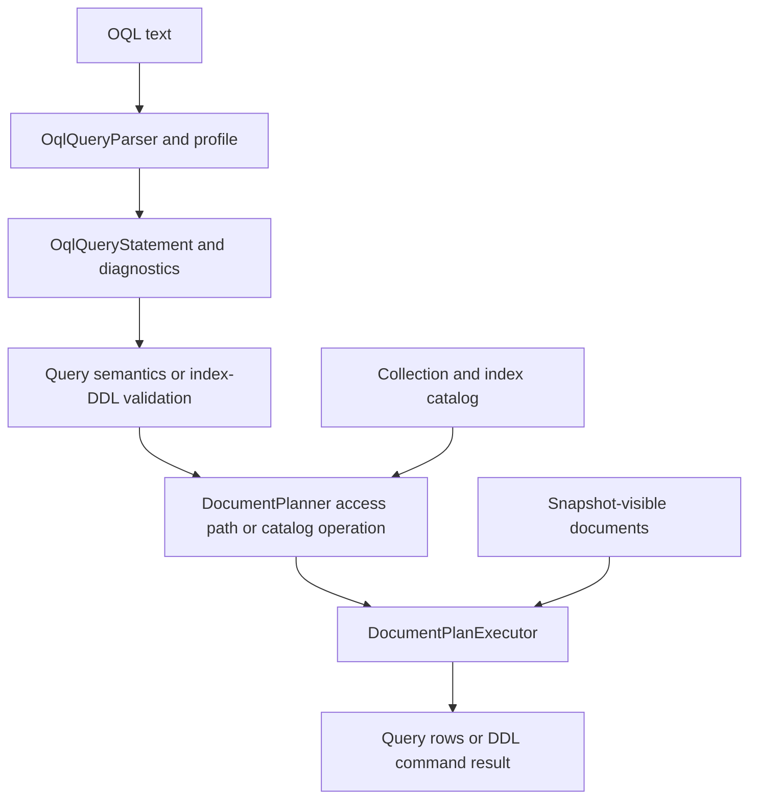
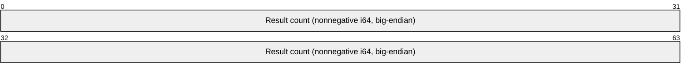
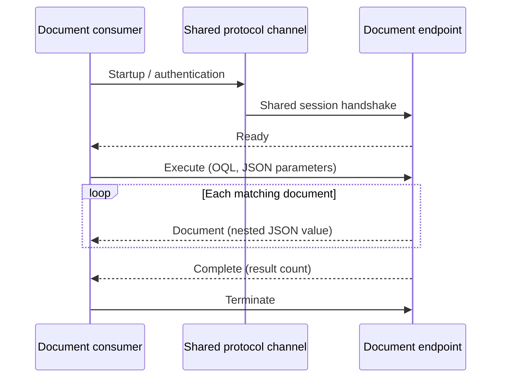

# Assimalign.Cohesion.Database.Documents design

This page describes the boundaries and implementation shape of `Assimalign.Cohesion.Database.Documents`.

> **Status:** Partial.

## String comparison and collation (#1025)

Documents remains ordinal-only. OQL string predicates, ordering, grouping, and distinct comparisons
use case-sensitive .NET ordinal (UTF-16 code-unit) order. String index keys encode that same order,
including supplementary characters; they do not inherit SQL's UTF-8 collation transforms. Collection
names, document IDs, JSON property names, and prefix listings are also ordinal and case-sensitive.
Administrative database lookup remains ordinal-ignore-case. SQL database defaults, column
collations, and expression `COLLATE` have no effect on this model. Configurable document collation
is deferred; stored text retains its original form.

## Intent and composition

Documents combines the Blob engine's lifecycle, session transaction, worker, and stamped chunk
discipline with SQL's parse, logical planning, physical planning, and execution split. `Storage`,
journaling, paging, locks, MVCC, and B+Tree algorithms belong to the shared kernel. No kernel
contract or existing public interface was widened. The model adds internal implementations of the
frozen document contracts.

Every OQL statement flows through these stages. Catalog metadata informs query access-path selection
and index-DDL planning; `SELECT`, `CREATE INDEX`, and `DROP INDEX` all reach the same plan
executor rather than an index-management side channel.



| Assembly | Responsibility |
| --- | --- |
| `Database.Documents` | Engine, bound sessions, CRUD, OQL query/index-DDL plans and execution, document protocol family, builder extension |
| `Database.Documents.Language` | Profile, parser, AST, stable diagnostic locations |
| `Database.Documents.Catalog` | Versioned collection/document/index metadata and transactional index maintenance |
| `Database.Documents.Storage` | Explicit JSON validation, stamped metadata/chunk records, kernel record-space adapter |
| `Database` and child roots | Shared contracts, transaction coordinator, lock manager, WAL, pages, B+Tree |

The engine references the three model packages and the `Database` root. The catalog references
Documents storage and shared indexing/transactions, never this engine. There are no Hosting or
ApplicationModel references.

## Sessions and authority

The database's direct collection methods run automatic transactions. Methods called through
`session.Database` use that session's active transaction. OQL statements execute through the session
and therefore use its active transaction or an automatic statement transaction. Collection CRUD
always takes a session; a collection rejects sessions from another database. A handle obtained
through a session remains bound to that specific session and fails once it closes. Collection names
are database-local, case-sensitive names; OQL has one collection source and no database
qualification or server commands. The inherited `IDatabase.Engine` lifecycle reference remains the
frozen root API; executing OQL or CRUD never interprets it as session authority over other
databases.

Each statement uses one `ITransactionContext`. Automatic operations commit on success and roll back
on failure. Explicit transaction operations leave commit to the caller; a failing operation rolls
back the whole explicit transaction. Snapshot isolation fixes the read horizon at transaction start.
ReadCommitted captures one statement snapshot and pins its retention horizon for the statement.
Serializable is rejected rather than silently weakened.

The shared lock manager serializes writers per logical database. Before changing a document,
collection, or index, the operation compares its snapshot with the latest state under that lock. An
intervening change raises `DatabaseTransactionAbortedException`. Reads stay snapshot based. Catalog
and index writes use the same logical context as content chunks; rollback and crash recovery cannot
publish a partial document.

Collections created by these APIs have `DatabaseObjectOwner.Adhoc`. A collection directly marked
`Schema` refuses `DROP COLLECTION`, `CREATE INDEX`, and `DROP INDEX`, with
`DatabaseObjectLockedException` naming the collection, owning schema, and requested operation.
`Document` contents remain mutable. There is no compiled-schema provisioning authority in this engine.

## OQL query and DDL semantics

### Catalog introspection

Collections are already discoverable through `GetCollectionsAsync` and `GetCollectionAsync`. OQL
adds only the catalog facts those handles do not expose, through two virtual document collections:

| Source | `Document` properties | Cardinality |
| --- | --- | --- |
| `COHESION_SCHEMA.INDEXES` | `COLLECTION_CATALOG`, `COLLECTION_NAME`, `INDEX_NAME`, `PATH`, `IS_UNIQUE` | One document per visible index definition; `IS_UNIQUE` is Boolean false for the current nonunique indexes |
| `COHESION_SCHEMA.OBJECT_OWNERSHIP` | `COLLECTION_CATALOG`, `COLLECTION_NAME`, `OBJECT_TYPE`, `OBJECT_NAME`, `OWNER`, `OWNING_SCHEMA` | One document per visible collection; `OBJECT_TYPE` is `COLLECTION` |

`COLLECTION_CATALOG` is the bound database name. `OWNER` preserves SQL's `Adhoc` and `Schema`
values; `OWNING_SCHEMA` is the schema name or JSON null. Documents enforces ownership on the
collection: index DDL checks that collection's owner. The index metadata has no independent
ownership, so the ownership source reports collections and does not invent an index owner. `Index`
paths retain the catalog's canonical document-path spelling; physical generation IDs and B+Tree
pages remain internal. There is no collection schema or inferred document-field catalog.

The sources are document shaped: `SELECT *` returns one JSON document per entry, and ordinary
projection, aliases, parameters, filtering, grouping, aggregates, and ordering use the same
evaluator as stored documents. `For` example:

```sql
SELECT INDEX_NAME, PATH FROM COHESION_SCHEMA.INDEXES
WHERE COLLECTION_NAME = 'items' ORDER BY INDEX_NAME

SELECT OBJECT_NAME, OWNER, OWNING_SCHEMA
FROM COHESION_SCHEMA.OBJECT_OWNERSHIP
```

This follows the existing choice to put document index DDL in OQL and keeps the frozen database
interface unchanged. The system-source names are case-insensitive; their JSON property names are
case-sensitive, as with all document paths. Only the reserved `COHESION_SCHEMA` qualifier is
accepted: it names a source in the session's database, never another database. Ordinary
`other.items` remains invalid. Quoting the entire system-source name also identifies the same
reserved source.

Every query computes documents directly from the same transaction catalog snapshot used by the
statement. Snapshot transactions retain their read horizon, while own uncommitted catalog writes are
visible. Subsequent statements observe committed catalog changes according to their isolation level.
No metadata copy, content record, or synthetic collection is stored, and existing collection listing
stays unchanged.

The sources are read-only. `CREATE INDEX` and `DROP INDEX` targeting either source, and
`CreateCollectionAsync` or `DropCollectionAsync` using either reserved name, throw
`DatabaseException` with `System collection '<canonical source>' is read-only.` before ordinary
catalog lookup or mutation. OQL document `INSERT`, `UPDATE`, and `DELETE` remain unsupported
everywhere and return the existing `COHDBL001` parse diagnostic. Virtual sources do not provide
mutable `IDocumentCollection` handles.

### Stored document queries

The supported clause matrix lives in the language package's
[DESIGN.md](../assimalign-cohesion-database-documents-language/design.md) . SELECT, FROM, WHERE,
GROUP BY, HAVING, ORDER BY, CREATE INDEX, and DROP INDEX are executed; DEFINE, ELEMENT, FLATTEN,
nested queries, document data-mutation statements, and server statements are rejected with
`COHDBL001`. The parser advertises only clauses this executor supports. AST diagnostics are checked
both for text requests and directly constructed requests.

Projection supports whole documents, nested field paths, zero-based array element paths, literals,
parameters, arithmetic, and aggregates. `SELECT *` returns one `document` column containing the
entire JSON value. Objects and arrays remain `JsonElement` values; scalars become null, Boolean,
decimal, or string. Mixed-type columns advertise `DatabaseType.Null` as unknown rather than guessing
a schema. An explicit alias resolves duplicate projected column names; otherwise they fail. No POCO
reflection, schema inference, or runtime code generation is involved. Query JSON parsing uses the
same 128-level nesting limit as storage validation and index extraction, so every accepted document
can be queried at its stored depth.

Absent fields, paths through an incompatible shape, and out-of-range array indexes evaluate to null.
Null and missing share the same group and `IS NULL` behavior. Ordinary comparison with null is
unknown; WHERE/HAVING retain only true predicates. Equality compares scalar values and structurally
compares arrays/objects. Range predicates compare only values of the same scalar kind. Arithmetic
requires decimal operands; invalid numeric input and division by zero fail explicitly.

COUNT(*) counts documents; COUNT(expression) counts nonnull values. SUM and AVG require numeric
nonnull inputs. SUM, AVG, MIN, and MAX over no nonnull inputs return null; COUNT returns zero.
Ungrouped aggregate queries yield a single group even for an empty source. Outside aggregate calls,
grouped projection, HAVING, and ORDER BY expressions must be a group key or an expression built from
group keys and constants. `Group`-key binding compares expression structure, preserves literal scalar
types, and treats qualified and unqualified paths to the same iteration variable as equivalent.
`Group` values compare structurally.

Results are deterministic. A scan and an index seek both establish ordinal document-ID order before
filtering and projection. GROUP BY uses the total order null, Boolean, decimal, ordinal string,
array, object. Arrays compare element by element; objects compare property names in ordinal order
and their values. ORDER BY accepts source expressions or a standalone explicit projection alias;
alias names take precedence over source fields for that standalone form. It compares its expressions
and preserves the established order for ties. This baseline makes identical data and queries return
identical sequences across access paths. Query results are materialized and own their JSON values;
they do not retain a transaction or borrowed storage memory after execution.

## `Index` planning and writes

`CREATE INDEX <index-name> ON <collection> (<path>)` and `DROP INDEX <index-name> ON <collection>`
are OQL statements. `DocumentPlanner` binds them to catalog-operation plans and
`DocumentPlanExecutor` executes those plans under the statement's `ITransactionContext`. This
replaces the former extension-member entry point and leaves the frozen `IDocumentDatabase` member
list unchanged; there is no runtime switch on internal database implementations.

The create path uses the same segment grammar as a WHERE path, including nested object fields, array
subscripts, and bracket-string property names. Planning converts those segments to the catalog's
lossless canonical path without changing their case or treating a property name's punctuation as
structure.

The executor takes the logical database's exclusive writer lock, enforces schema ownership using the
specific `CREATE INDEX` or `DROP INDEX` operation name, and delegates the transactional catalog/tree
work to Documents.Catalog. The catalog owns index definitions and maintains shared B+Trees during
every Put/`Delete` and collection drop. `Index` creation populates existing documents in its
transaction; queries never lazily build trees. Dropping an index removes its visible definition in
the same transaction, so subsequent physical plans stop selecting it while older snapshots retain
their defined visibility.

Successful index DDL returns a command `QueryResult` with `Success` status and an affected count of
zero; index definition changes are not document-row mutations.

The physical planner uses applicable equality/range predicates on indexed paths, including parameter
values, reversed operands, and conjunctive bounds. Equality is preferred over a range; ties choose
ordinal index name. The executor reapplies the full predicate to candidates, preserving mixed-shape
semantics. See the [catalog design](../assimalign-cohesion-database-documents-catalog/design.md) for
supported scalar keys, visibility filtering, and restart recovery.

## Data mutation and serialization semantics

OQL now includes index DDL but no document data-mutation clauses. The existing collection API
provides deterministic mutation semantics: Put replaces the complete JSON value by ordinal identity,
`Delete` removes that identity, and each operation either completes in its transaction or rolls back.
Put captures caller memory before awaiting and returns a new version. An optional expected version
must match an existing visible document; mismatch fails. Versions use the durable kernel sequence
allocator, are strictly increasing for successful writes, and may have gaps. `Delete`/reinsert and
restart never reuse an old version.

Nested objects, arrays, and scalar roots are accepted. JSON validation and exact byte-preservation
rules are specified in the
[storage format](../assimalign-cohesion-database-documents-storage/design.md) . Adding/removing
fields and changing a scalar's type are supported complete-document replacements. They need no
compiled schema migration and update indexes in the same transaction. The new shape can change
predicate membership and projection types by the explicit mixed-shape rules above.

## Lifecycle and durability

`DocumentDatabaseEngine.Create` starts four engine-owned workers: checkpoint, write-ahead-log flush,
dirty-page write-back, and MVCC version purge. `Workers` exposes them through the existing engine
contract. The observable state is Running, Faulted after an unexpected worker exception, and
Disposed after close. Disposal is idempotent: stop/join workers, dispose coordinators (rolling back
open transactions), then durably flush and close each storage file set. Close errors are aggregated
after attempting every database.

File-backed databases have `document.dat`, `document.log`, and `document.bak` under one validated
database-name directory. `Open` performs kernel WAL replay with its checkpoint deferred, scrubs
uncommitted record writers and index changes, and then completes the recovery checkpoint. Both
synchronous and grouped durability acknowledge commits only after the journal is durable.
Memory-backed databases use the identical storage/transaction implementation over in-memory streams.

## Limits and verification

The current engine materializes query inputs/results and whole JSON values in managed memory. Chunk
persistence handles documents larger than a page but does not promise a bounded heap independent of
document/query size. `Database`-wide writer locking is conservative; there is no query-cost statistics
model, join, subquery, external sort, document protocol server/client, replication, security,
hosting wiring, ApplicationModel integration, or compiled-schema provisioning.

Co-located tests cover nested/mixed JSON, expected-version writes, explicit commit and rollback,
both isolation levels, cross-database/session guards, direct-marked schema ownership,
indexed-versus-scanned queries, and file reopen. `Storage`/catalog tests exercise crash images with
committed and abandoned writes and index recovery. All serialization and activation are static BCL
calls compatible with trimming and NativeAOT.

The frozen lock manager does not cancel queued requests on transaction rollback. Documents rechecks
the context after a writer grant and releases any grant to an ended transaction. A caller
cancellation token cancels a pending wait promptly; without cancellation, an ended operation fails
when the earlier writer releases. Operation completion and abort are serialized to avoid duplicate
logical rollback.

The engine's durability setting configures the storage's physical commit gate. The current
transaction coordinator flushes logical document commits synchronously in both settings; grouped
logical commit batching is not claimed. The WAL flush worker remains the engine-owned implementation
of the shared storage flush duty.

## `Document` wire family

`DocumentProtocol.Family` contributes the Documents message vocabulary to the shared
`ProtocolChannel`. The channel is permanently bound to this family at the endpoint; neither a
request nor the startup payload can change the model. The shared package owns framing, startup,
authentication, errors, liveness and termination. Documents owns OQL requests, JSON parameter
objects and JSON results. This mirrors the shared lexer/parser mechanism and model language profile.
There is no document server or document client in this increment. The public family and codecs are
the surface for that work. `DocumentProtocolTests` exercises a complete startup/authentication, OQL
request, engine execution, nested result and termination exchange over `Connections.InMemory`.

The envelope remains protocol **1.0**: unsigned 32-bit big-endian payload length, one message-type
byte, then exactly that many payload bytes. The length excludes the five-byte header and is at most
16,777,216. Shared codes 1–4 and 10–13 retain their meaning; 14–63 are reserved. The Documents
endpoint admits only its family below and the shared codes. Code 64 on another model's endpoint
belongs to that endpoint's vocabulary. A channel and a client pool cannot switch families. Unknown
major versions are rejected with shared `UnsupportedVersion`; the negotiated minor is the smaller
supported/requested minor. No deployed SQL or `Key`-Value frame changes.

All lengths and counts below are signed big-endian integers. A string is an `int32` byte length
followed by that many UTF-8 bytes; a negative length is invalid. No padding is present.

| Byte | Direction | Payload |
| --- | --- | --- |
| 64 (`Execute`) | Client → server | Statement string; `int32` parameter-byte length; exactly that many UTF-8 JSON bytes containing one object |
| 65 (`Document`) | Server → client | Exactly one complete UTF-8 JSON value occupying the entire payload, with no inner length prefix |
| 66 (`Complete`) | Server → client | Exactly eight bytes: nonnegative `int64` count of `Document` frames emitted for this request |

Payload offsets are zero-based and exclude the shared five-byte frame header. `For` `Execute`, bytes
0–3 are the signed 32-bit big-endian statement byte length `S`; the `S` UTF-8 statement bytes begin
at byte 4; bytes `4 + S` –`7 + S` are the signed 32-bit big-endian parameter byte length `P`; and
the `P` JSON-object bytes begin at byte `8 + S` and consume the rest of the payload. A `Document`
payload is its complete JSON value from byte 0 through the payload end, without an inner length. A
`Complete` payload has one exact fixed layout: bytes 0–7 (bits 0–63) are the nonnegative signed
64-bit result count in big-endian order, and no bytes follow it. The packet view below shows that
exact fixed `Complete` layout; the variable-length `Execute` and `Document` layouts remain in prose.



Parameters are named object members and may themselves contain nested values. An empty parameter set
is `{}`. A result can be an object, array, string, number, Boolean or null; absent properties stay
absent. The codec preserves the original bytes, including whitespace and Unicode spelling. JSON
comments, trailing commas, multiple top-level values, malformed UTF-8 and nesting deeper than 256
levels are invalid. Extra bytes after the Execute parameter object or Complete count are protocol
violations. Objects and arrays stay intact; there is no schema header or positional field
vocabulary.

After the shared Ready message the client sends one Execute and waits for zero or more `Document`
messages followed by exactly one Complete. A shared Error instead terminates the current exchange;
no Complete follows it. Statements are serialized on a connection. An empty result has Complete
count zero. The family does not fragment an individual JSON value: each result must fit one frame;
only Blob imposes a chunked byte-stream exchange. Session implementations must verify the completion
count against the number of results received and reject out-of-order messages.

The sequence shows the model-owned result exchange within the shared session lifecycle:



## Phase 29: deferred hosting composition

The owner-approved `Database` hosting composition
(`cohesion/docs/programs/DATABASE_HOSTING_DESIGN.md`) is implemented as
`AddDocuments((context, engine) => ...)` on `IDatabaseApplicationBuilder`. This replaces
`AddDocumentDatabase`. The model callback runs during application `Build` and receives an
`IDocumentDatabaseEngineBuilder`. It configures the complete option set, including
`FileSystemPath? RootPath`, durability, storage strategy, identity and worker intervals; it neither
binds configuration nor accesses a service container. Retained builder options and factories reject
mutation after the first engine `Build` attempt.

`AddWorker` and `AddServer` take factories whose engine argument exists before the factory runs. The
engine schedules custom workers through the common `IDatabaseEngineWorker.Run` contract; this is the
concrete generic consumer that earns `IDatabaseEngineBuilder`. There are no additional strongly
typed factory overloads: a model-specific factory can cast its argument, while ordinary workers
remain portable across models. The engine owns successful factory products and cleans them up on
subsequent construction failure. Nested servers must front that exact engine. The application
snapshots each engine's Servers for start/stop; disposing the engine disposes its servers and custom
workers.

`DocumentDatabaseEngine.Create(options)` remains the standalone entry point. `Application` factory
registrations are application-owned; instance registrations remain caller-owned, including their
nested components. All four named database operations now take `DatabaseName`, with the existing
implicit string conversion preserving ordinary literal call sites. Empty/default names are rejected.

The explicit requirement for StorageStrategy supersedes the draft's statement that this model lacks
a storage injection parameter. `IDocumentStorageStrategy` provides create/open/drop, existence and
discovery using the existing `DocumentStorage` product. It overrides RootPath without allocating
default files; returned storage is engine-owned and the strategy itself is borrowed. Durability is
supplied explicitly, and opening must defer checkpointing until engine recovery. Default file/memory
selection remains unchanged.

`DocumentDatabaseEngine.CreateBuilder()` exposes the model builder for the concrete hosting
builder's `AddEngine(name, build => ...)` overload. The consumer assigns resolved
configuration/service values, registers nested server/worker factories, and returns `Build()`; the
model package still never sees DI. There is no generic production orchestration over
`IDatabaseEngineBuilder`; the base contract supports model-agnostic worker composition,
demonstrated by tests exercising the public factory through that base interface.

## Declared dependencies

| Reference | Kind |
|---|---|
| `Assimalign.Cohesion.Database` | `CohesionProjectReference` |
| `Assimalign.Cohesion.Database.Documents.Language` | `CohesionProjectReference` |
| `Assimalign.Cohesion.Database.Documents.Storage` | `CohesionProjectReference` |
| `Assimalign.Cohesion.Database.Documents.Catalog` | `CohesionProjectReference` |

[Assembly overview](index.md) · [Examples](examples/index.md)

## Sources

- **Primary source** — `cohesion/resources/Database/Assimalign.Cohesion.Database.Documents/docs/DESIGN.md`.
- **Source** — `cohesion/resources/Database/Assimalign.Cohesion.Database.Documents/src/Assimalign.Cohesion.Database.Documents.csproj`.
