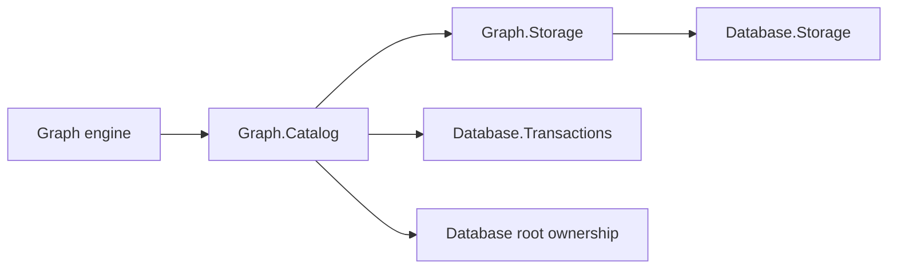

# Assimalign.Cohesion.Database.Graph.Catalog design

This page describes the boundaries and implementation shape of `Assimalign.Cohesion.Database.Graph.Catalog`.

> **Status:** Implemented.

## Intent and dependencies

The catalog gives each logical graph database a durable vocabulary. A label or relationship type has
a stable GUID identity and an ordinal, case-sensitive name. Property and index metadata references
the stable identity, so dropping and recreating the same name does not reuse old child metadata.
Identities cannot be reused across definitions or renamed. Label names and relationship-type names
occupy separate namespaces.

The Graph engine depends on this catalog. The catalog depends on `Graph.Storage`'s raw metadata record
operations and on the shared transaction kernel; it does not reference the engine. `Graph.Storage`
owns physical node-property B+Trees, while catalog index records supply names and object discovery.
The engine coordinates both through the same logical transaction.

The dependency diagram repeats these reference directions.

## Public seam and ownership

`GraphCatalog.Open` returns `IGraphCatalog`; implementation classes and codecs are internal. Every
mutation takes the caller's `ITransactionContext`, and none commits it. The caller holds the
database definition lock to serialize DDL and detect conflicting writes before publication. Reads
use the caller's snapshot.

After acquiring that lock, each catalog mutation compares the snapshot's physical metadata reference
with the latest committed reference. A changed definition, property, or index raises a graph catalog
write conflict; changing a child also checks its parent. Dropping a definition compares its entire
child set, preventing a stale snapshot from leaving newly committed child metadata behind. Schema
ownership is checked against the latest definition, so an older snapshot cannot bypass a newly
applied ownership marker. Concurrent first writes of the same label therefore serialize and the
stale writer must retry its transaction.

An initial label or relationship-type definition may explicitly carry `Schema` ownership and a
nonblank schema name. Once visible, every save or drop of that definition refuses with
`DatabaseObjectLockedException`. Its operation is `ALTER LABEL`, `DROP LABEL`,
`ALTER RELATIONSHIP TYPE`, or `DROP RELATIONSHIP TYPE`. Property and index mutations also consult
the parent and use its ALTER operation. This is an enforcement seam, not compiled schema
provisioning. Data writes that use a label do not alter its definition.

Property metadata supports an optional shared `DatabaseType` and a required flag. The engine uses
these declarations for schema checks; the catalog does not inspect node content. Indexes carry a
name and property key, and are nonunique. The physical tree identity and registration stay entirely
in `Graph.Storage`. A catalog index save cannot silently retarget an existing name to another
property.

## On-disk format

Catalog records occupy `Graph.Storage` owner 0 pages. Graph data, adjacency, and physical index
registrations occupy other owners. Each record begins with the shared 16-byte stamp prefix: an
unsigned 64-bit little-endian creator sequence at offset 0, and an unsigned 64-bit little-endian
deleter sequence at offset 8. Zero means no deleter. The shared record-space adapter scrubs these
records with all graph data during recovery.

The payload begins at byte 16:

| Offset / order | Encoding | Meaning |
| --- | --- | --- |
| 16 | byte | Kind: 1 label, 2 relationship type, 3 property key, 4 named index |
| 17 | byte | Format version, currently 1 |
| 18 | 16 bytes | CLR `Guid.ToByteArray()` representation: definition ID for kinds 1/2, parent ID for kinds 3/4 |
| 34 | string | Definition name, property key, or index name |
| Following name, kinds 1/2 | byte, string | `DatabaseObjectOwner` value and owning schema |
| Following name, kind 3 | byte, byte | Shared `DatabaseType` value (255 means unconstrained), required flag (0 or 1) |
| Following name, kind 4 | string | Indexed scalar property key |

All fixed-width numeric values are little-endian. Strings use a signed 32-bit little-endian UTF-8
byte length followed by exactly that many strict UTF-8 bytes. Length -1 represents null, accepted
only for owning schema. Definition IDs must be nonempty; names and index keys must be nonblank. Only
schema-owned definitions may carry a schema name, and they must carry one. Unknown kinds, versions,
enum values, invalid lengths, malformed UTF-8, and trailing bytes are rejected with
`GraphCatalogException`. Decoding has no reflection or dynamic serialization.

## MVCC, mutation, and recovery

Opening scans only owner 0 and builds an in-memory directory keyed by kind, parent, and name. The
directory holds physical references and creator stamps, not mutable metadata copies. Every read
reloads the record and checks identity, creator, and deleter visibility against the snapshot.
Reclaimed slots and reused identities invalidate cached references; corrupt live records propagate
an error rather than appearing absent.

Saving a version tombstones the old version and inserts the new one inside one shared physical
statement bracket. Both changes register with the coordinator's version store. Deleting a definition
tombstones its property and index records in that same bracket. A failed bracket publishes no
directory references; logical rollback removes created versions and restores deleters. Snapshot
readers continue to see their original definitions until they leave.

Recovery order is storage open, coordinator analyze-and-scrub, catalog open, then coordinator
complete-recovery. The graph store separately scrubs physical index entries before the recovery
checkpoint. Catalog crash tests copy live data and WAL before disposal, proving that committed
definitions survive and partial definition/child changes disappear.

Definition discovery is linear in the number of known names plus visible version checks. This is
deliberately a metadata directory; traversal uses graph adjacency and physical indexes. Catalog
disposal and flushing remain owned by the engine and its shared storage/coordinator.

## Scope

The catalog supplies no server-scope names, security checks, wire client, replication, or compiled
schema provisioning. Graph index create/drop must coordinate catalog metadata with the corresponding
physical store change; publishing only one side is not an engine operation.

## Declared dependencies

| Reference | Kind |
|---|---|
| `Assimalign.Cohesion.Database` | `CohesionProjectReference` |
| `Assimalign.Cohesion.Database.Graph.Storage` | `CohesionProjectReference` |
| `Assimalign.Cohesion.Database.Storage` | `CohesionProjectReference` |
| `Assimalign.Cohesion.Database.Transactions` | `CohesionProjectReference` |
| `Assimalign.Cohesion.Database.Types` | `CohesionProjectReference` |

[Assembly overview](index.md) · [Examples](examples/index.md)

## Sources

- **Primary source** — `cohesion/resources/Database/Assimalign.Cohesion.Database.Graph.Catalog/docs/DESIGN.md`.
- **Source** — `cohesion/resources/Database/Assimalign.Cohesion.Database.Graph.Catalog/src/Assimalign.Cohesion.Database.Graph.Catalog.csproj`.
