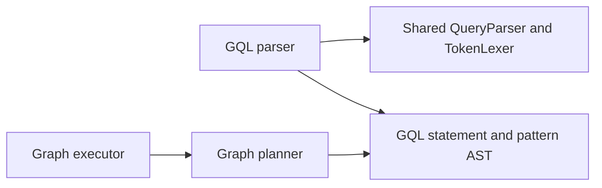

# Assimalign.Cohesion.Database.Graph.Language design

This page describes the boundaries and implementation shape of `Assimalign.Cohesion.Database.Graph.Language`.

> **Status:** Partial.

## Standard decision (#193)

The owner selected **ISO/IEC 39075:2024 GQL** on **2026-09-17**, following
`DATABASE_PROGRAM_PLAN.md`. ISO GQL provides a ratified, independently governed standard and a
portability target for the graph engine; openCypher's vendor-centered governance was the rejected
alternative. This records the owner decision independently of the feature list and chat transcript.
The GitHub issue may still require an administrative close; this implementation does not post to it.

[ISO's publication record](https://www.iso.org/standard/76120.html) identifies the first edition as
published in April 2024 and describes its property-graph data structures and operations. The
[standard editors' status page](https://www.gqlstandards.org/) records publication and the standards
committee process. These are the standard-selection references, not a claim that this MVP implements
every mandatory ISO feature.

The implemented syntax is an explicitly bounded subset. **`INSERT` is the standard graph-insertion
verb. `CREATE (pattern)` is a Cohesion compatibility extension**, retained for the phase-5 examples.
Both compile to the same `Creates` AST. `Database`-scoped catalog `SHOW` statements are another
explicit Cohesion extension. Repeated colon labels and `!=` are accepted conveniences; applications
seeking portable syntax should use one label per pattern and `<>`. `Database`, graph, schema, and
session selection statements are outside the profile: all evaluation stays inside the already-bound
logical database.

## Parser and expression tree

`GqlQueryParser` derives from the shared `QueryParser`, and its `Profile` is
`GqlLanguageProfile.Instance`. The shared `TokenLexer` supplies graph arrows and punctuation. The
parser constructs immutable lists/maps in the AST and returns diagnostics on `GqlQueryStatement`.
Its partial files separate the statement, pattern, and scalar-expression grammars. Instances
serialize concurrent calls and clear their transient state between statements. Shared analyzers run
through the existing base-class pipeline.

The parser depends on shared language contracts; the graph planner depends on the resulting AST, and
the graph executor depends on the planner's plan. This dependency view summarizes that flow.



`GqlQueryExpression` carries match paths, an optional predicate, insertion paths, deletion
variables, a detach flag, projections, and an optional `GqlCatalogSurface` for dedicated metadata
statements. Catalog statements cannot carry graph clauses. Every path holds one more node than
relationship. Anonymous nodes and relationships have a null variable. Relationship directions are
relative to consecutive pattern nodes; incoming arrows reverse that relationship's endpoints. A
scalar property reference always contains a variable and exactly one property key; qualified
database names have no AST representation.

## Supported-clause matrix

Only these clauses occur in `GqlLanguageProfile.Clauses`. The larger reserved keyword table is
retained for tokenization and targeted unsupported diagnostics; it does not advertise capabilities.
The builtin-function table is empty because the executor implements no functions.

| Clause | Accepted subset | Execution |
| --- | --- | --- |
| `MATCH` | Comma-separated finite node/relationship chains; optional labels, type, literal property maps | Planner chooses an indexed anchor when available; executor matches bounded relationship-unique trails |
| `WHERE` | Scalar `=`, `<>`, `!=`, `<`, `<=`, `>`, `>=` comparisons joined by `AND`; predicate parentheses | Filters bound properties against literal or property operands |
| `RETURN` | Bound node/relationship variables or scalar properties, optional `AS` aliases | Projects elements or scalar values in source order |
| `INSERT` | Literal node/path insertion, optionally following a match | Inserts nodes and relationships transactionally |
| `CREATE` | Same insertion grammar as `INSERT`; compatibility extension | Same transactional insertion path |
| `DELETE` | Bound node/relationship variables following a match | Refuses deleting a node that still has incident relationships |
| `DETACH DELETE` | Bound node/relationship variables following a match | Deletes incident relationships with the node in one transaction |
| `SHOW` | `LABELS`, `RELATIONSHIP TYPES`, `PROPERTY KEYS`, `INDEXES`, or `OBJECT OWNERSHIP`; Cohesion extension | Returns typed, read-only metadata from the session database's catalog snapshot |

`Match` patterns accept `(a)`, `(a:Label {key: value})`, `-[r:TYPE]->`, `<-[r:TYPE]-`, and
`-[r:TYPE]-`, including anonymous bracketed relationships. Scalar literals are null, Boolean,
signed 64-bit integer, finite double, and single-quoted string with doubled-quote escaping. Names
are case-sensitive; keywords are case-insensitive. Double-quoted names preserve spaces. A single
optional trailing semicolon is accepted. Multiple statements, bare relationship arrows, nested
property access, and return-after-delete are not accepted.

The grammar is intentionally finite:

```text
query       := [ MATCH paths [ WHERE predicate ] ]
               ( (INSERT | CREATE) paths [ RETURN projections ]
               | [ DETACH ] DELETE variables
               | RETURN projections )
paths       := path (',' path)*
path        := node (relationship node)*
predicate   := comparison ('AND' comparison)*
comparison  := operand comparison-operator operand | '(' predicate ')'
operand     := variable '.' property | scalar-literal
projection  := variable ['.' property] [AS alias]
catalog     := SHOW (LABELS | RELATIONSHIP TYPES | PROPERTY KEYS | INDEXES | OBJECT OWNERSHIP)
```

A mutation can start without `MATCH`; a read or deletion must bind variables through `MATCH`.
`Pattern` chains are limited to 64 relationships. Predicates are limited to 128 nesting levels and 128
scalar comparisons, bounding left-associated conjunction trees as well as parentheses. `Match`
execution also imposes a materialized-binding limit, documented in the Graph engine design.
Quantified paths are unsupported, so cycles cannot cause unbounded repetition of a path pattern. The
executor's trail rule permits repeated nodes but forbids repeated relationship identities within one
path.

### Dedicated catalog statement choice (C2)

The separate `SHOW` grammar exposes metadata through the query language without constructing fake
nodes or relationships for `MATCH`. Catalog definitions have stable catalog identities but are not
graph elements. The extension adds no server scope or database selector and changes no public
interface. Keywords are case-insensitive and comments and one optional trailing semicolon follow the
ordinary lexer rules. A statement cannot combine `SHOW` with graph matching, projection or mutation.
Attempted mutation composition produces `GQL0007`, including verbs such as `SET` and `DROP` that
are otherwise unsupported. The engine validates direct AST requests too.

The
[engine's catalog section](../assimalign-cohesion-database-graph/design.md#catalog-introspection-c2)
defines ordered result columns, SQL-consistent ownership vocabulary and session snapshot behavior.
The parser describes only the metadata subject; it never accesses or caches catalog state.

## Diagnostics and conformance (#194, #195)

| Code | Meaning |
| --- | --- |
| `COHDBL001` | Recognized construct outside the executable profile, including optional matching, procedures, functions, parameters, collection literals, quantifiers, ordering, set operations, and server/session scope |
| `GQL0001` | Empty statement |
| `GQL0002` | Malformed supported syntax or invalid statement composition |
| `GQL0003` | Unterminated string, quoted name, or block comment |
| `GQL0004` | Invalid or out-of-range numeric literal |
| `GQL0005` | `Pattern` length, comparison count, or expression nesting limit exceeded |
| `GQL0006` | Duplicate literal property key |
| `GQL0007` | `Graph catalog introspection is read-only.`: mutation composed with `SHOW` |

Locations use zero-based absolute UTF-16 offsets with exclusive ends and one-based line numbers.
Capability checks run before syntax parsing, so a recognized unsupported clause does not degrade
into a generic error caused by its downstream syntax. Quoted text, comments, label names, and
property keys do not trigger keyword-based capability checks. Binding and catalog diagnostics belong
to the Graph planner, which knows the database schema.

`GqlQueryParserTests` is the executable-subset conformance corpus, with valid and malformed cases
and assertions on the AST, not a full ISO certification suite. Its groups map to ISO GQL graph
pattern matching (4.11 / 16.4 / 16.7), insertion (13.2), deletion (13.5), matching (14.4), return
(14.11), comparisons (19.3), and property references (20.11). The ISO section mapping is
independently cross-checkable in an implementer's
[published GQL feature table](https://neo4j.com/docs/cypher-manual/25/appendix/gql-conformance/supported-mandatory/)
. Compatibility-extension cases are named by their `CREATE` spelling. Separate tests pin the exact
profile, reject unsupported and cross-database constructs, preserve source locations, and bound
adversarial nesting and long patterns.

## AOT posture and extension discipline

The package references only `Database.Language`. It uses ordinary typed AST classes and BCL scalar
values with no reflection, runtime discovery, or `Microsoft.Extensions.*` dependencies. Adding a
clause requires the parser, planner, executor, conformance cases, and this matrix in the same
change; keyword recognition alone never enables it.

## Declared dependencies

| Reference | Kind |
|---|---|
| `Assimalign.Cohesion.Database.Language` | `CohesionProjectReference` |

[Assembly overview](index.md) · [Examples](examples/index.md)

## Sources

- **Primary source** — `cohesion/resources/Database/Assimalign.Cohesion.Database.Graph.Language/docs/DESIGN.md`.
- **Source** — `cohesion/resources/Database/Assimalign.Cohesion.Database.Graph.Language/src/Assimalign.Cohesion.Database.Graph.Language.csproj`.
