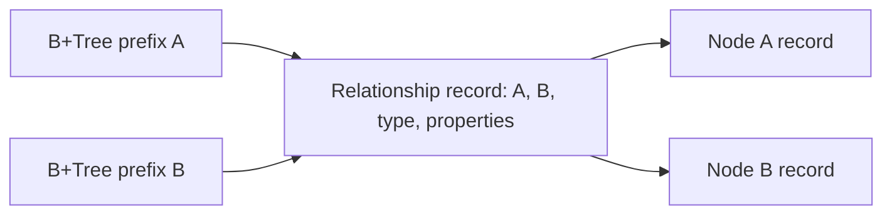

# Assimalign.Cohesion.Database.Graph.Storage design

This page describes the boundaries and implementation shape of `Assimalign.Cohesion.Database.Graph.Storage`.

> **Status:** Partial.

## Ownership and composition

The public `IGraphStore` contract is implemented by internal `DefaultGraphStore` and created by
`GraphStore.Open`. `GraphStorage` is the thin shared-kernel storage subclass. The engine owns its
storage streams and coordinator; the store owns neither and has no independent disposal or
background workers. All identities are reserved from the kernel's durable transaction-sequence
namespace, so rollback and restart do not reuse an identity.

The Graph root owns query planning, label/type validation and session scoping. Graph.Catalog owns
schema metadata. This package owns physical graph records and their indexes. The dependency arrows
point to the shared `Storage`, Transactions and Indexing packages; no model-specific paging, journal,
lock manager or B+Tree is implemented here.

## Physical layout and adjacency

The shared file header persists `StorageModel.Graph`. Slotted data pages carry an owner identifier:
owner 0 is Graph.Catalog metadata, owner 1 is physical B+Tree registrations, and owner 2 contains
nodes, relationships and logical property-index definitions. Shared B+Tree pages use the kernel's
`PageType.Index` format.

One relationship record contains both directed endpoint identities. One shared adjacency B+Tree,
registered under object ID `UInt64.MaxValue` and name `graph`, maps
`(incident node identity, relationship identity)` to the relationship's packed physical location.
Both identities are unsigned 64-bit big-endian components, making each key exactly 16 bytes.
Non-self relationships have two entries, one per endpoint. A self-loop has one entry. Direction and
relationship type are read from the relationship record; direction filtering belongs to traversal
execution.

The diagram shows the same layout: each node's adjacency prefix selects references to relationship
records, and each relationship record contains both endpoints.

An incident lookup seeks from `(node, 0)` through `(node, UInt64.MaxValue)` inclusively. It costs
`O(log E + d)` B+Tree work and at most `d` record reads for a node of degree `d`, where `E`
includes retained relationship versions. Materialization sorts the visible results by relationship
identity, adding `O(d log d)` CPU work in the worst case. Work includes retained MVCC tombstones
until purge; it never includes an unrelated node's adjacency range. Creating or deleting a
relationship maintains both entries in its record's single physical statement bracket.

Compound keys make every current relationship entry distinct. This is also deliberate protection
against a duplicate-key lower-bound seek starting in a later leaf after a shared B+Tree split. A
regression creates 240 incident edges, forces splits, reopens the file set, and checks all edges.
There is no kernel change.

## Version 1 record format

All multibyte fixed-width values below are little-endian unless a key explicitly says otherwise.
Every slotted record starts with the shared 16-byte stamp prefix: writer sequence at offsets 0-7,
deleter sequence at offsets 8-15. Zero deleter means live. Graph records have kind at offset 16,
format version `1` at offset 17 and a nonzero 64-bit logical identity at offsets 18-25. The
remaining payload is:

| Kind | Meaning | Payload after identity |
| --- | --- | --- |
| 1 | Node | Int32 label count, label strings, property map |
| 2 | Relationship | UInt64 source, UInt64 target, type string, property map |
| 3 | Property index definition | Label string, property-key string |

A property map is an Int32 count followed by ordinally sorted `(key string, scalar)` pairs. Counts
must be nonnegative and bounded by the maximum record size. Strings use the .NET BinaryWriter length
format: a 7-bit encoded nonnegative UTF-8 byte length and those bytes, with strict UTF-8 validation.
Labels are ordinally deduplicated and sorted. The explicit scalar encoding is:

| `Tag` | Payload |
| --- | --- |
| 0 | Null, no payload |
| 1 | Boolean byte |
| 2 | String |
| 3, 4 | SByte, Byte |
| 5, 6 | Int16, UInt16 |
| 7, 8 | Int32, UInt32 |
| 9, 10 | Int64, UInt64 |
| 11 | `Decimal`, BinaryWriter's four Int32 words |
| 12, 13 | Finite IEEE-754 Float64, Float32 |

Record length is limited to the shared `SlottedPage.MaxRecordSize`. Unsupported CLR objects,
non-finite floating values and oversized records fail before insertion. This version does not define
arrays, nested objects or overflow chains. Nodes and relationships are immutable versions; the
frozen engine surface has create/delete operations and no property-update member.

Owner-one physical registration records are exactly 34 bytes: a zero stamp prefix, kind `4`,
version `1`, UInt64 object ID, and Int64 root page ID. Every tree is named `graph`; its object ID
distinguishes it. `Root` registrations change in the same bracket as a split and are reloaded after
physical statement rollback. They are physical infrastructure, so logical rollback leaves an unused
tree available for recovery; logical property-index definitions remain stamped and determine
visibility.

Physical references use the high 48 bits for the page ID and low 16 bits for the slot. Readers check
page allocation, data-page owner, record identity and writer stamp before trusting cached
references. Checksum errors and real I/O failures propagate; reclaimed pages/slots and reused
locations are treated as stale directory entries.

## Secondary indexes

Each label/property definition owns a B+Tree whose object ID is its durable definition identity.
Keys consist of the shared `DatabaseKeyWriter` scalar encoding followed by the node identity as
eight unsigned big-endian bytes. The scalar encoding is null, Boolean, ordinal UTF-16 big-endian
string bytes, or Float64 for every numeric CLR type. The scalar prefix may occupy at most 1016
bytes, leaving eight bytes within the shared 1024-byte key limit. Missing properties have no entry;
a present null has a null key.

Numeric keys are a candidate projection. Nearby Int64 or `Decimal` values can map to the same Float64
value. Every result is compared to its original scalar: integral/`Decimal` pairs compare exactly as
`Decimal`, and a pair involving Float32 or Float64 compares as Double. This matches the root evaluator
and supports very large and very small finite floating values. Positive and negative zero share one
key. Prefix seeks bound the candidate range by node identities zero and `UInt64.MaxValue`; the
identity suffix also makes a heavily repeated property value safe across B+Tree leaf splits.

`Index` creation backfills visible nodes under the database writer lock and preserves source record
stamps. Every subsequent node create/delete maintains all current definitions in its transaction.
Dropping an index tombstones its logical definition; older snapshots retain the tree and their view.
This MVP retains dropped physical trees for later reclamation rather than recycling them while
snapshots may still reference them. An exact seek costs `O(log N + k)` index work for `k`
candidates, including numeric projection collisions and retained versions; ordering its `m` visible
matches adds `O(m log m)` CPU work.

## Atomicity, conflicts and recovery

All graph writers acquire the shared database-level exclusive lock and retain it until logical
commit/rollback; readers use MVCC snapshots. The lock is deliberately coarse for the MVP. After a
wait, the store checks cancellation and active transaction state and releases a grant received after
rollback. Endpoint and deletion checks compare the caller's snapshot with the latest committed view
while holding the lock; a changed record produces `TransactionAbortedException`. A stale detach
cannot silently cascade a relationship that appeared after its snapshot.

Creating a relationship applies the record and endpoint indexes in one coordinator statement.
Deleting a connected node without detach is refused before mutation. Detach tombstones the node,
every incident relationship, both adjacency entries and all node-property entries in one physical
bracket. Version-ledger entries allow logical rollback to restore those records and index stamps
together. Committed tombstones remain available to older snapshots until the shared version-purge
worker's safe bound passes.

Opening follows this order:

1. `GraphStorage.Open(..., checkpointOnOpen: false)` runs shared physical recovery.
2. Construct the coordinator and call `AnalyzeAndScrub()` to undo unproven record writers.
3. `GraphStore.Open` loads owner-two record directories and owner-one registrations.
4. `RecoverIndexesAsync(plan.Aborted)` scrubs aborted index writers and deleters.
5. `CompleteRecovery()` checkpoints after lifecycle classification has been consumed.

Crash tests ordinarily flush the journal and clone data and journal memory streams without disposing
the live database. MemoryStream has no durable-flush contract; these serialized images test recovery
replay and scrub, not physical persistence. They prove committed nodes, relationships and property
indexes survive while a partially applied logical transaction disappears. The graph store keeps an
in-memory identity directory rebuilt in `O(V + E + I)` at open; label scans examine `O(V)` records
and sort their `m` visible matches in `O(m log m)`. Traversal path enumeration and cycle limits are
owned and documented by the Graph root.

## Declared dependencies

| Reference | Kind |
|---|---|
| `Assimalign.Cohesion.Database.Storage` | `CohesionProjectReference` |
| `Assimalign.Cohesion.Database.Transactions` | `CohesionProjectReference` |
| `Assimalign.Cohesion.Database.Indexing` | `CohesionProjectReference` |

[Assembly overview](index.md) · [Examples](examples/index.md)

## Sources

- **Primary source** — `cohesion/resources/Database/Assimalign.Cohesion.Database.Graph.Storage/docs/DESIGN.md`.
- **Source** — `cohesion/resources/Database/Assimalign.Cohesion.Database.Graph.Storage/src/Assimalign.Cohesion.Database.Graph.Storage.csproj`.
