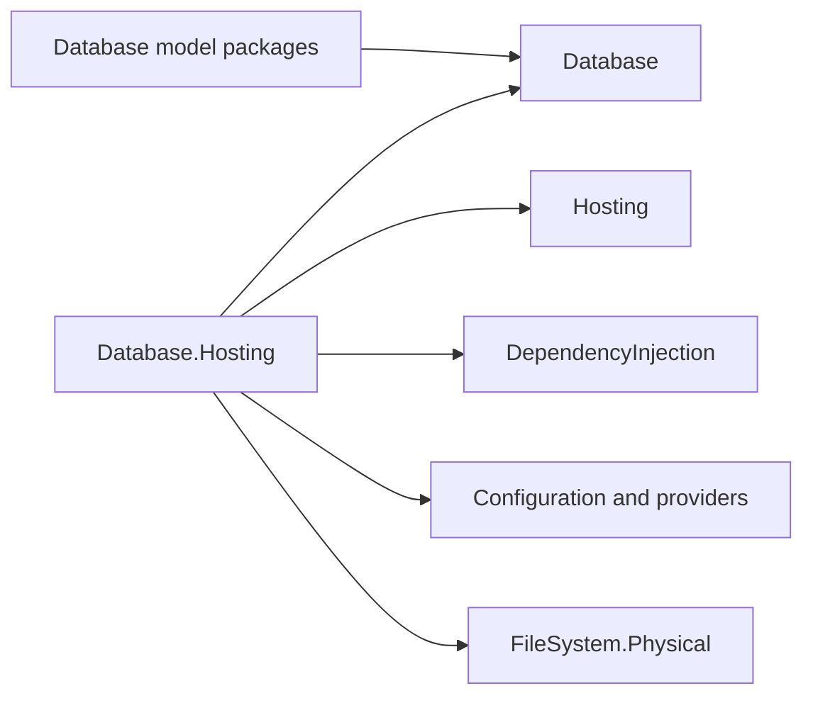

# Assimalign.Cohesion.Database.Hosting design

This page describes the boundaries and implementation shape of `Assimalign.Cohesion.Database.Hosting`.

> **Status:** Partial.

## Composition

Phase 29 implements the owner-approved `Database` hosting design
(`cohesion/docs/programs/DATABASE_HOSTING_DESIGN.md`), including its nested-engine corrections. The
public path is `DatabaseApplication.CreateBuilder(args)` → `Add` intent → one-shot `Build()` → engine
access / `RunAsync()`. There is no composition `Use` method or application-builder `AddServer`.

The root builder accepts borrowed engines and dependency-free engine factories receiving the
application context. Model packages supply `AddSql`, `AddDocuments`, `AddGraph`, `AddKeyValue`,
and `AddBlob` using `extension(IDatabaseApplicationBuilder)`. Their callbacks run at `Build` against
a model engine builder; worker and server factories run after that engine exists. Hosting never
references a model package, resolves model services, or binds model configuration. A concrete
hosting overload, `AddEngine(name, factory)`, receives built `Configuration` and `Services`
explicitly.

`COHRES001`–004 remain enforced. Existing private Web hosting/health references serve the pre-existing
enabled-resource admin integration. Phase 29 adds no ApplicationModel surface, manifest, resource
command, resource control plane, or orchestration behavior. The existing `ResourceRuntime.HostBuilt`
hook remains in place so an installed `HostContext.Runner` still controls complete runs through
`IHostRunner` / `IHostRun`.

## `Build` and configuration

`Build` consumes the builder before user code runs, even if construction fails. Registration methods
and retained configuration/service facades reject late mutation. The facades reject independent
`Build`/`BuildAsync`; the application is the sole owner of materialization. Legacy `Options` scalar
settings and borrowed instance lists are copied at `Build` and cannot alter runtime registries later.
The root builder has no live `Engines` property.

Construction order is optional `appsettings.json`, optional `appsettings.{Environment}.json`,
environment variables prefixed `COHESION_CONFIG__`, copied command-line arguments, then explicitly
registered configuration providers; later values win. Paths resolve against
`Options.ContentRootPath`, defaulting to `AppContext.BaseDirectory`. Environment uses the existing
Hosting default; `Local` remains `Local`. JSON reload is disabled. The default physical file system
is allocated only at `Build` and disposed after configuration.

One Cohesion service provider is built with `EnableDynamicCode = false`, `ValidateScopes = true`,
and `ValidateOnBuild = true`. This selects the interpreted resolver on JIT and NativeAOT. Hosting
permits closed factories and instances only, rejects implementation-type/open-generic activation,
and reserves `IConfiguration` as a borrowed registration for the application's configuration. Model
construction uses explicit assignments rather than reflection-based binding. Provider-owned services
must not be returned from application factories; doing so would create two owners.

`Root` engine factories observe preceding engine registrations. They cannot depend on later
registrations. This follows the approved context-taking factory correction; names from arbitrary
factories can only be validated when the factory returns. Concrete named factories reserve names at
`Add` and must return an exact ordinal name match. Names are nonempty, case-sensitive, and unique
across models. `Context.GetEngine(name)` returns a borrowed reference.

## Nested servers and ownership

`Application` `Build` flattens each engine's `Servers` snapshot in engine/attachment order. Engines own
these servers and dispose them before workers and databases. The application drives their Start/Stop
through `DatabaseServerHostService` but never enrolls them for a second disposal. A server must
front its owning engine. Legacy `Options.Servers` remains a borrowed input path; its referenced
engines are implicitly borrowed and included in the runtime registry. Duplicate lifecycle references
and conflicting engine names fail `Build`.

| Input | Disposal owner |
| --- | --- |
| `AddEngine(instance)` / `Options.Engines` | Caller |
| `Root` or hosting `AddEngine(factory)` / model `Add` verb | `Application` after `Build`; builder on failed `Build` |
| Model builder worker/server factory | Engine |
| `Options.Servers` | Caller; application drives start/stop only |
| `AddService(instance)` / `Options.Services` | Caller |
| `AddService(factory)` | `Application` if disposable |
| Provider-created service | Provider |
| Provider instance registration | Caller |
| Configuration and default configuration file system | `Application` |

A factory transfers a fresh product, and cleans up partial allocations if it throws before
returning. Detectable borrowed/owned aliases are rejected before re-enrollment. Fresh invalid
products are enrolled before validation so rollback disposes them. `Build` compensation attempts owned
services, engines (including their servers), provider, configuration, and file system in reverse
dependency order. Synchronous `Build` bridges asynchronous cleanup on a worker without capturing the
caller's synchronization context. Original construction exceptions are preserved; cleanup failures
produce an aggregate with the original first. Files created by a factory are never silently deleted.

## Runtime lifetime

Additional services start in registration order, then servers; shutdown drains servers first and
stops services in reverse. Compiled-schema `Provision` / `AddDatabase` uses the existing provisioner
and runs before listener accept. Named overloads resolve deferred engines at `Build`. Instance
overloads require the engine to belong to the composition.

`DatabaseApplication` remains `Host<DatabaseApplicationContext>` and its context remains
`HostContext` / `IHealthContributor`. `Run`, `RunAsync`, and `AsService` use the Hosting
extensions. Embedded applications can use engines immediately after `Build`, or `Run` to wait for host
shutdown without a listener.

The application permits one start lifecycle. Repeated Start while started is a host no-op; restart
after Stop or a failed start is rejected through the protected start hook, including interface/`Run`
paths. Stop before first Start does not consume the attempt. Concurrent Start/Stop/`Dispose` is
unsupported; concurrent `Dispose` calls alone share one cleanup task. `Dispose` is idempotent, stops if
needed, and attempts all application-owned roots after failures. Provider/configuration outlive
products that depend on them. Sessions remain caller-owned and must finish before application
disposal. Borrowed SQL/KeyValue servers may terminally close their listeners during Stop despite
remaining caller-owned for disposal.

Health observes distinct engines, states and workers from the frozen runtime registry. Existing
enabled-resource admin endpoints, telemetry order and health aggregation remain compatible; this
phase does not extend those systems.

The public static `CreateBuilder()` on each model engine provides deferred standalone composition
and the bridge for hosting-aware engine factories that also need nested servers. It returns the
model interface; its implementation remains internal. Configuration and service reads still occur in
the hosting callback, outside the model package.

## Declared dependencies

| Reference | Kind |
|---|---|
| `Assimalign.Cohesion.Database` | `CohesionProjectReference` |
| `Assimalign.Cohesion.DependencyInjection` | `CohesionProjectReference` |
| `Assimalign.Cohesion.Configuration` | `CohesionProjectReference` |
| `Assimalign.Cohesion.Configuration.Json` | `CohesionProjectReference` |
| `Assimalign.Cohesion.Configuration.EnvironmentVariables` | `CohesionProjectReference` |
| `Assimalign.Cohesion.Configuration.CommandLine` | `CohesionProjectReference` |
| `Assimalign.Cohesion.FileSystem.Physical` | `CohesionProjectReference` |
| `Assimalign.Cohesion.Hosting` | `CohesionProjectReference` |
| `Assimalign.Cohesion.Hosting.Health` | `CohesionProjectReference` |
| `Assimalign.Cohesion.Hosting.Resources` | `CohesionProjectReference` |
| `Assimalign.Cohesion.Hosting.Telemetry` | `CohesionProjectReference` |
| `Assimalign.Cohesion.Web.Hosting` | `CohesionPrivateProjectReference` |
| `Assimalign.Cohesion.Web.Hosting.Resources` | `CohesionPrivateProjectReference` |
| `Assimalign.Cohesion.Web.Hosting.Health` | `CohesionPrivateProjectReference` |
| `Assimalign.Cohesion.Web.Health` | `CohesionPrivateProjectReference` |

[Assembly overview](index.md) · [Examples](examples/index.md)

## Sources

- **Primary source** — `cohesion/resources/Database/Assimalign.Cohesion.Database.Hosting/docs/DESIGN.md`.
- **Source** — `cohesion/resources/Database/Assimalign.Cohesion.Database.Hosting/src/Assimalign.Cohesion.Database.Hosting.csproj`.
