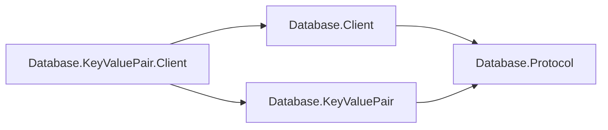

# Assimalign.Cohesion.Database.KeyValuePair.Client design

This page describes the boundaries and implementation shape of `Assimalign.Cohesion.Database.KeyValuePair.Client`.

> **Status:** Partial.

The key-value client owns command construction, parameter encoding, result materialization, typed
outcomes, error mapping, and telemetry. The shared client owns pooling, handshake, framing, and
exchange lifetime.

## Family position

The client references shared mechanism and the key-value wire family:

| Package | Role |
| --- | --- |
| `Database.KeyValuePair.Client` | Command/result policy and materialization |
| `Database.Client` | Pooling, handshake, framed exchange lifetime |
| `Database.KeyValuePair` | Family identifiers and payload codecs |
| `Database.Protocol` | Shared framing and immutable family binding |

## Wire ownership

`KeyValueClient.Create` binds its pool to `KeyValueProtocol.Family`. `KeyValueExecuteExchange`
encodes parameters, writes the command, and materializes the complete response before returning its
private result to the typed connection. The model's command specification
(`cohesion/resources/Database/Assimalign.Cohesion.Database.KeyValuePair/docs/COMMANDS.md`) defines
command grammar and operation result shapes. Protocol 1.0 bytes are unchanged.

The model assembly reference supplies codecs; this client does not construct an engine or parse
commands. The transitive closure is an accepted packaging consequence. A separate model protocol
assembly can be considered later.

Keys and values remain byte-oriented and use `DatabaseValueCodec` binary components. Typed
serialization belongs to consumers; public client entry/range types remain independent from engine
request types.

## Conditional outcomes

An etag mismatch is a first-class outcome: conditional put returns `KeyValueWriteResult` with
`Applied` and the new-or-current etag; conditional delete returns a boolean. Staleness calls for
rereading, while a concurrently committed write conflict reports `ExecutionFailure` for contention
retry. Unconditional put returns its new etag directly.

## Errors, lifecycle, and telemetry

`KeyValueClientException : DatabaseException` maps wire codes to model error kinds and preserves the
code. `MalformedResult` identifies a completed response that does not match the typed operation's
values; no unread frames remain. Framing/decoder failure or cancellation during an exchange
invalidates the shared connection. Disposing a healthy typed connection returns its session to the
pool; disposing the client disposes that pool.

Observers report grammar text, counts, and elapsed time. `Key`/value bytes are never included.
Observer exceptions cannot fault an operation or mask its exception.

## Materialized scans, AOT, and non-goals

Materialized scans are this package's policy. `Use` a range limit to bound results; cursor composition
can resume after the last key. An incremental API can be added here without changing shared result
policy.

Encoding and materialization use no reflection or runtime code generation. Wire transactions, typed
serialization, caching, retry policy, and rent-time liveness pings remain outside this surface.

## Phase 29 composition migration

The TCP end-to-end fixture now registers `AddKeyValue` with a nested deferred `AddServer` factory.
`Build` constructs the engine and listener/server, then the fixture retrieves the engine from the
built context for provisioning. The application owns the engine and the engine owns its
server/listener; disposing the application closes this whole graph before the restart-recovery
composition. Wire/client behavior and protocol remain unchanged.

## Declared dependencies

| Reference | Kind |
|---|---|
| `Assimalign.Cohesion.Database` | `CohesionProjectReference` |
| `Assimalign.Cohesion.Database.Client` | `CohesionProjectReference` |
| `Assimalign.Cohesion.Database.KeyValuePair` | `CohesionProjectReference` |
| `Assimalign.Cohesion.Database.Types` | `CohesionProjectReference` |
| `Assimalign.Cohesion.Connections` | `CohesionProjectReference` |

[Assembly overview](index.md) · [Examples](examples/index.md)

## Sources

- **Primary source** — `cohesion/resources/Database/Assimalign.Cohesion.Database.KeyValuePair.Client/docs/DESIGN.md`.
- **Source** — `cohesion/resources/Database/Assimalign.Cohesion.Database.KeyValuePair.Client/src/Assimalign.Cohesion.Database.KeyValuePair.Client.csproj`.
