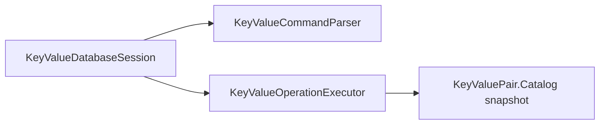
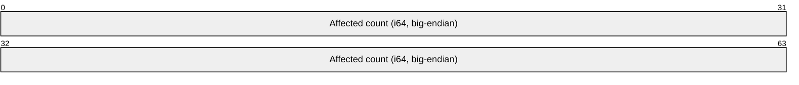

# Assimalign.Cohesion.Database.KeyValuePair design

This page describes the boundaries and implementation shape of `Assimalign.Cohesion.Database.KeyValuePair`.

> **Status:** Partial.

The key-value engine (area architecture: resources/`Database`/DESIGN.md
(`cohesion/docs/resources/Database/DESIGN.md`) §3.3, generality report §3.10): an ordered key space
over the shared kernel, and the **second model engine** — built deliberately as the proof that the
kernel is model-general, not SQL-shaped.

## String comparison and collation (#1025)

`Key`-Value remains binary-only for user data: keys and values are opaque bytes, and key equality,
ordering, uniqueness, and prefix ranges use unsigned lexicographic byte comparison. Text supplied as
a key is compared in its encoded form without case or accent folding. Command keywords and
administrative database lookup remain ordinal-ignore-case; those identifier rules do not transform
user keys. SQL database defaults and column/expression `COLLATE` have no effect on this model.
Configurable text collation is deferred.

## Design intent

Compose kernel pieces, never re-implement them — and compose them in a *different shape* than the
SQL engine, because the difference is the point:

| | SQL engine | `Key`-value engine |
|---|---|---|
| Primary structure | the record space (scan-primary; indexes are secondary accelerators) | **the B+Tree primary key index** (index-primary; every read is a seek) |
| Record payload | object-id-prefixed typed tuple, schema from the catalog | key + value as two binary tuple components, self-describing |
| Conflict grain | table intent locks + per-row location locks + unique-key locks | **key locks only** (one per command) |
| Statement surface | the SQL dialect | data commands plus `KEYSPACES` discovery (docs/COMMANDS.md) |
| Catalog | schemas/tables/columns/indexes | registrations + format marker only |

Both engines share, unchanged: the storage substrate (slotted pages, per-owner chains, WAL v2,
recovery), the MVCC discipline (16-byte writer/deleter stamp prefix, snapshot visibility,
first-updater-wins latest-state checks, logical rollback via the version-store ledger, open-time
recovery scrub), the B+Tree (MVCC-stamped entries, latest-state uniqueness under hashed-key locks),
the one-sequence-namespace pairing, and the per-statement bracket/apply-gate model.

## Execution model

- **`Index`-primary reads.** `GET`/`EXISTS` seek the unique primary index
  (`key` → packed record location) through the command's snapshot; `SCAN` drives
  a snapshot cursor over an `IndexKeyRange`. Keys go into `IndexKey` **raw** —
  the key-value ordering contract (unsigned lexicographic byte comparison) *is*
  `IndexKey`'s comparison, so no codec transformation applies to keys. Every
  fetched record's stamps are re-checked against the same snapshot (the SQL seek
  executor's defense-in-depth discipline: entries mirror record stamps by
  construction, so a divergence is a bug this filter contains). Prefix scans map
  to `[prefix, successor(prefix))` by byte-successor arithmetic; an all-0xFF
  prefix is unbounded above.
- **`Entry` records.** `[writer u64][deleter u64]` — the fixed 16-byte stamp
  header, the same layout the SQL record space and the B+Tree leaves carry —
  followed by the shared tuple codec payload (`key` binary component, `value`
  binary component). Entries live in the key space's per-object page chain
  (owner id 1), so a full scan of the database touches only entry pages. The
  key is stored in the record (not only in the index) so recovery scrubs and
  integrity checks are self-describing; format version 1, catalog-persisted,
  rejected-if-newer at open (no upgrade machinery — the model was born stamped).
- **Writes are two-phase, key-grain.** Phase one: acquire the key's Exclusive
  lock (`LockResource.Entry(keySpace, IndexKey.Hash())` — the same identity the
  B+Tree's unique enforcement locks internally, so its in-gate re-acquisition is
  a same-owner re-grant), resolve the visible version by index seek, re-validate
  its **current** stamps under the lock (a foreign committed deleter =
  first-updater-wins conflict, retryable), and decide conditional writes. Phase
  two: the coordinator's gated apply bracket — tombstone the old version in
  place (same-length stamp write), insert the new version into the chain, mirror
  both in the primary index, ledger every effect. A unique violation on the
  insert is a concurrently committed invisible writer → translated to the same
  retryable conflict.
  - **Why no row/location locks (a deliberate divergence from SQL):** every
    key-value mutation is keyed by exactly one key, and every version of a key
    is only ever mutated by that key's writer — so the key lock subsumes
    per-location locks entirely. `Key`-grain locks are the model's whole
    user-visible conflict surface; deadlocks (multi-key transactions) surface
    through the shared lock manager's requester-closes-cycle detection.
- **Etags = writer sequences.** An entry's etag is the `TransactionSequence`
  that wrote its visible version — R1's "key/etag uniqueness" for free: the
  sequence namespace is unique per database, every applied write produces a new
  etag, and the stamp is already in the record. Surfaced as `long` (the wire's
  `Int64` component).
  - **`Compare`-and-swap is a conditional decision, not a conflict** (the
    recorded outcome-shape decision): `IF @etag` / `IF ABSENT` misses return
    first-class not-applied outcomes (`applied=false` + current etag, affected
    count 0) with **no mutation and no exception** — an etag mismatch means the
    caller's *own* view is stale, which is application flow, not contention.
    Contention (a concurrently *committed* change racing the command) instead
    aborts with the root's retryable `DatabaseTransactionAbortedException` —
    same taxonomy as SQL. Rejected alternative: throwing on CAS misses (an
    exception storm on a hot upsert path) or folding conflicts into
    `applied=false` (hides real contention and breaks retry semantics).
- **Transactions.** Identical binding to the SQL engine's (§3.8): per-database
  `Database.Transactions.TransactionCoordinator` (manager + lock manager + record-space
  version store + gated journal-bound log, one sequence namespace with storage),
  explicit transactions and auto-commit both ride manager contexts, `Snapshot`
  default / `ReadCommitted` per-command refresh / `Serializable` rejected,
  rollback is logical through the ledger, recovery classifies + scrubs record
  space and primary index at open. Kernel aborts are wrapped in the root's
  exceptions at the session boundary (the area error policy).
- **Result shapes.** `GET`/`SCAN` return result sets (`key`, `value`, `etag`);
  `PUT` a one-row outcome set (`applied`, `etag`); `EXISTS` a one-row boolean
  set; `DELETE` a plain result with its affected count. These shapes ride the
  wire's generic ResultHeader/Row/Complete framing untouched — a deliberate
  constraint so the model needs no protocol surface of its own.

## The text seam (docs/COMMANDS.md — the grammar contract)

The session's text-execute seam parses the command grammar into the same typed requests the typed
seam executes. **Decision (2026-07-14): the recommended minimal-grammar shape was taken** — it makes
the model wire-compatible with the existing `Execute` message (statement text + named tuple-codec
parameters) and the generic server session pump with **zero protocol changes**, which is also what
made the server-core extraction evidence conclusive (area DESIGN §3.10). The rejected alternative —
model-specific binary command frames ("KV wants binary command paths", the extraction trigger's
prediction) — would have forked the protocol message family and the server pump for no
expressiveness gain over named binary parameters; it remains open as a measured-need optimization,
not a default. The grammar is a contract: parser, COMMANDS.md, and the corpus tests change together
(the DIALECT.md precedent).

## `Key`-space catalog introspection (C2)

The survey found one implicit key space and no named key-space registry. The catalog holds its
primary index registration and entry-space format version; `GetAsync`, `ExistsAsync`, and
`ScanAsync` already expose entry access, but none describes that key space. `KEYSPACES` extends the
existing command vocabulary with discovery through the session and wire protocol. Its typed
counterpart is `KeyValueKeySpacesRequest`; no existing public interface changes.

The command returns one row describing the catalog-registered implicit space: database name,
key-space object id, entry format version, primary-index name, index kind, and uniqueness. The exact
column order and types are specified in COMMANDS.md
(`cohesion/resources/Database/Assimalign.Cohesion.Database.KeyValuePair/docs/COMMANDS.md`, section
`key-space-discovery-c2`). The key-space id is local to the database and does not imply named-space
support. Physical index pages remain internal. This model has no compiled-schema ownership or
ownership enforcement, so there is no `OWNER` or `OWNING_SCHEMA` field to report. A smaller surface
faithfully describes its catalog without inventing relational or schema concepts.

The executor captures format and index registrations together under the catalog's metadata lock when
each command runs. Rows are computed in memory from that capture and never persisted into entry
storage or a second metadata cache. The next command sees newly published catalog state, even inside
a snapshot transaction: catalog publications are self-committing, separate from entry MVCC. An
already returned result retains its capture. The executor receives only its session's database
catalog and name; no selector can address another database.

The catalog snapshot belongs to the catalog package. The executor obtains its public
`IKeyValueCatalogSnapshot` contract through the `public static`
`KeyValueCatalog.CaptureSnapshot(IKeyValueCatalog)` bridge - not through `IKeyValueCatalog`, which
the capture is deliberately not a member of - with the capture implementation kept internal. It owns
no storage handle and requires no disposal. The command executor returns the ordinary wire result
shape:

`KEYSPACES` is read-only. Both supported mutation verbs reject the reserved target (`PUT KEYSPACES
...`, `DELETE KEYSPACES ...`) before execution with ``DatabaseParseException``, mapped to
`ParseFailure` on the wire, and the stable diagnostic `The KEYSPACES catalog surface is read-only.`
Keys passed as byte parameters remain data, including the bytes `KEYSPACES`. Scope, fresh captures,
unchanged user storage, and client discovery/refusal are covered by `KeyValueIntrospectionTests`
without replacing existing entry-access tests.

## The key-value server runtime (`KeyValueDatabaseServer`)

The model ships its own wire-protocol server — the **second model server**, the one whose
construction fired the area's recorded server-core extraction trigger (2026-07-14) and thereby
produced the evidence behind the settled placement. `KeyValueDatabaseServer` is a sealed
implementation of the area root's `IDatabaseServer` contract fronting exactly one
`KeyValueDatabaseEngine` (`Create(engine, options)`, options in `KeyValueDatabaseServerOptions`),
and this package carries its **own full copy of the server machinery** — accept loop, session state
machine and frame pump (`Internal/`), auth/idle/session guardrails, two-phase drain. **Per-model
duplication is the owner's decision (2026-07-14), made with this model's extraction evidence in
hand:** the extraction into a shared `Database.Server` was executed and then reversed on review —
model independence outweighs the duplication/drift cost, and wire-behavior parity is held by the
protocol contract plus each model's E2E suite, not by shared code (the preserved
prediction-vs-evidence table and the full placement history live in the area `DESIGN.md` §3.10 and
decision log). The copy is textually near-identical to `Database.Sql` 's today; divergence over time
is sanctioned — that is the point. The pump adds no model-specific behavior yet: the command grammar
travels the protocol's existing Execute message into the root's text-execute seam, and the model's
result sets ride the generic result framing (`ResultComplete` carries the set's real `AffectedCount`
, so the model's one-row outcome sets report 1/0 on the wire). Model-specific wire surface (binary
command frames, if measurement ever demands them) grows here, in this copy, without touching any
other model. The machinery design record (composition seam, state machine, error taxonomy, two-phase
stop) is documented in `Database.Sql` 's DESIGN.md server section, whose decisions this copy
currently mirrors. In particular, `StartAsync` awaits the configured listener's `BindAsync` before
starting the accept loop or returning; bind failure terminally disposes the listener. `StopAsync`
cancels accept, drains sessions, then terminally disposes the listener. Stop is terminal, so restart
symmetry composes a fresh server and listener rather than reusing the disposed pair. When this copy
diverges, this section records the divergence.

## Engine-owned background workers

The same five-worker inventory as the SQL engine, spawned at creation on engine-owned threads,
quiesced on dispose (engines are data machines; R10): group-commit WAL flusher (signal-driven),
paced page write-back, checkpointer (both file sets; data set through the coordinator so truncating
checkpoint records carry in-flight sequences; re-exports index registrations when drifted),
**version purge — live** (the KV MVCC binding is real from the first cut, so the purge duty is real:
aborted-undo retries + reclamation below the minimum snapshot floor), and the index-maintenance
**stub** (the index layer has no compaction yet — the stub matters more here than in SQL, since
every delete accrues a tombstone in the primary structure; the seam is kept stable for the
compaction feature). Cadence knobs live on `KeyValueDatabaseEngineOptions`.

## Two file sets per database

`<name>` (entries + primary index pages — index pages ride the data storage's transactional page
surface, no separate index file) and `<name>.catalog` (registrations + format marker), both via
`IKeyValueStorageStrategy` — file-backed under `RootPath`, in-memory otherwise, the SQL strategy
pattern. The primary index bootstraps at database creation inside a durably-committed bracket (the
self-committing DDL posture), then persists its registration and the format marker as catalog
self-commits; a crash between tree build and registration leaves only an orphaned root page (safe
leak), repaired by re-bootstrapping on the next open.

## Error model

`DatabaseException` (area root) for misuse and model errors; `DatabaseNotFoundException` for an open
request whose storage does not exist; `DatabaseParseException` for grammar violations (→
`ParseFailure` on the wire); `DatabaseTransactionAbortedException`
/`DatabaseTransactionDeadlockException` (retryable) for MVCC conflicts — kernel exceptions are
translated at the model boundary, never leaked raw.

## Shared MVCC composition (#918 — area DESIGN §3.10)

`TransactionCoordinator` and `RecordSpaceVersionStore` now live in the existing
`Database.Transactions` child root. `KeyValueTransactionRecordSpace` supplies entry reads,
transactional updates/deletes, and the existing packed location codec. `KeyValueRecordCodec` retains
key/value payload encoding and delegates stamp operations to `RecordVersionStamp`; the shared
[16-byte layout](../assimalign-cohesion-database-transactions/design.md#record-stamp-prefix-the-16-byte-contract)
is the contract for subsequent models. The instance's thin `IStorageTransactionSource` adapter
retains the engine's `DatabaseException` for a missing statement bracket; Indexing's
`RecordVersionIndex` binds the primary index to the shared undo ledger without a reverse dependency.

Recovery ordering is unchanged: re-attach the primary index, analyze and scrub records, scrub the
index with the same classification, then complete the deferred checkpoint before ensuring the
primary index exists. The coordinator retains the same journal append/checkpoint gate, statement
apply gate, and snapshot-based safe prune bound as the extracted copies.

## Non-goals (current cut)

- **TTL/expiration** — the area model table lists TTL for this model; it is
  deferred (#919), and the surface was deliberately shipped without
  `ExpiresAt` so etag semantics landed clean first.
- **Named key spaces (multiple ordered key spaces per database)** — the catalog
  reserves the concept; the engine currently owns one implicit key space.
- **Multi-key atomic batches, `Serializable`** — isolation, secondary value indexes,
  index compaction (the stub worker's future body).

## `Database` scope conformance (A5)

Each session captures one database instance and its operation executor. `IKeyValueDatabase`
validates that instance identity before all five typed operations, including deferred scan
enumeration. Typed requests carry no database selector; key bytes are data even when they resemble
qualified names. The text grammar has no database selector or server administration verb. `Database`
lifecycle operations belong to the host-owned engine.

`KeyValueDatabaseScopeTests` mirrors the SQL/Blob guard: two databases contain the same key with
different values, attempts to pass a foreign session fail, commands cannot select another database,
and attempted server/database commands leave the binding and engine inventory unchanged. The tests
use public execution behavior without reflection.

## AOT posture

No reflection, no runtime codegen: byte spans, the shared tuple codec, and boxed scalars only at the
result-row boundary (the Execution family's shape).

## Model-owned wire family (#1015)

This package owns the KeyValuePair request and tabular result codecs; the shared protocol contains
only mechanism. Wire format
(`cohesion/resources/Database/Assimalign.Cohesion.Database.KeyValuePair/docs/WIRE-PROTOCOL.md`)
specifies every message and scalar component for independent clients. The server binds
`KeyValueProtocol.Family` once on accept, retains wire version 1.0 and the existing bytes, and
negotiates incompatible majors before authentication. Result materialization belongs to
`Database.KeyValuePair.Client`. Transport listeners remain supplied through generic
IConnectionListener.

Payload offsets are zero-based and exclude the shared five-byte frame header. `Execute` (5) starts
with a signed 32-bit big-endian statement byte length `S` at bytes 0–3, followed by `S` UTF-8
statement bytes at byte 4 and a nonnegative signed 32-bit big-endian parameter count at bytes
`4 + S` –`7 + S`. Each parameter beginning at byte `Q` has a nonnegative signed 32-bit big-endian
name length `N` at bytes `Q` –`Q + 3`, `N` UTF-8 name bytes at byte `Q + 4`, a nonnegative signed
32-bit big-endian encoded-value length `V` at bytes `Q + 4 + N` –`Q + 7 + N`, and `V`
self-describing scalar-component bytes at byte `Q + 8 + N`. `ResultHeader` (6) starts with a
nonnegative signed 32-bit big-endian column count at bytes 0–3; each repeated column has the same
four-byte name length and UTF-8 name, followed immediately by one unsigned `DatabaseType` byte.
`ResultRow` (7) concatenates one self-describing scalar component per result field from byte 0
through the payload end, with no count prefix. `Transaction` (9) is reserved and has no implemented
payload; supported key-value transaction commands travel as statement text in `Execute`.

`ResultComplete` (8) is the implemented family's one fixed-width payload. Its encoder emits exactly
eight bytes: bytes 0–7 (bits 0–63) are the signed 64-bit affected count in big-endian order.
`Key`-value query sets use `-1`; outcome sets preserve their affected count of `1` or `0`. The
packet view below shows that complete fixed-width payload.

## Phase 29 hosting composition

`AddKeyValue(Action<IDatabaseApplicationContext, IKeyValueDatabaseEngineBuilder>)` replaces eager
`AddKeyValueDatabase` and the sibling application `AddKeyValueServer`. The verb registers a
dependency-free factory and returns the application builder. `Application` `Build` executes its
callback; the model builder exposes all existing options, including `FileSystemPath? RootPath` and
`IKeyValueStorageStrategy?`, and freezes them on its one `Build` attempt. It constructs the engine
before invoking nested `AddWorker` and `AddServer` factories. No DI or configuration enters this
model package. Direct `KeyValueDatabaseEngine.Create(options)` stays available.

The root builder interface earns its place through model-agnostic workers:
`IDatabaseEngineWorker.Run` lets each engine pump factory-supplied implementations and quiesce them
during disposal. No strongly typed factory overloads are added; server callbacks can cast to the
model engine once, avoiding ambiguous overloads. `IDatabaseEngine.Servers` is read-only observation;
application `Build` flattens it for lifecycle, while the engine owns server disposal, followed by
worker quiescence and database closure. Cleanup attempts independent children after a failure.
Factory engines are application-owned; instance registrations remain caller-owned. `Database`
create/open/drop/lookup now accept `DatabaseName`.

No production hosting code currently consumes `IDatabaseEngineBuilder` generically. Its shared
contract is retained for model-independent `AddWorker` composition; model-specific options stay on
each derived builder interface.

`KeyValueDatabaseEngine.CreateBuilder()` returns `IKeyValueDatabaseEngineBuilder`. This
interface-first entry enables standalone nested composition and lets the concrete hosting-aware
engine factory configure the same builder from its final configuration and services. The model still
sees no DI or configuration contract.

## Declared dependencies

| Reference | Kind |
|---|---|
| `Assimalign.Cohesion.Database` | `CohesionProjectReference` |
| `Assimalign.Cohesion.Connections` | `CohesionProjectReference` |
| `Assimalign.Cohesion.Database.KeyValuePair.Storage` | `CohesionProjectReference` |
| `Assimalign.Cohesion.Database.KeyValuePair.Catalog` | `CohesionProjectReference` |
| `Assimalign.Cohesion.Database.Storage` | `CohesionProjectReference` |
| `Assimalign.Cohesion.Database.Types` | `CohesionProjectReference` |

[Assembly overview](index.md) · [Examples](examples/index.md)

## Sources

- **Primary source** — `cohesion/resources/Database/Assimalign.Cohesion.Database.KeyValuePair/docs/DESIGN.md`.
- **Source** — `cohesion/resources/Database/Assimalign.Cohesion.Database.KeyValuePair/src/Assimalign.Cohesion.Database.KeyValuePair.csproj`.
