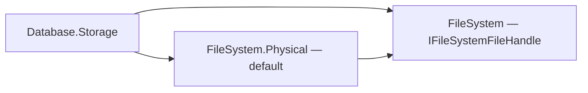

# Assimalign.Cohesion.Database.Storage design

This page describes the boundaries and implementation shape of `Assimalign.Cohesion.Database.Storage`.

> **Status:** Partial.

The physical layer of the Data Platform kernel (area architecture: resources/`Database`/DESIGN.md
(`cohesion/docs/resources/Database/DESIGN.md`) §3.2). This document records the design decisions
that shape the storage model; the program-level requirements it satisfies are R1 (ACID), R3 (shared
kernel), and R6 (NativeAOT) in the area design.

## Design intent

One model-agnostic physical substrate: fixed-size pages, a pin-counted buffer pool, a slotted-page
record layout, and a write-ahead journal. Model engines bring *layouts* (what bytes mean inside a
page body) but never their own paging, caching, or logging. The guardrails that keep this layer
trustworthy are structural: every page load is checksum-verified, every write-back is
checksum-stamped, and durability flows through the journal only — there are no side files.

## The page model

- **8 KiB pages, 96-byte header.** The header layout (`Page.Header`) is an explicit
  struct persisted on disk, so field offsets are a wire contract: id (0), LSN (8),
  checksum (16), flags (20), type (21), slot count (22), free-data end (24), overflow
  size (28), reserved nonce/MAC space for encryption at rest (32–63), then the
  owner tag (64) driving per-owner record chains (72–95 reserved).
- **`PageType.Free` is zero — deliberately.** A zero-initialized page reads as free,
  and `FreePage` re-stamps freed pages with `Free`, which is what lets the free-space
  map be *reconstructed from page headers* on open instead of being persisted as a
  separate structure that could drift from reality. The trade-off: a page freed but not
  yet flushed at process exit reappears as allocated after reopen — a safe leak, never
  corruption. (A bitmap FSM page type is reserved for when file sizes make the open-time
  scan matter.)
- **Page LSN.** Every page carries the LSN of the journal record that last modified it.
  This is the hook for the write-ahead rule (a page may not be written to the data
  stream until the journal is durable up to its LSN) and for idempotent recovery replay
  (apply a record only if it is newer than the page). The storage layer stores the
  field; the journal build-out (#160) enforces the rule.
- **Checksums on every read path.** CRC-32 over the full page with the checksum field
  zeroed. Stamped centrally in the buffer pool's write-back (the only path to the data
  stream), verified centrally in the buffer pool's load (the only path from it).
  A stored checksum of zero means "never stamped" and skips verification — accepted
  because the alternative (a validity bit elsewhere) buys nothing against the ~2⁻³²
  false-negative rate this already carries.

### Why the file header lives in the page body

`StorageFileHeader` (magic, format version, storage id/name, page counts, checkpoint LSN) sits in
the **body** of page 0 — after the standard 96-byte page header — not at file offset 0. An earlier
draft overlaid the file header on the page header, which made page 0 un-checksummable and un-typed.
Making page 0 a normal `PageType.FileHeader` page means one integrity rule covers every page in the
file, including the header.

## File handles, positional I/O, and durability

`Storage` file opening accepts an `IFileSystem`; omitting it selects the physical file system. Data,
backup, and journal files are opened with `OpenHandle`, which returns the explicit
`IFileSystemFileHandle` contract. The buffer pool and recovery pass page offsets to its positional
reads and writes through `StorageStream`. Their I/O does not depend on a shared stream cursor; the
pool's existing locking, page layout, and write-ahead ordering remain unchanged.

Durability follows the handle through composition: the storage journal retains the `StorageStream`
durability contract and forwards a durable request to `IFileSystemFileHandle.Flush(durable: true)`.
Capability comes from `SupportsDurableFlush`, never a runtime stream type. This fixes **#1018**:
wrapping a physical handle cannot silently turn the journal's durable flush into an ordinary
buffered flush. The physical handle implements that request with `RandomAccess.FlushToDisk`.

The dependency direction keeps the physical implementation as the default behind the file-system
contract:

**Durability follows the storage.** `Storage.SupportsDurableFlush` requires both data and journal
handles to support durable flushing: checkpointing cannot safely discard a durable journal before
its data pages are durable. Backups are separate from the commit/checkpoint path.
`ConfigureCommitDurability` derives an unset choice as `Synchronous` for capable storage and `None`
otherwise. An explicit `Synchronous` or `Grouped` choice on unsupported storage fails at engine
open, naming the storage and the setting. Model factories resolve the default before initialization
and recovery; engines validate their explicit options before serving the database.

Low-level durable journal operations still throw `NotSupportedException` on unsupported handles,
rather than silently downgrading the request. Reading existing journal bytes does not advance
`DurableLsn`: only a completed explicit durable flush does. Reopening live memory or an
operating-system cache is not durability evidence.

Constructors accepting an ordinary `Stream` explicitly provide **no durability**, even if that
stream happens to wrap a physical file. Such callers must use the handle overload to carry the
contract. `StorageStream.FromInMemory()` is likewise non-durable. Tests of recovery ordering use
explicit simulated durable handles; that fixture contract models persistence across their simulated
crash rather than claiming that production memory is durable.

The regression gate observes the durable flag on a recording handle around the real physical handle
used by the composed storage journal. A reopen or simulated crash assertion alone cannot prove this
request: operating-system buffering can preserve bytes even when no durable flush was issued.

## The buffer pool

`Pin`-counting with RAII handles (`IStoragePageHandle`): a page cannot be evicted while pinned, dirty
pages are written back (checksum-stamped) before eviction, and handles release their pin on dispose.
Contrast with a `Memory<byte>` -pooling design: pages are *pinned* GC handles exposing raw pointers
because the slotted-page and header structs are `unsafe` overlays — the pool guarantees pointer
stability for the handle's lifetime.

- **Eviction is least-recently-used** over unpinned entries: pins and cache hits move a
  page to the MRU end; capacity overflow evicts from the LRU end, skipping pinned
  pages, and fails loudly (`StorageIOException`) when every resident page is pinned —
  the pool never silently exceeds its memory budget. LRU (not clock/2Q) because the
  pool is fully lock-serialized anyway, so the precise policy costs nothing extra and
  is trivially testable.
- **Buffers are reused**: evicted entries return their pinned 8 KiB buffers (GC handle
  and all) to a recycle stack, so steady-state page churn performs zero allocations —
  fresh pages are zeroed on reuse so recycled buffers never leak prior content.
- **Failed loads never poison the cache**: a page that fails checksum verification is
  not cached; its buffer goes straight back to the recycle stack and the exception
  propagates.
- **One lock.** All pool state is guarded by a single monitor. Page *content* access is
  the caller's concern (a handle hands out a raw pointer); the transaction layer above
  provides content-level isolation. Sharding the lock is a measured-need optimization,
  not a default.

## The record layer

`SlottedPage` implements the classic slotted layout: records grow forward from the header, the slot
directory grows backward from the page end, deletion marks a slot (length 0) and `Compact`
defragments. All four models share this because their unit of storage — row, document, KV entry,
node/edge record — is "a variable-length byte sequence addressed by (page, slot)". Records above
`SlottedPage.MaxRecordSize` are rejected at the API boundary; multi-page records ride overflow pages
(a later feature — the flags and page type are reserved).

### Per-owner record chains

Data pages carry an 8-byte **owner tag** in the page header (offset 64, taken from the reserved
area; zero = the shared, untagged space, which is also what pre-tag files read — no format flag
needed). The tag is model-agnostic: storage never interprets it beyond grouping.
`InsertRecord(transaction, ownerId, data)` lands the record on the owner's current write page
(allocating and tagging a new page when needed), `GetUnitIterator(ownerId)` iterates only the
owner's pages, and `GetOwnerPages(ownerId)` exposes the chain. This is what turns a model's "scan
one object" from O(storage) into O(object) — the SQL engine passes table object ids, so a table scan
stops decoding the whole database.

- **The directory is in-memory only, page headers are the truth.** The per-owner
  page directory is rebuilt on open by the same header scan that rebuilds the
  free-space map (no extra I/O) and maintained at allocation/free time. A persisted
  directory could drift from reality; headers cannot (the FSM precedent).
- **Owner tags are WAL-covered like all page bytes.** A fresh chain page is tagged
  *before* its first-touch before-image is captured, so a rolled-back allocation
  restores an empty page still belonging to the chain — a safe leak the owner's
  next insert reuses.
- **Chain release (`FreeOwnerPages`) is transactional with commit-deferred
  reuse.** Each page is retyped `Free` under the transaction (before-image
  covered — rollback and crash recovery restore the chain bytes), but the pages
  re-enter the free-space map and leave the directory only when the transaction
  **commits**. Freeing eagerly would let the allocator hand a page to a new owner
  while the release could still roll back — the rollback's before-image would then
  resurrect old content over live data. Deferral makes that impossible.
- **Why release is O(pages), not O(1).** Full-page-image logging prices a
  transactional free at one page touch per page (before-image + after-image in the
  journal). A directory-level O(1) release needs a persisted allocation structure
  (the reserved bitmap-FSM page type) so freeing can be a metadata write; until
  that lands, chains keep releases proportional to the object, which is already
  incomparably better than the previous permanent leak.

## The journal (write-ahead log)

`IStorageJournal` is the durability mechanism — the *only* one. Frames are length-prefixed,
magic-tagged, and CRC-protected; a torn or corrupted tail terminates the read scan and is ignored —
it belongs to work that was never acknowledged. Records are typed and binary (begin / commit /
rollback / checkpoint / before-image / after-image / opaque logical operation); transaction identity
at this level is a compact monotonic `long` sequence — GUID identity belongs to the transaction
layer above.

### `Write` ordering rules (steal / no-force, full page images)

1. **Before-image at first touch.** A transaction's first modification of a page
   appends the page's full prior image and stamps the pooled page's LSN with that
   record — mutations then apply in the buffer pool only.
2. **The write-ahead gate.** The buffer pool may steal (evict) a dirty page at any
   time, but its write-back first forces the journal durable up to the page's LSN —
   so any uncommitted content that reaches the data file is always undoable from a
   durable before-image.
3. **`Commit` = after-images + commit record + fsync.** `Commit` appends the after-image
   of every touched page (stamping each page's LSN with its record), then the commit
   record, and acknowledges only after `EnsureDurable(commitLsn)`. Data pages are
   *not* forced — recovery redoes them (no-force).
4. **`Rollback` restores in memory.** Before-images are kept per transaction and copied
   back into the pooled pages, so rollback is complete without I/O; a rollback record
   marks the outcome.
5. **Page-level single-writer.** A page touched by an active transaction is
   write-locked to it (conflicts throw rather than wait). Record-level concurrency is
   `Database.Transactions`' job above this layer; full-image logging is only correct
   because two transactions can never interleave on one page. This division is
   permanent in the MVCC integration design (area DESIGN.md §3.8): storage
   transactions remain the **physical WAL bracket** — the MVCC manager layers
   row-grain snapshots/locks *above* them (paired per transaction via
   `IStorageTransactionSource`), and page locks stop being the user-visible
   conflict surface without ever weakening the invariant that makes page-image
   logging correct.

### The physical/logical bracket interplay (MVCC layering rules)

The MVCC session binding (area DESIGN.md §3.8, first delivered by the SQL engine) added three
storage-side rules that keep the logical layer sound:

- **One sequence namespace.** `IStorage.ReserveTransactionSequence()` +
  `IStorage.BeginTransaction(long sequence)` let an engine's transaction manager
  allocate from the storage's own counter and pair each logical transaction with
  a bracket that *adopts the same sequence*. The bracket's commit record then
  proves the logical transaction at recovery — there is no window in which page
  images are committed under one sequence while the logical outcome hangs on
  another, and internally sequenced brackets (catalog self-commits, auto-commit
  record operations) can never collide with manager-assigned sequences. An
  adopted bracket appends **no begin record** — the reserving caller's
  transaction log owns lifecycle records; the bracket contributes page images
  and its commit/rollback record.
- **The sequence floor.** The file header persists the storage's high-water
  transaction sequence (`LastTransactionSequence`, updated on every header
  write). On open, sequence assignment resumes above `max(journal-max, floor)`:
  a checkpoint truncates the journal — the only other sequence witness — while
  MVCC row stamps persist in data pages, so a recycled sequence would corrupt
  snapshot visibility. Files written before the field read zero, a safe floor
  (they predate row stamps).
- **Checkpoints carry logical actives; the open-time checkpoint is deferrable.**
  `Checkpoint(ReadOnlySpan<long>)` embeds in-flight *logical* sequences in the
  truncating checkpoint record (their begin records are being destroyed;
  `TransactionRecovery.Analyze` reads them back so an unproven sequence still
  classifies as aborted). `Storage`-level brackets must still be quiescent — the
  active-count interlock is unchanged, and logical actives are the caller's to
  supply because storage cannot see above its own layer. Symmetrically,
  `OpenExisting(checkpointOnOpen: false)` lets an engine analyze the recovered
  journal *before* the truncation destroys the records classification reads.
- **Inner brackets may commit non-durably.** `Commit(awaitDurability: false)`
  appends the same records (after images + commit record) without the durable
  flush — for per-statement physical brackets whose durability is owned by the
  outer logical transaction's commit record: the journal is ordered, so
  flushing the later record makes the earlier ones durable first, and a crash
  before that leaves the bracket unproven — its pages undone by recovery —
  which is exactly the outer transaction's abort semantics. The write-ahead
  gate protects stolen pages regardless of the flag; the flag never weakens
  the rule that an *acknowledged* commit is durable, because acknowledgment
  belongs to the outer commit.

Full page images (8 KiB per touch) were chosen over byte-range deltas deliberately: they make
recovery a pure idempotent overwrite with no operation replay logic, which is the property the crash
suites verify. Deltas are a measured-need optimization that can ride the same record types later.

### Recovery replay rules

Because images are full pages and pages are single-writer, the desired final state of a page is the
image of the **last** journal record on it among *committed after-images* and *uncommitted
before-images* — redo and undo collapse into one last-record-wins pass. Replay is idempotent by
exact-LSN match: an after-image stamps its record LSN, a before-image restores the pre-transaction
LSN embedded in the captured bytes, and an image is skipped only when the on-disk page already
verifies (checksum) at exactly the target LSN. Recovery runs on open, writes directly to the data
stream (bypassing the pool — a corrupt page must be overwritable), and finishes with a checkpoint.

### Checkpoints

`Checkpoint()` durably flushes all page state and **truncates** the journal, writing a fresh
checkpoint record whose LSN continues the sequence (LSNs never restart — page LSN comparisons depend
on monotonicity across truncation). Checkpointing requires no active transactions — truncating live
before-images would orphan stolen writes; fuzzy checkpoints are a later feature (the record already
carries the active-transaction set). Clean shutdown checkpoints, so a clean reopen recovers
instantly.

With a background checkpointer (#902) checkpoints race live transactions, so the emptiness check
hardened from "no page write locks" to an **active-transaction count** taken in `BeginTransaction`
under the transaction lock and released exactly once per commit/rollback: a begun-but-untouched
transaction holds no page lock yet has already appended its begin record, and the whole checkpoint
now runs *under* the transaction lock, so no transaction can slip between the emptiness check and
the truncation. (Lock order is transaction lock → buffer pool → journal; no path takes them in
reverse.) A checkpoint attempted while transactions are active still throws
`StorageTransactionException` — background checkpointers treat that as "busy, retry next pass".

### `Commit` durability modes (group commit)

`Storage.CommitDurability` controls how journal records reach stable storage:

- **`Synchronous` (default):** commit calls `EnsureDurable(commitLsn)` inline — one
  fsync per commit, simplest latency profile.
- **`Grouped`:** commit registers its LSN on the internal group-commit gate, wakes
  the engine's flush worker through the `OnCommitPending` hook, and waits. The worker
  calls `IStorage.FlushPendingCommits()` — one durable flush covering the highest
  pending LSN — and wakes every covered committer, so concurrent commits share one
  fsync. **Self-help invariant:** a committer not woken within `GroupCommitWindow`
  flushes inline itself; a missing, stalled, or misconfigured worker costs bounded
  latency, never durability. A commit is acknowledged only after its records are
  durable in either mode.
- **`None`:** commits do not flush to durable storage because the backing store
  cannot provide it. The same before images, after images, and commit records are
  appended. Page write-back keeps ordinary journal-before-page flush ordering;
  recovery, checkpoints, explicit flushes, and shutdown perform ordinary flushes
  without advancing the durable LSN or publishing durable group-commit progress.

`Synchronous = 0` and `Grouped = 1` retain their shipped enum values; `None = 2` is additive. The
low-level `Storage` property retains its synchronous default for callers explicitly managing
composition. Engine defaults are derived from the backing handles, and the resolved value is visible
through `CommitDurability`. The policy is applied after the commit record exists;
`EnsureCommitDurable` also lets an outer logical transaction apply the same policy to its later
commit record. MVCC visibility, joins, and constraint enforcement do not read this setting.

The gate lives in storage (not the engine) because commit blocks inside `CommitTransaction`; the
engine contributes only the worker loop and the wake signal. Page write locks release after the
durability wait, exactly as in synchronous mode.

### Paced page write-back

`IStorage.WriteBackDirtyPages(maxPages)` writes back a bounded batch of dirty buffered pages without
evicting them — the page-writer worker's pass between checkpoints, so a checkpoint's `FlushAll` does
not spike. Every write-back path (this one, eviction, `FlushAll`) funnels through the buffer pool's
single write-back routine, so the write-ahead gate (journal durable ≥ page LSN) holds for stolen
pages here exactly as everywhere else.

### What is deliberately unlogged

Page 0 (the file header) carries only recomputable bookkeeping and is rebuilt or revalidated on
open; it is flushed but never journaled. Page allocation is likewise not undone on rollback — a page
allocated by an aborted transaction is restored to its empty initialized image and leaks safely
until reused.

## Empty pages and streaming journal recovery

Deleting the last live record in a data page retypes it as `Free` inside the physical bracket and
registers a pending free, exactly as an owner-chain release does. The allocator and owner directory
change only after commit. `Rollback` restores the original page image and keeps its owner membership.
Inserts check page type and owner before reusing a current-write-page hint, including a hint to a
page pending release in the same bracket. Iterators release a pin before skipping a page that was
freed during a scan.

`StorageJournal.ReadSequential` holds the synchronous append lock for the lifetime of an enumeration
and yields one validated frame at a time. Callers consume it on one thread without awaiting or
mutating the journal; early disposal restores the underlying stream position and releases the lock.
`ReadAll` preserves its existing materialized API. Journal initialization also uses streaming
enumeration.

Physical recovery uses three streaming passes: classify committed sequences, retain the winning
relevant LSN per page, then replay only those images. The winner remains the last committed
after-image or uncommitted before-image in WAL order, preserving existing undo/redo semantics and
torn-tail handling. The replay memory cost is transaction/page identities plus one page image, not
the journal payload size. This permits Blob journals larger than available memory to reopen.

## Error model

`StorageException` is the area root for this library. `StorageIOException` (stream and allocation
failures), `SlottedPageException` (record layout violations), `StorageCorruptionException`
(checksum/header integrity failures — carries the `PageId`), and `JournalException` (journal
framing/state violations) all derive from it, so consumers can catch the family or the specific
failure.

## AOT posture

No reflection, no runtime codegen. `Header` structs are explicit-layout overlays read through
pointers; encodings are hand-written span code. `AllowUnsafeBlocks` is enabled for the pointer
overlays — the unsafe surface is confined to `Units/` and the buffer pool's pinned buffers.

## Non-goals

- **No model semantics.** Nothing here knows what a row or document is.
- **No distributed I/O.** One storage instance = one file set on one machine.
  Replication rides the journal from `Database.Replication`, not this layer.
- **No encryption yet.** The header reserves nonce/MAC space and `PageFlags.Encrypted`;
  the encryption-at-rest feature (#861) implements it beneath the buffer pool.

## Declared dependencies

| Reference | Kind |
|---|---|
| `Assimalign.Cohesion.FileSystem` | `CohesionProjectReference` |
| `Assimalign.Cohesion.FileSystem.Physical` | `CohesionProjectReference` |

[Assembly overview](index.md) · [Examples](examples/index.md)

## Sources

- **Primary source** — `cohesion/resources/Database/Assimalign.Cohesion.Database.Storage/docs/DESIGN.md`.
- **Source** — `cohesion/resources/Database/Assimalign.Cohesion.Database.Storage/src/Assimalign.Cohesion.Database.Storage.csproj`.
