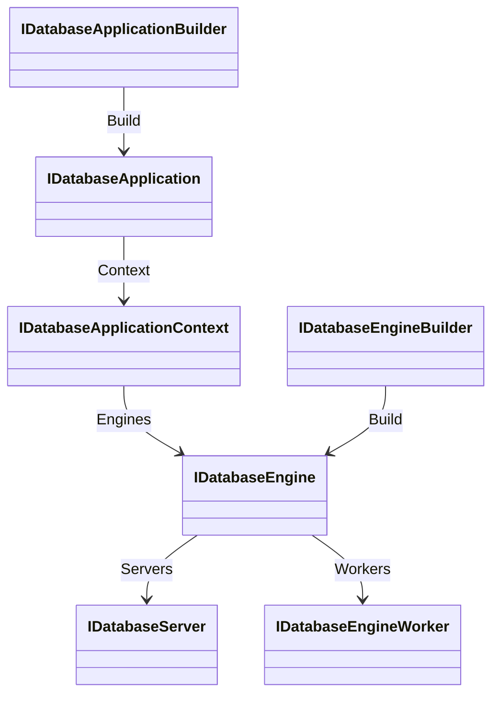

# Assimalign.Cohesion.Database design

This page describes the boundaries and implementation shape of `Assimalign.Cohesion.Database`.

> **Status:** Partial.

The area root (architecture: resources/`Database`/DESIGN.md
(`cohesion/docs/resources/Database/DESIGN.md`)). Everything here must be true for *all five* data
models — anything model-specific belongs in a model package. The root's job is to make engines
substitutable at the seams the platform builds on: the server serves any engine, the hosting layer
composes any engine, a client result looks the same regardless of the engine that produced it.

The root is also the area's **rollup**: it references every child root — the independently
consumable base components a database is made of (`Database.Types`, `Database.Language`,
`Database.Storage`, `Database.Transactions`, `Database.Execution`, `Database.Protocol`,
`Database.Security`, `Database.Governance`) — so one reference to the root delivers the whole base
surface. Child roots never reference the root.

## Phase 29 composition contract (current)

The approved hosting composition (`cohesion/docs/programs/DATABASE_HOSTING_DESIGN.md`) supersedes
the historical builder/worker descriptions below. `IDatabaseApplicationBuilder` exposes exactly
borrowed `AddEngine(instance)`, owned
`AddEngine(Func<IDatabaseApplicationContext, IDatabaseEngine>)`, and one-shot `Build()`. There is
no builder engine enumeration, application-level `AddServer`, or `Use` stage. `IDatabaseApplication`
inherits `IAsyncDisposable`; its context observes every engine, nested servers, and ordinal
`GetEngine(name)` lookup. All four named engine operations use the existing `DatabaseName` value
object; its implicit string conversions preserve straightforward callers while implementations use
the typed contract.

`IDatabaseEngineBuilder` earns a shared seam because `AddWorker` is model-agnostic: the same factory
can attach a worker to any model. Shared construction/rollback source is owned in this project's
`shared/` and compiled by each model through `CohesionSharedSource`. Every model-specific interface
extends the base and carries that model's options. No separate generic application composition
algorithm consumes arbitrary model options. Strongly typed worker/server factory overloads are
deliberately omitted: the common engine factory contract already works, and explicit casts for
SQL/KeyValue servers avoid overload ambiguity and a second factory vocabulary.

Workers remain scheduled and quiesced by their engine.
`IDatabaseEngineWorker.Run(CancellationToken)` exposes the existing executable pump so workers
returned by the approved deferred factories can run without requiring a particular base
implementation. `IDatabaseEngine.Servers` enables hosting to discover nested servers. Engines own
factory-produced workers and servers; hosting snapshots servers for lifecycle only.
`Application`-created engines are disposed by the application; instance-registered engines remain
caller-owned.

## Why-this-not-that decisions

- **Child roots roll up under the root; they never reference it** (owner
  decision, 2026-07-13 — inverts the earlier Protocol→root and Transactions→root
  references). Unlike the Web area, a database has a vast base-component surface;
  the child roots exist to break it out for separation of concerns and
  testability, and each must stay *independently consumable* — a tool that only
  speaks the wire protocol, or a storage engine experiment, should not drag the
  area contracts in. That is only true if the dependency arrow points root →
  child. The rejected alternative — child roots referencing the root for shared
  vocabulary (`DatabaseException` ancestry, `TransactionId`, `ProtocolVersion`) —
  made two children (`Protocol`, `Transactions`) unaggregatable and forced the
  hosting module into a `COHRES002` exemption for the server's own machinery. With
  the inversion, vocabulary lives with its owning child (`ProtocolVersion` in
  `Protocol`, `TransactionId`/`TransactionState` in `Transactions`), the root
  consumes it through its child-root references, and consumers reach it
  transitively through the root. `Database.Indexing` joined the child
  roots on 2026-07-13 (owner direction): its only root coupling was exception
  ancestry, re-rooted onto its own `IndexException` — index infrastructure is a
  base component like storage and transactions.

- **Engine → database → session → transaction as four contracts**, not one god
  interface. Each has a distinct lifetime and threading model: engines are
  process-long and thread-safe; databases are shared handles; sessions are
  cheap, single-threaded execution scopes; transactions are explicit ACID
  brackets inside a session. Collapsing them (an `ExecuteAsync` on the engine,
  say) would smuggle session state into a shared object.
- **Engines are data machines — create → use → dispose, no lifecycle members**
  (owner decision, 2026-07-13 — **reverses the #903 decision** that put
  `StartAsync`/`StopAsync` on the root engine contract, and supersedes the
  short-lived `IDatabaseEngineLifecycle` segregation from earlier the same day,
  which was deleted before it ever shipped in a release). The new information
  that changed the calculus: once servers became per-model (below), "running"
  had an owner — the server fronts the engine on the network and is the thing
  that starts and stops — and the engine's start/stop ceremony was revealed as
  accidental service-shape, not data-machine substance. An engine is fully
  operational from creation (its background workers spawn with it) and disposal
  is its one transition: quiesce workers → durable flush → close databases.
  What #903 actually needed — a host that can *align* engine durability with
  its own lifecycle — is satisfied by disposal alone: the composition root that
  created the engine disposes it, and committed work is durable when
  `DisposeAsync` completes. The rejected alternative (keeping idempotent
  start/stop for restartability) bought a restartable engine object nobody
  needed — a "restart" is creating a fresh engine over the same storage root,
  which the recovery path already makes correct — at the cost of a
  four-state machine on every engine and a start-order protocol between host
  and composition root.
- **A minimal observational `State` stays on the engine** (judgment call,
  recorded): the approved data-machine contract needs no state machine, but
  worker-fault reporting needs *somewhere* to surface — the old contract threw
  the recorded fault from `StopAsync`, and with stop gone the only alternatives
  were throwing from `DisposeAsync` (hostile to `await using`, masks in-flight
  exceptions) or silence. `EngineState` therefore shrank from a six-state
  lifecycle enum to three observational conditions: `Running` (from creation),
  `Faulted` (a background-worker fault was recorded; the engine keeps serving —
  grouped commits self-help, checkpoints just stop truncating — but the owner
  should learn it runs degraded), `Disposed`. The default control-plane health
  aggregate delivered by #973 reads this surface; nothing drives transitions
  from outside.
- **The application exposes its composition through `IDatabaseApplicationContext`,
  and the context is plural** (owner direction, 2026-07-13 — the `Database`
  instance of the Web area's `IWebApplicationContext` pattern, converged with
  Web's shape). The context carries `Servers` (registration order — plural
  because servers are per-model, so one application may front SQL and Documents
  engines through two servers) and `Engines` (the server-less, embedded
  registrations; an engine fronted by a server is reachable through that
  server's context). `IDatabaseApplication` is the Web shape exactly: `Context`
  plus `StartAsync`/`StopAsync` (the loose `Engines` member it briefly carried
  is gone). Deferred composition callbacks on the builder receive the context —
  `AddServer(Func<IDatabaseApplicationContext, IDatabaseServer>)`, mirroring
  Web — replacing the earlier engine-list-receiving factory: the context view
  lets a factory observe servers registered ahead of it, not just engines, and
  keeps the callback signature stable as the context grows. An earlier cut of
  this contract (same day, superseded before merge) exposed a single nullable
  `Server`; per-model servers made plurality structural, not optional.
- **Two execute seams on `IDatabaseSession`.** The typed seam
  (`ExecuteAsync(QueryRequest)`) is for in-process consumers that already speak a
  model's language objects (`SqlQueryRequest`). The **text seam**
  (`ExecuteAsync(string, parameters)`) exists for the wire protocol: the server
  receives statement *text* plus decoded parameter values and must stay
  model-agnostic — so the session, which knows its model, owns parsing. The
  alternative — the server referencing model language packages to build typed
  requests — would couple the one shared network front-end to every model and
  violate the area's composition rules. Each model implements the text seam with
  its own parser (`SqlDatabaseSession` → `SqlQueryRequest.FromSql`).
- **The isolation-level seam consumes the Transactions child's enum directly**
  (2026-07-13, with the MVCC-integration design — area DESIGN.md §3.8).
  `IDatabaseSession.BeginTransactionAsync(IsolationLevel, …)` and
  `IDatabaseTransaction.IsolationLevel` speak `Database.Transactions`'
  `IsolationLevel` — the same pattern as `TransactionId`/`TransactionState`:
  post-inversion, the root consumes child vocabulary rather than duplicating
  it. The rejected alternative — a root-owned isolation enum mapped onto the
  child's — would create two vocabularies for one concept and a translation
  layer with no owner. The contract deliberately allows engines to run
  *stronger* than requested (the SQL engine's page-grain serialization today),
  never weaker, so the seam could land ahead of the MVCC session binding
  without lying about semantics. No speculative MVCC contracts were added to
  the root: the manager's contracts already live in the Transactions child
  root, and the binding is a model-engine concern (the design doc explains the
  placement).
- **`DatabaseParseException` as a first-class error category.** `Parse` failures
  and execution failures have different wire error codes (`ParseFailure` vs
  `ExecutionFailure`) and different caller responses (fix the text vs inspect
  the data). A subtype of `DatabaseException` keeps existing `catch` blocks
  working while giving the server an exact mapping — better than string-matching
  messages or per-model exception knowledge in the server.
- **`QueryRequest`/`QueryResult` live in `Database.Execution`, not here.** The
  root aggregates the execution family rather than owning it: execution is its
  own child root with pipeline/context machinery the contract root has no
  business carrying. The same holds for the other child-root vocabularies the
  root's contracts speak: `TransactionId`/`TransactionState` live in
  `Database.Transactions` (`IDatabaseTransaction` consumes them), and
  `ProtocolVersion` lives in `Database.Protocol` (`IDatabaseServerSession`
  consumes it).
- **Background workers are engine-owned, unconditionally — the claim handshake
  is gone** (owner decision, 2026-07-13; supersedes the #902 claim model). The
  engine spawns its worker loops at creation — the latency-critical flusher and
  write-back loops on dedicated threads the engine itself owns, satisfying the
  Lane-H dedicated-thread guardrail with no host involvement — and quiesces
  them on dispose. `IDatabaseEngineWorker` shrank to an **observational**
  contract (name, kind, cadence — what a diagnostics or health surface needs);
  the pump machinery (`Run`/`RunIteration`/`WaitForTrigger`) lives on the
  guided base `DatabaseEngineWorker` for the owning engine's internal use only.
  The rejected (previous) design — `TryClaim`/`Release` plus host worker slots
  mapping claimed workers onto the hosting execution menu — existed to let a
  host own worker scheduling; per R10 the engine had to own the *work* anyway,
  so the handshake bought configurability nobody used at the price of a
  two-owner protocol whose failure modes (claim races, disabled slots,
  half-claimed inventories) all had to be designed away. One owner, no
  handshake: a worker can never run twice because exactly one engine-internal
  scheduler exists. Workers remain synchronous by design — every body is
  storage I/O (fsync, page writes, checkpoint), which has no async fast path.
- **Server *contracts* live here — and they are the only area-wide server
  requirement; servers are per-model, each model package carrying its own copy
  of the server machinery** (owner decision 2026-07-14, settled on review of
  the second model server's extraction evidence). A server fronts exactly
  **one** engine — `IDatabaseServerContext.Engine` is singular — so
  model-specific wire behavior has a home. Each model ships its own
  `IDatabaseServer`/`IDatabaseServerContext`/`IDatabaseServerSession`
  implementation in its model package (`SqlDatabaseServer` in `Database.Sql`,
  `KeyValueDatabaseServer` in `Database.KeyValuePair`), with the machinery
  (accept loop, session state machine and frame pump, guardrails, two-phase
  drain) internal to that package. The placement history is deliberate
  evidence discipline: the shared base that briefly existed at n=1 was folded
  into `Database.Sql` with an extraction trigger recorded; the second model
  server fired it and the proven core was extracted into a shared
  `Database.Server` — and the owner then reviewed that evidence and chose
  per-model duplication anyway (model independence over shared code; drift
  cost accepted; wire parity held by the protocol contract and per-model E2Es —
  the preserved prediction-vs-evidence table lives in the area DESIGN §3.10).
  The contracts stay here for the same `COHRES001` reason as before: feature
  libraries (quotas #167, health, `Database.Testing`) must be
  able to name the server without referencing any runtime. The context shape
  (`Context` = engine + sessions) mirrors the application context pattern —
  observational composition on a context, lifecycle on the owning object.
- **The application builder is a root seam; the implementation is not** (owner
  direction, 2026-07-13). `IDatabaseApplicationBuilder`/`IDatabaseApplication`
  live here so **model packages register their engines and servers without
  knowing the hosting implementation**: `Database.Sql` ships `AddSqlDatabase(...)` and
  `AddSqlServer(...)` as `extension(IDatabaseApplicationBuilder)` members and
  never references `Database.Hosting` (`COHRES001` intact); the hosting module
  ships the implementation (`DatabaseApplicationBuilder`) and the creation
  entry point (`DatabaseApplication.CreateBuilder()`). The concrete
  `DatabaseApplicationBuilder.AddService` in `Database.Hosting` accepts plain Hosting
  service instances and context factories; those services start before servers and
  stop after them in reverse order. The root references no hosting library and
  exposes no service-registration verb (O34). Multiple `AddServer` registrations are
  allowed — servers are per-model. This mirrors the Web area exactly
  (`IWebApplicationBuilder` in the `Web` root, `WebApplication.CreateBuilder()`
  in `Web.Hosting`, `AddAuthentication` in `Web.Authentication`) — and the
  pattern is the **cross-area expectation**: every area root provides
  `I<Area>ApplicationBuilder`, and feature/model registration verbs ship with
  their feature package (see `.claude/rules/resource-areas.md`). The rejected
  alternative — a builder type in the hosting module — would force every model
  package that wants a registration verb to reference the composition surface,
  which is precisely what the hosting-isolation rule forbids.
- **Model-specific schemas belong to their model family** (MVP features A1–A4,
  2026-09-17). `CompiledSchema` is an abstract model-agnostic identity carrying
  `Format`, `Name`, `Model`, `AllowsDestructiveChanges`, and the model's canonical
  document. The root computes SHA-256 over that document without inspecting its
  shape. `IDatabaseSchemaProvisioner` remains the common apply seam, returning
  the readonly `SchemaMigrationResult` value (`FromHash`, `ToHash`,
  `OperationCount`, `WasAlreadyApplied`). Relational declarations, builders,
  validation, serialization, and migration planning moved to the thin
  `Database.Sql.Schema` package, which build tooling can consume without the SQL
  engine or network stack. The former root schema's collection shape was removed;
  the document model will define its own vocabulary in its own model family.
  If another model needs a different shape, it does not belong in this root.
- **`Object` ownership separates code-first provisioning from ad-hoc statements.**
  `DatabaseObjectOwner.Adhoc` objects remain fully mutable through session
  statements. `DatabaseObjectOwner.Schema` objects can change only through schema
  apply; a session attempting to alter or drop one receives
  `DatabaseObjectLockedException` identifying the object, its compiled
  `OwningSchema`, and the operation. `OwningSchema` is provisioning identity,
  distinct from any model-specific namespace such as a SQL table's `Schema`.
  Model catalogs persist ownership and model engines enforce it. Neither the
  ownership contract nor the exception requires a relational object shape.
- **`ProtocolVersion` lives in `Database.Protocol`, and the root consumes it.**
  The struct is wire vocabulary, so it lives with the wire implementation —
  `ProtocolVersion.Current` ("the version this assembly implements") is a plain
  static property on the struct, with the claim and the implementation that
  makes it true in one assembly. The struct spent a period in the root with
  `Current` grafted on from `Protocol` as a C# 14 static extension member — an
  arrangement that existed *only* because `Protocol` referenced the root, which
  made root → `Protocol` impossible. The child-root inversion removed that
  constraint, so the split was collapsed back into the protocol package.

## Error model

`DatabaseException` (inherits `Exception` per the area-scoped exception rule) is the root for **the
contract root and everything built *above* it**: the model engines and their satellites
(`SqlCatalogException`, engine-thrown `DatabaseException` s), the client core
(`DatabaseClientException`, `SqlClientException`), the server, and `Database.Embedded`. The root
defines semantic subtypes, each because the distinction is part of a public contract:
`DatabaseNotFoundException` is the exact absence signal from `IDatabaseEngine.OpenDatabaseAsync` (so
provisioning and server binding do not confuse an operational failure with a missing database),
`DatabaseParseException` distinguishes fix-the-text from fix-the-data failures (the wire's
`ParseFailure`), and the retryable-abort pair `DatabaseTransactionAbortedException` /
`DatabaseTransactionDeadlockException` (the model-boundary surface of the transaction kernel's
aborts: a write-write conflict or deadlock victim is retryable by construction, and in-process
consumers deserve to catch that kind precisely rather than parse messages; on the wire both remain
`ExecutionFailure` with a precise message).

**Child roots own independent exception roots** — `StorageException`, `DatabaseTypeException`,
`QueryExecutionException`, `ProtocolException`, `TransactionAbortedException` all inherit
`Exception` directly. This is the point of the child-root inversion: a child root must be
independently consumable, so its error surface cannot depend on the area contracts. (`Storage`, Types,
and Execution were always shaped this way; Protocol and Transactions joined them when their root
references were inverted, 2026-07-13.)

The consequence, deliberately accepted: `catch (DatabaseException)` does **not** catch child-root
failures. The layer that owns both vocabularies translates at its boundary — the server session pump
maps `ProtocolException` to `ProtocolViolation` in a dedicated handler and the client core wraps it
in `DatabaseClientException`. A model engine that surfaces a child-root failure (storage conflict,
transaction abort) through the session contract is responsible for wrapping it in a
`DatabaseException` at the model boundary; a child-root exception that escapes raw reaches the wire
as the `Internal` error (and closes the session), which is the pre-existing behavior for
`StorageException` — the SQL engine's statement-level failures already surface as
`DatabaseException`, so the inversion changed no live wire mapping.

## Lifecycle pattern

- **Engines** — **no lifecycle members** (the data-machine decision above). An engine
  is operational from creation — background workers pumping, databases
  creatable — and disposal (`IAsyncDisposable` + `IDisposable`, idempotent) is
  its one transition: quiesce workers → durable flush → close every open
  database. Committed work is durable when `DisposeAsync` completes. `State` is
  observational only (`Running`/`Faulted`/`Disposed`).
- **Servers** — `StartAsync`/`StopAsync` on `IDatabaseServer` — "running" lives on
  the per-model server (and the application composing servers), never on the
  engine. Stop drains gracefully within the server's drain budget; disposal
  stops the server.
- **Sessions** — disposing rolls back any active transaction (documented on the
  interface; sessions must never commit implicitly on dispose).
- **Transactions** — disposing an uncommitted transaction rolls it back.

## AOT posture

Contracts, enums, value objects, and canonical-document hashing only. The root does not inspect
model schemas or discover types dynamically. SQL declaration compilation and source-generated JSON
serialization live in `Database.Sql.Schema`.

## Non-goals

- **No connection/network concepts (that** — is the per-model server machinery in
  the model packages — `SqlDatabaseServer` in `Database.Sql` — and
  `Database.Client`).
- **No DI, configuration, or** — `Assimalign.Cohesion.Hosting*` reference. Background-work
  registration and hosting implementation remain in `Database.Hosting` (O34).
- **No model-specific request or result types** — models subclass the
  `Database.Execution` family in their own packages.

## Declared dependencies

| Reference | Kind |
|---|---|
| `Assimalign.Cohesion.Core` | `CohesionProjectReference` |
| `Assimalign.Cohesion.Database.Execution` | `CohesionProjectReference` |
| `Assimalign.Cohesion.Database.Governance` | `CohesionProjectReference` |
| `Assimalign.Cohesion.Database.Indexing` | `CohesionProjectReference` |
| `Assimalign.Cohesion.Database.Language` | `CohesionProjectReference` |
| `Assimalign.Cohesion.Database.Protocol` | `CohesionProjectReference` |
| `Assimalign.Cohesion.Database.Security` | `CohesionProjectReference` |
| `Assimalign.Cohesion.Database.Storage` | `CohesionProjectReference` |
| `Assimalign.Cohesion.Database.Transactions` | `CohesionProjectReference` |
| `Assimalign.Cohesion.Database.Types` | `CohesionProjectReference` |
| `Assimalign.Cohesion.Web` | `CohesionPrivateProjectReference` |

[Assembly overview](index.md) · [Examples](examples/index.md)

## Sources

- **Primary source** — `cohesion/resources/Database/Assimalign.Cohesion.Database/docs/DESIGN.md`.
- **Source** — `cohesion/resources/Database/Assimalign.Cohesion.Database/src/Assimalign.Cohesion.Database.csproj`.
