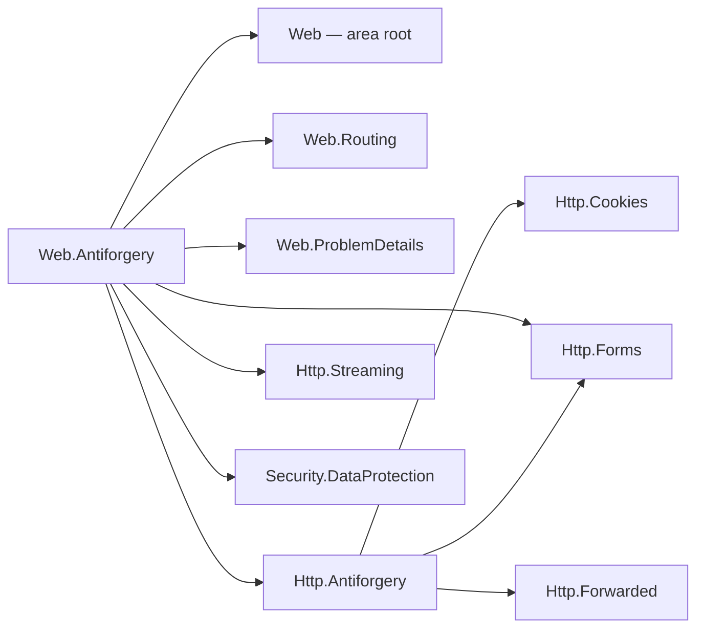

# Assimalign.Cohesion.Web.Antiforgery design

This page describes the boundaries and implementation shape of `Assimalign.Cohesion.Web.Antiforgery`.

> **Status:** Partial.

## Design intent

`Assimalign.Cohesion.Http.Antiforgery` shipped a complete token engine — a signed double-submit
cookie and request token behind `IHttpAntiforgery`, with a pluggable `IHttpAntiforgeryProtector`
seam — but nothing in the Web area used it, the source-generated form binding checked no token, and
its default protector signed with a per-process random key (issue #1057; D12 in
`docs/programs/HTTP_WEB_PROGRAM_PLAN.md` §7.2). This package is the Web-pipeline half. It owns three
things and nothing else:

- **Registration** — `AddAntiforgery` creates the application's antiforgery service once and chooses
  the protector it seals tokens with.
- **Enforcement** — `UseAntiforgery` validates protected endpoints between `UseRouting` and the
  endpoint.
- **Declaration** — the sealed `AntiforgeryMetadata` carrier and the `RequireAntiforgery` /
  `DisableAntiforgery` convention verbs, plus the requirement the endpoint-binding generator
  attaches to form-bound typed endpoints.

Token framing, cryptography, cookie writing and the request-token read stay in `Http.Antiforgery`.
Key storage and rotation stay in `Security.DataProtection`.

## Home: a feature library, not `Web.Forms`

The issue left the choice open between a new feature library and `Web.Forms`. It is a new library,
recorded in the area README's project map, for three reasons:

- **Antiforgery is not a form concern.** The header-token flow protects any unsafe request — a
  `fetch` posting JSON, a `DELETE` from a single-page application — that never carries a form.
  Homing it in `Web.Forms` would make JSON-only applications take a form-parsing package to get CSRF
  protection, and would make a form package own an endpoint policy.
- **It is an endpoint policy, and the area has a shape for those.** Metadata carrier, middleware
  after `UseRouting`, acknowledgement, convention verbs, end-to-end tests over the real router: the
  same unit as `Web.RateLimiting` and `Web.RequestTimeouts`, each its own package.
- **`Web.Forms` is deliberately single-purpose.** Its design owns exactly `UseForms()`; its
  `RootNamespace` is the area root's, so the antiforgery types would have landed in
  `Assimalign.Cohesion.Web` next to the pipeline abstractions.

The cost is the new-project wiring (framework list, three solutions, CI matrix, release inventory,
docs), paid once.

## Family map

Arrows mean "references". The package composes the token engine, the routing seam and the
data-protection key ring; the token engine composes cookie storage, form parsing and the effective
request scheme that decides whether its cookie token is `Secure`.

| Package | Role |
| --- | --- |
| `Assimalign.Cohesion.Web.Antiforgery` | This package: registration, protector selection, middleware, metadata, verbs |
| `Assimalign.Cohesion.Http.Antiforgery` | The token engine: `IHttpAntiforgery`, `HttpAntiforgeryOptions`, the protector seam, `context.Antiforgery` |
| `Assimalign.Cohesion.Security.DataProtection` | The rotating, purpose-bound key ring the production protector derives from |
| `Assimalign.Cohesion.Web.Routing` | The published endpoint and its metadata, the acknowledgement, `IRouterConventionBuilder` |
| `Assimalign.Cohesion.Web.ProblemDetails` | The `application/problem+json` rejection |
| `Assimalign.Cohesion.Http.Forms` | The form read for the form-token flow (shared with the engine) |
| `Assimalign.Cohesion.Http.Streaming` | The committed-response check before a rejection |

The endpoint-binding generator (`analyzers/Assimalign.Cohesion.SourceGeneration.Web`) does not
reference this package. It names `AntiforgeryMetadata` by metadata name and emits the requirement
only when the consuming compilation resolves it (see "The generator integration").

## The validation flow

`UseRouting` selects the endpoint and calls `next`; the pipeline's terminal runs it (#1054). The
middleware sits between the two and decides, per request:

1. **No published endpoint, or a CORS preflight:** call `next`.
2. **The last `AntiforgeryMetadata` requires no validation, or the method is `GET`, `HEAD`,
   `OPTIONS` or `TRACE`:** acknowledge `UseAntiforgery` and call `next`.
3. **No token header and a form body:** read and cache the form. A malformed body is rejected with
   `400` problem+json, and a body over a configured Http.Forms limit with `413` problem+json; the
   endpoint does not run.
4. **Validate the cookie and request tokens.** Invalid: `400` problem+json, and the endpoint does
   not run. Valid: acknowledge `UseAntiforgery` and call `next`.

- **The endpoint** is the route match `UseRouting` published (`context.GetRouteMatch()`). No match
  (a 404) and a 405 publish no route match, so the middleware calls `next` and the terminal answers
  them.
- **A CORS preflight** publishes its candidate endpoint with `IsPreflight` set; the candidate never
  runs for the preflight, which by definition carries no credentials. The middleware neither
  validates nor acknowledges it.
- **The requirement** is the last `AntiforgeryMetadata` in the endpoint's metadata
  (`GetMetadata<AntiforgeryMetadata>()`), so the most specific declaration wins.
- **Exempt methods** are the bodiless safe methods, exactly the set `IHttpAntiforgery` exempts.
  `QUERY` is safe (RFC 10008) but carries a body — the vector antiforgery defends — so it is
  validated, as `Http.Antiforgery` decided. The middleware checks the set itself only so that an
  exempt request's body is never read.
- **Header first, then the form.** The middleware reads the form only when the request carries no
  token header (`HttpAntiforgeryOptions.HeaderName`) and has a `application/x-www-form-urlencoded`
  or `multipart/form-data` body. A client that sends the token in the header therefore keeps its
  body unread, which an endpoint streaming a large upload depends on. This is the order ASP.NET
  Core's token store uses for the same reason.
- **The form is parsed once.** `context.ReadFormAsync` caches the parse on the exchange's
  `IHttpFormFeature`, so a form-bound typed endpoint binds from the same parse instead of a consumed
  body. A malformed body the form reader rejects (`InvalidDataException`) carries no token the server
  can verify, and is a validation failure (`400`). A body over a configured Http.Forms limit — the
  reader's `InvalidDataException` with an `HttpFormLimitExceededException` as its cause — is answered
  `413 Content Too Large` instead (RFC 9110 §15.5.14, #1061): the client must send less whatever its
  token, and the endpoint's own form binding answers the same body the same way, so the status does
  not depend on whether the token travels in the header or the form.
- **Validation** is `IHttpAntiforgery.IsRequestValidAsync` on the exchange's service
  (`context.Antiforgery`): the one `AddAntiforgery` registered, unless a middleware replaced it for
  the exchange. The service that validates is therefore always the one handlers mint with.

### The rejection

A failed validation is answered with `400 Bad Request` as RFC 9457 `application/problem+json`
(`ProblemDetails.FromStatus`, written with `WriteProblemDetailsAsync`), and the middleware returns
without calling `next`. It is an ordinary short-circuit, not an exception, so no catch-all can turn
it into a 500. The detail is one generic sentence for every failure: whether the cookie, the request
token, or their binding failed is not disclosed. If a middleware ahead of this one already committed
the response head, the status can no longer be set, so the exchange is aborted at the protocol layer
instead and the endpoint still does not run — the same defensive path `Web.RateLimiting` takes.

## Fail closed when the middleware is missing or misordered

An endpoint that requires validation must not run unvalidated because a middleware was forgotten.
`AntiforgeryMetadata` implements routing's `IRouteMiddlewareMetadata`: `RequiredMiddleware` is
`UseAntiforgery` for `Required` and `null` for `Disabled`. The middleware acknowledges every
non-preflight endpoint it processes (`context.AcknowledgeEndpointMiddleware("UseAntiforgery")`),
whether it validated, exempted the method, or found no requirement. When routing dispatches an
endpoint whose last `AntiforgeryMetadata` requires the middleware and the request was never
acknowledged — the middleware is missing, or registered ahead of `UseRouting` where no endpoint is
known — it throws `InvalidOperationException` naming the endpoint and `UseAntiforgery()`.

Routing applies that check last-wins **per runtime type**. That is why both states are instances of
one sealed type: a route's `Disabled` under a group's `Required` supersedes it and requires nothing,
so a webhook route opted out of its group's requirement runs in an application without
`UseAntiforgery`. A second type for "disabled" (or an `IAntiforgeryMetadata` interface with several
implementations) would leave the group's requirement unsuperseded and fail the opted-out route.

## Endpoint metadata and the convention verbs

`AntiforgeryMetadata` is a sealed carrier with a private constructor and two shared instances,
`Required` and `Disabled`. It carries no options: the token names and cookie attributes are
application settings on the registered service, not per-endpoint policy.

`RequireAntiforgery()` and `DisableAntiforgery()` are generic extension members over routing's
`IRouterConventionBuilder`, so one verb serves a mapped route and a route group and returns the
receiver's own builder type. Each appends one instance; routing composes group items before route
items when the route table is built, in any call order.

## The generator integration

Every typed endpoint with a `[FromForm]` parameter or an uploaded-file parameter (`IHttpFormFile`, a
file sequence, `IHttpFormFileCollection`; #1061) requires antiforgery: a form post, files included,
is the request a cross-site page can forge. The endpoint-binding generator chains
`.WithMetadata(global::Assimalign.Cohesion.Web.Antiforgery.AntiforgeryMetadata.Required)` onto the
route its interceptor maps.

- **Only when the application can express it.** The generator emits the requirement only when the
  consuming compilation resolves `AntiforgeryMetadata`, it is accessible, and it exposes the static
  `Required`. An application that does not reference this package compiles exactly as before and
  needs no `UseAntiforgery`. Every `Sdk.Web` application references it through the `App.Web`
  framework, so form-bound endpoints in those applications are protected by default.
- **Route-level, so a group-level opt-out does not reach it.** The requirement is attached where the
  route is mapped, which makes it route-level metadata, more specific than any group declaration. A
  form endpoint under a group that calls `DisableAntiforgery()` is still validated; it opts out with
  its own `.DisableAntiforgery()`, which follows the generated item and wins. ASP.NET Core orders
  metadata the same way: what the request-delegate factory infers is more specific than group
  conventions. The alternative — an "inferred" requirement any explicit declaration overrides —
  needs resolution rules routing's fail-closed check does not share, and would let a group-wide
  opt-out silently strip form endpoints of protection.
- **Every form-bound endpoint, whatever its method.** The rule is "binds a form", not "is a POST": a
  `Map(method, ...)` call site has no static method to inspect, and a safe-method request passes the
  middleware anyway.

Application impact: a `Sdk.Web` application with `[FromForm]` endpoints must register
`AddAntiforgery` and `UseAntiforgery` (after `UseRouting`), or opt those endpoints out. Otherwise
their requests fail at dispatch, by design.

## Registration and protector selection

`AddAntiforgery` builds `HttpAntiforgeryOptions`, runs the caller's `configure`, selects the
protector, creates the service with `HttpAntiforgery.Create(options)`, and registers it through
`IWebApplicationBuilder.AddFeature` as an `IHttpAntiforgeryFeature`. The host seeds application
features onto every exchange, so the render path mints with
`context.RequireAntiforgery.GetAndStoreTokens(context)` on any route, protected or not, and with or
without `UseAntiforgery`.

The protector is chosen in this order:

1. **An explicit `options.Protector`** set in `configure` wins.
2. **A data-protection provider** passed to `AddAntiforgery(dataProtectionProvider)` supplies the
   production default: an `IDataProtector` derived for the purpose chain
   `("Assimalign.Cohesion.Web.Antiforgery", "v1")` (under the provider's application discriminator),
   adapted to the engine's seam. The key ring persists and rotates its keys and names the producing
   key in every payload, so tokens survive restarts and validate on every instance that shares the
   key repository. The purpose isolates tokens from every other payload the ring protects: a cookie
   authentication ticket cannot stand in for a token, or the reverse. The purpose chain is part of
   the token format; changing it invalidates every outstanding token, so a new chain needs a new
   version segment.
3. **Otherwise** the engine's HMAC-SHA256 protector over a per-process random key. This is for
   development only: a restart invalidates every token, and instances behind a load balancer reject
   each other's tokens. It is documented that way on `AddAntiforgery()`,
   `HttpAntiforgeryOptions.Key`, and `IHttpAntiforgeryProtector`.

The adapter maps `DataProtectionException` — every verification and key-lifecycle failure — to
"invalid", because the engine feeds it untrusted request input. Anything else, such as an unreadable
key repository, is an infrastructure fault and propagates. This is the adapter
`Security.DataProtection`'s design promised; it lives here because this package is where the Web
application composes the two.

### Why an explicit provider, not a discovered one

The application "has a data-protection provider" when it hands one over. Web composition is
dependency-free: there is no container to discover a provider in, and there is no application-level
data-protection contract both `Web.Authentication` and this package could read without one of them,
or the area root, owning a data-protection seam. Authentication's explicit provider set the
precedent (today `AuthenticationBuilder.UseDataProtection` inside
`builder.Services.AddAuthentication`); sharing one key ring is passing the same provider to both
registrations. A shared application-level provider feature is a recorded follow-up.

### Why not default to a file-system key ring

`AuthenticationBuilder` creates a file-system key ring under `AppContext.BaseDirectory` when no
provider is supplied. Antiforgery does not copy that default: D12 records that it fails in read-only
and multi-instance containers, and key placement is a deployment decision (#806–#808). Without a
provider the package keeps the engine's in-memory key and says plainly that it is for development.

## Registration semantics

- **One antiforgery service per exchange.** The registered feature reports
  `nameof(IHttpAntiforgeryFeature)` as its name, and so does `Http.Antiforgery`'s own feature
  (aligned in this change), so assigning `context.Antiforgery` on an exchange replaces the
  registered service rather than shadowing it.
- **The last registration wins.** Calling `AddAntiforgery` twice registers two features in the same
  slot; the host seeds them in registration order, so exchanges carry the last, and `UseAntiforgery`
  resolves the last as its fallback.
- **`UseAntiforgery` without `AddAntiforgery` fails the start.** The middleware resolves the
  registration from the application context when the pipeline is built, so a missing registration is
  an `InvalidOperationException` at startup, not a 500 on the first protected post.

## Ordering

`UseForwardedHeaders` → `UseRouting` → `UseRequestTimeouts` → `UseRateLimiting` → `UseAntiforgery` →
endpoint. The area's [middleware order](../../../../web/middleware-order.md) places the rest.

- **After `UseRouting`** (required): the endpoint and its metadata are published when the middleware
  runs. Ahead of it, protected endpoints fail at dispatch.
- **After `UseRateLimiting`**: a flood is turned away before any body is read or token decrypted.
- **After `UseRequestTimeouts`**: the form read runs under the endpoint's timeout.
- **Authentication** may come anywhere before the endpoint: tokens are bound to the cookie secret,
  not to the user, so validation does not read `context.User`.

## Error model

| Condition | Outcome |
| --- | --- |
| Missing, malformed, forged, or unbound token on a protected unsafe request | `400` `application/problem+json`; the endpoint does not run |
| Malformed form body, with no token header | `400` `application/problem+json` |
| Form body over a configured Http.Forms limit, with no token header | `413` `application/problem+json` |
| Rejection after the response head was committed | The exchange is aborted |
| A protected endpoint dispatched without `UseAntiforgery` having processed it | `InvalidOperationException` at dispatch |
| `UseAntiforgery` without `AddAntiforgery` | `InvalidOperationException` when the pipeline is built |
| Key repository unreadable, or another infrastructure fault | Propagates |

## AOT posture

No reflection, no runtime code generation, no configuration binding, no service location. The
middleware reads metadata with `is` tests, compares methods, parses one media type, and calls the
engine; the registration lookup at pipeline build is a LINQ `OfType` over the application features.
Cryptography is the BCL's (`HMACSHA256`, `AesGcm`, `HKDF`) behind the two seams. The generator's
emitted code is a static property read inside the interceptor it already generates.

## Non-goals

- **Identity-bound tokens.** Tokens bind to the cookie secret only, as `Http.Antiforgery` decided;
  identity binding can layer on later without changing this package's surface.
- **A global mode.** Only endpoints that carry the requirement are validated; there is no "validate
  every unsafe request" switch. Unrouted requests have no endpoint to protect.
- **Tokens in the query string.** Only the header and the form field are read; a token in a URL
  leaks through logs and `Referer`.
- **Automatic pipeline placement.** `Web.Hosting` may not reference feature packages (COHRES002), so
  the application registers `UseAntiforgery` itself; routing's fail-closed check catches a missing
  one.
- **Key storage.** Where keys live and how they are shared is `Security.DataProtection`'s and the
  deployment's concern (#806–#808).

## Scope-creep candidates (recorded, not taken)

- An application-level data-protection provider feature that authentication and antiforgery both
  read, so one registration serves both.
- An `OnRejected` hook, as rate limiting has, for applications that want an HTML error page rather
  than problem+json.
- The key ring reloads its repository for every payload that names an unknown key id
  (`KeyRing.ResolveForUnprotect`), so forged tokens can force repeated repository reads; a negative
  cache or reload throttle belongs in `Security.DataProtection`.

## Testing

`tests/AntiforgeryMiddlewareTests.cs` drives the middleware through `UseAntiforgery` over a
composing pipeline harness with an application context (`tests/TestObjects/`); a stage ahead of the
middleware publishes a fake route match, which is what `UseRouting` does. It covers every exempt and
validated method (QUERY included), the header-first read leaving the body unread, the form read and
its failure, last-wins metadata in both directions, the preflight skip, the problem+json body, the
committed-head abort, validation with the exchange's service, a custom header, and a missing
registration failing the build. `tests/AntiforgeryRegistrationTests.cs` covers protector selection:
restart survival with a provider, restart invalidation without one, the pinned purpose chain,
rejection of another purpose's payloads and of tampered tokens, the explicit protector winning, and
last-registration-wins. `tests/AntiforgeryEndToEndTests.cs` and
`tests/AntiforgeryRouteConventionTests.cs` run over the in-memory `WebApplicationTestFactory` with
the real router: the cookie-and-header and form-token flows, a token replayed without its cookie,
safe methods, a real CORS preflight, fail-closed dispatch with the middleware missing or misordered,
startup failure without a registration, a multipart upload kept intact by a header token, a replaced
exchange service, and the verbs on routes and groups with and without the middleware.
`tests/AntiforgeryTypedEndpointTests.cs` compiles typed endpoints through the real generator and
proves the attached requirement: rejection without a token, binding from the parsed form, a header
token, a route opt-out, fail-closed dispatch, a group opt-out that does not reach the endpoint, and
no requirement on endpoints that bind no form.

## Declared dependencies

| Reference | Kind |
|---|---|
| `Assimalign.Cohesion.Web` | `CohesionProjectReference` |
| `Assimalign.Cohesion.Web.ProblemDetails` | `CohesionProjectReference` |
| `Assimalign.Cohesion.Web.Routing` | `CohesionProjectReference` |
| `Assimalign.Cohesion.Http` | `CohesionProjectReference` |
| `Assimalign.Cohesion.Http.Antiforgery` | `CohesionProjectReference` |
| `Assimalign.Cohesion.Http.Forms` | `CohesionProjectReference` |
| `Assimalign.Cohesion.Http.Streaming` | `CohesionProjectReference` |
| `Assimalign.Cohesion.Security.DataProtection` | `CohesionProjectReference` |

[Assembly overview](index.md) · [Examples](examples/index.md)

## Sources

- **Primary source** — `cohesion/resources/Web/Assimalign.Cohesion.Web.Antiforgery/docs/DESIGN.md`.
- **Source** — `cohesion/resources/Web/Assimalign.Cohesion.Web.Antiforgery/src/Assimalign.Cohesion.Web.Antiforgery.csproj`.
