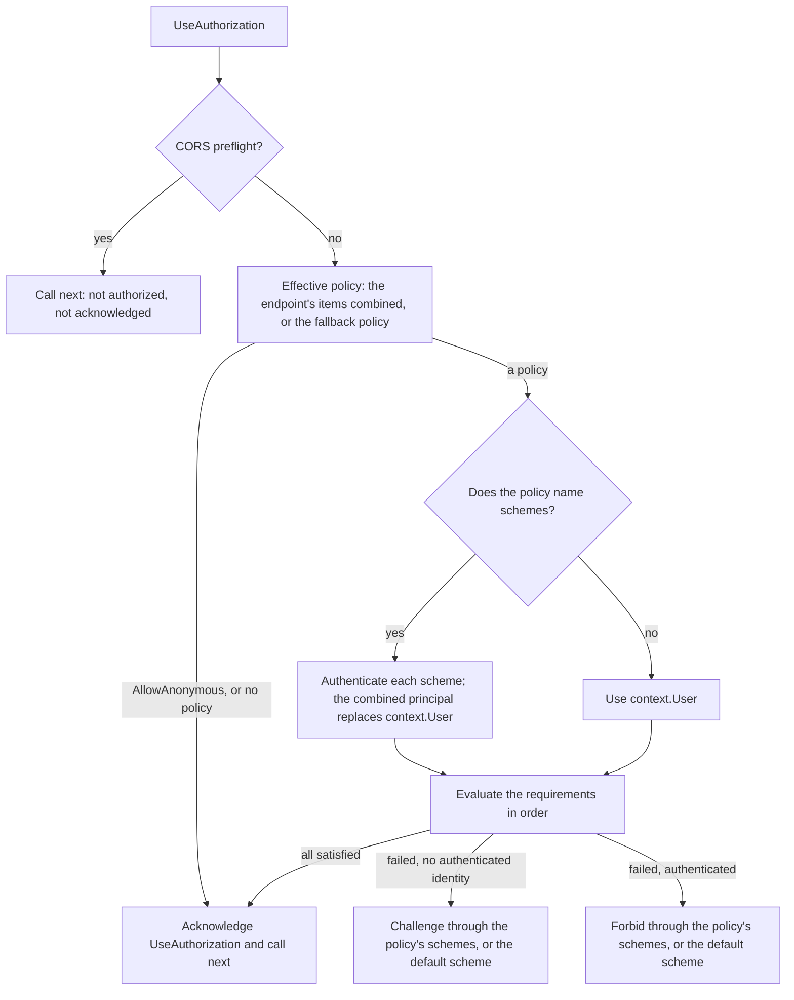

# Assimalign.Cohesion.Web.Authorization design

This page describes the boundaries and implementation shape of `Assimalign.Cohesion.Web.Authorization`.

> **Status:** Partial.

## Design intent

Authorization answers one question per request: may the principal this request authenticated as
reach the endpoint it matched? The package supplies the policy model, the endpoint metadata that
attaches policies to routes and groups, and the `UseAuthorization` middleware that evaluates them
between `UseRouting` and the endpoint, on the endpoint-aware pipeline Stage 6 delivered (#1054,
#1055). It never authenticates on its own account and never writes a failure response: the
authentication schemes of `Web.Authentication` establish the principal and answer a failure.

The package owns one interface (`IAuthorizationRequirement`), one sealed policy and its builder, one
evaluation context, one options type, one sealed metadata carrier, and two extension containers
(`AddAuthorization`/`UseAuthorization` with the `TryGetAuthorizationOptions` read accessor, and the
endpoint verbs). Request-time work is a cached policy lookup, a requirement loop, and, for a policy
that names schemes, one authentication per scheme.

## The claim model: `ClaimsPrincipal`

Authorization evaluates over the BCL `ClaimsPrincipal`. `Web.Authentication` already authenticates
onto it by a recorded decision (its DESIGN, "The scheme model"), and every requirement here reads
`AuthorizationContext.User`. IdentityModel makes its canonical claims the authorization input and
leaves an authorization model to #828, which is still open. The owner decided on 2026-09-30
(`docs/programs/HTTP_WEB_PROGRAM_PLAN.md` §7.4, decision 1) that Web authorization evaluates over
`ClaimsPrincipal` now, and that #828 later contributes an adapter rather than being a prerequisite;
see "The IdentityModel adapter" below.

## The policy model

### Requirements evaluate themselves

An `AuthorizationPolicy` is a list of `IAuthorizationRequirement`s, and a request is authorized when
every one is satisfied. A requirement evaluates itself:
`ValueTask<bool> EvaluateAsync(AuthorizationContext, CancellationToken)`.

ASP.NET Core splits a requirement (data) from its handler (logic) and resolves handlers from the
service container by type. That split exists so handlers can take injected services, and it costs a
container, a type-keyed registry, and activation. A Web feature library may not take a container
(the area's DI-free rule), and NativeAOT rules out discovery by type. So the requirement is the
logic: the policy holds it by reference and calls it, nothing is discovered or activated, and a
requirement that needs a collaborator closes over it at builder time. The built-in requirements are
internal and created through `AuthorizationPolicyBuilder`:

| Builder member | Satisfied when |
| --- | --- |
| `RequireAuthenticatedUser()` | any identity of the principal is authenticated |
| `RequireRole(roles)` | `ClaimsPrincipal.IsInRole` is true for any of the roles (each identity's own role claim type applies) |
| `RequireClaim(type)` | the principal carries a claim of the type, any value |
| `RequireClaim(type, values)` | the principal carries a claim of the type with one of the values (type ordinal-ignore-case, value ordinal, as `ClaimsPrincipal.HasClaim`) |
| `RequireAssertion(context => bool)` | the delegate returns `true` |
| `RequireAssertion((context, cancellationToken) => ValueTask<bool>)` | the asynchronous delegate returns `true` |
| `AddRequirements(requirement)` | a custom `IAuthorizationRequirement` is satisfied |

Requirements are evaluated in order and evaluation stops at the first unsatisfied one, so an
expensive asynchronous assertion belongs last. The loop has a synchronous fast path: the built-in
requirements complete synchronously, and the policy enters an `async` state machine only at the
first requirement that does not. `AuthorizationContext` carries the principal and the exchange, so a
delegate can decide over route values or headers as well as claims.

### Policies are immutable values, and none is empty

A policy is sealed and immutable: its requirement and scheme lists are read-only copies, and it is
shared by every request it governs. The builder snapshots on each `Build()`. Three inputs that would
otherwise widen access fail at registration instead:

- **A policy with no requirement.** It would authorize every request, so `Build()` throws
  `InvalidOperationException` and the constructor throws `ArgumentException`. Selecting schemes is
  therefore never enough on its own:
  `AddAuthenticationSchemes("Bearer").RequireAuthenticatedUser()`.
- **`RequireRole()` with no role** throws `ArgumentException`.
- **`RequireClaim(type, values)` with an empty list** throws `ArgumentException`. A computed list
  that came back empty must not quietly mean "any value"; accepting any value is the explicit
  `RequireClaim(type)`.

### Options

`AuthorizationOptions` holds three things:

- **`DefaultPolicy`** (an authenticated user): what an authorization item that names no policy and
  no roles requires, as `RequireAuthorization()` with no arguments does.
- **`FallbackPolicy`** (`null`): what a request without authorization metadata requires; see "The
  fallback policy's reach".
- **Named policies** (`AddPolicy`): names compare ordinal, as the sibling rate-limiting policy map
  does, and a duplicate name throws. A mistyped name fails the request instead of resolving to a
  different policy.

The options become read-only when the `AddAuthorization` callback returns; every mutator then throws
`InvalidOperationException`. That is what makes it safe to cache each endpoint's effective policy
and to read the options from concurrent requests without locks.

### Registration

`builder.Services.AddAuthorization(options => ...)` captures the options as a typed application
feature, an `IHttpFeature` singleton, the only channel between the builder and the pipeline. The
verb is a component integration over `AuthorizationComponents.CreateFeature` that the application's
compilation receives, so the package takes no dependency-injection reference. `UseAuthorization`
uses the context-aware `Use` overload to read the options once, through
`TryGetAuthorizationOptions`, when the pipeline is composed: a missing `AddAuthorization` fails
application start rather than a request, and nothing is looked up per request. A second
`AddAuthorization` replaces the first, matching the per-request feature slot.

### Reading the options back

A component that describes the application's endpoints rather than serving them, such as
Web.OpenApi's document generator, has to know what `UseAuthorization` will enforce on each endpoint,
or its description goes wrong in the direction that matters: an endpoint protected only by the
fallback policy described as open (#1205). Three public members answer that, and none of them can
change what is enforced:

| Member | Answers |
| --- | --- |
| `TryGetAuthorizationOptions(out options)` on `IWebApplicationContext` | The options `AddAuthorization` registered, resolved the way `UseAuthorization` resolves them (the last registration wins); `false` without `AddAuthorization` |
| `AuthorizationOptions.TryGetPolicy(name, out policy)` | A named policy, with its requirements and its `AuthenticationSchemes` |
| `AuthorizationOptions.GetEffectivePolicy(metadata)` | The policy the middleware applies to an endpoint: its items combined (see "Combination rules"), the fallback policy when it has none, or `null` when the middleware authorizes it without evaluation |

`DefaultPolicy` and `FallbackPolicy` were readable already. The accessor hands out the registered,
read-only instance: every mutator throws `InvalidOperationException`, so a reader cannot change the
policies the middleware evaluates, and concurrent reads need no lock.

`GetEffectivePolicy` is the middleware's combination, moved onto the options it reads; the
middleware keeps only its per-endpoint cache. A describer therefore runs the same code as the
enforcement and cannot drift from it: a change to the combination rules lands in both at once. An
unregistered policy name throws from it, which the middleware turns into a failed request and a
describer into a failed description.

*Rejected: `InternalsVisibleTo` for the describer.* The repository forbids grants between shipped
libraries, and a grant would hide which internals the describer depends on.

*Rejected: a public `AuthorizationFeature`.* The feature is the registration channel. Making it
public and constructible would let any component register options that bypass `AddAuthorization`'s
read-only snapshot, and it would publish the transport rather than the data.

*Rejected: a read-only interface over the options.* It would add a type whose only job is to hide
setters that already throw on the registered instance, and a name such as
`IAuthorizationPolicyProvider` suggests ASP.NET Core's dynamic, request-time policy provider, which is
a non-goal here.

*Rejected: every describer re-deriving the combination.* Web.OpenApi first mirrored the
`AllowAnonymous` rule itself. A second copy of a security rule drifts from the first, and the copy
could not see the default, fallback or named policies at all, which is how the fallback-protected
endpoint came to be documented as open.

## Endpoint metadata

### One sealed carrier

`AuthorizationMetadata` is the metadata contract, a sealed immutable carrier like the rest of the
routing metadata family (there is no `IAuthorizationMetadata`). One item can name a registered
policy (`PolicyName`), carry an inline `Policy`, list `Roles`, and list `AuthenticationSchemes`. An
item that names no policy and no roles requires the default policy.
`AuthorizationMetadata.AllowAnonymous` is the allow-anonymous marker. The verbs build items:

| Verb | Item |
| --- | --- |
| `RequireAuthorization()` | `new AuthorizationMetadata()`: the default policy |
| `RequireAuthorization("admins")` | `new AuthorizationMetadata("admins")` |
| `RequireAuthorization(policy)` | `new AuthorizationMetadata(policy)` |
| `RequireAuthorization(policy => ...)` | an inline policy, built when the verb is called |
| `AllowAnonymous()` | `AuthorizationMetadata.AllowAnonymous` |

The verbs are generic over routing's `IRouterConventionBuilder`, so each serves a mapped route and a
route group and returns the receiver's own builder type.

### Combination rules

The middleware reads every authorization item on the endpoint, outer group first
(`GetOrderedMetadata`), not only the last one.

| Endpoint metadata | Effective authorization |
| --- | --- |
| none | the fallback policy; none by default |
| `RequireAuthorization()` | the default policy |
| `RequireAuthorization("admins")` | the `admins` policy |
| an item with `Roles` | the role requirement (the default policy is not added) |
| group `RequireAuthorization(employee)`, route `RequireAuthorization("admins")` | both: the request must satisfy each |
| items that name schemes | their union, in order |
| route `AllowAnonymous()` inside a protected group | no authorization at all; the fallback policy does not apply |
| group `AllowAnonymous()`, route `RequireAuthorization("admins")` | the `admins` policy: a requirement declared after `AllowAnonymous` still applies |
| outer group requirement, nested group `AllowAnonymous()`, route requirement | the route's requirement only: `AllowAnonymous` cleared the outer group's |
| `RequireAuthorization().AllowAnonymous()` on one builder | no authorization: on one builder the later call wins |

**Why items combine.** Rate limits, timeouts and caching are settings, and there the most specific
item replaces the broader one. Authorization items are constraints. A route that adds
`RequireAuthorization("admins")` inside a group that requires employees is a refinement, and
last-wins would silently drop the group's constraint, turning the refinement into a hole. ASP.NET
Core combines the same way.

**Why the most specific `AllowAnonymous` wins (owner decision, 2026-10-01).** The middleware
combines the items that follow the last `AllowAnonymous`: an `AllowAnonymous` clears every
requirement declared before it, in the groups above it or earlier on its own builder, and a
requirement declared after it still applies. When the last item is `AllowAnonymous`, nothing
applies. Two reasons:

- **It fails closed.** A route that declares `RequireAuthorization("admins")` inside a public group
  is protected. Under the rejected rule it ran anonymously, and nothing in the route's own code said
  so.
- **It matches the dispatch check.** Routing decides whether an endpoint needs `UseAuthorization`
  from its last authorization item (next section). With this rule the same item decides whether the
  endpoint is authorized, so the two never disagree.

The rejected alternative was ASP.NET Core's rule: `AllowAnonymous` anywhere on the endpoint wins. It
is the simpler sentence to audit, but its one open-ended case, a group's `AllowAnonymous` silently
overriding a route's requirement, opens a route its author protected. The cost of this rule is one
difference from ASP.NET Core that an application ported from it must check: a requirement on a route
inside an `AllowAnonymous` group now applies.

### Fail closed: one runtime type

`AuthorizationMetadata` implements routing's `IRouteMiddlewareMetadata`: a requirement names
`UseAuthorization` as its `RequiredMiddleware`, and `AllowAnonymous` names none. When the endpoint
is dispatched, routing fails the request with `InvalidOperationException` if an item names a
middleware that never acknowledged the request, so a missing `UseAuthorization`, or one registered
ahead of `UseRouting`, cannot let a protected endpoint run.

Routing checks only the last item of each runtime type, the same last-wins read most consumers use.
That is why the allow-anonymous marker is an instance of `AuthorizationMetadata` rather than a type
of its own:

| Metadata (outer first) | Endpoint | Without `UseAuthorization` |
| --- | --- | --- |
| route requirement | protected | fails at dispatch |
| group requirement, route `AllowAnonymous` | anonymous | runs: the last item requires nothing |
| group `AllowAnonymous`, route requirement | protected | fails at dispatch: the last item names `UseAuthorization` |

The last item decides both columns, which is what the most-specific rule buys (see "Combination
rules"). The rejected alternative, a separate `AllowAnonymousMetadata` type, gets the second row
wrong: the group's requirement would stay the last item of its type, and every route that opts out
of its group's requirement would fail at dispatch in an application without `UseAuthorization`.

The middleware acknowledges every non-preflight endpoint it processes, with or without a policy, so
the check passes whenever the middleware ran.

The fallback policy has no such guard. It governs requests without authorization metadata, which
gives routing nothing to check, so an application that sets a fallback policy and never registers
`UseAuthorization` runs its unannotated endpoints unauthorized. `AddAuthorization` cannot see the
pipeline it would need to inspect; registering the middleware remains the application's job, as in
ASP.NET Core.

## The evaluation flow

The middleware runs once per request, after `UseRouting` has published the endpoint:

After an acknowledgement, the pipeline terminal runs the endpoint. After a challenge or a forbid,
the middleware returns without calling `next`, so the endpoint never runs.

### Scheme selection

Per-endpoint scheme selection moved here from #154. When the effective policy names schemes, the
middleware authenticates the request with each of them through `context.AuthenticateAsync(scheme)`,
combines the principals that succeeded in scheme order (the first scheme's identity becomes the
primary identity), and evaluates that principal. With no success the principal is anonymous.

The combined principal also replaces `context.User`, as ASP.NET Core does, so the endpoint runs as
the principal it was authorized as. That is the security point of selecting schemes: a cookie the
default scheme accepted must not count on, or leak into, a Bearer-only API endpoint, where it would
be a cross-site request forgery vector. A policy that names no schemes evaluates `context.User` as
`UseAuthentication` established it from the default authenticate scheme.

### Challenge or forbid

A failed policy is answered by RFC 9110's split: a request without an authenticated identity is
challenged (§15.5.2, `401`), and an authenticated one the policy rejects is forbidden (§15.5.4,
`403`). "Authenticated" means the evaluated principal has at least one authenticated identity. The
middleware calls `context.ChallengeAsync`/`context.ForbidAsync` for each of the policy's schemes in
order, or once with the default challenge or forbid scheme when the policy names none. The handlers
write the response: JWT Bearer answers `401` with a `WWW-Authenticate` challenge and `403` with
`insufficient_scope` (RFC 6750 §3.1); Cookie redirects a browser endpoint to its login or
access-denied page and answers an endpoint marked `IApiEndpointMetadata` with a bare `401` or `403`.
When several schemes answer, each writes in turn; a handler that sets a header outright (Bearer's
`WWW-Authenticate`) leaves the last value.

A failure is a response, not an exception, so no exception boundary can turn it into a `500`. A
missing authentication registration is the exception: with no `AddAuthentication`, or no default
challenge scheme for a policy that names none, `Web.Authentication` throws
`InvalidOperationException`, and the request fails closed.

### The fallback policy's reach

The fallback policy applies to every request that reaches `UseAuthorization` without authorization
metadata: an endpoint that declares none, a request no route matched, and a `405`. An anonymous
caller of an application with a fallback policy is therefore challenged on an unknown path instead
of learning that it does not exist, which is ASP.NET Core's behavior too. It also covers middleware
registered after `UseAuthorization` that answers requests without an endpoint: a terminal `Run`, a
branch, or `Web.Health`'s `MapHealthChecks`, whose probes would then need credentials. It cannot
cover anything registered ahead of `UseAuthorization`, which is where middleware that must stay
public belongs.

### CORS preflight

Routing publishes the candidate endpoint of a CORS preflight with `IsPreflight` set, and the
candidate never runs for the preflight. The middleware skips such a request entirely: it does not
evaluate the endpoint's policy or the fallback policy, does not challenge (a browser sends a
preflight without credentials), and does not acknowledge the candidate. When no CORS middleware
answers the preflight, the terminal answers it as the plain `OPTIONS` request it is.

### `AllowAnonymous` and the principal

An anonymous endpoint skips evaluation entirely, including the authentication of any schemes its
group's items name, so `context.User` is what `UseAuthentication` established. ASP.NET Core
authenticates those schemes anyway to populate the user; skipping them keeps an anonymous endpoint
free of scheme work and its principal predictable.

## Ordering

`UseForwardedHeaders` → `UseAuthentication` → `UseRouting` → `UseCors` → `UseAuthorization` →
`UseRequestTimeouts` → `UseRateLimiting` → `UseOutputCache` → endpoint. The area's
[middleware order](../../../../web/middleware-order.md) places the rest.

- **After `UseRouting`**, so the endpoint and its metadata are known. Ahead of it, the middleware
  sees no endpoint (only the fallback policy applies) and a protected endpoint fails at dispatch.
- **After `UseAuthentication`**, so `context.User` is established for policies that name no schemes.
  Ahead of it, every such policy sees an anonymous user and challenges, which fails closed.
- **Ahead of `UseOutputCache`**, so an unauthorized request is never served from the cache.
- **After CORS**, which answers preflights; authorization skips them regardless.

## Caching and lifetime

The effective policy of an endpoint is computed on its first request (by
`AuthorizationOptions.GetEffectivePolicy`) and cached in a `ConditionalWeakTable` keyed by the
endpoint's metadata collection, one stable instance per route.
Endpoint metadata is fixed once the route table is built and the options are read-only, so the
result cannot go stale; weak keys keep the cache from holding a route alive. An unregistered policy
name throws and is not cached, so every request to that endpoint fails, not only the first.
Policies, requirements and the middleware live for the application lifetime; nothing is created per
request except the evaluation context and, for a policy with several succeeding schemes, the
combined principal.

## Error model

The package has no exception root. Every failure is a misconfiguration surfaced as the BCL exception
a caller expects, at the earliest point it can be detected; an authorization failure is a response.

| Failure | Detected | Surface |
| --- | --- | --- |
| Invalid builder input (no requirement, an empty role or allowed-value list, a blank name) | at registration | `ArgumentException`, `ArgumentNullException`, `InvalidOperationException` |
| Options changed after `AddAuthorization` | at registration | `InvalidOperationException` |
| `UseAuthorization` without `AddAuthorization` | when the pipeline is composed, at start | `InvalidOperationException` |
| A protected endpoint `UseAuthorization` never processed | at dispatch | `InvalidOperationException` from routing |
| An unregistered policy name | on each request to the endpoint, and wherever `GetEffectivePolicy` resolves it (a describer such as Web.OpenApi) | `InvalidOperationException` |
| No authentication registered, an unregistered scheme, or no default challenge or forbid scheme | on a request that needs it | `InvalidOperationException` from `Web.Authentication` |

## The IdentityModel adapter (#828, future work)

IdentityModel treats its canonical claims (`IIdentityClaimCollection`, with protocol provenance) as
the authorization input and keeps an authorization model out of its own scope (its DESIGN,
"Non-goals"). #828 adds that model: roles, permissions and entitlements, plus a policy-evaluation
contract over canonical claims. By owner decision 1 it is not a prerequisite here; it contributes an
adapter later. The seams for that adapter already exist:

- **A requirement.** An `IAuthorizationRequirement` that projects `AuthorizationContext.User` onto
  canonical claims and delegates to the #828 contract, added through `AddRequirements` or a
  `Require...` verb grafted onto `AuthorizationPolicyBuilder` with a C# 14 `extension(...)` block,
  the way the Cookie and Bearer packages graft their verbs onto `AuthenticationBuilder`.
- **Or a translation.** A builder-time translation of #828 policies into `AuthorizationPolicy`
  values, registered with `AddPolicy`.

The adapter does not live in this package: Web.Authorization takes no IdentityModel dependency.
Today the two claim models meet only in the Bearer handler's mapper, which projects a validated
token onto a `ClaimsPrincipal`; an adapter that needs canonical provenance may need the mapper to
carry it.

## AOT posture

No reflection, no attribute discovery, no type activation, no runtime code generation. Requirements
are objects and delegates captured at builder time; endpoint metadata is read with `is`-test scans.
LINQ's `OfType` runs when the options are read from the application context: once when the pipeline
is composed, and once per read by a describer. The package is `IsAotCompatible`, and the trim and
AOT analyzers run on its build.

## Non-goals

- **An injectable authorization service.** A policy evaluates itself:
  `policy.EvaluateAsync(new AuthorizationContext(context, context.User))` covers an imperative check
  in a handler, such as one over a loaded resource, without a service locator.
- **A failure-response hook.** The response belongs to the authentication scheme (ASP.NET Core's
  `IAuthorizationMiddlewareResultHandler` has no counterpart). A custom answer is a custom
  `IAuthenticationHandler` today.
- **Dynamic policy providers** that resolve policy names from a store at request time.
- **Attribute-based authorization** (`[Authorize]` on handlers). Under NativeAOT that needs the Web
  source generator to translate attributes into `AuthorizationMetadata`, the routing carriers'
  precedent; it is not part of this slice.
- **Permission and entitlement models.** They are #828's.

## Testing

`tests/AuthorizationPolicyTests.cs` covers the policy model directly: each built-in requirement,
synchronous and asynchronous assertions, custom requirements, in-order evaluation that stops at the
first failure (including after an asynchronous requirement), and the builder's validation and
immutability. `tests/AuthorizationOptionsTests.cs` covers the defaults, named policies and their
ordinal lookup, registration, the read-only snapshot, and reading it back from the application
context (a stub context and the hosted one, without `AddAuthorization`, and with two
registrations); `tests/AuthorizationMetadataTests.cs` covers the carrier, including that the
allow-anonymous marker shares the requirement's runtime type.
`tests/AuthorizationEffectivePolicyTests.cs` reads `GetEffectivePolicy` directly, as a describer
does: the fallback policy, named and default policies with their schemes, group and route items
combined in order, `AllowAnonymous` in both positions, and an unregistered name, applying or
cleared.

`tests/AuthorizationEndToEndTests.cs` drives the real pipeline over `WebApplicationTestFactory` with
two header-driven test schemes (`tests/TestObjects/TestAuthenticationHandler.cs`): challenge and
forbid, role, claim and delegate requirements, the default, named and fallback policies (including
unmatched requests and `405`s), `AllowAnonymous` on routes and groups and the most specific one
winning (nested groups, call order on one builder), group-and-route combination, per-endpoint scheme
selection and the combined principal, challenges and forbids through every scheme a policy names,
`UseAuthorization` missing or registered ahead of `UseRouting`, a route that opts out of its group's
requirement without the middleware and a protected route in an anonymous group without it, CORS
preflights, an unregistered policy name, and a missing `AddAuthorization`.
`tests/AuthorizationChallengeTests.cs` repeats the challenge and forbid paths through the shipped
handlers: JWT Bearer `401`/`403 insufficient_scope`, Cookie redirects for a browser endpoint and a
bare `401` for an API endpoint, and a Bearer-only endpoint that ignores the cookie the default
scheme accepted.

## Declared dependencies

| Reference | Kind |
|---|---|
| `Assimalign.Cohesion.Http` | `CohesionProjectReference` |
| `Assimalign.Cohesion.Web` | `CohesionProjectReference` |
| `Assimalign.Cohesion.Web.Authentication` | `CohesionProjectReference` |
| `Assimalign.Cohesion.Web.Routing` | `CohesionProjectReference` |

[Assembly overview](index.md) · [Examples](examples/index.md)

## Sources

- **Primary source** — `cohesion/resources/Web/Assimalign.Cohesion.Web.Authorization/docs/DESIGN.md`.
- **Source** — `cohesion/resources/Web/Assimalign.Cohesion.Web.Authorization/src/Assimalign.Cohesion.Web.Authorization.csproj`.
