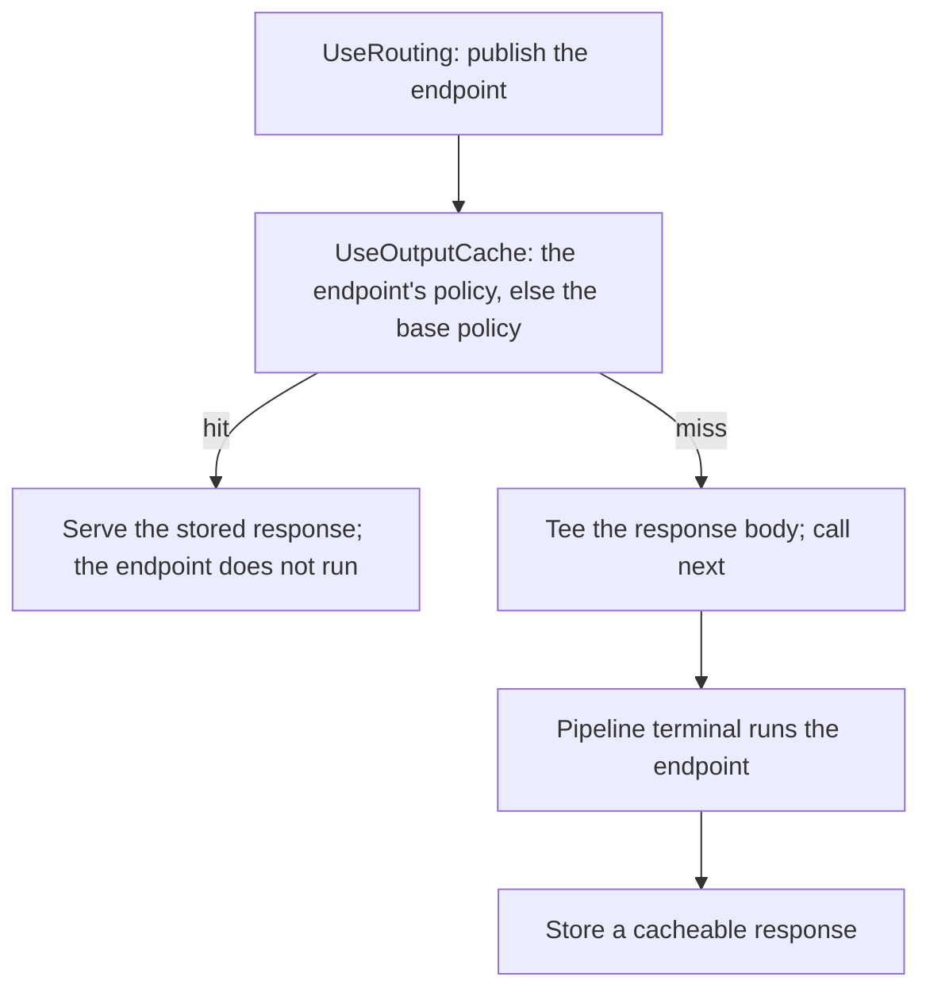

# Assimalign.Cohesion.Web.Caching design

This page describes the boundaries and implementation shape of `Assimalign.Cohesion.Web.Caching`.

> **Status:** Partial.

Server-owned output caching for the Cohesion Web pipeline. This document records the reasoning
behind the middleware's shape so a future reader does not re-derive it from the code.

## Design intent

Cohesion already owns a cache foundation (`Assimalign.Cohesion.Caching` + `.InMemory`, with size
limits, priorities, and token invalidation) and the RFC 9111 typed primitives (`HttpCacheControl`,
`HttpFreshness`, the method safety/cacheability traits) from #755. Output caching is therefore a
thin **middleware + policy** layer over those, not a storage stack: it decides *whether* to store or
serve and *how the key is built*, and delegates *storage* to an async, tag-aware store seam whose
default adapts the synchronous `MemoryCache`.

The package is a dependency-free feature library composed against the Web root. It never references
`Web.Hosting` (the resource hosting-isolation rule, `COHRES001`); options and the store are
captured at builder time and no request-time service location occurs.

## Endpoint resolution — the published endpoint (why-this-not-that)

Per-endpoint policy lives in a sealed `OutputCacheMetadata` carrier on the route, resolved last-wins
with `IRouterRouteMetadataCollection.GetMetadata<OutputCacheMetadata>()` — the same
endpoint-metadata seam `Web.RateLimiting` and `Web.RequestTimeouts` read.

`UseRouting` selects the endpoint, publishes it as an `IRouteMatchFeature` and calls `next`; the
pipeline's terminal runs it (#1054). Registered after `UseRouting`, the middleware reads the
published match (`context.GetRouteMatch()`) for the endpoint's metadata and route values, decides,
and on a hit answers without calling `next`, so the endpoint never runs. On a miss it tees the
response body and calls `next`, the terminal runs the endpoint, and a cacheable result is stored. It
never runs the matcher itself; with no published endpoint (no route matched, or routing not
registered) the base policy alone governs. A CORS preflight's candidate endpoint is ignored, though
a preflight is an `OPTIONS` request, which the method gate passes through before the endpoint is
read.

Before #1054 the router matched **and** dispatched in one step, so there was no pipeline slot
between "matched" and "handler runs" for an **async** concern that must **skip the handler on a
hit**; the feature-collection seam `Web.RateLimiting` used then was synchronous, and a store lookup
is not. The middleware therefore ran ahead of `UseRouting` and performed the router's own
side-effect-free `IRouter.Match(context)` itself, reached through the per-application
`IRouterFeature` — a second match per cacheable request. Splitting match from dispatch removed the
need for it: routing matches once and every consumer reads the result.

### Registered ahead of `UseRouting`

The middleware then decides before any endpoint is known: the base policy governs, and endpoint
metadata cannot opt anything in. Output caching is optional behavior, so `OutputCacheMetadata` does
not implement `IRouteMiddlewareMetadata` (the fail-closed check rate limits and timeouts use): an
endpoint dispatched without the middleware simply is not cached, which loses nothing a caller relies
on.

Ignoring the metadata would not be safe in one case, though: under a **base policy**, an endpoint
marked **`Disabled`** (per-user data, say) would be cached anyway. So when no endpoint was published
as the middleware decided and routing has published one carrying `OutputCacheMetadata` by the time
`next` returns, the response is **not stored**. That metadata may disable caching, or name a policy
whose keys, tags or duration differ from those the entry would be stored under; not storing is the
only answer that is right for all of them. Lookups still happen, but nothing is ever stored under a
key such an endpoint maps to, so no hit can serve one. An endpoint's opt-out is therefore honored in
either position; opting in requires `UseOutputCache` after `UseRouting`.

## Policy model

- **`OutputCachePolicy`** — freshness `Duration` (the time-to-live), the `VaryBy*` key dimensions,
  `CacheAuthenticated`, `HonorResponseCacheControl`, an optional per-policy `MaximumBodySize`, and `Tags`.
- **`OutputCacheOptions`** — the `BasePolicy`, a named-policy registry (`AddPolicy`, ordinal names, mirroring
  `RateLimitingOptions`), the middleware-wide `MaximumBodySize` and store `SizeLimit`, and the `TimeProvider`.
- **`OutputCacheMetadata`** — the sealed per-endpoint carrier: a named policy, an inline policy,
  `Enabled` (opt in under the base/default policy), or `Disabled` (opt out).
- **Convention verbs (#1055)** — `CacheOutput()`, `CacheOutput(name)`, `CacheOutput(policy)` and
  `DisableOutputCache()` append those four shapes. They are generic extension members over routing's
  `IRouterConventionBuilder`, so one verb serves a mapped route and a route group; routing composes the
  metadata when the route table is built, outer group first, which the last-wins resolution below relies
  on.

**Resolution** (in the middleware): a matched endpoint's metadata wins last-wins over the base
policy — inline policy → named policy → `Enabled` (base/default) → `Disabled` (no caching). With no
metadata the `BasePolicy` governs; with neither a base policy nor endpoint metadata the request is
not cached (**opt-in mode**). A `null` or disabled resolved policy is a clean passthrough.

## Cache key — primary key plus a Vary variant

The **primary key** is built before the endpoint runs from the request method, the effective scheme
and host (below), and the path, plus the policy's `VaryBy*` rules: `VaryByHeaders` (request-header
values), `VaryByRouteValues` (the route values of the published endpoint), and `VaryByQueryKeys`
(empty folds the *entire*, sorted query string; non-empty selects listed keys). Components are
fenced with the ASCII unit separator so boundaries are unambiguous without hashing; a distributed
adapter may hash the string.

The **variant key** folds in the stored response's own `Vary` header (see below).

### Scheme and host are the effective values (#1050)

The scheme and host components are `context.EffectiveScheme` and `context.EffectiveHost` from
`Assimalign.Cohesion.Http.Forwarded` — what a trusted proxy forwarded when `UseForwardedHeaders` ran
first, otherwise the wire values (owner decision 3 in `docs/programs/HTTP_WEB_PROGRAM_PLAN.md` §7.4:
consumers read the effective values; nothing rewrites the request). The rest of the pipeline builds
responses from those values: HTTPS redirection and HSTS judge the effective scheme, redirects and
absolute links use the effective host, and host-bound content follows the host the client addressed.
Keyed on the wire values behind a TLS-terminating, host-rewriting proxy, every client-facing scheme
and host would collapse onto one wire scheme and upstream authority, so one could be served
another's stored response — for example a representation meant for `https://tenant-a.example`
replayed to `tenant-b.example`, or a response cached for an `https` request replayed to a plaintext
one that HTTPS redirection would otherwise have upgraded. That is the unkeyed-input shape of web
cache poisoning, so the key follows the effective values.

The package never reads forwarding headers: without the forwarded-headers middleware (or from a peer
outside its trust model) the effective values are the wire values and the key is unchanged from
before, so a client-asserted `X-Forwarded-Host` neither splits nor poisons the cache.

## THE VARY DECISION — honor the response `Vary` header (RFC-faithful), with ordering

This branch also ships `Web.Compression` (response varies by `Accept-Encoding`) and #149 content
negotiation (varies by `Accept`); both **stamp the response's own `Vary` header** and append to any
existing one. The output cache therefore chooses option **(a) — automatically honor the response's
own `Vary` header in the cache key (RFC 9111 §4.1)** — rather than ASP.NET-style policy-only
`VaryBy*`.

Why (a) and not (b): policy-only varying is fragile — if the operator forgets to declare
`VaryByHeader("Accept-Encoding")` while compression is active, a `br` variant and a `gzip` client
collide on one key and the cache serves brotli to a client that cannot decode it. Reading the
response's actual `Vary` makes that **impossible by construction**, regardless of policy
configuration, and composes exactly with what compression/negotiation already emit. Policy `VaryBy*`
still exists as an **additive** refinement on the primary key.

### How it is stored and looked up (the marker indirection)

The response `Vary` is not known until the endpoint has run, so a first lookup cannot compute the
variant key. The store therefore holds two entry shapes under one primary key:

- **No `Vary`** → the representation is stored **directly** under the primary key (one-lookup hit path).
- **`Vary` present** → a lightweight **vary marker** (`Body == null`, carrying the `Vary` field-names) is
  stored under the primary key, and the representation under `primaryKey + variant-suffix`, where the
  suffix is the current request's values of those field-names.

A lookup reads the primary key; a direct representation is served immediately, a marker drives a
second read of the variant the current request maps to. A **`Vary: *`** response is treated as
uncacheable and not stored. If a later response for the same primary key carries a *different*
`Vary`, it overwrites the marker; older variants become unreachable and expire by time-to-live —
conservative (worst case a miss, never a wrong-variant serve).

### Ordering (load-bearing)

`UseRouting` → `UseOutputCache` → `UseResponseCompression` → … → endpoint.

Register `UseOutputCache` **after** `UseRouting` (see "Endpoint resolution" above) and **outside**
(before) `UseResponseCompression` and any content-negotiated write. The buffered tee then captures
the **fully-encoded** bytes, and the captured `Vary` already carries `Accept-Encoding`/`Accept`. On
a hit the compression/negotiation middleware (inner) never runs; the cache replays the stored
encoded bytes with their `Content-Encoding`, and because the variant key folds in the client's
`Accept-Encoding`, a `gzip`-only client computes a different key than the stored `br` variant and
misses rather than mis-decoding. Registering it *inside* compression would cache the pre-compression
bytes against a `Vary` compression is about to stamp — the mis-serve this design exists to prevent.
A test (`UseOutputCache_ResponseVary_ShouldNotServeForeignVariant`) proves the cross-client case
over a generic `Vary` header.

Both constraints together put compression after `UseRouting` in an application that uses output
caching. Before #1054 the cache itself sat ahead of `UseRouting`, so `UseOutputCache` →
`UseResponseCompression` → `UseRouting` satisfied everything. Compression needs nothing from
routing, but a middleware that answers requests ahead of `UseRouting` (static files, for example) is
then outside its reach; such responses rely on their own encoding (precompressed static assets) or
move behind compression too.

## Bypass matrix

**Request-side** (decided before the endpoint runs — the request is not served/stored):

| Condition | Behavior |
| --- | --- |
| Method not `GET`/`HEAD` | passthrough (no caching) |
| Request carries `Upgrade` (asks to switch protocols, RFC 9110 §7.8) | passthrough |
| No applicable/enabled policy | passthrough |
| Endpoint metadata `Disabled` | passthrough |
| Request `Cache-Control: no-store` or `no-cache` | passthrough (conservative) |
| `Authorization` header present, policy `CacheAuthenticated == false` | passthrough |

**Response-side** (decided after the endpoint runs — the response is not stored):

| Condition | Behavior |
| --- | --- |
| Status ≠ `200 OK` | not stored (conservative — see below) |
| Response `Set-Cookie` present, policy `CacheAuthenticated == false` | not stored |
| Response `Cache-Control: no-store` / `private` / `no-cache` (when `HonorResponseCacheControl`) | not stored |
| `Vary: *` | not stored |
| Body exceeds the per-entry cap | not stored (streamed through untouched) |
| Effective time-to-live ≤ 0 | not stored |
| `Entry` larger than the store's whole `SizeLimit` | declined by the store |

**Protocol switches are never cached.** A WebSocket handshake is a `GET` on HTTP/1.1 (an upgrade,
RFC 6455) and a `CONNECT` on HTTP/2 and HTTP/3 (an extended CONNECT, RFC 8441 and RFC 9220), and it
often shares its URL with a cacheable page. A `CONNECT` is excluded by method. A `GET` carrying an
`Upgrade` field is excluded before the lookup and before the buffering: answered from the cache, the
handshake would get the page's `200` instead of the `101` its endpoint gives, and the socket would
fail to open; stored, the exchange an endpoint took over would leave only the default status it never
set, an empty `200` that every later request for the URL would receive. The field alone decides:
HTTP/2 and HTTP/3 prohibit it, and an HTTP/1.1 request with an `Upgrade` but no `upgrade` connection
option, which a server may serve as an ordinary request, loses only its caching. The suites pin both
directions, the cache-first and the socket-first order, over HTTP/1.1 and (for the cache-first order)
HTTP/2.

**Why only `200`:** the conservative default caches exactly `200 OK`. Other 2xx (`204`/`206`) and
the "heuristically cacheable" statuses (`203`, `300`, `301`, `308`, `404`, `410`, …) are
deliberately excluded — they invite subtle correctness bugs (partial content, absent bodies,
negative caching) that a first output cache should not take on. Widening the set is an additive
future change.

**Authenticated responses** are never cached by default: an `Authorization` request or a
`Set-Cookie` response both bypass unless the policy sets `CacheAuthenticated`. That opt-in is
dangerous (it shares a per-user representation) and is intended only alongside a `VaryBy*` that
segments the key per principal — the caller owns that correctness. The opt-in covers the *response*,
never the cookie grant itself: `Set-Cookie` is in the non-cacheable header set unconditionally, so a
stored entry can never replay one client's cookie (say, a freshly minted session id) to another. A
hit therefore carries the shared body and headers but no `Set-Cookie`.

## Time-to-live and Age

The effective time-to-live is the policy `Duration`. When `HonorResponseCacheControl` is set
(default) and the response declares an explicit freshness lifetime
(`Cache-Control: s-maxage`/`max-age`, or `Expires` − `Date`, via `HttpFreshness.GetFreshnessLifetime` as a
**shared** cache), the smaller of the two wins — the origin may **shorten** but never **lengthen**
the policy cap; a `max-age=0` response is not stored. Client revalidation semantics (conditional
requests, `304`, `stale-while-revalidate`) are out of scope (they belong to #755's client story);
the cache serves only genuinely fresh entries and lets an entry lapse at its time-to-live.

On a hit the served `Age` is `now − CreatedAt` in whole seconds, computed on the same `TimeProvider`
the store expires against (they are threaded together so the clocks agree, and tests can drive a
manual clock).

## Store seam

`IOutputCacheStore` is the async, tag-aware seam: `GetAsync(key)`, `SetAsync(key, entry)`,
`EvictByTagAsync(tag)`. It layers **above** the synchronous `Assimalign.Cohesion.Caching`
foundation, per that library's DESIGN rule that distributed/async surfaces belong in the consumer.
Entries (`OutputCacheEntry`) are opaque to the store beyond their size, time-to-live, and tags — the
response framing (status, headers as `OutputCacheHeader` carriers, body bytes, vary marker) is the
middleware's concern, so any store that returns the exact entry round-trips a response losslessly.
The entry is a plain data object (value types, strings, one `byte[]`), so the in-memory store holds
it **with no serialization** (fully AOT-clean) and a distributed adapter can frame it without
reflection.

### Default in-memory store and size accounting

`InMemoryOutputCacheStore` (public, so an application can construct and hold it for tag eviction)
adapts `MemoryCache`:

- **Size accounting.** The store sets `MemoryCacheOptions.SizeLimit` and declares each entry's `Size`
  (`OutputCacheEntry.Size` = body bytes + captured header text + a floor). The foundation enforces the
  cumulative limit with its priority/LRU capacity eviction; an entry larger than the whole limit is
  declined and the store drops it silently rather than surfacing a fault to the request path. This is the
  **total** cap; the **per-entry** cap (`OutputCacheOptions.MaximumBodySize`) is enforced earlier by the
  buffering middleware.
- **Time-to-live.** Entries use absolute expiration (`AbsoluteExpirationRelativeToNow`), not a sliding
  window, so a response is served only while genuinely fresh.
- **`Tag` index.** A separate `tag → keys` index backs `EvictByTagAsync`; a post-eviction callback prunes a
  key from its tags on any eviction (expiry, capacity, replacement, removal), so the index self-cleans.
  Tags are re-indexed *after* the commit so a replacement's own replaced-eviction cannot un-index the new
  entry.

## Buffering — the tee, and the no-clobber discipline

On a miss the middleware replaces the settable `IHttpResponse.Body` with an
`OutputCacheBufferStream`: a **tee** that writes every byte **straight through** to the transport's
real body first (the client is always served) while capturing a copy up to the per-entry cap.
Crossing the cap **abandons the capture** — the buffer is released and writes continue to flow
through untouched, so an over-large response streams normally and is simply not cached. This mirrors
the `Web.Compression` `CompressionBodyStream` discipline: caching is a strictly additive side effect
that can never corrupt or withhold the response. The original body is always restored in a `finally`
, and storage runs only after the endpoint returns normally (an exception skips it).

## QUERY posture (RFC 10008 §2.7) — GET/HEAD only, QUERY a documented follow-up

The cacheable set is **`GET` and `HEAD` **. QUERY is deliberately excluded despite
`HttpMethod.Query.IsCacheable` and `CacheKeyIncludesContent` reporting `true`: RFC 10008 §2.7
requires the request **content** to be part of the cache key, and Cohesion exposes **no
request-content key seam** that is both available before dispatch and non-destructive.
`IHttpRequest.Body` is a forward-only stream on some transports (the shipped `Web.Query` validation
middleware itself never reads it, peeking only length metadata); reading and hashing it to key on
content would consume the body and break the endpoint. Rather than half-implement QUERY caching with
a transport-dependent, body-consuming key, it is a recorded follow-up: **when a buffered/rewindable
request body or a request content-digest seam lands, QUERY joins the cacheable set keyed by (target
+ content-digest)** — the `CacheKeyIncludesContent` trait is already the flag for that path.

## `Tag` eviction reachable from application code

Two routes, both over the same store:

- **The application constructs an** — `InMemoryOutputCacheStore` (or any `IOutputCacheStore`), passes it to the
  `UseOutputCache(store, …)` overload, and calls `store.EvictByTagAsync(tag)` directly.
- **A handler resolves `IOutputCacheFeature` from `context.Features` and calls its `EvictByTagAsync`** — a thin,
  stateless handle over the same store, installed on every exchange.

An `IChangeToken` bridge (mapping a tag to a foundation change token) was considered and **not
taken** — the explicit `EvictByTagAsync` surface is simpler and sufficient; a token bridge can layer
additively later.

## AOT posture

No reflection, no dynamic serialization, no runtime code generation. The stored entry is plain data
held directly by the in-memory store; keys are built with a `StringBuilder`; the endpoint is a typed
feature read from the exchange, and metadata resolution is the router's reflection-free `is`-test
seam. Registration is dependency-free — options and the store are captured at builder time.

## Non-goals

- **Distributed store backends.** This package ships the middleware over the store *seam* with the in-memory
  default; a distributed cache / key-value / database store is a follow-up adapter implementing
  `IOutputCacheStore` (the future Data Platform cache service, #57/#58/#60).
- **Client revalidation semantics.** Conditional requests, `304 Not Modified`, `stale-while-revalidate`, and
  `stale-if-error` are out of scope (tracked by #755's client story). The cache serves only fresh entries.
- **QUERY caching** until a request-content key seam exists (see the QUERY posture above).
- **Caching non-`200` statuses** by default (conservative; additive to widen).
- **Owning DI/config/logging.** Feature packages never take the hosting module (`COHRES001`); the store is
  supplied to `UseOutputCache`, not resolved from a container.

## Scope-creep candidates (recorded, not taken)

- **Distributed `IOutputCacheStore` adapters** over `Database.KeyValuePair` (has etag/CAS) or a
  `libraries/Cache` distributed contract when it matures.
- **An `IChangeToken` → tag bridge** for configuration-driven purges.
- **Widening the cacheable status set** (`301`/`308`/`404`/`410` negative caching, `206` range caching).
- **QUERY caching** once a buffered/rewindable request body or request content-digest seam lands.
- **Conditional-request generation** (emit `ETag`/`Last-Modified` and answer `If-None-Match` from cache)
  once the client-revalidation story from #755 is picked up.

## Testing

Unit tests cover the in-memory store (round-trip, miss, absolute time-to-live over a manual clock,
tag eviction and the re-tag safety, oversized decline), the key builder (query order-independence,
`VaryBy` partitioning, the response-`Vary` variant partition), and the middleware bypass matrix over
an in-memory context double (hit skips downstream + stamps `Age`,
authenticated/`Set-Cookie`/`no-store`/non-200/over-cap bypass, non-cacheable method, a WebSocket
handshake never served from the cache, a taken-over exchange never stored, an extended CONNECT
neither). `tests/OutputCacheWebSocketTests.cs` runs a cached page and a WebSocket echo on one URL end
to end (the test project references `Http.WebSockets`). Middleware tests also publish a fake route
match ahead of the middleware, as `UseRouting` does: the published
endpoint's metadata decides while the exchange's router feature throws on access (so a second match
would fail the test), a published `Disabled` bypasses the base policy, and published route values
partition `VaryByRouteValue`. End-to-end tests over `WebApplicationTestFactory` (in-memory HTTP/1.1)
prove a hit skips the endpoint (downstream-invocation counting), a differing query misses, the
response `Vary` keeps a client from a foreign variant, an authenticated request bypasses, tag
eviction forces a re-fetch, per-endpoint opt-in through the real router caches only the marked
endpoint, and, registered ahead of `UseRouting`, a `Disabled` endpoint is never stored while a plain
one still is.

`tests/OutputCacheForwardedTests.cs` covers the effective key with the real forwarded-headers
middleware (the test project references `Web.ForwardedHeaders`): end to end, behind the factory's
trusted local transport, each forwarded host and each forwarded scheme gets its own entry while
repeats still hit, and without the middleware a spoofed `X-Forwarded-Host` does not partition the
cache; at the unit level, keys built for plaintext requests from a trusted proxy address follow the
forwarded host rather than the wire host.

## Declared dependencies

| Reference | Kind |
|---|---|
| `Assimalign.Cohesion.Web` | `CohesionProjectReference` |
| `Assimalign.Cohesion.Web.Routing` | `CohesionProjectReference` |
| `Assimalign.Cohesion.Http` | `CohesionProjectReference` |
| `Assimalign.Cohesion.Http.Forwarded` | `CohesionProjectReference` |
| `Assimalign.Cohesion.Http.Streaming` | `CohesionProjectReference` |
| `Assimalign.Cohesion.Caching` | `CohesionProjectReference` |
| `Assimalign.Cohesion.Caching.InMemory` | `CohesionProjectReference` |

[Assembly overview](index.md) · [Examples](examples/index.md)

## Sources

- **Primary source** — `cohesion/resources/Web/Assimalign.Cohesion.Web.Caching/docs/DESIGN.md`.
- **Source** — `cohesion/resources/Web/Assimalign.Cohesion.Web.Caching/src/Assimalign.Cohesion.Web.Caching.csproj`.
