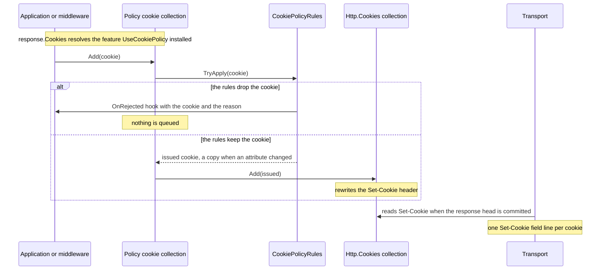

# Assimalign.Cohesion.Web.CookiePolicy design

This page describes the boundaries and implementation shape of `Assimalign.Cohesion.Web.CookiePolicy`.

> **Status:** Partial.

## Design intent

`Web.CookiePolicy` enforces a site's **cookie policy** on top of the wire-level cookie model in
`Assimalign.Cohesion.Http.Cookies`. The model answers *"is this cookie well-formed on the wire?"*;
this package answers *"is this well-formed cookie **allowed**, and if not, is it repaired or
dropped?"* Those decisions depend on deployment posture and on the user's consent, not on the RFC
grammar.

`UseCookiePolicy(...)` replaces the exchange's response cookie feature. From then on, every cookie
appended through `context.Response.Cookies` is judged before it reaches a `Set-Cookie` field:

- **consent** for non-essential cookies;
- the **floors**: `Secure`, `HttpOnly`, and a minimum `SameSite`;
- the **RFC 6265bis requirements** a user agent enforces by ignoring a cookie: the `__Host-` and
  `__Secure-` prefixes, and `SameSite=None` requiring `Secure`;
- the **400-day lifetime cap**, applied at emission.

A dropped cookie is reported to `CookiePolicyOptions.OnRejected`. The package is a DI-free feature
library: the options are validated and captured at registration, and nothing is resolved per
request.

## The model / policy split (RFC 6265 / 6265bis)

The split is documented on both sides (`Assimalign.Cohesion.Http.Cookies/docs/DESIGN.md`,
"Wire-safety hardening"). Wire-safety and well-formedness live in the model; site policy lives here.

| RFC 6265 / 6265bis rule | Owner | Rationale |
|---|---|---|
| `cookie-name` token / `cookie-value` octet-grammar validation (anti header-splitting) | **`Http.Cookies`** | A malformed value corrupts the wire regardless of policy. Enforced at `HttpCookie` construction. |
| Per-cookie size limits (name+value ≤ 4096, attribute value ≤ 1024, bounded attribute count) | **`Http.Cookies`** | Parse robustness; oversized input is ignored while parsing (`HttpCookieLimits`). |
| 400-day lifetime **cap math** (`HttpCookie.ClampLifetime`) | **`Http.Cookies`** | Pure and clock-free, so it is deterministic to test. |
| **Applying** the lifetime cap to outbound cookies at emission, against a clock | **`Web.CookiePolicy`** | Overriding an application's explicit lifetime, and reading the clock, is an emission decision. |
| `__Host-` / `__Secure-` **prefix requirements** | **`Web.CookiePolicy`** | Repair or reject is a site decision, not grammar. |
| `SameSite=None` **requires** `Secure` | **`Web.CookiePolicy`** | Repair or reject is configurable. |
| Nameless cookies (RFC 6265bis § 5.7 step 22) | **`Http.Cookies`** | `HttpCookie` rejects an empty name, so no nameless cookie can be emitted and the policy has nothing to enforce. |

## Interception: replace the response cookie feature, judge at append

### How a cookie reaches the wire

The transports serialize `response.Headers[Set-Cookie]`, one field line per value. They never look
at cookie types. The Http.Cookies default response feature keeps that header in sync with its
collection on every mutation (`HttpCookieCollection`'s one-way synchronization). A cookie is
therefore on its way to the wire the moment it is appended: a buffered response serializes the
header after the pipeline returns, and a streamed response commits it at the first body write.

### Why the policy acts when a cookie is appended

The policy has to act before the header is written, which means when the cookie is appended. Two
alternatives were rejected:

- **Rewrite `Set-Cookie` after `next` returns.** A streamed response has already committed its head
  by then. The rewrite would also have to parse `Set-Cookie` strings back into cookies, which loses
  `HttpCookieOptions.IsEssential`, because that flag never reaches the wire, and consent depends on
  it.
- **A transport hook at serialization.** No such seam exists. Adding one to `Http.Connections` would
  pull cookie policy into the protocol layer, which the model / policy split exists to prevent.

### The mechanism

`UseCookiePolicy` installs a replacement `IHttpResponseCookieFeature` whose collection runs each
`Add` through the rules and queues the result in an *inner* collection. The inner collection owns
storage and the header synchronization. The `response.Cookies` extension property resolves the
feature on every read, so every writer that reads `response.Cookies` when it writes goes through the
policy: `Web.Sessions`, `Web.Authentication.Cookie`, `Http.Antiforgery`, and application code.

The judged path, for one appended cookie:

Details that make the replacement hold:

- **The old feature's slot is removed first.** `IHttpFeatureCollection` is keyed by
  `IHttpFeature.Name`, and `Get<T>()` returns the first match. Setting a second, differently named
  `IHttpResponseCookieFeature` would leave the existing one in charge, and the policy would be
  silently bypassed. The middleware removes the existing feature's slot, then uses that feature's
  collection as inner storage. A richer feature installed earlier, such as a future signing feature,
  keeps working underneath the policy instead of being discarded.
- **Cookies queued before the policy took over are judged when it does,** in their original order.
  Those are cookies that middleware registered ahead of `UseCookiePolicy` queued on the way in, and
  `Set-Cookie` fields written straight to the headers before the collection was created; the new
  collection parses those, just as the default one would. The rule: the policy judges every cookie
  the collection holds.
- **The feature stays installed after `next` returns.** Cookies that earlier middleware appends on
  the way out are judged too, provided it reads `response.Cookies` when it appends. Middleware that
  grabs the collection before `next` and appends to that reference afterwards is the one bypass.
- **The inner collection is created lazily.** A response that never touches cookies allocates two
  small per-exchange features (the cookie feature and the consent feature) and nothing else.

### Copy-on-write, and `Remove` / `Contains` identity

The rules never mutate the `HttpCookie` they are given. A cookie whose attributes must change is
copied, the convention `HttpCookie.ClampLifetime` already follows. Mutating in place was rejected:
an application that reuses one `HttpCookie` instance across requests would carry one request's
decision into the next. For example, `Secure` added over HTTPS would leak onto a later plaintext
response, and concurrent requests would race on the shared options object.

Because the queued cookie may be a copy, the policy collection remembers which copy stands for which
appended instance (a reference-keyed map, populated only for rewritten cookies). `Remove(appended)`
and `Contains(appended)` work with the instance the application holds. A dropped cookie is not in
the collection: `Contains` returns `false` and `Remove` finds nothing. Enumeration shows the cookies
that will actually be sent.

## Rule order

`CookiePolicyRules.TryApply` is the single decision point. It applies the rules in this order:

1. **Consent.** A cookie that is neither essential (`HttpCookieOptions.IsEssential`) nor a deletion
   is dropped while the exchange needs consent and has none. This rule goes first because it is the
   cheapest rejection, and a dropped cookie needs no other work.
2. **The floors:** `Secure`, then `HttpOnly`, then the minimum `SameSite`. Each floor only adds
   protection.
3. **The RFC 6265bis requirements:** `SameSite=None` requires `Secure`, then the `__Host-` and
   `__Secure-` prefixes. They run after the floors so that a floor can satisfy them. Over HTTPS, the
   `Secure` floor makes a `__Host-` cookie with `Path=/` compliant even under `Reject`; a `SameSite`
   floor raised above `None` takes a cookie out of the pairing rule.
4. **The lifetime cap,** applied to the cookie as it will finally be sent.

**No rule removes protection the application asked for.** `Secure` and `HttpOnly` are never cleared
and `SameSite` is never lowered. `SameSite` is ordered `Unspecified` < `None` < `Lax` < `Strict` by
an explicit rank rather than by the enum's numeric values.

## Defaults, and why

| Option | Default | Why |
|---|---|---|
| `Secure` | `SameAsRequest` | Every cookie issued to a client that used HTTPS is `Secure`. Without it, a cookie set over HTTPS rides along on any later plaintext request to the host. `Always` is for deployments where every client uses HTTPS but the application cannot see it; a user agent ignores a `Secure` cookie set over plaintext (RFC 6265bis § 5.7 step 13), except on origins it treats as secure, such as `localhost`. |
| `HttpOnly` | `None` | Client-side script legitimately reads some cookies: a double-submit antiforgery token, or the consent cookie. Forcing `HttpOnly` by default would break them silently. |
| `MinimumSameSitePolicy` | `Unspecified` (no floor) | `Lax` also raises an explicit `SameSite=None`, which breaks embeds and federated sign-in that depend on one. Applications without cross-site cookies should set `Lax`. |
| `SameSiteNoneWithoutSecure` | `Upgrade` | Adding `Secure` is a pure tightening, and the result is the only form of the cookie a user agent accepts (RFC 6265bis § 5.7 step 19). |
| `PrefixViolation` | `Upgrade` | The name is the declaration. `Upgrade` adds `Secure`, and for `__Host-` sets `Path=/` and removes `Domain`, which is what the prefix promises. Removing `Domain` narrows the cookie to the host. Widening the path stays within the same host, and a path is not a confidentiality boundary (RFC 6265 § 8.5). `Reject` is for deployments that want misconfigurations to surface as drops. |
| `MaxLifetime` | 400 days | The limit RFC 6265bis § 5.5 has user agents enforce. It is validated to be greater than zero and at most 400 days: a longer cap would let the response claim a lifetime no client honors, and a zero cap would turn every persistent cookie into a deletion. |
| `CheckConsentNeeded` | `null` (consent never needed) | Whether consent is needed is a legal and product decision per request (region, user type); the package cannot guess it. |

## The RFC 6265bis requirements

The rules follow draft-ietf-httpbis-rfc6265bis-22.

- **Prefixes are matched case-insensitively.** The server section (§ 4.1.3) tells servers to match
  `__Secure-` and `__Host-` case-sensitively, but a user agent MUST match them case-insensitively
  (§ 5.4) and ignores a cookie that breaks one (§ 5.7 steps 20 and 21). The policy exists to keep
  emitted cookies acceptable to the user agent, so it matches the way the user agent does:
  `__HOST-id` is held to the `__Host-` rules. A prefix counts only at the start of the name.
- **`__Host-` compliance** means `Secure`, a `Path` attribute of exactly `/`, and no `Domain`.
  `HttpCookie` omits a blank `Domain` when it serializes, so a blank `Domain` counts as absent; a
  blank `Path` counts as missing.
- **`SameSite=None` requires `Secure`** (§ 5.7 step 19).
- **Not enforced: a `Secure` cookie set over plaintext** (§ 5.7 step 13). The server cannot know
  whether the user agent treats the origin as secure. Browsers accept `Secure` cookies from
  `http://localhost`, so dropping them would break local development for no gain.

## The lifetime cap at emission

For this package, "emission" is the moment the cookie is appended: that is when it enters the
response and the `Set-Cookie` header is rewritten. The clock is `CookiePolicyOptions.TimeProvider`,
which tests replace with a fixed instant. A buffered response serializes the header when the
pipeline returns, after the clock was read, but a delay of one request's processing time is
immaterial against a 400-day cap. The model's `ClampLifetime` performs the math: it reduces
`Max-Age`, pulls `Expires` back to now + cap, and leaves deletions untouched.

**What counts as a deletion** follows how a user agent reads the cookie (RFC 6265bis § 5.6.2 and
§ 5.7). When `Max-Age` is present it wins over `Expires`, and the value judged is the one
`HttpCookie` serializes, in whole seconds, so a 400 ms `Max-Age` is `Max-Age=0`. Otherwise, an
`Expires` at or before now is a deletion. A cookie with `Max-Age=3600` and an epoch `Expires` lives
for an hour on a conforming client, so the consent rule treats it as a live cookie, not a deletion.

## Consent

### Model

`UseCookiePolicy` installs an `ICookieConsentFeature` on each exchange:

- `IsConsentNeeded`: the `CheckConsentNeeded` predicate, evaluated at most once per exchange and
  only when needed.
- `HasConsent`: starts from the request's consent cookie, which must carry exactly
  `ConsentCookieValue`.
- `CanTrack`: `!IsConsentNeeded || HasConsent`.
- `GrantConsent` and `WithdrawConsent`: change the state for the rest of the exchange and append the
  consent cookie, or its deletion.

The surface mirrors ASP.NET Core's `ITrackingConsentFeature`, so the vocabulary is familiar.
`CreateConsentCookie()` was left out: it serves a client-side banner that writes `document.cookie`
itself, while a Cohesion application grants consent from an endpoint.

- **Essential cookies and deletions never need consent.** Removing a cookie from the client is
  always allowed, and an essential cookie is one the site cannot work without.
- **Decisions are made at append time.** A grant lets through the non-essential cookies appended
  after it; a withdrawal does not recall the ones already queued. Recalling them was considered: it
  makes withdrawal non-local and differs from the behavior ASP.NET Core users expect. Withdrawal
  removes the consent record only; the application deletes the non-essential cookies it set.
- **The consent cookie itself** is always essential, because it is the record of consent; its
  template's `IsEssential` is overridden. It is not `HttpOnly` by default, so client-side code can
  check the decision before loading anything that tracks. The policy's floors still apply to it. Its
  lifetime is `Max-Age` only; an `Expires` on the template is rejected at registration, because one
  fixed date would be stamped on every grant. A grant or withdrawal replaces a consent cookie
  already queued in the exchange, so a grant followed by a withdrawal emits one line.
- **After the response head is committed,** grant and withdraw still change the state, but append
  nothing.

### Request cookies are read, not filtered

The request side is consulted for the consent cookie through `request.Cookies`; the request cookie
feature is not replaced. Filtering inbound non-essential cookies while consent is missing was
rejected. A `Cookie` header carries bare `name=value` pairs (RFC 6265 § 4.2), with no attributes and
no essential marker, so the server cannot classify them. A name allow-list would have to enumerate
every essential cookie the stack emits (session, authentication, antiforgery) and would silently
sign users out when one was missed. The policy governs what the server **emits**; withdrawal is
handled by deletion.

### One consent decision per exchange

The rules consult consent only through `ICookieConsentFeature.CanTrack`, and `UseCookiePolicy`
installs its own feature only when the exchange has none. The first consent feature installed on an
exchange therefore decides for every registration:

- **Nested registrations.** A branch may register its own policy, for example
  `app.Map("/admin", b => b.UseCookiePolicy(...))`. The inner registration wraps the outer one's
  collection, so **attribute rules compose**: both registrations' rules apply to each appended
  cookie. The inner registration reuses the outer registration's consent feature instead of
  installing its own. Two independent consent states would let a grant made through one feature be
  refused by the other.
- **An application-supplied feature.** Consent kept somewhere other than the consent cookie, such as
  a consent-management platform's signal or the `Sec-GPC` request header, plugs in as an
  `ICookieConsentFeature` installed before `UseCookiePolicy` runs. `CheckConsentNeeded` and the
  consent cookie options then do not apply to that exchange. Replacing a foreign feature was
  rejected: the application would read one consent state through `Get<ICookieConsentFeature>()`
  while the policy enforced another.

## Observing dropped cookies

`CookiePolicyOptions.OnRejected` receives a `CookiePolicyRejectionContext`: the exchange, the cookie
as the application appended it, and a `CookiePolicyRejectionReason` (`ConsentRequired`,
`SameSiteNoneWithoutSecure`, `SecurePrefixViolation`, `HostPrefixViolation`). The hook runs
synchronously inside the call that appended the cookie, so it must be fast and must not throw; an
exception propagates to the appender. The context object is allocated only when a hook is set.

The hook **observes; it cannot reverse the decision.** ASP.NET Core's `OnAppendCookie`, which can
rewrite or veto a cookie, was considered and rejected: a second policy engine in application
callbacks makes the configured policy non-authoritative. The common reason to want one, user-agent
sniffing for legacy `SameSite=None` bugs, is obsolete. An application that needs a different rule
changes the options.

Beyond the hook, a dropped cookie is absent from `response.Cookies` (`Contains` is `false`) and from
the `Set-Cookie` fields.

## Where it goes in the pipeline

Register `UseCookiePolicy` early: after `UseForwardedHeaders` and `UseHostFiltering`, and before
`UseRouting`, `UseSessions`, `UseAuthentication`, and anything else that writes cookies.

The design tolerates other placements, but early is still the recommendation:

- The `Secure` decision reads the effective scheme **when a cookie is appended,** not when the
  policy installs itself. A handler's cookies see the forwarded scheme wherever
  `UseForwardedHeaders` sits. Registering `UseForwardedHeaders` ahead of the policy, as its ordering
  contract asks, also covers cookies queued before the policy.
- Cookies queued before the policy took over are judged when it takes over, and the feature stays
  installed for writes on the way out. Registering the policy late therefore does not open a bypass
  for a writer that reads `response.Cookies` when it writes. It does mean those cookies are judged
  later, for example against a consent state the application may already have changed.
- Branches compose (see "One consent decision per exchange").

## Composition with Cookie authentication: the secure default

`Web.Authentication.Cookie` emits its ticket through `response.Cookies`, so the policy judges it
like any other cookie. The defaults of the two packages are chosen to compose safely:

- **Essential by default.** `CookieAuthenticationOptions.Cookie.IsEssential` defaults to `true`
  (added with this package). Signing in is something the user asked for; under a consent
  requirement, a non-essential ticket would be dropped on every request and the user could never
  stay signed in. That was the one gap: before this package nothing read `IsEssential`, so the
  template never set it. The other cookies the stack emits follow the same reasoning, each owned by
  its package: the antiforgery cookie token is essential by default
  (`HttpAntiforgeryOptions.CookieIsEssential`), because without it no form post from an undecided
  user could pass validation; the session cookie is not (`HttpSessionOptions.CookieIsEssential`,
  default `false`), because a session usually holds state that needs consent, and an application
  that cannot work without its session opts in.
- **`Secure` over HTTPS, behind a proxy too.** The handler's own floor (#1050) and the policy's
  `SameAsRequest` default both read the effective scheme, so they agree. Over HTTPS, direct or
  through a trusted TLS-terminating proxy, the ticket is `Secure`.
- **`SameSite` as configured.** The template's `Lax` stands unless `MinimumSameSitePolicy` raises
  it. `Strict` withholds the ticket from top-level navigations that arrive from another site.
- **`__Host-` ticket names work.** The template's `Path=/` and absent `Domain`, together with the
  `Secure` floor over HTTPS, make a `__Host-` name compliant. Over plaintext, `Upgrade` adds
  `Secure`, which only a `localhost` client accepts, and `Reject` drops the ticket.
- **Sign-out always passes.** The deletion cookie is a deletion, so consent never blocks it.

## Error model

- **Registration:** `ArgumentNullException` for a `null` builder. `ArgumentException` (`ParamName` =
  `configure`) for an undefined enum value, a lifetime cap outside (0, 400 days], a `null`
  `TimeProvider`, or a malformed consent cookie: an invalid name or value, an empty value, a
  non-positive `Max-Age`, or an `Expires`. An invalid consent cookie name or value is caught by
  constructing an `HttpCookie` at registration, so the first grant cannot fail.
- **Request time:** policy decisions never throw; a dropped cookie is reported, not raised.
  `Add(null)`, `Remove(null)`, and `Contains(null)` throw `ArgumentNullException`, as the model
  does. An exception from `CheckConsentNeeded` or `OnRejected` propagates to the code that appended
  the cookie or read the consent state.

## Dependency direction

One-way: `Web.CookiePolicy` references `Assimalign.Cohesion.Web` (the pipeline),
`Assimalign.Cohesion.Http.Cookies` (the model), `Assimalign.Cohesion.Http.Forwarded` (the
`EffectiveScheme` read), and `Assimalign.Cohesion.Http` (the core). The model never references the
policy layer, which is what lets the policy compose the model's mechanisms freely. No `Hosting*`
library, no `Web.Hosting`, and no DI, configuration, or logging dependency (COHRES001, COHRES004).

## AOT posture

`<IsAotCompatible>true</IsAotCompatible>`. Enforcement is plain string comparison (ordinal and
ordinal-ignore-case prefix checks), enum switches, and the model's `ClampLifetime`. Option
validation uses the generic `Enum.IsDefined<TEnum>`. No reflection, no regex, and no runtime code
generation.

## Non-goals

- **Not the wire model.** This package never re-implements cookie parsing, serialization, octet
  validation, size limits, or the lifetime-cap math; those belong to `Http.Cookies`.
- **Not signing or encryption.** Confidentiality and integrity of cookie payloads is a separate
  concern, for a future `Http.Cookies.Signing`. Such a feature composes underneath the policy by
  being installed ahead of it.
- **Not raw header writes.** A `Set-Cookie` field written straight to `response.Headers` after the
  cookie collection exists is outside the cookie model and is not judged. Write cookies through
  `response.Cookies`.
- **Not client-side cookies.** Cookies that script sets through `document.cookie` never pass the
  server.
- **Not request filtering** (see "Request cookies are read, not filtered").
- **Not user-agent sniffing** for legacy `SameSite` incompatibilities.

## Testing

`tests/` drives the real pipeline through `WebApplicationTestFactory` over the in-memory transport
and asserts on the `Set-Cookie` fields an `HttpClient` receives. Those fields are parsed by a
test-side parser (`TestObjects/SetCookieField.cs`), not by the model under test.

- `CookiePolicyOptionsTests` covers the documented defaults and every registration-time validation
  failure, and that options changed after registration have no effect.
- `CookiePolicyAttributeTests` covers the `Secure` modes, the `HttpOnly` modes, the
  minimum-`SameSite` matrix (raise, never lower), attribute preservation on a rewrite, and the
  no-cookie response.
- `CookiePolicyRfc6265bisComplianceTests` covers `__Secure-` and `__Host-` (upgrade, and each
  violation under reject), case-insensitive prefix matching, prefixes only at the start, the
  nameless-cookie case, `SameSite=None` (upgrade, reject, satisfied by a floor, raised out of the
  rule), the 400-day cap on `Max-Age` and `Expires` with a fixed clock, a shorter configured cap,
  deletions untouched, `Max-Age` precedence over `Expires`, and one field line per cookie on
  HTTP/1.1 and HTTP/2.
- `CookiePolicyConsentTests` covers consent required, present, granted, and withdrawn; essential
  cookies and deletions without consent; the consent cookie's value and attributes; a grant
  round-tripping through a client cookie store; per-request predicate evaluation; custom consent
  cookies; the floors on the consent cookie; an application-supplied consent feature (`Sec-GPC`);
  and the feature's presence.
- `CookiePolicyInterceptionTests` covers adoption of queued cookies (in order), on-the-way-out
  appends, `Remove`/`Contains` identity, copy-on-write, a shared instance across requests,
  composition over a pre-installed feature, raw header adoption, and nested registration in a
  branch.
- `CookiePolicyForwardedTests` covers the effective scheme: a trusted proxy's `https` and `http`, a
  spoofed header without the middleware, the policy registered ahead of `UseForwardedHeaders`, and
  the `Secure` floor satisfying `Reject` rules.
- `CookiePolicyCookieAuthenticationTests` covers the ticket without consent behind a TLS proxy, a
  sign-in round trip, a `Strict` floor, sign-out without consent, a `__Host-` ticket name, and a
  ticket the application marks non-essential.

## Declared dependencies

| Reference | Kind |
|---|---|
| `Assimalign.Cohesion.Web` | `CohesionProjectReference` |
| `Assimalign.Cohesion.Http` | `CohesionProjectReference` |
| `Assimalign.Cohesion.Http.Cookies` | `CohesionProjectReference` |
| `Assimalign.Cohesion.Http.Forwarded` | `CohesionProjectReference` |

[Assembly overview](index.md) · [Examples](examples/index.md)

## Sources

- **Primary source** — `cohesion/resources/Web/Assimalign.Cohesion.Web.CookiePolicy/docs/DESIGN.md`.
- **Source** — `cohesion/resources/Web/Assimalign.Cohesion.Web.CookiePolicy/src/Assimalign.Cohesion.Web.CookiePolicy.csproj`.
