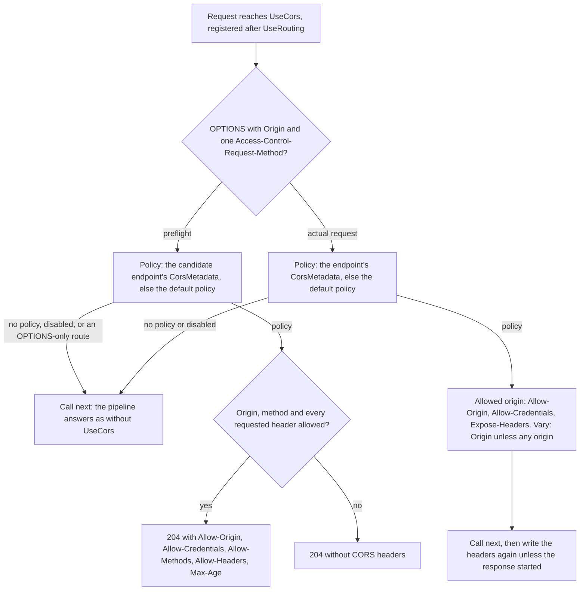

# Assimalign.Cohesion.Web.Cors design

This page describes the boundaries and implementation shape of `Assimalign.Cohesion.Web.Cors`.

> **Status:** Partial.

## Design intent

CORS is a browser's opt-in for cross-origin reads. A browser withholds a cross-origin response from
the calling script unless the response names the script's origin as allowed. Before it sends a
request that a page could not have sent without script (a `PUT`, a JSON body, an `Authorization`
header), it first asks the server with a preflight. This package is the server half of that
protocol, as the Fetch standard defines it, for the Web pipeline: an immutable policy model
validated at startup, a middleware that answers preflights and stamps actual responses, and
per-endpoint policy selection through routing metadata (issue #3, with #109–#111).

CORS is not access control. The server never refuses an actual request because of its origin: CORS
only decides whether the browser hands the response to the script. A "simple" cross-origin request
(a form `POST`) is sent without a preflight whatever the policy says. Protecting state-changing
endpoints is the job of authorization (#155) and antiforgery (#1057); a preflight protects them only
from the requests a browser will not send without one.

The package owns one immutable policy (`CorsPolicy`) and its builder, one options object
(`CorsOptions`), one sealed metadata carrier (`CorsMetadata`), the `UseCors` pipeline verb, the
`RequireCors` and `DisableCors` convention verbs, and the internal evaluation. It has no feature
interface: nothing downstream needs the CORS decision.

## The protocol in one picture

The middleware sorts each request into a preflight or an actual request and selects a policy. A
preflight with a policy is answered on the spot. An actual request with a policy is stamped and
continues. Without a policy, the middleware steps aside.



Each step is described below: policy selection in "Policy selection", the preflight branch in
"Preflights", and the actual-request branch in "Actual requests".

## The policy model

`CorsPolicy` is sealed and immutable, built by `CorsPolicyBuilder.Build()`. Each value is validated
when it is added, so the `ArgumentException` points at the offending call. Combinations are
validated by `Build()`, which throws `InvalidOperationException`. Everything fixed per policy is
computed once at build: the lookup sets, and the method, header, exposed-header and max-age header
values. A response reuses those strings.

### Origins

A policy allows origins by an exact list (`WithOrigins`), by a predicate (`SetIsOriginAllowed`), or
all of them (`AllowAnyOrigin`). A list and a predicate combine, and either one may admit an origin.
Any origin excludes both.

- **Configured origins are serialized origins.** A browser sends `Origin` in the HTML serialization
  of an origin: `scheme://host[:port]`, with scheme and host lowercase and the default port omitted.
  Matching is an ordinal comparison against that form, so each configured origin is parsed and
  normalized once. Case is folded; a default port (80 for `http` and `ws`, 443 for `https` and
  `wss`, 21 for `ftp`) is dropped, as are leading zeros in a port; an IPv6 address is re-serialized
  the way the URL standard does it (`[::1]`).
- **Anything that is not part of an origin is rejected, not stripped:** a path, including the
  trailing `/` of a pasted URL, a query, a fragment, user information, or a wildcard. The message
  says what to remove. A configured `https://app.example/` that silently never matches is a
  well-known CORS pitfall in other frameworks; here it fails at startup.
- **`*` and `null` cannot be listed.** `*` has `AllowAnyOrigin`. `null` is the serialization of an
  opaque origin, which sandboxed iframes, `file:` documents and cross-origin redirects all send, so
  allowing it by value allows every one of them. A predicate may still accept it deliberately.
- **A non-ASCII host is rejected**, with a hint to write its punycode form, which is what the
  browser sends. Host names are limited to letters, digits, `-`, `.` and `_`.
- **The predicate sees only well-formed origins.** It is consulted only when the request's `Origin`
  is exactly a serialized origin, or `null`. A predicate can therefore rely on the shape and check
  the host and the scheme: an `http` origin can be impersonated on a hostile network.
- **Any origin and credentials are mutually exclusive**, and `Build()` throws. Fetch forbids
  `Access-Control-Allow-Origin: *` on a response to a credentialed request. The usual workaround,
  echoing every origin, lets any site read responses with the user's cookies. A predicate that
  accepts everything, combined with `AllowCredentials`, reproduces that hole by choice; the API
  remarks say so.
- **A policy must allow some origin**; one that allows none fails to build. It would be
  `DisableCors` written as a bug.

### Methods

- **Byte-case-sensitive**, as Fetch compares them. The requested method is read from the raw
  `Access-Control-Request-Method` header, because the `HttpMethod` value type uppercases every
  method.
- **Fetch's "normalize a method" is applied to configured methods.** `DELETE`, `GET`, `HEAD`,
  `OPTIONS`, `POST` and `PUT` are uppercased, because a browser always sends them uppercase; any
  other method keeps its case. So `WithMethods("put")` approves `PUT`, but `WithMethods("PATCH")`
  does not approve `fetch(url, { method: 'patch' })`, exactly as a browser refuses
  `Access-Control-Allow-Methods: PATCH` for it.
- **The CORS-safelisted methods are always allowed**: `GET`, `HEAD` and `POST`, byte for byte. A
  browser accepts them whatever the response lists, so a policy cannot restrict them through CORS.
  Refusing a preflight for one (a JSON `POST`, preflighted for its `Content-Type`) would only break
  requests the policy's author never meant to block.
- **`AllowAnyMethod` answers with the requested method**, not `*`, because for a credentialed
  request `*` is a method literally named `*`.
- `*` is rejected by `WithMethods`, and `AllowAnyMethod` combined with `WithMethods` fails to build.

### Request headers

- **Case-insensitive.**
- **Every name in `Access-Control-Request-Headers` needs approval.** A browser lists only the
  headers that are not CORS-safelisted. `Content-Type` is listed whenever its value is not one of
  the three safelisted media types, so a JSON API lists `Content-Type`. Safelisted headers with
  ordinary values are never listed, so a policy never needs to name them.
- **No header name is approved implicitly.** The old W3C "simple headers" (`Accept`,
  `Accept-Language`, `Content-Language`) get no free pass: a browser lists one only when its value
  is unsafe, and then requires the name in `Access-Control-Allow-Headers`.
- **`AllowAnyHeader` echoes the requested names**, not `*`. A `*` never covers `Authorization`
  (Fetch's CORS non-wildcard request-header name) and means a header literally named `*` to a
  credentialed request. The echo approves bearer-token APIs either way. The requested list is
  validated first: every element must be a token, so the echo carries only token characters, commas
  and whitespace.

### Credentials, exposed headers and max age

- `AllowCredentials` adds `Access-Control-Allow-Credentials: true` to actual responses and to
  preflight grants. Fetch requires the preflight to say it too.
- `WithExposedHeaders` lists `Access-Control-Expose-Headers` on actual responses; Fetch defines it
  for those only. `*` is rejected: it is a wildcard only for requests without credentials, and the
  model keeps exposure explicit.
- `SetPreflightMaxAge` sets `Access-Control-Max-Age` on preflight grants, in whole seconds
  (fractions are truncated). Unset, the header is omitted and browsers default to five seconds;
  browsers also cap it.

## Policy selection

The policy for a request is chosen in this order:

1. **The endpoint's metadata**, read last-wins from the endpoint `UseRouting` published, so a
   route's declaration overrides its group's. `CorsMetadata` names a policy (resolved at request
   time against `CorsOptions.AddPolicy`), carries an inline policy, or is `Disabled`.
2. **The default policy** (`CorsOptions.AddDefaultPolicy`), for an endpoint without CORS metadata
   and for a request with no endpoint.
3. **None.** The middleware steps aside, and the request continues as though `UseCors` were not
   registered. `Disabled` has the same effect and overrides a group's policy and the default.

An endpoint that names an unregistered policy fails with `InvalidOperationException` when a request
reaches it, the same posture Web.RateLimiting takes for an unknown policy name.

The options are captured when `UseCors` runs. The middleware copies the default policy and the named
policies into a frozen dictionary, so options changed later cannot change a running pipeline.

The convention verbs are generic extension members over routing's `IRouterConventionBuilder`, so one
verb serves a route and a group and returns the receiver's builder type: `RequireCors(name)`,
`RequireCors(policy)`, `RequireCors(configure)` and `DisableCors()`. `RequireCors(configure)` builds
and validates its policy when the route is mapped. Routing composes the metadata when the route
table is built, outer group first, so the last-wins read resolves the most specific declaration
whatever order the calls were made in.

## Preflights

A request is a preflight when it is an `OPTIONS` request with an `Origin` and exactly one
well-formed `Access-Control-Request-Method` (a token of at most 32 characters). The rule is
routing's, so routing and CORS always agree on which requests are preflights. An `OPTIONS` request
with an `Origin` but no requested method is an actual request.

### A grant or nothing

A preflight with a policy is answered `204 No Content` and never continues down the pipeline. When
the policy allows the origin, the requested method and every requested header, the answer carries
the full grant:

- `Access-Control-Allow-Origin`: the origin echoed, or `*` for an any-origin policy.
- `Access-Control-Allow-Credentials: true`, when the policy allows credentials.
- `Access-Control-Allow-Methods`: the policy's whole list, or the requested method for any method.
- `Access-Control-Allow-Headers`: the policy's whole list, or the requested names for any header.
- `Access-Control-Max-Age`, when set.

Otherwise the answer carries no CORS header at all, and any an earlier component set is removed.
Lists are sent whole, so one preflight lets the browser cache every listed method and header.

**Why a denial omits everything.** The alternative, ASP.NET Core's since 3.0, answers every allowed
origin with the policy's lists and lets the browser compare them with the request. Issue #109 asks
the server to evaluate methods, headers, origins and credentials, and #3 asks for browser-facing
behavior that is easy to reason about and test. A grant-or-nothing answer meets both: an approved
preflight is identifiable from its headers alone. The cost is the browser's message: it reports
every denial as a missing `Access-Control-Allow-Origin`, even when the origin was allowed and the
method was the problem. A denial is `204` too. Fetch also permits `403`; the browser's outcome is
the same either way.

### Where a preflight's policy comes from

The preflight's policy has to be the one that will govern the actual request, so it is read from the
actual request's endpoint whenever routing can name it:

| Routing published | Policy source | Why |
| --- | --- | --- |
| A candidate (`IRouteMatchFeature.IsPreflight`) | The candidate's metadata, else the default | It is the actual request's endpoint |
| A route that matched the `OPTIONS` request and also serves the requested method (lists it, or accepts any method) | That route's metadata, else the default | It is the actual request's endpoint too, for example a gateway catch-all |
| An `OPTIONS`-only route | None: the middleware calls `next` and the route answers | See below |
| Nothing: routing's 405 or 404, no routing at all, or `UseCors` ahead of `UseRouting` | The default policy | See "A preflight with no candidate endpoint" |

**An `OPTIONS`-only route owns its path's preflights.** Routing's contract is that an explicit
`OPTIONS` route handles the request itself; it publishes that route, not a candidate. The actual
request's endpoint (the `DELETE` next to it) is then unknown to CORS, and answering with the
`OPTIONS` route's policy or the default could approve a preflight that the `DELETE` endpoint's own,
stricter policy would refuse. So the middleware leaves the preflight to the route, which answers it
as it answers any `OPTIONS` request. A route that wants CORS to answer its path's preflights serves
the actual method too, or is not mapped for `OPTIONS` at all.

### A preflight with no candidate endpoint (decision)

Stage 6 answers a preflight whose requested method no route serves with `405` at the pipeline
terminal. With `UseCors` registered, **the default policy answers it** (`204`, grant or nothing).
With no default policy, `UseCors` steps aside and the `405` (or `404`) stands.

- No candidate means no handler can run for the actual request: routing will answer it `405` or
  `404`. So approving the preflight cannot let a state-changing request reach application code.
- What it buys is diagnosability. The actual request goes out, and its `405` or `404`, stamped by
  the same default policy, is readable by the script, instead of an opaque CORS failure for what is
  really a missing route.
- Without a default policy there is nothing to answer with, and the middleware never invents a
  policy.
- ASP.NET Core's CORS middleware does the same with its default policy when the matched endpoint
  carries no CORS metadata.
- Rejected: always leaving such a preflight unanswered. It is just as safe, but it turns a missing
  route into a CORS error.

## Actual requests

An actual request is evaluated on its origin only. Method and header restrictions belong to the
preflight: a browser never sends an actual request whose preflight failed, and a non-browser client
ignores CORS altogether. The middleware never rejects. A request from a denied origin still runs;
its response carries no CORS header, and the browser withholds it from the script.

- **An allowed origin** gets `Access-Control-Allow-Origin` (the origin echoed, or `*` for an
  any-origin policy), `Access-Control-Allow-Credentials: true` when the policy allows credentials,
  and `Access-Control-Expose-Headers` when the policy exposes headers.
- **An any-origin policy** writes `*` and the exposed headers on every response it governs, CORS
  request or not, and no `Vary`.
- **Any other policy** adds `Vary: Origin` to every response it governs: allowed, denied, or without
  an `Origin`.
- **The policy is authoritative for the headers it governs.** A CORS header the decision does not
  include is removed, so a value set by another component (a second `UseCors`, a handler) cannot
  widen what the policy grants. An endpoint that writes its own CORS headers opts out with
  `DisableCors()`.

### `Vary: Origin` and caches

Fetch's "CORS protocol and HTTP caches" note: when the CORS headers depend on the origin, the
response must carry `Vary: Origin`. Otherwise a cache hands a response computed for one origin, or
for a same-origin navigation with no `Access-Control-Allow-Origin` at all, to a request from
another. So the header goes on denied responses and on responses to requests without an `Origin` as
well; ASP.NET Core adds it only where it echoes an origin. Conversely, for a static `*` Fetch says
to send `Access-Control-Allow-Origin` on every response and use no `Vary`, which is why an
any-origin policy writes `*` even without an `Origin`.

Appending follows the area convention shared with Web.Serialization, Web.StaticFiles and
Web.Compression: existing tokens are kept, `Origin` is never duplicated (case-insensitive), and
`Vary: *` is left alone. Web.Caching keys stored variants on the response's own `Vary`, so it keeps
one variant per origin, and a cache hit restores headers that match the request.

### Written before and after the rest of the pipeline

The headers are written before `next`, so a response that starts streaming downstream carries them.
They are written again after `next` returns, unless the response head has started
(`IHttpResponseStreamingFeature.HasStarted`), because a write then would not reach the wire.

The Web pipeline has no response-starting hook (ASP.NET Core's CORS middleware applies its headers
through `OnStarting`), and the second write is the substitute. Middleware registered after `UseCors`
that resets a response before writing its own (the exception boundary, a request timeout, an
output-cache hit) clears the CORS headers, and the second write restores them, so a cross-origin
caller can read a `500` problem response.

**Known limit.** A middleware registered *before* `UseCors` that rewrites the response after
`UseCors` has returned writes a response without CORS headers. The typical case is an exception
boundary at the top of the pipeline that catches a fault propagating through `UseCors`. When
cross-origin callers must read fault responses, register `UseErrorHandling` after `UseCors`. A
response-start hook in the Web root would remove the limit (see "Scope-creep candidates").

## Fail closed: `CorsMetadata` implements `IRouteMiddlewareMetadata` (decision)

**Decision:** yes, in every form, `Disabled` included. `RequiredMiddleware` is `UseCors`. The
middleware acknowledges every non-preflight endpoint it sees, and routing fails an endpoint whose
last `CorsMetadata` item was never acknowledged with an `InvalidOperationException` naming the
endpoint and `UseCors`.

The question was whether CORS needs routing's fail-closed check at all, since CORS only relaxes
browser restrictions. That argument holds for a **missing** `UseCors`: no CORS headers are written,
and the browser blocks, which is the safe direction. It does not hold for a **misordered** one. A
`UseCors` registered ahead of `UseRouting` sees no endpoint and applies the default policy to every
request, so:

- an endpoint that declared a stricter policy than the default (fewer origins, no credentials) gets
  the default's grant;
- an endpoint that declared `DisableCors` gets the default's grant;
- that endpoint's preflights are answered with the default's grant too, so a browser sends
  state-changing requests the endpoint's own policy would have refused a preflight for.

Each of these widens access silently, and the misordered pipeline is exactly the one an application
migrating from terminal routing has (#1054 moved every policy middleware behind `UseRouting`).
Failing at dispatch catches it the first time a declaring endpoint is called. A preflight answered
by the misordered middleware is still followed by an actual request, and that request fails before
the handler runs.

- **Why `Disabled` places a requirement, unlike `RateLimitingMetadata.Disabled`.** A disabled rate
  limit means the same thing in either position, because the global limiter applies in both. A
  disabled CORS policy behind a misordered `UseCors` is replaced by the default policy, the opposite
  of what it declared.
- **The cost.** An endpoint that declares CORS in an application without `UseCors` fails every
  request, same-origin ones included, until `UseCors` is added or the declaration removed, even for
  `DisableCors`, which means nothing there. The failure is loud and deterministic, and its message
  says what to do. It is the trade Web.RateLimiting and Web.RequestTimeouts make, and ASP.NET Core's
  endpoint middleware makes the same check: it refuses an endpoint with CORS metadata when the CORS
  middleware did not run.
- **Rejected alternatives.** No requirement at all: silently weakens a misordered application that
  has a default policy. A requirement for named and inline policies only: leaves `DisableCors`
  endpoints exposed to the misordered default.

The acknowledgement happens for every endpoint the middleware sees, with or without CORS metadata
and before anything else: a same-origin request to an endpoint with a policy must run, and the item
routing checks may be a group's. A preflight's candidate is not acknowledged, because it never runs
for the preflight.

## Ordering

```text
UseForwardedHeaders → UseHostFiltering → … → UseRouting → UseCors → UseAuthorization / UseRateLimiting / UseRequestTimeouts / UseOutputCache / antiforgery → endpoint
```

- **After `UseRouting`**, so the endpoint and its `CorsMetadata` are known. Registered ahead of it,
  an endpoint that declares CORS fails at dispatch (see above).
- **Ahead of every middleware that can reject a preflight.** A preflight carries no credentials, so
  authorization would answer it `401`, an antiforgery check `400`, and a rate limit `429`. `UseCors`
  answers preflights before any of them runs. Web.RateLimiting already skips a preflight's candidate
  for endpoint policies; with `UseCors` ahead of it, preflights also stay out of its global limiter.
- **The exception boundary after `UseCors`** when cross-origin callers must read fault responses
  (see "Known limit").
- **Output caching** works on either side, because `Vary: Origin` keys the stored variants.
- **Middleware that answers before `UseRouting`**, such as static files or a path branch, answers
  before a `UseCors` placed after `UseRouting` runs, so its responses carry no CORS headers.

## Error model

- **Configuration errors** surface when `UseCors` or `RequireCors` runs, normally at startup:
  `ArgumentException` for a value (an origin, a method, a header name),
  `ArgumentOutOfRangeException` for a negative max age, and `InvalidOperationException` for an
  invalid combination, a duplicate policy name or a second default policy.
- **At request time**, the middleware throws `InvalidOperationException` for an endpoint that names
  an unregistered policy, and routing throws it for an endpoint whose `CorsMetadata` `UseCors` never
  processed.
- **No exception type of the package's own.** No failure is one a caller would handle differently.
- **No error status.** A denied CORS request is still a successful HTTP exchange; the browser
  enforces the outcome.

## AOT posture

No reflection, configuration binding, service location or runtime code generation. Policies are
plain data; origin and method matching are `FrozenSet` lookups, and request-header matching uses the
frozen set's span-based alternate lookup, so a requested header name is matched without allocating.
The origin predicate is a plain delegate. IPv6 normalization uses `IPAddress` parsing, which is
AOT-safe. The library builds with the trim and AOT analyzers enabled (`IsAotCompatible`) and no
warnings.

## Non-goals

- **Private Network Access** (`Access-Control-Request-Private-Network` and
  `Access-Control-Allow-Private-Network`): a Chromium-specific draft.
- **A subdomain-wildcard verb** (`https://*.app.example`): the predicate covers it with an explicit
  check, and a pattern language invites suffix-matching mistakes.
- **Exposing every response header** (`Access-Control-Expose-Headers: *`): it is a wildcard only for
  requests without credentials.
- **A per-request policy provider** (ASP.NET Core's `ICorsPolicyProvider`): policies are static and
  selected by endpoint metadata, which keeps evaluation trimming-safe and visible at the route. A
  dynamic origin decision is the predicate's job.
- **Blocking requests from denied origins:** CORS grants reads; it is not access control.
- **WebSocket origin checks:** the WebSocket handshake is not subject to CORS (#765).
- **`Timing-Allow-Origin`:** it belongs to the Resource Timing specification, not to CORS.

## Scope-creep candidates (recorded, not taken)

- A response-start hook in the Web root, so the CORS headers survive an exception boundary
  registered ahead of `UseCors` (the known limit above).
- A public evaluation seam for applications that answer CORS on their own `OPTIONS` routes, which
  today write the headers by hand.

## Testing

`tests/CorsPolicyBuilderTests.cs` and `tests/CorsOptionsTests.cs` cover the policy model: origin
normalization and every rejected form, method normalization, token validation, the combinations
`Build()` rejects, list-plus-predicate matching and the predicate's well-formed-origin guard,
duplicate and default registrations, and the metadata's `RequiredMiddleware` in every form.

`tests/CorsMiddlewareTests.cs` drives `UseCors` over a capturing pipeline builder and an
`IHttpContext` double (`tests/TestObjects/`); a stage ahead of the middleware publishes a fake route
match, which is what `UseRouting` does. It covers echoed, wildcard, credentialed and denied actual
requests, exposed headers, `Vary: Origin` on denied and origin-less responses and its append rules,
the authoritative removal of stale CORS headers, the second write after a downstream reset and its
suppression once the response started; preflight grants and denials, byte-exact methods with the
safelisted ones always allowed, case-insensitive and malformed request headers, the any-method and
any-header echoes, max age; and the preflight's policy source for a candidate, a disabled candidate,
an `OPTIONS`-only route, a route that also serves the requested method, an any-method route, and no
endpoint at all.

`tests/CorsEndToEndTests.cs` and `tests/CorsRouteConventionTests.cs` run the real router over the
in-memory `WebApplicationTestFactory`: wildcard, credentialed and denied requests on the wire; a
preflight answered through its candidate, which never runs; named, group-level and route-level
policies and their overrides; `DisableCors`; preflight grants and denials for methods and headers;
exposed headers and max age; the preflight with no candidate, with and without a default policy; the
explicit `OPTIONS` route; a same-origin request to an endpoint with a policy; `UseCors` registered
ahead of `UseRouting` and missing altogether, both failing closed at dispatch; the real exception
boundary behind `UseCors` keeping the CORS headers on its `500`; and a preflight over HTTP/2.

## Declared dependencies

| Reference | Kind |
|---|---|
| `Assimalign.Cohesion.Web` | `CohesionProjectReference` |
| `Assimalign.Cohesion.Web.Routing` | `CohesionProjectReference` |
| `Assimalign.Cohesion.Http` | `CohesionProjectReference` |
| `Assimalign.Cohesion.Http.Streaming` | `CohesionProjectReference` |

[Assembly overview](index.md) · [Examples](examples/index.md)

## Sources

- **Primary source** — `cohesion/resources/Web/Assimalign.Cohesion.Web.Cors/docs/DESIGN.md`.
- **Source** — `cohesion/resources/Web/Assimalign.Cohesion.Web.Cors/src/Assimalign.Cohesion.Web.Cors.csproj`.
