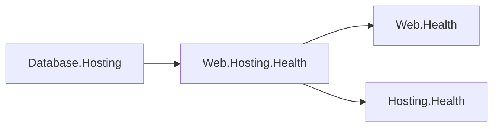

# Assimalign.Cohesion.Web.Hosting.Health design

This page describes the boundaries and implementation shape of `Assimalign.Cohesion.Web.Hosting.Health`.

> **Status:** Partial.

## Design intent and boundaries

O34 places Hosting integration in the area's hosting family so that the Web health model remains
independently consumable. This library references `Web.Health` and `Hosting.Health`, and never
`Web.Hosting`. Roots and features cannot reference it (`COHRES001`); hosting families and application
composition roots can consume it. `Web.Hosting.Resources` independently serves the resource
control-plane protocol.

## Adapter and lifecycle

`HealthChecksBuilderExtensions` exposes an `extension(IHealthChecksBuilder)` block. `AddContributor`
registers a delegate through the existing public `AddCheck` seam:

- **The contributor name uses** — normal case-insensitive duplicate validation.
- **An explicit switch maps** — `Healthy`, `Degraded`, and `Unhealthy` into the Web status enum.
- **Description and diagnostic data** — retain their original values.
- **Evaluation forwards the cancellation** — token; caller cancellation propagates.
- **Exceptions and timeouts use** — the registration's Web failure policy.
- **Missing tags default to** — ready and live; explicit tags replace them, including an
  empty collection for aggregate-only checks.

Builder `Build()` snapshots registrations into the Web health service. The adapter neither starts
nor disposes contributors; their lifetime belongs to the composition root. Null arguments fail at
registration, unknown contributor status fails during evaluation, and the Web health service applies
its normal exception policy.

## AOT posture and verification

The adapter uses static delegate/interface dispatch and an exhaustive named-status mapping with a
rejecting default. It adds no reflection, dynamic code, DI, or runtime service lookup. Existing
contributor mapping, tags, failure, cancellation, duplicate, and null-input tests move with the
adapter into this package's co-located tests.

## Delivery and non-goals

The package ships in `App.Web` and the release inventory. `Database`'s admin service consumes it
through the private project/framework pair in `App.Database`, preserving its separate accepting
gate. The adapter owns no HTTP endpoint, transport, health model, or service container.

`Database` privately references the adapter, which translates the two independent health contracts.

## Declared dependencies

| Reference | Kind |
|---|---|
| `Assimalign.Cohesion.Hosting.Health` | `CohesionProjectReference` |
| `Assimalign.Cohesion.Web.Health` | `CohesionProjectReference` |

[Assembly overview](index.md) · [Examples](examples/index.md)

## Sources

- **Primary source** — `cohesion/resources/Web/Assimalign.Cohesion.Web.Hosting.Health/docs/DESIGN.md`.
- **Source** — `cohesion/resources/Web/Assimalign.Cohesion.Web.Hosting.Health/src/Assimalign.Cohesion.Web.Hosting.Health.csproj`.
