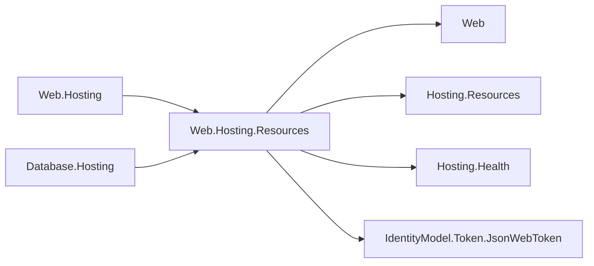

# Assimalign.Cohesion.Web.Hosting.Resources design

This page describes the boundaries and implementation shape of `Assimalign.Cohesion.Web.Hosting.Resources`.

> **Status:** Partial.

The hosting-family integration extends `IWebApplicationPipelineBuilder` with
`UseResourceControlPlane(controlPlane, resourceContext, isApplicationReady, controlPlanePort = null)`
. Callers install it first on a private listener. It owns no port, host, service container, or
configuration provider. The readiness callback observes the owning resource host's
`HostState.Started`, not merely listener startup.

The route and envelope contract matches Web.Hosting's terminal: public `/healthz`, `/readyz`,
`/livez` aliases; namespaced health, readiness, liveness, endpoints, stop, and commands beneath
`/cohesion/v1`. Reads allow GET/HEAD, stop allows POST, and commands allow GET/HEAD/POST/DELETE.
Unknown namespaced routes are 404. Health reports preserve diagnostic values and ordinal
contribution/endpoint ordering. HEAD suppresses bodies.

Managed namespaced requests verify an ES256 JWT with the published application P-256 JWK:
issuer/application, subject/gateway, key id, signature, required temporal claims and jti, and at
most 24 hours from issuance to expiry. Invalid credentials are 401 with a Bearer challenge; a valid
credential for another resource audience is 403. A missing gateway identity enables standalone
execution. The verifier is internal and creates/disposes its cryptographic handle within each
authenticated request; tokens rotated at reconciliation are accepted without byte-equality pinning.

Command discovery includes both acceptedCommandKinds and applied commands. Non-object envelopes,
non-string/base64 payloads, and blank identity fields are 400. Unsupported kinds return 501 and
ownership/replay rejections return 409, both with status=Rejected and detail. This package declares
no command kinds or handlers.

O35 permits the exact Web.Hosting module to consume its own hosting family under `COHRES002`.
`COHRES001` still prevents roots and features from referencing it and prevents it from referencing
Web.Hosting. Web.Hosting and `Database.Hosting` consume this single terminal. The Web root's
`IWebResponseCompletionFeature` defers stop until the transport has written 202; custom servers
without the feature retain direct stop. The executable regression compares the Web.Hosting wrapper
through FromProgram with the direct verb, guarding both composition paths.

`ResourceControlPlaneMiddleware` exposes `InvokeAsync` for manually composed hosts and `Validate` for
eager identity validation. `UseResourceControlPlane` calls `Validate` before registration. Its optional
trailing controlPlanePort gates every route, including bare probes; null means no gate. Web.Hosting
separately treats an unknown observed http/https port as disabled, so it forwards without invoking
this terminal. Web and `Database` validate managed identity at `Build` only when their control-plane
listener is installed.

Serialization uses Utf8JsonWriter and JsonDocument only. Dependencies are Web root,
Hosting.Resources, Hosting.Health, and `IdentityModel.Token.JsonWebToken`. App.Web exposes the feature
publicly; other areas consume its implementation privately. No ApplicationModel package enters a
framework.

Tests may reference Web.Hosting and the sample `Program`: `COHRES001`/002 skip the tests leaf via
`_CohesionHostingRuleApplies`; `COHAM001`/`COHRES003` skip harness path segments via
`_CohesionResourceBoundaryRulesApply` (`Build.Rules`.targets). These are separate gates, not
exemptions.

The certificate contract is consumed by each owning host when it constructs an HTTPS listener. This
middleware owns no TLS parser or listener and retains identical command and health behavior over
either transport.

Web and `Database` compose the same terminal through its root contracts; the integration never
references either runtime.

## Declared dependencies

| Reference | Kind |
|---|---|
| `Assimalign.Cohesion.Web` | `CohesionProjectReference` |
| `Assimalign.Cohesion.Hosting.Resources` | `CohesionProjectReference` |
| `Assimalign.Cohesion.Hosting.Health` | `CohesionProjectReference` |
| `Assimalign.Cohesion.IdentityModel.Token.JsonWebToken` | `CohesionProjectReference` |

[Assembly overview](index.md) · [Examples](examples/index.md)

## Sources

- **Primary source** — `cohesion/resources/Web/Assimalign.Cohesion.Web.Hosting.Resources/docs/DESIGN.md`.
- **Source** — `cohesion/resources/Web/Assimalign.Cohesion.Web.Hosting.Resources/src/Assimalign.Cohesion.Web.Hosting.Resources.csproj`.
