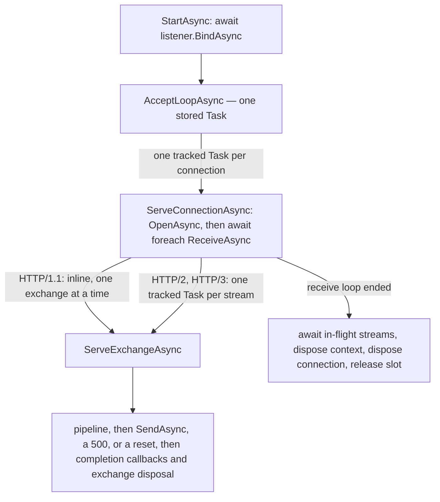
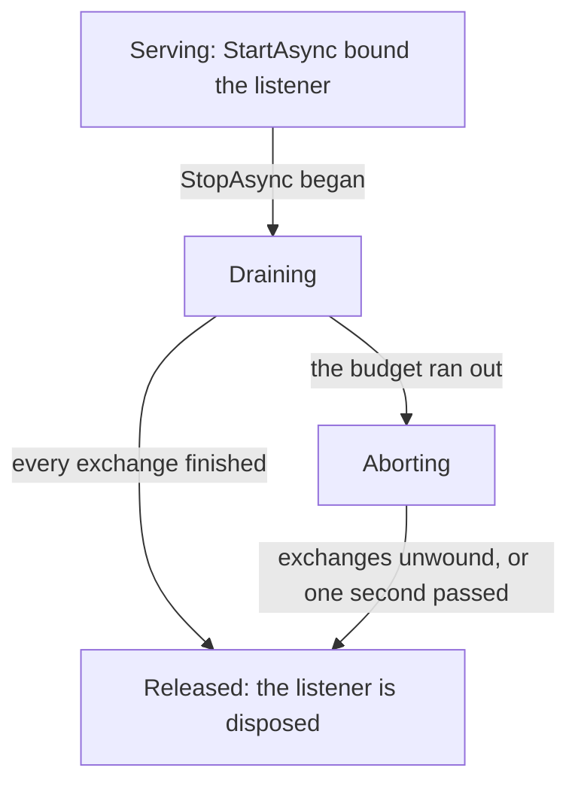
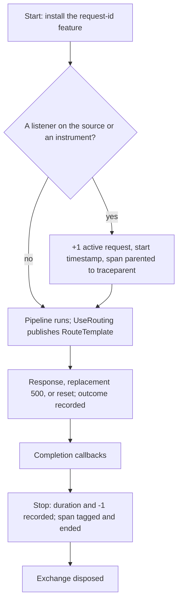

# Assimalign.Cohesion.Web.Hosting design

This page describes the boundaries and implementation shape of `Assimalign.Cohesion.Web.Hosting`.

> **Status:** Partial.

`Assimalign.Cohesion.Web.Hosting` is the composition root for the Web resource: it builds a
`WebApplication` (a `Host<WebApplicationContext>`), wires the middleware pipeline, and owns the
runtime server that turns accepted HTTP connections into pipeline invocations. It is the **only**
Web layer where DI, logging, and configuration are integrated, and that integration is strictly
builder-time — nothing resolves services per request.

**The hosting module is dependency-isolated within the Web area** (rule adopted 2026-07-10, recorded
in `resources/Web/README.md`): no Web feature library references this package — a feature that did
would drag the DI/configuration composition surface into every consumer — and this package
references **no** Web feature library. It references the root `Assimalign.Cohesion.Web`
abstractions, its own hosting family under O35, and non-Web infrastructure. Applications still see
the whole Web family because the `App.Web` shared framework (via `Sdk.Web`) delivers every Web
assembly; builder verbs ship with their features (`AddAuthentication` moved to
`Web.Authentication`, `AddCookie`/`AddJwtBearer` to their handler packages) and compose against
the root `IWebApplicationBuilder` seam. The one sanctioned exception is `Web.Testing`, the harness
that drives this concrete runtime.

This document focuses on the piece with the most load-bearing runtime behaviour:
`WebApplicationServer`, the default `IWebApplicationServer`. Its dispatch model and stop semantics
are the contract the rest of the Web middleware stack builds on, so they are recorded here rather
than left to be re-derived from the code.

The Web runtime references the public response-completion contract and the shared terminal; the
terminal depends only on the Web root within this area.


## Design intent

The server has one job: pull connections off a listener and drive each one through the middleware
pipeline, forever, without letting any single connection — well-behaved or hostile — degrade the
others or take down the host.

Four properties fall out of that intent and shape the whole implementation:

- **Connections are independent.** One connection's pace, idleness, or failure
  must never be observable by another. This rules out any design that serves
  connections from a shared loop.
- **Streams are independent.** HTTP/2 and HTTP/3 multiplex many exchanges over
  one connection; one stream's pace or failure must never be observable by its
  siblings. This rules out serving a connection's streams from its receive loop.
- **Application faults are contained.** Middleware is arbitrary user code. A
  throw from it is expected, not exceptional, and must cost exactly one
  exchange — never its siblings, never the accept loop, never the process.
- **Shutdown is deterministic.** Stopping the server lets what is in flight finish
  within the stop's budget, cancels only what outlives it, and releases every
  resource, without leaving an unobserved exception behind.

## Application lifecycle composition

`WebApplicationBuilder.Services` is the application's one composition registry. Every dependency the
host runs with is a registration in it, and the root `IWebApplicationBuilder` verbs are
explicit-interface shims over those registrations:

| Verb | Registration |
| --- | --- |
| `AddService(IHostService)` / `AddService(Func<WebApplicationContext, IHostService>)` | `IHostService` |
| `IWebApplicationBuilder.AddServer(...)`, `Server.UseServer<TServer>(...)` | `IWebApplicationServer` |
| `IWebApplicationBuilder.AddFeature(...)` | `IHttpFeature` |
| `AddHealthCheck(name, check)` | `IHealthContributor` |

A value becomes an instance registration, which stays owned by its caller; a
`Func<IWebApplicationContext, T>` becomes a factory registration invoked once with the final
context, and the application owns what it returns. Factories receive the context, never the
provider, which is what keeps the container out of the feature libraries that call these verbs. A
direct `Services.AddSingleton<IHostService>(...)` or `AddSingleton<IWebApplicationServer>(...)` is
equivalent to the matching verb.

**The service type is the lifecycle phase.** The host runs two phases, each in its own registration
order: every `IHostService` registration (the application services), then every
`IWebApplicationServer` registration (the servers). Because the phases are distinct service types,
registration order across them is irrelevant, so the default server (registered when the builder is
constructed) never precedes a later `AddService` call. `WebApplicationContext.HostedServices`
concatenates the two snapshots, adapting each server that is not itself an `IHostService` exactly
once. The Web host rejects concurrent service start or stop, so every application service starts
before any Web server and reverse shutdown drains every server before stopping application services.
Before this registry held everything, `AddService` kept a private list beside the DI-owned server
slot to get the same guarantee.

**Resolve once, at the boundary that consumes it.** `Build` makes the container read-only (a later
registration throws instead of silently missing the provider), creates the provider once, and
resolves the application services, running each factory exactly once against the final context.
Servers resolve once at host start, because the default server captures the composed pipeline and
middleware is added to the built application. Features resolve once at pipeline build (below).
Nothing resolves per request.

**The application owns the provider.** Disposing a `WebApplication` stops the host, then disposes
the provider, which disposes every factory-created service in reverse creation order; a failed
`Build` disposes it before rethrowing. The provider was previously never disposed.

`AddPipeline` is the one root verb that is not a registration: it replaces the default pipeline with
a single value, which the hosted `IWebApplicationPipeline` registered at `Build` wraps with the
enabled-resource terminals.

## Server dispatch model

The server runs three levels of work: one accept loop, one task per connection, and — on a
multiplexed connection — one task per stream. Each arrow below hands work to the next level without
waiting for it; only the drain at the bottom waits.



The accept loop optionally awaits a concurrency slot before each accept, and each connection task
releases its slot only after its drain completes.

**Bind before Started.** `StartAsync` first awaits the aggregate HTTP listener's `BindAsync`. Only
after every transport endpoint is bound does it schedule the stored accept-loop task and return. A
bind failure is surfaced as `HostStartupException`, preserving the transport exception as its inner
exception; the `ResourceHost` from `Hosting.Resources` can therefore classify typed
configuration/dependency causes as exit 64/69 and other pre-ready bind failures as exit 70. The
default server is the first `IWebApplicationServer` registration and implements `IHostService`
itself, so the host lifecycle drives this boundary directly. When an application registers only a
custom server and supplies no default-listener configuration, the default registration resolves to
an internal inert placeholder that `WebApplicationContext` excludes from both `Servers` and
`HostedServices`; it does not start an empty aggregate alongside the custom server.

The root `IWebApplicationBuilder.AddServer` overloads accept servers that know nothing about
Hosting. They register the server as an `IWebApplicationServer`, and `WebApplicationContext` wraps
each one that is not an `IHostService` in one internal lifecycle adapter when it snapshots the
server phase, so `Servers` exposes the original Web contract objects. A configured default and a
custom server each start exactly once, in registration order, and stop in reverse order. The factory
overload is a singleton registration that receives the final application context. `Web.Testing`
starts the first server registration, which is always the default server.

**One accept loop, one task per connection.** The loop accepts a connection and *hands it off* to
`ServeConnectionAsync` on its own `Task`, then loops straight back to accept the next one. The loop
never awaits a connection's service.

**Why this is the whole point.** The previous implementation queued one `async void` thread-pool
work item that accepted a connection and then `await foreach`-ed its entire receive sequence inline
before accepting the next. A single idle HTTP/1.1 keep-alive client — parked in `ReceiveAsync`
waiting for a request it never sends — blocked that loop indefinitely, so every other accepted
connection sat unserved in the listener backlog. Per-connection dispatch removes the shared
bottleneck: the idle client parks on *its* task while every other task runs.

**Stored `Task`, never `async void`.** The accept loop and each connection task are stored/tracked
`Task`s. An `async void` body escalates any escaped exception to a process-terminating unhandled
exception via the thread pool; a `Task` makes the exception observable instead. The accept loop
additionally swallows its own terminal faults so the stored task always completes cleanly.

**In-flight tracking.** Connection tasks are registered in a `ConcurrentDictionary<long, Task>`
keyed by a monotonic id, added by the accept loop and removed by each task as it completes. The map
is the drain set `StopAsync` awaits. A connection that completes synchronously (only possible with a
degenerate/empty receive sequence) is removed immediately after registration so the map never leaks
a completed entry.

## Dispatch within a connection (#1049)

A connection's receive loop dispatches by protocol, one exchange at a time for HTTP/1.1 and one task
per stream for HTTP/2 and HTTP/3.

**HTTP/1.1 stays sequential — the transport requires it.** An HTTP/1.1 connection carries one
exchange at a time, and its transport does the connection-level work for the *next* request inside
the receive enumerator's `MoveNextAsync`: it checks the finished exchange's keep-alive decision,
drains whatever request body the application left unread (so the connection realigns on the next
request's framing), and only then parses the next request head. Asking for the next exchange before
the previous response is written would race that drain against a handler still reading the body and
could send responses out of order. So the loop serves an HTTP/1.1 exchange inline — pipeline, send,
completion callbacks, dispose — and asks for the next one only afterwards. Pipelined requests are
therefore served strictly in order.

**HTTP/2 and HTTP/3 run one task per stream.** Neither transport needs an exchange to finish before
it can produce the next. The HTTP/2 frame pump dispatches a request head the moment its header block
completes and keeps feeding bodies, flow-control credit, and resets while handlers run, and
`SendAsync` is safe to call concurrently for different exchanges (the write scheduler serializes
frames on the wire). HTTP/3 carries each request on its own QUIC stream and writes each response to
it. So the server hands each multiplexed exchange to `MultiplexedExchangeTracker.Start` and goes
straight back for the next. Before #1049 the loop awaited each exchange's pipeline and send before
taking the next, so a slow request, a long poll, or a server-sent-events stream held up every other
stream on its connection. Since #1066 the HTTP/3 transport yields each exchange once its request
stream's HEADERS frame decodes and streams the body afterwards, so a slowly uploading stream no
longer delays the streams behind it.

- **How the server tells.** `IHttpContext.Version` is `Http20` or `Http30` for a
  multiplexed exchange. That is all the dispatch reads about the protocol; everything
  else about the wire stays below the connection-context contract.
- **Why `Task.Run`.** A pipeline may run synchronously for as long as it likes before
  its first `await`. Starting it on the receive loop's thread would hold back every
  sibling stream for that long, so each stream starts on the thread pool.
- **Concurrency is bounded by the transport.** The server adds no queue and no work of
  its own: a stream task exists only for an exchange the transport yielded, and the
  transport yields only streams it admitted — HTTP/2 refuses a stream beyond
  `SETTINGS_MAX_CONCURRENT_STREAMS` (`Http2Limits.MaxStreamsPerConnection`, default
  100) with `RST_STREAM(REFUSED_STREAM)`, and HTTP/3 peers cannot open request
  streams beyond the QUIC stream credit (`QuicConnectionListenerOptions.MaxBidirectionalStreamCount`,
  default 100). One gap remains in the HTTP/2 transport: a peer `RST_STREAM` frees the
  stream's slot immediately (`Http2ConnectionContext.ProcessRstStreamFrameAsync`),
  while an application that ignores `RequestCancelled` keeps its task running. The
  rapid-reset flood guard (`MaxResetStreamsPerWindow`) bounds the rate at which such
  tasks can accumulate; counting a reset stream against the limit until its
  application task completes, as Kestrel does, is transport work.
- **The connection waits for its streams.** `MultiplexedExchangeTracker` is a
  countdown, not a task set: it starts at one (the receive loop's hold), rises as each
  stream starts, falls as each finishes, and the loop gives up its hold when it stops
  receiving. Whichever release reaches zero completes the drain, exactly once, with no
  lock. The connection task awaits that drain before it disposes the connection
  context — the HTTP/2 context's disposal is the RFC 9113 §6.8 graceful close
  (`GOAWAY`, then the pump stops and the output completes), which must not run under a
  stream still writing its response — and before it releases its concurrency slot and
  leaves the `StopAsync` drain set. An HTTP/1.1 connection never allocates a tracker.

## Layering boundary — what the server does *not* do

Wire-level failure isolation lives one layer down, in `Assimalign.Cohesion.Http.Connections` (see
its `docs/DESIGN.md`, "Receive-loop failure isolation"). Truncated frames, malformed request lines,
peer resets, HTTP/2 `RST_STREAM`/`GOAWAY`, and per-stream HTTP/3 faults are all classified and
handled there: the receive enumerable simply stops yielding on a wire error and the surrounding
`await using` disposes the connection.

The server therefore owns **only** the concerns above that layer:

| Concern | Owner |
| --- | --- |
| Wire-protocol conformance, frame parsing, per-stream reset encoding | `Http.Connections` |
| Wire-level failure isolation (bad frames, peer reset) | `Http.Connections` |
| Stream admission (`SETTINGS_MAX_CONCURRENT_STREAMS`, QUIC stream credit) | `Http.Connections` |
| Announcing a graceful close on the wire (`Connection: close`, `GOAWAY`, refused streams) | `Http.Connections` |
| Application-exception isolation (middleware throws), per exchange | **this server** |
| Per-connection and per-stream dispatch | **this server** |
| Exchange + connection + context disposal | **this server** |
| In-flight tracking + the lame-duck drain and its budget, per connection and per stream | **this server** |
| Optional connection concurrency cap | **this server** |
| Request spans, HTTP server metrics and the request id (#1064) | **this server** |

The server never inspects a frame or a stream id. It sees `IHttpConnection` →
`IHttpConnectionContext` → `IHttpContext` and reads exactly two protocol facts off an exchange:
whether it is multiplexed (`IHttpContext.Version`), and — only when its pipeline faulted — whether
its response has started (the transport's `HasResponseStarted` probe, below). Every outcome,
including a replacement `500` and a reset, goes on the wire through
`IHttpConnectionContext.SendAsync`, so the wire encoding of each stays in the transport.

## Error model — application-exception isolation

The isolation boundary is the **exchange** (`ServeExchangeAsync`), not the connection. Every
exchange is finalized through the connection context exactly once, in one of three ways, chosen by
how its pipeline ended:

| Pipeline outcome | Finalization | On the wire |
| --- | --- | --- |
| Returned | `SendAsync` | the application's response |
| Threw, response not started | the staged status, headers, and body are replaced by a bodyless `500`, then `SendAsync` | `500 Internal Server Error` |
| Threw after the response started, or the exchange was cancelled | `IHttpContext.CancelAsync`, then `SendAsync` | a reset: HTTP/2 `RST_STREAM(CANCEL)`, HTTP/3 stream abort, HTTP/1.1 no further bytes and a connection that ends after the exchange |

- **Cancelled, not faulted.** An `OperationCanceledException` counts as a cancellation
  only when the server's shutdown token or the exchange's own `RequestCancelled`
  fired (server stop, peer reset, closed connection, `IHttpContext.Cancel`). An
  operation cancelled for any other reason — an application timeout — is a fault.
- **Why "started" decides.** Once the final response head is on the wire (a
  streamed write or flush through the raw body sink — `Http.Streaming`, server-sent
  events), a replacement status can no longer reach the peer, and `SendAsync` would
  *finalize* the started response — `END_STREAM`, or the terminating chunk — handing the
  client a truncated body as if it were complete. A reset is the honest answer. The
  server reads the state through `HttpContextTransportExtensions.HasResponseStarted`, a
  probe `Http.Connections` exposes for exactly this decision; the runtime module takes
  no dependency on `Http.Streaming`, which would also have to enter every area
  framework that privately carries this module.
- **The replacement `500` swaps the body rather than truncating it.** A seekable body
  the application supplied may be a file it owns, so the staged body is replaced with a
  fresh empty one and disposed, never `SetLength(0)`-ed. If the response object itself
  cannot be reshaped, the exchange is reset instead.
- **A failed send.** On a multiplexed connection it belongs to its stream alone — a
  response body that throws on read, a lifecycle hook that throws, a write cut off by
  shutdown — so the server resets that stream (`CancelAsync`, then `SendAsync` once
  more), which also releases its concurrency slot and the transport's drain
  accounting. On an HTTP/1.1 connection the response framing on the wire is then
  unknown, so the failure escapes to the connection loop, which aborts the connection;
  a send cut off by shutdown is a clean drain instead.
- **Post-response work is contained.** A throwing response-completion callback or a
  throwing exchange disposal costs nothing but its own exchange. Completion callbacks
  run only after the application's own response was sent — never after a replacement
  `500` or a reset.
- **The connection-level catch remains** for what is left: a receive-side failure the
  transport surfaced and an HTTP/1.1 send failure. Either way the connection cannot
  carry another request, so it is logged (see "Diagnostics"), `Abort`-ed, and the
  enclosing `await using` disposes it. The accept loop is untouched and keeps serving.

**Behaviour change for HTTP/1.1 (#1049).** Before #1049 a pipeline fault aborted the whole
connection, so an HTTP/1.1 client saw a dropped connection instead of a status. It now receives a
`500` on a connection that stays usable for keep-alive, the same as Kestrel. The transport still
decides reuse: if the faulted handler left a request body that cannot be drained within the limits,
the connection closes after the `500`. A post-dispatch body-limit violation (`413` or `408` raised
from the body read) surfaces as an exception whose status only the transport knows, so it is
answered with `500` until the transport exposes that status.

Catching bare `Exception` at each of these points is a deliberate, documented departure from the
"catch specific exceptions" rule. This is a **fault-isolation boundary around arbitrary user code**
— middleware, completion callbacks, application bodies and features — the same pattern the
transport's accept loop uses (`HttpConnectionListener.RunStreamAcceptLoopAsync`). The alternative —
letting an unknown exception propagate out of a background task — is precisely the process-crash
hazard this component exists to remove. Each catch is annotated in source so future readers do not
"correct" it back to a narrow catch. `MultiplexedExchangeTracker` observes the outcome of every
stream task, so none can surface as an unobserved task exception.

## Disposal contract

When a connection's loop ends — normally, by client disconnect, by shutdown, or by a
connection-level fault — the server disposes, in order:

1. **Each exchange** (`IHttpContext`) in a `finally` after its finalization and
   completion callbacks, on whichever task served it, so an exchange is released
   even if its pipeline or send throws. A multiplexed connection's exchanges are all
   disposed before step 2: the loop awaits its stream drain first.
2. **The connection context** (`IHttpConnectionContext`) in a `finally` after the
   receive loop and the stream drain.
3. **The connection** (`IHttpConnection`) via `await using`.

`IHttpConnectionContext` is intentionally *not* `IAsyncDisposable`: a context is a projection over
the connection, and the connection releases the underlying transport on its own disposal (see
`Http1Connection.DisposeAsync`). The server still disposes any context that *does* implement
`IAsyncDisposable`/`IDisposable` through a type test (no reflection), so a stateful context is torn
down deterministically. The HTTP/2 context is one: its disposal is the RFC 9113 §6.8 graceful close
(`GOAWAY`, a bounded wait for dispatched exchanges, then the frame pump stops and the output
completes), which is why the server drains the connection's streams before it disposes the context.

## Stop semantics — the lame-duck drain (#146)

`StopAsync(cancellationToken)` is a lame-duck drain: the server accepts nothing new, lets the
exchanges in flight finish within the caller's budget, and cancels only what outlives it. The token
is the budget. `Host<TContext>.StopAsync` passes a token that fires when its `ShutdownTimeout`
elapses, which an orchestrated resource derives from its stop grace
(`ResourceHostOptions.DeriveShutdownTimeout`: grace − 5 s, floor 5 s), so a Web app drains for at
most that long.

The server holds two signals (`Internal/WebApplicationServerDrain`). Each live connection registers
on both once its context is open, so a connection accepted just as the stop begins is handled the
same way as the rest.

| Signal | Fires | Carries |
| --- | --- | --- |
| `Draining` | when the stop begins | the accept loop, a bind still in progress, and every connection's graceful close |
| `Aborted` | when the budget runs out | every connection's open and receive, every exchange's pipeline and send, and every connection's abort |

The stop runs in order:

1. **Begin the drain.** `Draining` fires: the accept loop stops, and every live connection begins
   its graceful close through `IHttpConnectionContext.BeginGracefulClose`. Nothing is cancelled: an
   exchange already running finishes, and its response is delivered, because its send runs under
   `Aborted`, which has not fired. The transport implements the close per version
   (Http.Connections DESIGN, "The host contract"):
   - HTTP/1.1 (RFC 9112 §9.6): the response to the exchange in flight carries `Connection: close`
     and the connection ends after it; an idle keep-alive connection ends at once.
   - HTTP/2 (RFC 9113 §6.8): `GOAWAY(NO_ERROR)` carrying the last stream processed; new streams
     are refused with `RST_STREAM(REFUSED_STREAM)`; the frame pump keeps feeding the open streams.
   - HTTP/3 (RFC 9114 §5.2): no further request stream is accepted, and a `GOAWAY` names the first
     one that was not.
2. **Wait for the accept loop**, so no connection task is added after the in-flight set is
   snapshotted.
3. **Drain in-flight connections and their streams**, within the budget. A connection's receive
   loop ends on its own once its transport has nothing left to yield, and a connection task
   completes only after every stream it dispatched has finished (see "Dispatch within a
   connection"), so the drain covers every in-flight exchange on every connection. Each task is
   self-contained — it swallows its own cancellation and faults and never rethrows — so the drain
   completes without surfacing an unobserved exception.
4. **Abort, when the budget runs out first.** The server logs how much was still in flight (see
   "Diagnostics"), then `Aborted` fires: every exchange still running observes `RequestCancelled`,
   which every transport version links to the receive token, and every connection still open is
   aborted with a `ConnectionAbortedException`. The stop then waits up to one second
   (`_abortGracePeriod`, Kestrel's figure) for them to unwind. An exchange that ignores
   cancellation keeps running after the stop completes.
5. **Dispose the listener**, then the drain's token sources and (if present) the concurrency
   semaphore. Listener disposal runs from a `finally`, so `StopAsync` never completes with the port
   still owned by this server.

The stop completes normally when the budget runs out, as Kestrel's does: the server is stopped and
its endpoint released; only the graceful part was cut short, which the caller knows from its own
token and which the host already reports as `DrainAborted` (exit 130/143 for an orchestrated
resource). Every later `StopAsync` call shares the first call's task. Cancelling before starting, or
stopping twice, is safe.

The server's states through a stop:



**Why two signals.** Before #146 one token did both jobs. It stopped the accept loop and cancelled
every exchange in flight: through `RequestCancelled` on HTTP/1.1 and HTTP/3, and on every version
through the send, which then failed. A request that would have finished a moment later was cut off,
and whatever an exchange produced after the stop began was not delivered. Splitting the signal is
what lets the budget be spent finishing work.

Alternatives considered and rejected:

- **Cancelling each exchange from the server when the budget runs out** (`IHttpContext.Cancel`
  registered per exchange). It works over any transport, but it costs a registration per exchange
  on a shared token for what the transport does once per connection. The transport's receive token
  now cancels every exchange it yielded on all three versions; HTTP/2 used to leave a fully
  received request running, and now aborts it when its frame pump is cancelled (Http.Connections
  DESIGN, "HTTP/2 graceful close").
- **Failing the stop with `OperationCanceledException` when the budget runs out**, as it did
  before #146. Every later caller shares the stop task, so the cancellation of a test factory's or
  an explicit stop would be replayed to the host's own stop, failing it after the server had in
  fact stopped.
- **Waiting for the cancelled exchanges without a bound.** An exchange that ignores
  `RequestCancelled` would hold the stop, and the host's shutdown, open past the budget.
- **Draining inside connection disposal.** The HTTP/2 teardown's own drain is bounded at five
  seconds, so it cannot spend the host's budget, and the server disposes a connection only after
  its streams are done anyway.

## Concurrency cap (`MaxConcurrentConnections`)

Optional, configured builder-time via `WebApplicationServerBuilder.LimitConcurrentConnections(int)`
or from configuration (`Http:Limits:MaxConcurrentConnections`, see "Configuration-bound server
limits and endpoints"), and carried on `WebApplicationServerOptions.MaxConcurrentConnections`.
`null` (the default) means **unlimited**. A cap set in code takes precedence over a configured one:
the configuration binding records its value while the default server's factory runs the listener
configurations, and the factory uses it only when `LimitConcurrentConnections` set none.

When set to a positive `N`, a `SemaphoreSlim(N, N)` gates the accept loop: a slot is acquired
**before** accepting a connection and released when that connection's task finishes. Once `N`
connections are being served, the loop stops accepting, so additional connections stay in the
listener's backlog channel — accepted by the transport but not opened or served — applying natural
backpressure until an active connection completes. A non-positive cap is rejected at construction.

A multiplexed connection's task finishes only after its streams drain, so a connection whose peer
has stopped sending still holds its slot while any of its streams is running. The cap counts
connections, not streams; the per-connection stream limit is the transport's.

The gate is chosen for AOT-safety: a semaphore, stored `Task`s, and a `ConcurrentDictionary` — no
reflection, no dynamic code.

## Server telemetry (#1064)

The default server emits one span per request and the OpenTelemetry HTTP server metrics through the
BCL's `System.Diagnostics.ActivitySource` and `System.Diagnostics.Metrics.Meter`. It only emits.
Exporting stays with `Hosting.Telemetry` and the OpenTelemetry foundation (#317), whose OTLP
exporter is logs-only and does not subscribe to either yet. Any `ActivityListener` or
`MeterListener` subscribes by name: an exporter, `dotnet-counters`, or a test. The
[observability guide](../../../../web/observability.md) shows a subscription in an application.

| Signal | Name | Emits |
| --- | --- | --- |
| Traces | `ActivitySource` `Assimalign.Cohesion.Web.Hosting` | one `Server` span per request |
| Metrics | `Meter` `Assimalign.Cohesion.Web.Hosting` | `http.server.request.duration` (histogram, `s`, the convention's bucket boundaries as advice) and `http.server.active_requests` (up-down counter, `{request}`) |

**Why that name.** An event source is named for the assembly that raises it
(`.claude/rules/event-source.md`), and the same rule names this source and this meter. Operators
enable one name, the `Assimalign.Cohesion.` prefix still covers every Cohesion signal, and the name
says which module emits. Rejected:

- `Assimalign.Cohesion.Web`, the area root, the way ASP.NET Core names its source
  `Microsoft.AspNetCore`. The root emits nothing, and the name would claim signals for every Web
  package.
- `Assimalign.Cohesion.Http.Connections`. The transport sees connections and frames, not the
  pipeline, the route, or how the exchange was finalized.
- Separate names for the source and the meter, as ASP.NET Core's `Microsoft.AspNetCore` and
  `Microsoft.AspNetCore.Hosting` are. That is two names to learn for one emitter.

### Placement: the span covers the whole exchange

`ServeExchangeAsync` starts the exchange's telemetry (`Internal/WebExchangeTelemetry`) before the
pipeline runs. It records how the exchange was finalized, and stops the telemetry in its `finally`.
That happens after the response, the replacement `500` or the reset was sent and the completion
callbacks ran, and before the exchange is disposed. So the span and `http.server.request.duration`
include writing the response. The two report the same value, because the span's end time is set
from the duration measurement. While the pipeline runs the span is `Activity.Current`, so a
handler's own activities and its outgoing `HttpClient` calls become its children. The server file
gains only those three calls; everything else lives in the two telemetry types.

The flow of one exchange's telemetry:



**The parent is the caller.** The server parses `traceparent` and `tracestate` with
`ActivityContext.TryParse` (W3C Trace Context). A missing, repeated or malformed `traceparent`, or
an all-zero id, gives no parent, and the request starts a new trace. Repeated `tracestate` fields
are joined into one list. Before it starts the span, the server clears an ambient
`Activity.Current`. The accept loop inherits whatever activity was current when `StartAsync` ran,
and that activity is never a request's parent; without the clear, every request of a host started
inside an activity would nest under it.

**Attributes** follow the stable OpenTelemetry HTTP server conventions:

| Attribute | Span | Duration | Active requests | Value |
| --- | --- | --- | --- | --- |
| `http.request.method` | yes | yes | yes | the method when known, else `_OTHER` |
| `http.request.method_original` | when `_OTHER` | no | no | the method token |
| `url.scheme` | yes | yes | yes | `http` or `https`, as the transport saw the request |
| `url.path` | yes | no | no | the request path |
| `server.address`, `server.port` | yes | no | no | the `Host` or `:authority` host, and its port when the value carries one |
| `network.protocol.version` | yes | yes | no | `1.1`, `2` or `3` |
| `http.route` | when routed | when routed | no | `IWebEndpointFeature.RouteTemplate` |
| `http.response.status_code` | when sent | when sent | no | the status sent |
| `error.type` | on failure | on failure | no | see the outcome table |

The span is named `{method}` when it starts (`HTTP` for `_OTHER`) and `{method} {route}` once the
route is known. The attributes known at the start are passed at creation, so samplers can read
them. A failure sets the span status to `Error`; a `4xx` leaves it unset, as the server-span rule
requires.

**Known methods.** The default list is the convention's: RFC 9110's eight methods, `PATCH` and
`QUERY`, which are exactly the methods `HttpMethod` canonicalizes. The convention requires a way to
replace it, because a valid extension method would otherwise always report `_OTHER`.
`OTEL_INSTRUMENTATION_HTTP_KNOWN_METHODS` (comma-separated, case-sensitive, a full replacement) is
read once per process, as the source and meter are process-wide. The HTTP stack upper-cases method
tokens when it parses a request, so entries should be upper case. For the same reason the original
casing of a known method is not available, and `http.request.method_original` is set only for
`_OTHER`.

**Outcomes and `error.type`.** The server reports how it finalized the exchange; the exception
itself stays with the error boundary, which does not keep it, and with the hosting logs (#147).

| How the exchange ended | `http.response.status_code` | `error.type` |
| --- | --- | --- |
| A response was sent with a status below 500 | the status | none |
| A response was sent with a 5xx status, including the server's replacement `500` after a fault | the status | the status, for example `500` |
| The exchange was cancelled (a peer reset or closed connection, the server stopping, `IHttpContext.Cancel`) and reset | only when a streamed response had started | `request_canceled` |
| The pipeline threw after its response started, or its response could not be replaced, and the exchange was reset | only when the response had started | `unhandled_exception` |
| The response could not be put on the wire (a body or lifecycle hook threw, the write was cut off) | none: the transport marks the head committed before it writes it, so whether it went out is unknown | `response_send_failed` |

**How `http.route` reaches the span.** `Web.Hosting` may not reference `Web.Routing` (COHRES002),
so the template travels through the root's `IWebEndpointFeature`, which already carries the
selected endpoint to the pipeline terminal. Its default member `RouteTemplate` is `null`; routing's
matched route returns its template with a leading `/` (Web.Routing DESIGN,
"[The route template the server's telemetry reports](../assimalign-cohesion-web-routing/design.md#the-route-template-the-servers-telemetry-reports-1064)").
The server reads it once, when it stops the exchange's telemetry, and only when a span or the
duration is being recorded. Rejected:

- **Routing tags `Activity.Current` through BCL types only.** It needs no root member. But the
  duration metric must carry `http.route` when no span exists (a metrics-only listener), the
  current activity may be a child a middleware started, and the span's naming would move into
  routing.
- **A root telemetry feature that the server installs and routing writes into.** That is a second
  public type and a write path for one string the endpoint seam can already carry.

**The request id is the trace id.** The per-exchange telemetry object is also the exchange's
`IWebRequestIdFeature`, installed before the pipeline runs. Its `RequestId` is the span's trace id
when there is a span. Without one, it is the trace id of a valid `traceparent`, which is the id a
span would have had, or else a random trace id resolved on the first read and stable for the
exchange.

**No listener, no cost.** `Start` reads `ActivitySource.HasListeners()` and the two instruments'
`Enabled`. With all three off it creates no activity, reads no request state, records nothing, and
`Stop` returns at once. What is left on every exchange is the request id: one small object set on
the exchange's features, whose id is computed only when something reads it.

**A listener cannot cost the exchange.** Listener callbacks run inline, inside `Start` and `Stop`.
Both contain an exception a callback throws, so the exchange loses its telemetry, never its
response. This is the isolation boundary the server keeps around application code.

**Deliberately not emitted.**

- `url.query`, although the convention makes it conditionally required. Query strings carry
  tokens and signatures that the server cannot recognize generically. An application can tag
  `Activity.Current` itself.
- Proxy-resolved host and scheme. The convention prefers `Forwarded`/`X-Forwarded-*` values for
  `server.address` and `url.scheme`; the server reports what the transport saw. Those headers are
  believable only after `Web.ForwardedHeaders`' trust evaluation, and reading its result
  (`Http.Forwarded`) would add a reference that the seventeen area frameworks carrying this module
  privately would each have to carry.
- `client.address`, `network.peer.address` and `user_agent.original` (recommended). A client
  address is personal data, and it depends on the same forwarded-headers question.
- `server.address` and `server.port` on the metrics. They are opt-in there because they come from
  request headers, which makes them a cardinality attack vector.
- Requests the transport rejects before dispatch (400, 408, 413, 414 and 431 answered by
  `Http.Connections`). They never reach the server, so they have no span or measurement, and the
  transport does not report them yet either (Http.Connections DESIGN, "Diagnostics").
- W3C `baggage`.

**AOT.** `ActivitySource`, `Meter`, `TagList`, `ActivityContext.TryParse` and `FrozenSet`: no
reflection and no runtime code. The Web AOT guard's smoke run subscribes with an `ActivityListener`
and a `MeterListener` and checks a routed request's span and duration. In-process listeners need no
`EventSourceSupport` in a NativeAOT application; tools that read meters out of process through
EventPipe (`dotnet-counters`) do, as they do for event sources.

## Diagnostics (#147)

The default server writes its own diagnostics through the application's logging. The default
server factory creates its logger, once, from the `ILoggerFactory` that
`WebApplicationBuilder.Build` registers from `builder.Logging`, under the category
`Assimalign.Cohesion.Web.Hosting.WebApplicationServer`, and hands it to the server through
`WebApplicationServerOptions.Logger`. Composition stays builder-time; nothing resolves per request.
The events, their levels, and their attribute names live in `Internal/WebApplicationServerLog`, and
a logger that throws never changes what the server does. There is no `Microsoft.Extensions.*`
dependency and no `EventSource`: these are discrete events an operator acts on, while counters and
traces are the telemetry work (#1064).

| Event | Level | When | Content |
| --- | --- | --- | --- |
| Bind failure | `Critical` | `StartAsync` cannot bind the listener; logged before `HostStartupException` propagates | the transport's exception; `http.server.listener.protocols` |
| Accept-loop fault | `Critical` | accepting faults; the server keeps running but accepts nothing more. Only the drain's own cancellation ends the loop quietly; a cancellation the server did not request is the listener's fault and is logged here (#1310) | the exception |
| Connection fault, a defect | `Error` | the connection-level isolation boundary caught a failure not attributable to the peer: an unexpected receive-side failure, an HTTP/1.1 response that could not be framed, a teardown failure | the exception; `connection.id`, `network.local.address`/`.port`, `network.peer.address`/`.port`, `network.protocol.version` |
| Connection fault, the peer or the network | `Debug` | the same boundary, for an `IOException`, `SocketException`, or `ConnectionException`, or any fault after the server aborted its drain | as above |
| Drain cut short | `Warning` | a stop's budget ran out with work in flight; logged before the abort | `http.server.drain.connections`, `.exchanges`, `.duration` |

Why these levels:

- **`Critical` for a bind or accept-loop failure.** After either, the server cannot serve: the host
  fails to start (exit 70, or 64/69 for a classified cause), or the server runs on without
  accepting anything. Kestrel logs its own startup failure at the same level.
- **`Error` for a connection fault the server cannot blame on the peer.** It is a defect — in the
  transport, an interceptor, or the application's response — that cost a connection. The server
  isolated it and keeps serving, so it is not `Critical`.
- **`Debug` for a connection the peer or the network ended.** That is routine on any reachable
  endpoint and not actionable, and it is frequent enough to flood a log at a higher level. The
  classification is by exception type, so an application stream that throws an `IOException` is
  reported at `Debug` too. A fault after the drain was aborted is the server's own doing, and the
  drain warning already reports it.
- **`Warning` for a drain cut short.** The requests in flight got no response, which an operator
  should see, but it is the outcome of a budget, not a defect; the host reports the same stop as
  `DrainAborted` (exit 130/143 for an orchestrated resource).

What is never logged is request or response content. A connection is identified by its id, its
endpoints, and the version of the exchanges it carried (absent when it faulted before its first
exchange); no header value, body, path, or query reaches an entry. An exception's message is the
faulting component's own.

The peer's address is logged even though server telemetry leaves it out of spans and metrics (see
"Deliberately not emitted" under [Server telemetry](#server-telemetry-1064)). The two go to
different sinks under different policies:
- **Logs.** A connection-fault entry is an operator's lead when investigating a failing or abusive
  peer, and logs stay under the application's own retention and access control.
- **Spans and metrics.** Their attributes flow to telemetry backends. There a client address is
  personal data, a cardinality risk on metrics, and ambiguous until forwarded headers are trusted.

The logged address is the transport's peer, which behind a proxy is the proxy.

Not logged here: an exception the application's pipeline throws. The server isolates it to its
exchange (a `500`, or a reset), and reporting it belongs to the application's error handling
(`Web.ErrorHandling`'s `OnException` hook) and to request telemetry, so the server does not add a
second report of the same failure.

## AOT posture

`IsAotCompatible=true` holds with no special handling. The dispatch machinery is `SemaphoreSlim`,
`CancellationTokenSource`, `ConcurrentDictionary`, `Interlocked`, `TaskCompletionSource`,
`Task.Run`, and `await using`/`await foreach` — all trim/AOT-clean. The defensive context disposal
is a `switch` type test, the multiplexing check is an enum comparison, and the response-started
probe is a type test inside `Http.Connections`; none is a reflection probe. No runtime code
generation, no `Assembly.LoadFrom`, no reflection-based serialization.

**The Web NativeAOT guard (#1052)** is the evidence for the area as a whole, not just this module:
`samples/Assimalign.Cohesion.Web.AotGuard` composes a representative application (routing,
source-generated typed binding and JSON, error handling, Cookie and JWT Bearer authentication,
static files, response compression, request decompression, rate limiting and request timeouts). Its
csproj promotes the trim/AOT analyzer diagnostics and ILC's per-assembly summaries (IL2104/IL3053)
to errors, so a trim or AOT warning in any library it reaches fails the publish.
`resource-web.yml`'s `aot-guard` job publishes it with `PublishAot` for linux-x64 and runs the
native binary with `--smoke`, which serves on a free loopback port and checks every feature over
real HTTP. The first run surfaced four DependencyInjection call-site diagnostics, resolved as
described in that library's DESIGN ("NativeAOT compatibility checks").

## Application feature seeding

`IWebApplicationBuilder.AddFeature` registers `IHttpFeature` singletons (routing's per-application
`IRouterFeature` is the canonical example), but a feature is only useful once it is present on each
exchange's `IHttpContext.Features` collection. That bridging happens when the pipeline is built:
`WebApplication`'s pipeline `Build()` resolves the registered features **once** and, when any
exist, wraps the composed pipeline in a seeding middleware that stamps each feature onto every
exchange before any user middleware runs.

Two deliberate properties:

- **Builder-time snapshot, not request-time service location.** The feature set is
  materialized at pipeline build (which happens when the server is resolved). Per
  the hosting philosophy, nothing resolves services per request — the per-exchange
  work is a plain array walk. Registration closes at `Build`, before any pipeline
  exists, so the snapshot always holds every feature; a feature factory runs once,
  the first time the application's features resolve.
- **Application-registered features are per-application.** Each application seeds
  only its own DI-registered features, which is half of the process-wide isolation
  story (#789's per-application router state is the other half).

**The pipeline is built before any service starts (#1051).** `WebApplication.OnStartingAsync`
resolves the servers, and with them the pipeline and every middleware factory, so a composition
failure such as an invalid route table fails `StartAsync` with nothing to roll back and leaves the
host `Failed`. `ExecuteAsync` runs no middleware for a token that is already cancelled; middleware
observe cancellation through `RequestCancelled`.

## The pipeline terminal — endpoint dispatch and the bodyless 404 fallback (#881, #1054)

`WebApplication`'s pipeline `Build()` composes the innermost middleware — the terminal reached only
when every registered middleware chained to `next`.

**Endpoint dispatch (#1054).** When an endpoint-selecting middleware (`UseRouting`) published the
root's `IWebEndpointFeature`, the terminal runs that endpoint. That is where a matched route's
handler runs, after every middleware registered behind `UseRouting`, and where routing's 405 is
written. The terminal reads only the root seam; it cannot see `Web.Routing` (COHRES002). The
terminal is the root's `WebApplicationTerminal.InvokeAsync` (#1056), shared with every non-rejoining
pipeline branch, so the application and its branches agree on what "unhandled" means.

**The 404 fallback (#881).** With no endpoint selected, the request went unhandled. The terminal
used to be a silent `Task.CompletedTask`, which handed the transport an empty `200` for any
unhandled request. It now sets a **bodyless `404 Not Found`** when the response arrives untouched
(still `200`, no body, no `Content-Type`, no `Location`); a response a middleware already shaped — a
non-`200` status, a written body/content type, or a redirect `Location` — is left as-is.

Two deliberate properties:

- **Payload-free by necessity.** The resource hosting-isolation rule (`COHRES002`)
  forbids this runtime module from referencing the Web feature libraries, including
  `Web.ProblemDetails`, so the terminal can only *set the status*. Turning the
  bodyless 404 into an RFC 9457 problem+json body is the job of the opt-in
  `UseStatusCodePages()` middleware in `Web.ErrorHandling`, which the application
  composes over the top.
- **A deliberate empty `200` must be terminal.** A `200` with no body is
  indistinguishable from an untouched response, so a middleware that means to answer
  with an empty `200` must be terminal (not call `next`); a bodyless-`200`
  fall-through is read as unhandled. This is the accepted trade-off for turning
  no-match into a `404` without a routing-level "handled" signal.

## Testing

Behaviour is verified in `tests/` with xUnit + Shouldly against instrumented doubles
(`FakeHttpConnectionListener`, `FakeHttpConnection`, `FakeHttpConnectionContext`,
`FakeHttpContext`, `FakePipeline`) that let a test script receive sequences, park connections,
throw from the pipeline, and observe opens/sends/aborts/disposals. The suite pins each acceptance
property: idle keep-alive non-starvation, single-connection fault isolation with continued service,
connection+context disposal on every exit path, graceful `StopAsync` drain + listener disposal, and
the concurrency cap holding connections back until a slot frees.

The same properties are additionally pinned **end to end** by the full-pipeline integration suite
(`WebApplicationPipelineIntegrationTests`, `WebApplicationServerIntegrationTests`, and
`WebApplicationTerminalFallbackTests` for the bodyless-404 terminal), which drives the real server
over the in-memory transport through `Assimalign.Cohesion.Web.Testing`'s `WebApplicationTestFactory`
— a real `HttpClient`, real HTTP/1.1 exchanges, no sockets. It covers middleware onion ordering and
short-circuiting, per-connection dispatch (a parked connection does not starve others),
application-fault isolation (a `500` on a connection that keeps serving), the unhandled-request 404
fallback, and graceful shutdown draining (in-flight unwind, idle keep-alive unblock, post-stop
connection refusal). A raw in-memory connection pipelines two HTTP/1.1 requests to pin that the
second reaches the pipeline only after the first's response.

Per-stream dispatch (#1049) is pinned at both levels. The unit suite drives multiplexed doubles
(`IHttpContext.Version` of HTTP/2) through concurrency (a stream that completes only after its
sibling's response was sent), fault isolation (`500`, reset when the response cannot be replaced,
reset on cancellation, reset on a failed send), the stop drain (nothing is disposed under a running
stream), and slot accounting (a connection whose receive loop ended holds its slot until its stream
finishes); `MultiplexedExchangeTrackerTests` pins the countdown itself.
`WebApplicationServerHttp2IntegrationTests` repeats the concurrency, `500`, and drain properties
over prior-knowledge HTTP/2 with a real client and asserts every request shared one connection, and
adds the case the doubles cannot reach: a stream that faults after streaming part of its body is
reset, not completed. `WebHttp3HostingIntegrationTests` pins concurrency over a real QUIC connection
where the platform supports it.

Server telemetry (#1064) is pinned end to end by `WebServerTelemetryTests`, over the in-memory
transport with a real client and an `ActivityListener` and `MeterListener` subscribed by name
(`TestObjects/TelemetryRecorder`): one server span per request, parented to the caller's
`traceparent` and current while the pipeline runs; the attributes and the span name, a routed
request's `http.route` (through real `Web.Routing`, a test-only reference); every outcome in the
`error.type` table; `_OTHER`; one span per HTTP/2 stream; an ambient activity at server start that
must not parent requests; the duration and the active-request count; the request id with and
without a span; and no activity at all without a listener. Listeners are process-wide, so the class
runs in the non-parallel `TelemetryCollection`.

The lame-duck drain (#146) is pinned by `WebApplicationServerDrainTests`. Against the doubles: the
stop begins every connection's graceful close and the exchange in flight finishes and is sent under
a token that was never cancelled; when the budget runs out, the exchange is cancelled and reset, its
connection is aborted with a `ConnectionAbortedException`, and the stop still completes. End to
end: an HTTP/1.1 request in flight when the stop begins completes in full with `Connection: close`;
one that outlives the budget observes `RequestCancelled` and its client gets no response; and a raw
prior-knowledge HTTP/2 client sees `GOAWAY(NO_ERROR)` naming its open stream as the last processed
while that stream is still running, then the stream's full response. The per-version announcements
are pinned in the transport's own suite (`HttpConnectionGracefulCloseTests`).

The diagnostics (#147) are pinned by `WebApplicationServerDiagnosticsTests`, which records the
entries through a real `LoggerFactoryBuilder`: a bind failure (`Critical`, with its cause), an
accept-loop fault (`Critical`), a connection fault the server cannot blame on the peer (`Error`,
whose attributes are exactly the connection id, both endpoints, and the protocol version), one the
peer caused (`Debug`), and a drain cut short (`Warning`, two connections and three exchanges in
flight across HTTP/1.1 and HTTP/2). End to end, a real exchange carrying a secret header and body
whose response cannot be framed is logged without either, and an application built through
`WebApplicationBuilder` reports a real port conflict through its own `builder.Logging`.

## Non-goals

- **A server-side per-connection stream cap.** Stream admission is the transport's
  (`SETTINGS_MAX_CONCURRENT_STREAMS`, QUIC stream credit); a second, server-owned
  limit would silently disagree with the one advertised to the peer. The remaining
  HTTP/2 peer-reset gap (see "Dispatch within a connection") belongs in the transport's
  admission accounting as well.
- **Per-request service resolution.** DI/logging/config are builder-time only;
  the server resolves nothing per connection or per request.
- **Re-implementing wire behaviour.** Protocol conformance and wire-level failure
  isolation stay in `Http.Connections` and are never duplicated here.
- **Host filtering.** Allowed-hosts enforcement ships as the
  `Assimalign.Cohesion.Web.HostFiltering` feature package (`UseHostFiltering`,
  registered at the front of the application's pipeline). The runtime module deliberately has no
  knowledge of it — the hosting-isolation rule forbids the reference, and
  pipeline composition is the application's, not the host's.
The Web resource's composition root: the `WebApplicationBuilder` / `WebApplication` surface that
wires the `Assimalign.Cohesion.Http.Connections` transport, the request pipeline, DI, logging, and
configuration into a runnable host. Per the repo's hosting philosophy, **this is the one place DI /
Logging / Config integration happens** — the transport and protocol libraries stay free of those
concerns.

This document grows as areas are touched rather than re-documenting the whole surface at once. The
broader server/runtime shape (per-connection dispatch, error isolation, graceful stop) is being
reworked under issue #762; this file currently captures only the design decisions that are settled.

## Enabled-resource control plane

`WebApplication.CreateBuilder(args)` uses the process entry assembly for standalone execution and
honors its generated `Hosting.Resources` `ResourceRuntime` registration. During an in-process
resource invocation, the ambient invocation's logical member assembly takes precedence; no
caller-stack reflection is required. When enabled, the builder binds the ambient `http` endpoint,
aggregates `AddHealthCheck` registrations and DI-registered `Hosting.Health` `IHealthContributor`s,
observes ambient endpoints, and attaches the built host for graceful stop. A fixed terminal layer
wraps the final resolved pipeline — including a pipeline supplied through
`IWebApplicationBuilder.AddPipeline` — so it always runs before user dispatch. It serves
`/healthz`, `/readyz`, and `/livez` plus their `/cohesion/v1/healthz`, `/cohesion/v1/readyz`, and
`/cohesion/v1/livez` aliases, together with `/cohesion/v1/endpoints`, `/cohesion/v1/stop`, and
`/cohesion/v1/commands`.

The default server installs the public Web-root `IWebResponseCompletionFeature` contract with an
internal implementation on each exchange. The stop terminal uses it to register the host shutdown
signal, returns `202 Accepted`, and lets the server invoke that signal only after `SendAsync` has
written the response. This keeps the control-plane route terminal while preventing server
cancellation from racing delivery of its own acknowledgement.

The terminal is shared from `Web.Hosting.Resources` (O35); the private copy is deleted.
Gateway-managed contexts require an ES256 bootstrap JWT for every `/cohesion/v1/*` route:
application issuer, gateway subject, resource audience, key id, signature, required claims, and at
most 24 hours of lifetime. Invalid tokens return 401 with a Bearer challenge; a valid token for
another audience returns 403 without a challenge. Bare probes remain public. No gateway name means
unauthenticated routes, even when the context carries a credential.

`Build` validates managed identity and the public P-256 trust key only when an ambient http/https
listener is bound. A managed control plane without a listener still builds. The pipeline factory
captures the observed http/https port lazily once; if it is unknown, the wrapper forwards to user
dispatch without calling the terminal. The shared terminal itself treats null as no port gate, which
preserves filler behavior. A known port gates all paths, including bare probes.

This module consumes the plain `Hosting` lifecycle plus the opt-in `Hosting.Resources`
runtime/control-plane and `Hosting.Health` contribution contracts. It never references
`Web.ApplicationModel` or `Web.Health`, preserving `COHRES002`. The no-argument and options overloads
remain plain applications: they install no control-plane terminal, so the ordinary bodyless-404
fallback handles those paths.

## Default application configuration

`WebApplication.CreateBuilder(args)` composes the application configuration in increasing precedence
order:

1. optional `appsettings.json`;
2. optional `appsettings.{Environment}.json`;
3. process environment variables prefixed with `COHESION_CONFIG__` (the prefix is
   removed and double underscores become configuration path separators);
4. command-line arguments.

The environment file name remains generic: `Local` selects `appsettings.Local.json`, and
`Development` selects `appsettings.Development.json`. `Local` denotes a developer machine;
`Development` denotes a deployable environment. Neither file is an alias for the other, and the
unset environment default remains `Production`.

The JSON files resolve from the content root: `WebApplicationOptions.ContentRootPath` when set,
otherwise the ambient `Hosting.Resources` `ResourceContext.ContentRootPath` for an enabled resource,
otherwise `AppContext.BaseDirectory`. The same content root is published on
`HostEnvironment.ContentRootPath` and `IWebApplicationContext.ContentRootPath`.

The **web root** — the directory `UseStaticFiles()` serves — is resolved against the content root:
`WebApplicationOptions.WebRootPath` when set (a relative path is combined with the content root, and
the value is kept even before the directory exists), otherwise `wwwroot` under the content root when
that directory exists, otherwise none. It is published on `IWebApplicationContext.WebRootPath`. The
content root itself is never a web root, because it holds `appsettings*.json` and the application's
binaries. An in-process gateway supplies settings directly on that ambient `ResourceContext`, rather
than mutating process-wide environment variables. The builder folds those settings into the
deployment-setting layer before the caller's command-line arguments, so the same keys work in
process and out of process while explicit arguments retain the highest precedence. The
implementation uses only Cohesion's JSON, environment, and command-line configuration providers; it
adds no reflection binder or `Microsoft.Extensions.*` dependency.

## Configuration-bound server limits and endpoints

### What it is

`WebApplicationServerBuilder.UseConfiguration(IConfiguration, sectionKey = "Http")` (an extension
member in `WebHostingExtensions`) binds the server's listener **endpoints**, **server limits**, and
**connection cap** from a Cohesion `IConfiguration` section, giving `appsettings`-style
Kestrel-section parity:

```json
"Http": {
  "Endpoints": {
    "Public":   { "Protocol": "Https", "Host": "0.0.0.0", "Port": 443,
                  "Certificate": { "Path": "certs/site.pem", "KeyPath": "certs/site.key" } },
    "Quic":     { "Protocol": "Http3", "Host": "0.0.0.0", "Port": 443,
                  "Certificate": { "Path": "certs/site.pfx", "Password": "…" } },
    "Internal": { "Protocol": "Http1", "Host": "localhost", "Port": 8080 }
  },
  "Limits": {
    "MaxConcurrentConnections": 1000,
    "MaxRequestLineSize": 8192,
    "MaxRequestBodySize": 30000000,
    "KeepAliveTimeout": "00:02:10",
    "RequestHeadersTimeout": "00:00:30",
    "Http2": { "MaxStreamsPerConnection": 100, "MaxRequestHeaderListSize": 16384 }
  }
}
```

The actual binding lives in the internal `HttpServerConfiguration.Bind`, invoked from inside the
`UseServer((serviceProvider, options) => …)` callback so it runs when the `HttpConnectionListener`
is composed. Limits are per HTTP version on the transport, so the single `Limits` section is parsed
eagerly (an unparseable value fails loudly even with no endpoints) into an
`Http1ConnectionListenerOptions.Http1Limits` template and, for its `Http2` object, an
`Http2ConnectionListenerOptions.Http2Limits` template. Each endpoint the section registers copies
the bound values into its own per-registration limits through the registration verbs' configure
overloads:

| Endpoint protocol | Limits it receives |
|---|---|
| HTTP/1.1 (`Http1`, `Http1s`, and the HTTP/1.1 connections of `Https`) | every top-level key |
| HTTP/2 (`Http2`, `Http2s`, and the HTTP/2 connections of `Https`) | the shared `HttpConnectionListenerLimits` keys (`MaxRequestBodySize`, `KeepAliveTimeout`, `RequestHeadersTimeout`) and the `Limits:Http2` keys (`MaxStreamsPerConnection`, `MaxRequestHeaderListSize`, `MaxResetStreamsPerWindow`, `MaxSettingsFramesPerWindow`, `MaxPingFramesPerWindow`, `FloodDetectionWindow`) |
| HTTP/3 (`Http3`) | the shared keys |

The HTTP/1.1 wire-format keys have no HTTP/2 or HTTP/3 meaning. HTTP/3's stream and flow-control
bounds belong to the QUIC transport, and its one HTTP/3-specific limit
(`Http3Limits.MaxRequestHeadersFrameSize`) is not bound yet.

`Limits:MaxConcurrentConnections` is not an endpoint limit: it caps the default server (see
"Concurrency cap (`MaxConcurrentConnections`)"). The binder hands it to the server builder, and a
cap set through `LimitConcurrentConnections` takes precedence.

### Why explicit, hand-rolled binding

The binding is deliberately **not** reflection-based:

- **AOT is a hard repo requirement.** A reflection binder (`Bind<T>` over
  property setters) is exactly the pattern trimming and NativeAOT break. Every
  value is instead read by its known path (`GetValue`) and parsed with the
  invariant culture. There is no dynamic member discovery and no
  `Microsoft.Extensions.*` dependency.
- **Security config must fail loudly.** A mistyped limit is a security
  regression waiting to happen (`MaxRequestBodySize: "1O485760"` silently
  falling back to a default would be dangerous). A value that is *present but
  unparseable* throws; a value that is *absent* leaves the built-in
  Kestrel-parity default in place. The two cases are never conflated.

### Binding specifics

- **Body size.** `"unbounded"` / `"none"` bind to `null` (no cap); otherwise a
  non-negative integer.
- **Timeouts.** A `TimeSpan` string (`"00:00:30"`), a bare whole number of
  seconds, or `"infinite"` / `"-1"` for `Timeout.InfiniteTimeSpan`.
- **Endpoint host.** Literal IP addresses, `localhost` (→ loopback), and the
  wildcards `*` / `+` / `0.0.0.0` (→ any) / `[::]` / `::` (→ IPv6 any). DNS is
  **not** resolved at bind time — a hostname that is not one of those is an
  error, because binding-time DNS is an I/O surprise the composition root should
  not hide.

**Endpoint protocol.** Each value names the registration verb it binds to (see "TLS convenience
surface" for the naming):

| `Protocol` | Verb | Serves |
|---|---|---|
| `Http1` (default; also `Http/1.1`, `Http1.1`, `h1`) | `UseHttp1` | HTTP/1.1, cleartext |
| `Http2` (also `Http/2`, `Http2.0`, `h2`) | `UseHttp2` | prior-knowledge HTTP/2, cleartext |
| `Https` | `UseHttps` | HTTP/2 and HTTP/1.1 over TLS, chosen per connection through ALPN |
| `Http1s` | `UseHttp1s` | HTTP/1.1 over TLS |
| `Http2s` | `UseHttp2s` | HTTP/2 over TLS |
| `Http3` (also `Http/3`, `Http3.0`, `h3`) | `UseHttp3` | HTTP/3 over QUIC |

Anything else throws. `Https` meant HTTP/1.1 over TLS until #1063; it now offers `h2` as well, so an
`https` origin answers browsers over HTTP/2 while `Http1s` keeps the HTTP/1.1-only endpoint. An
`Http3` endpoint is refused with `PlatformNotSupportedException` on an operating system without
`System.Net.Quic`; on one that has it but lacks a QUIC implementation, binding fails at start (see
"Platform posture").

**Alt-Svc.** Configuring an `Http3` endpoint turns on the RFC 7838 advertisement
(`HttpConnectionListenerOptions.AltServiceAdvertisement.Enabled`): a client that reached a TCP
endpoint can only discover h3 through it. The transport emits it only when a TCP endpoint exists to
carry it, and derives the port from the bound QUIC listener. A later `UseServer` callback can still
turn it off; the configuration has no key for it.

**Endpoint certificate.** A TLS endpoint (`Https`, `Http1s`, `Http2s`, `Http3`) reads its
certificate from `Certificate`:

- **A scalar** names the Secret mount carrying a PEM bundle (see "HTTPS endpoint certificate
  contract"); an absent `Certificate` uses the endpoint's registered mount, or `tls`.
- **A section** names a file. `Path` is a PEM or PKCS#12 (PFX) file; `KeyPath` names a separate PEM
  key file; `Password` decrypts an encrypted PEM key or a protected PFX. A file that opens with the
  DER `SEQUENCE` tag (`0x30`) is PKCS#12, anything else is PEM, and a `KeyPath` implies PEM. A
  relative path resolves against the content root. The leaf is the PEM file's first certificate
  (or the PFX entry carrying a private key); the rest of the file is its chain.

Either way the leaf must carry its private key and be inside its validity window, and a file that
cannot be read or decoded fails with an `InvalidOperationException` naming the endpoint and the
path. A PEM key is re-imported through PKCS#12, as the Secret-mount loader does, because Windows
Schannel rejects an ephemeral key for server authentication. The host owns and disposes the loaded
certificates. A `Password` in a checked-in `appsettings.json` is plaintext; supply it through
`COHESION_CONFIG__…` or the command line.

**Client certificates.** A TLS endpoint's `ClientCertificateMode` is `NoCertificate` (the default),
`AllowCertificate`, or `RequireCertificate` — Kestrel's names — and maps to
`TlsServerOptions.AllowClientCertificate()` / `RequireClientCertificate()` (see "Client
certificates (mutual TLS)"). Configuration cannot carry a callback, so a presented certificate
passes only when it chains to a root the machine trusts; a private CA needs the code form. A
cleartext endpoint (`Http1`, `Http2`) that declares a mode other than `NoCertificate` is refused, as
is an unknown mode.

### Scope boundary

`UseConfiguration` binds HTTP, HTTPS, and HTTP/3 endpoints, their protocol-specific server limits,
their client-certificate mode, and the connection cap. Not bound: the HTTP/3
`MaxRequestHeadersFrameSize` and QPACK options, QUIC stream limits, and a client-certificate
validation callback. Data-rate limits are deferred with the transport's streaming-body rework.

### Entry-point defaults (#1047)

A **plain entry-point application** — `WebApplication.CreateBuilder(args)` with no generated control
plane — that configured no listener of its own gets one when it is built:

- the endpoints under `Http:Endpoints`, bound exactly as `UseConfiguration` binds them, from every
  configuration source the entry point composes (appsettings, `COHESION_CONFIG__*`, command line);
- otherwise HTTP/1.1 on the **development endpoint**, `127.0.0.1:5000` (loopback only, so an
  unconfigured application is never exposed beyond the machine), with any configured `Http:Limits`.

"Configured no listener" means no `Server.UseServer`/`UseConfiguration` call and no server
registered beside the default one (`AddServer`, `Server.UseServer<TServer>`, or a direct
`IWebApplicationServer` registration), checked in `Build` against the service container. The
configuration is read when the default server is created at host start, so sources added after
`CreateBuilder` still apply.

Before 2026-09 the default server was silently inactive in that case, so
`dotnet new cohesion-web && dotnet run` started and listened on nothing. Explicit compositions keep
that behavior on purpose: `CreateBuilder(options)`, a custom-only composition, and tests that build
an application without a server are left exactly as composed. An orchestrated resource binds its ambient endpoint instead
(below), and never the development endpoint.

### AOT posture

No reflection, no codegen, no dynamic activation. The binder is straight-line `GetValue` /
`TryParse` calls; endpoints are wired through the already-AOT-safe registration verbs, and
certificate files load through the BCL's `X509Certificate2.CreateFromPemFile` /
`X509CertificateLoader` APIs.

## Default request-parse interceptors

### What it is

When the web host composes the `HttpConnectionListener`, it installs the default request-parse
interceptors **before** any user `UseServer` configuration runs
(`WebApplicationServerBuilder.ApplyDefaultInterceptors`). Today that is one interceptor:
`Http.RequestLimits`' max-request-body-size interceptor, which occupies slot 0 of the interceptor
order so every request carries the typed `IHttpMaxRequestBodySizeFeature` and user-registered
interceptors' `AfterRequestHead` hooks can observe it. As of #819 the seam is invoked on **all
three** parse paths — HTTP/1.1, HTTP/2, and HTTP/3 — so the feature is attached uniformly regardless
of protocol. The cap is *enforced* with 413 on all three: HTTP/1.1 inline in its parser, HTTP/2
against the value the interceptor pipeline freezes (#1048), and HTTP/3 in its incrementally read
body (#1066). Http.RequestLimits' DESIGN, "Protocol coverage (honest gaps)", has the detail; the
transport-wide default is `HttpConnectionListenerLimits.MaxRequestBodySize`.

### Why default-on, and why here

The transport itself stays lean — with zero interceptors it allocates no per-request interception
state at all — so the "every request always has the typed feature" guarantee is a *hosting* policy,
not a transport one. It lives here because this is the composition root: apps that want a leaner
pipeline can inspect or clear `HttpConnectionListenerOptions.Interceptors` in their own `UseServer`
callback (user configurations run after the defaults), which keeps the default overridable without a
dedicated opt-out knob.

### Non-goals

No other interceptor ships by default. Parse-time features under design (digest fields, request
decompression) register through the same seam when their packages land, but each is an explicit
opt-in.

## TLS convenience surface

### What it is

`HttpConnectionListenerOptions.UseHttps(configure, tlsOptions)`,
`UseHttp1s(configure, tlsOptions)`, and `UseHttp2s(configure, tlsOptions)` (extension members in
`WebHostingExtensions`) are the secure siblings of the plaintext `UseHttp1` / `UseHttp2` callback
sugar. Each takes the same `Action<TcpConnectionListenerOptions>` used to configure the endpoint
plus a `TlsServerOptions`, and registers a listener that serves HTTP over TLS: for example,
`options.UseHttps(tcp => tcp.EndPoint = new IPEndPoint(IPAddress.Loopback, 8443), tlsOptions)`
inside `builder.Server.UseServer(options => ...)`, where `tlsOptions` carries the server
certificate in `AuthenticationOptions.ServerCertificate`.

`UseHttps` is the registration an `https` origin normally wants: it offers `h2` and `http/1.1`
through ALPN (RFC 7301) and serves each connection the protocol its handshake negotiated, HTTP/1.1
when it negotiated none (#1063). The choice is made per connection in `Http.Connections`
(`UseHttp1AndHttp2`, see its DESIGN, "Serving HTTP/1.1 and HTTP/2 on one TLS listener"); this
module only composes the surface. `UseHttp1s` and `UseHttp2s` serve one protocol over TLS. Each
verb also has an overload taking the protocol options (`UseHttps` takes one callback per protocol),
which is how the configuration binder applies its limits.

**Naming.** A verb names the protocol it serves and whether TLS is composed onto its listener, and
the configuration's `Protocol` values are the verb names without `Use`:

| Verb | `Protocol` | Serves |
|---|---|---|
| `UseHttp1` | `Http1` | HTTP/1.1, cleartext |
| `UseHttp2` | `Http2` | prior-knowledge HTTP/2, cleartext |
| `UseHttp1s` | `Http1s` | HTTP/1.1 over TLS |
| `UseHttp2s` | `Http2s` | HTTP/2 over TLS |
| `UseHttps` | `Https` | HTTP/2 and HTTP/1.1 over TLS, chosen per connection through ALPN |
| `UseHttp3` | `Http3` | HTTP/3 over QUIC, whose TLS is inherent |

The trailing `s` marks TLS on a single protocol. `Https` names the scheme, because what it serves
is what a client expects of an `https` URI (RFC 9113 §3.2). `UseHttp3` has no `s` form because
QUIC has no cleartext mode. The transport-level verb is `UseHttp1AndHttp2` because the transport
does not run TLS and names what it serves; the hosting verb names the scheme the composition
produces.

### Why here, and why compose-before-register

TLS is a **pre-composed transport layer**, never an HTTP concern — the
`Assimalign.Cohesion.Http.Connections` `docs/DESIGN.md` records this boundary ("TLS is a
pre-composed layer, not an HTTP concern"), and its `HttpConnectionListenerOptions` deliberately
carries no TLS or certificate options. The convenience honors that boundary by composing
`TcpConnectionListener.Create(configure).UseTls(tlsOptions)` **before** handing the listener to
`UseHttp1` / `UseHttp2` / `UseHttp1AndHttp2`. Composition is deferred inside the same factory the
plaintext sugar uses, so the TCP listener is not bound until the `HttpConnectionListener`
materializes the registration.

Because the security layer wraps the listener first, the layered listener reports
`Capabilities.Security == ConnectionSecurity.Tls`. That capability is the single source of truth
for the `https` scheme — the HTTP layer reads it once per accept loop; there is no registration-time
`isSecure` parameter to thread through. A request served over a `UseHttps` / `UseHttp1s` /
`UseHttp2s` listener therefore carries `HttpScheme.Https` end to end.

This is also the layering reason the surface lives in Web.Hosting rather than in the transport:
Web.Hosting is where the composition root is allowed to depend on both `Http.Connections` (the
registration surface) and `Connections.Security` (the `UseTls` layer). The transport depends on
neither direction of that composition.

### ALPN defaulting

The .NET / browser HTTP client selects the HTTP version over TLS via ALPN (RFC 7301), so a secured
HTTP/2 listener is only reachable as HTTP/2 if it advertises the `h2` protocol id. To make the
common case work without ceremony, each verb defaults `AuthenticationOptions.ApplicationProtocols`
**when the caller left the list unset** (null or empty): `UseHttps` to `h2` then `http/1.1` (the
server's preference order, so a client offering both gets HTTP/2), `UseHttp2s` to `h2`, and
`UseHttp1s` to `http/1.1`. A caller-supplied list is preserved unmodified. The default is written
onto the caller's `TlsServerOptions` (an intentional mutation) so a later read observes the
negotiated protocol.

Only `UseHttps` reads what ALPN negotiated. `UseHttp1s` and `UseHttp2s` serve their one protocol on
every connection, so a list that offers both `h2` and `http/1.1` to one of them breaks every client
that negotiates the other protocol. Until #1063 this section suggested such a list as the way to
share one endpoint between the protocols; nothing then read the negotiated value, so that never
worked, and `UseHttps` replaces it.

### Certificates are the caller's concern

The server certificate is supplied by the caller through
`TlsServerOptions.AuthenticationOptions.ServerCertificate` (or a selection callback). Certificate
sourcing, storage, and rotation are Security-area concerns and are explicit non-goals of the
security library's TLS surface, so they are not re-modeled on this convenience.

### Client certificates (mutual TLS)

An endpoint asks for client certificates through the `TlsServerOptions` it is registered with,
using `Connections.Security`'s `RequireClientCertificate(validate)` or
`AllowClientCertificate(validate)`. For example, calling
`.RequireClientCertificate((client, chain, errors) => thumbprints.Contains(client.Thumbprint))` on
the options passed to `UseHttps` admits only the clients whose certificate the callback accepts;
the [mutual TLS example](examples/web-mutual-tls-hosting-integration-tests.md) exercises each
policy.

The policy rides on the TLS options, so every TLS verb honors it with no overload of its own:
`UseHttps`, `UseHttp1s`, `UseHttp2s`, and `UseHttp3(configure, tlsOptions)`, which hands the same
authentication options to the QUIC listener. The certificate is requested during the handshake,
never afterwards: HTTP/2 forbids post-handshake authentication and renegotiation (RFC 9113 §9.2.1,
§9.2.3), so there is no deferred mode. A configured endpoint sets the policy with
`ClientCertificateMode` (see "Configuration-bound server limits and endpoints"). A handler reads the
result as `context.TlsConnection` — the client certificate, TLS protocol, cipher suite, and
negotiated application protocol on HTTP/1.1, HTTP/2, and HTTP/3 alike (`Http.Connections` DESIGN,
"The TLS session on every exchange").

This module stops at exposing the certificate. Authenticating a request from it — mapping a
certificate to a `ClaimsPrincipal` under an authentication scheme — is a handler for
`Web.Authentication`, not yet written.

### Scope boundary

`UseHttps` / `UseHttp1s` / `UseHttp2s` cover the stream protocols. HTTP/3 has its own always-on-TLS
surface — QUIC's transport security is inherent and QUIC listeners bind asynchronously — documented
in "HTTP/3 (QUIC) registration surface" below (issue #767).

### AOT posture

No reflection, no runtime codegen. The composition is plain delegate wiring
(`TcpConnectionListener.Create(...).UseTls(...)` inside a `Func<IConnectionListener>`), and the
ALPN default is a list assignment. `IsAotCompatible=true` holds with no special handling.

## HTTP/3 (QUIC) registration surface

### What it is

`HttpConnectionListenerOptions.UseHttp3(configure)` and `UseHttp3(configure, tlsOptions)` (extension
members in `WebHostingExtensions`) register an HTTP/3 listener over QUIC — the h3 counterpart of
the TCP `UseHttp1s` / `UseHttp2s` sugar:

See the [source-backed usage examples](examples/index.md).

There is no plaintext `UseHttp3`: QUIC's transport security is always-on (TLS 1.3 is inherent to
the protocol, RFC 9001), so both members register a secured listener whose
`Capabilities.Security == ConnectionSecurity.Tls`, and the HTTP layer derives the `https` scheme
from that capability exactly as it does for `UseHttp1s` / `UseHttp2s`. A request served over an h3
listener carries `HttpScheme.Https` and reports `HttpVersion.Http30`.

Two overloads, one for each certificate-configuration ergonomic:

- **`UseHttp3(Action<QuicConnectionListenerOptions>)`** — the QUIC-native form. The
  callback configures the endpoint, the certificate (through
  `ServerAuthenticationOptions.ServerCertificate` — the QUIC equivalent of the
  `TlsServerOptions` surface), stream limits, and error codes in one place,
  mirroring the `Http.Connections` HTTP/3 example.
- **`UseHttp3(Action<QuicConnectionListenerOptions>, TlsServerOptions)`** — the
  cross-protocol-consistent form. The certificate flows through the *same*
  `TlsServerOptions` type as `UseHttp1s` / `UseHttp2s`; its `AuthenticationOptions`
  becomes the QUIC listener's `ServerAuthenticationOptions`, leaving the callback for
  the endpoint and QUIC tunables. This is the exact ergonomic mirror of
  `UseHttp2s(configure, tlsOptions)`.

Both default the ALPN application-protocol list to `h3` and the enabled TLS protocols to TLS 1.3
when the caller leaves them unset (a caller-supplied list is preserved unmodified); the
`TlsServerOptions` overload applies those defaults eagerly to the passed options so a later read
observes them, matching `UseHttp2s`. A third overload,
`UseHttp3(configure, tlsOptions, configureHttp)`, also takes the `Http3ConnectionListenerOptions`
(limits, QPACK); the configuration binder uses it for an `Http3` endpoint.

### Async binding without sync-over-async

The registration surface remains synchronous: its deferred factory constructs an *unbound*
`QuicConnectionListener` and returns it immediately. Resource acquisition does not occur in the
factory or in the `HttpConnectionListener` constructor. The aggregate listener's asynchronous
`BindAsync` awaits the QUIC driver's asynchronous bind from `WebApplicationServer.StartAsync`,
alongside every configured stream listener. This removes the previous sync-over-async bridge and
makes TCP and QUIC obey the same explicit start/release lifecycle. The callback is still deferred
until the HTTP listener materializes, so configuration time remains resource-free.

### Platform posture

`System.Net.Quic` is available only on Windows, Linux, and macOS, and only when the platform ships a
usable QUIC implementation (for example libmsquic). The h3 members are annotated
`[SupportedOSPlatform("windows"/"linux"/"macos")]` to match the QUIC driver, so a call site on
another OS is flagged by the platform-compatibility analyzer. At run time, when the platform lacks
QUIC support (`QuicListener.IsSupported` is `false`), awaited binding throws
`PlatformNotSupportedException` **at start**, propagated from `QuicConnectionListener.BindAsync`.
The tests gate on `QuicListener.IsSupported` and assert the bind on supported platforms or the
`PlatformNotSupportedException` otherwise, so a CI machine without QUIC never hard-fails.

### Coexistence and Alt-Svc composition

h1/h2/h3 register simultaneously on one `HttpConnectionListenerOptions` (different endpoints), and
each accepted exchange reports its own scheme and protocol — the QUIC listener's
`Capabilities.Security = Tls` yields `https` / `Http30`, independent of any coexisting TCP
listener. HTTP/3 `Alt-Svc` advertisement (issue #754) needs no extra wiring from this surface:
`UseHttp3` registers the multiplexed listener that `HttpConnectionListener` reads when it computes
the RFC 7838 `Alt-Svc` header, and the advertised port is taken from that listener's bound endpoint.
An application opts in with `options.AdvertiseAltService(...)` alongside a stream listener; the
server then injects `Alt-Svc: h3=":<port>"` on the h1/h2 responses so clients can discover and
upgrade to h3. That includes both protocols of a `UseHttps` endpoint. The configuration binder opts
in by itself when it binds an `Http3` endpoint (see "Configuration-bound server limits and
endpoints").

### h3 response round-trip — verified end to end

The registration surface, the QUIC bind, the h3 connection accept, pipeline dispatch (scheme +
protocol), **and the full client response round-trip** (HTTP/3 status + body) are verified end to
end against a real .NET HTTP/3 client (`WebHttp3HostingIntegrationTests`). The client round-trip was
previously best-effort because of a pre-existing HTTP/3 *server send-path* defect in
`Assimalign.Cohesion.Http.Connections` (issue #928): the request stream was never ended when a
response completed, so the client's response-content read never finished and surfaced the eventual
connection teardown as `H3_CLOSED_CRITICAL_STREAM` (0x104). That defect is fixed in
`Http.Connections` (the send path now ends the request stream per RFC 9114 §4.1), so the e2e test
asserts the client-observed status and body alongside the server-side dispatch observation.

### AOT posture

No reflection, no runtime codegen, and no sync-over-async bridge. Registration is plain delegate
wiring; the ALPN/TLS defaults are list/enum assignments; awaited transport binding uses ordinary
`ValueTask` APIs. `IsAotCompatible=true` holds with no special handling.

## HTTPS endpoint certificate contract (31t)

The enabled resource's `http` listener consumes the shared Hosting.Resources endpoint certificate
accessor. Endpoint metadata identifies an ordinary Secret mount (default `tls`), carrying one PEM
leaf/private-key/chain document; existing hand-authored IdentityHub and LogSpace bundles retain the
same format. Empty mounts are absent; malformed or multi-key bundles fail. TLS options are composed
in Hosting from the returned leaf and chain, with no hosting-isolation exemptions or dependency
changes. Plain application composition is unchanged. Ambient binding tries http and then https by
endpoint name, admitting both URI schemes. An ambient `https` endpoint is registered through
`UseHttps`, so it offers `h2` and `http/1.1` and serves each connection the protocol it negotiated;
until #1063 it served HTTP/1.1 only. Manual Http:Endpoints configuration also accepts Protocol
Https/Http1s/Http2s/Http3, with Certificate either a mount name or a file section (`Path`,
`KeyPath`, `Password`; see "Configuration-bound server limits and endpoints").
Server.UseConfiguration stays opt-in for explicit compositions; a plain entry-point application
with no listener of its own binds `Http:Endpoints` by default (see "Entry-point defaults").

## Optional telemetry (31b)

The registered resource constructor calls ResourceTelemetry.Configure using the invocation snapshot.
With no gateway or telemetry endpoint, existing providers and hosted services are unchanged. When
enabled, the shared Hosting.Telemetry sibling adds OTLP/HTTP JSON logging and a service registered
before producers; reverse `StopAsync` drains producers before a flush bounded by five seconds and the
host shutdown token. Logging remains composed only in Hosting. See
`libraries/Hosting/Assimalign.Cohesion.Hosting.Telemetry/docs/DESIGN.md` for ordering and protocol
limits.

That export is logs. The server's spans and HTTP metrics are emitted on their own `ActivitySource`
and `Meter` (see "Server telemetry"); Hosting.Telemetry does not export them yet (#317).

## Hosting family (O34)

The root contracts and feature libraries reference no `Assimalign.Cohesion.Hosting*` library.
`Web.Hosting.Resources` and `Web.Hosting.Health` own reusable hosting integration. They never
reference this runtime module. COHRES002 permits this module to reference the Web root and its own
hosting family, and it consumes `Web.Hosting.Resources` for the enabled resource's control-plane
terminal (`Internal/EnabledResourcePipeline.cs`).

## Declared dependencies

| Reference | Kind |
|---|---|
| `Assimalign.Cohesion.Web` | `CohesionProjectReference` |
| `Assimalign.Cohesion.Web.Hosting.Resources` | `CohesionProjectReference` |
| `Assimalign.Cohesion.Hosting` | `CohesionProjectReference` |
| `Assimalign.Cohesion.Hosting.Health` | `CohesionProjectReference` |
| `Assimalign.Cohesion.Hosting.Resources` | `CohesionProjectReference` |
| `Assimalign.Cohesion.Hosting.Telemetry` | `CohesionProjectReference` |
| `Assimalign.Cohesion.Logging` | `CohesionProjectReference` |
| `Assimalign.Cohesion.DependencyInjection` | `CohesionProjectReference` |
| `Assimalign.Cohesion.Configuration` | `CohesionProjectReference` |
| `Assimalign.Cohesion.Configuration.CommandLine` | `CohesionProjectReference` |
| `Assimalign.Cohesion.Configuration.EnvironmentVariables` | `CohesionProjectReference` |
| `Assimalign.Cohesion.Configuration.Json` | `CohesionProjectReference` |
| `Assimalign.Cohesion.FileSystem` | `CohesionProjectReference` |
| `Assimalign.Cohesion.FileSystem.Physical` | `CohesionProjectReference` |
| `Assimalign.Cohesion.Http.Connections` | `CohesionProjectReference` |
| `Assimalign.Cohesion.Http.RequestLimits` | `CohesionProjectReference` |
| `Assimalign.Cohesion.Connections` | `CohesionProjectReference` |
| `Assimalign.Cohesion.Connections.Tcp` | `CohesionProjectReference` |
| `Assimalign.Cohesion.Connections.Quic` | `CohesionProjectReference` |
| `Assimalign.Cohesion.Connections.Security` | `CohesionProjectReference` |

[Assembly overview](index.md) · [Examples](examples/index.md)

## Sources

- **Primary source** — `cohesion/resources/Web/Assimalign.Cohesion.Web.Hosting/docs/DESIGN.md`.
- **Source** — `cohesion/resources/Web/Assimalign.Cohesion.Web.Hosting/src/Assimalign.Cohesion.Web.Hosting.csproj`.
