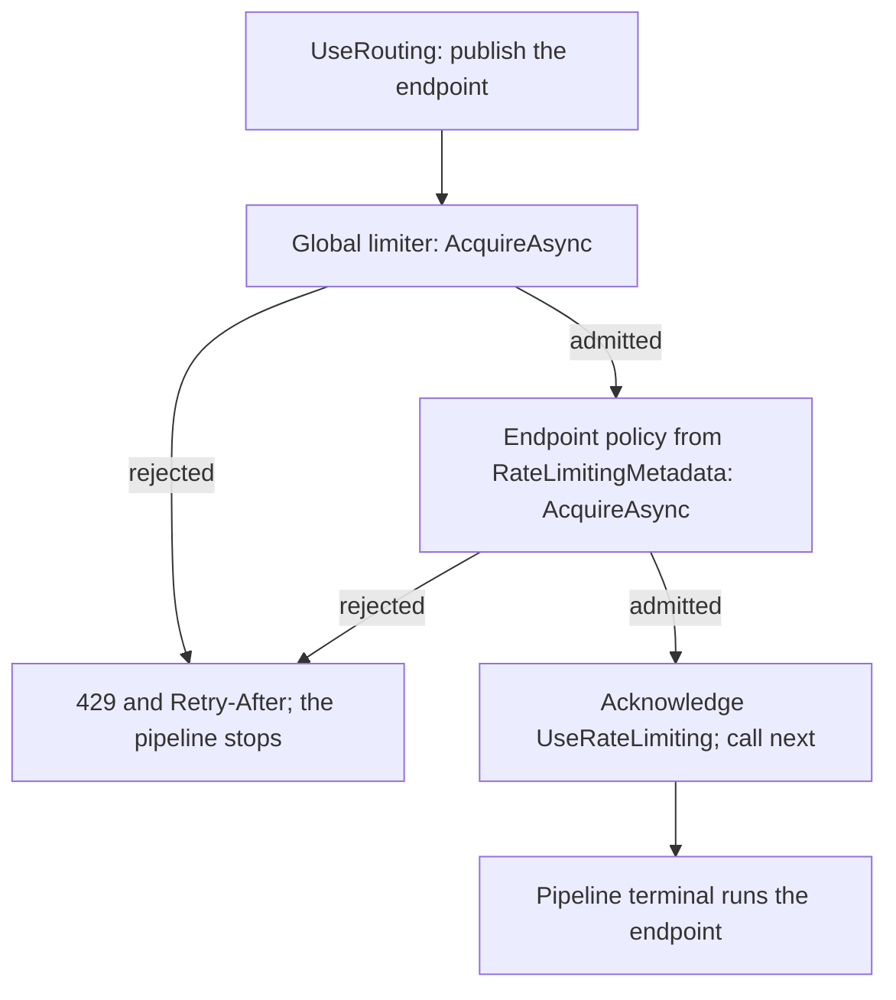

# Assimalign.Cohesion.Web.RateLimiting design

This page describes the boundaries and implementation shape of `Assimalign.Cohesion.Web.RateLimiting`.

> **Status:** Partial.

## Design intent

Inbound rate limiting is table stakes for an enterprise web server, and the platform already carries
the asset it should be built on: the BCL `System.Threading.RateLimiting` package (pinned `10.0.0`,
AOT-safe), which supplies all four limiter algorithms — fixed window, sliding window, token bucket,
concurrency — plus partitioning and queueing. This package therefore supplies only the
**Web-pipeline surface**: the middleware, the policy model, the partition-key selectors, and the
rejection response. It **never reimplements a limiter** — no token bucket, no window accounting.
That boundary is the whole point (issue
#783): Cohesion adapts the BCL primitives, matching the Resilience area's stated intent for the
client-side limiter (`Assimalign.Cohesion.Resilience.RateLimiting`).

The package owns: two options-carried hooks, one options object, one sealed policy type, one sealed
metadata carrier, a static partition-key helper, a typed feature, and one
`extension(IWebApplicationPipelineBuilder)` verb. Everything request-time is an `AcquireAsync`
against a prebuilt limiter and a status write.

## The policy model — a global limiter plus named policies, additive

`RateLimitingOptions` carries a `GlobalPolicy` and a set of named policies (`AddPolicy`). A
`RateLimitingPolicy` is a `PartitionedRateLimiter<IHttpContext>` plus a permit count — built once,
at builder time.

- **The global limiter is the must-have.** It is applied to **every** request that reaches the
  middleware and acquired **up-front**, before any downstream work, with the limiter's **full queueing
  semantics** (`AcquireAsync`). It is the primary flood shield, and it needs no endpoint, so it works
  wherever the middleware is registered.
- **Named policies attach per-endpoint** through `RateLimitingMetadata` in the routing metadata bag. A
  per-endpoint policy is evaluated **in addition to** the global limiter — **both must grant a lease** —
  and is acquired the same way, asynchronously and with queueing.

### Why additive, not replace

`Web.RequestTimeouts` (the sibling per-endpoint-metadata feature) has an endpoint policy **replace**
the global default. Rate limiting deliberately does **not**, because a rate limiter **spends a
permit** at acquisition, while a timeout only arms a timer:

- **The global limiter is the flood shield.** If endpoint metadata could replace it, one endpoint with a
  loose (or misconfigured) policy would carve a hole in the shield for everything routed to it.
- **The global limiter must not change meaning with its position.** An application that uses only the
  global limiter may keep the middleware ahead of `UseRouting`, where it runs before any endpoint is
  known and cannot consult endpoint metadata. Additive semantics are the only ones that hold in both
  positions.
- **Parity.** ASP.NET Core's `GlobalLimiter` is likewise combined with, not replaced by, endpoint
  limiters.

Before #1054 additivity was also forced: routing was terminal, so the global lease was always
acquired before the endpoint was known. Routing now publishes the endpoint first, so a replace model
would be implementable; it is rejected for the reasons above. `RateLimitingMetadata.Disabled`
removes only the **per-endpoint** gate; the global limiter still applies.

## Partition keys — trust composition and BCP 38

Partitioning is `PartitionedRateLimiter<IHttpContext>` -based, with AOT-safe selectors in
`RateLimitPartitionKeys`:

- **`ClientAddress`** reads `IHttpContext.EffectiveRemoteIp` — the `Http.Forwarded` (#778) effective
  client. When the forwarded-headers trust middleware has run and vouched for a proxy chain, this is the
  real client; otherwise it is the transport peer. Client-identity keying therefore **composes with the
  forwarded trust model for free**, and is the reason `Http.Forwarded` is a direct reference.
- **`Header`** reads a request header value — intended for values a **trusted gateway injects** (an API
  key, a tenant id).
- **A typed selector** — any `Func<IHttpContext, TKey>` — through `RateLimitingPolicy.Create`.

**BCP 38 caution (documented on the type and honored by the defaults):** never partition on
**unvalidated client-supplied** input. An attacker who can set the partition key (a spoofable
`X-Forwarded-For`, an unauthenticated header) can mint unlimited partitions and defeat the limit
entirely. `ClientAddress` is safe because it goes through the trust-gated effective identity, not
the raw header; `Header` is documented as gateway-trusted only.

## Per-endpoint mechanics — reading the published endpoint

`UseRouting` selects the endpoint and calls `next`; the pipeline's terminal runs it (#1054). A match
is published as an `IRouteMatchFeature` that every middleware registered after `UseRouting` can
read. The rate-limiting middleware sits between the two. It acquires the global lease first, then
the endpoint's own lease, then acknowledges the endpoint and calls `next`; a rejection at either
gate answers the request and stops the pipeline there, so the endpoint does not run.

- **The endpoint's policy** is the published match's `RateLimitingMetadata`, read last-wins
  (`GetMetadata<RateLimitingMetadata>()`), so an endpoint-level declaration overrides a group-level one. A
  named policy is resolved against `options.AddPolicy`; an unknown name throws
  `InvalidOperationException`, a configuration error surfaced by the first request that reaches it.
- **Declared with convention verbs (#1055).** `RequireRateLimiting(name)`, `RequireRateLimiting(policy)`
  and `DisableRateLimiting()` are generic extension members over routing's `IRouterConventionBuilder`, so
  one verb serves a mapped route and a route group and returns the receiver's own builder type. Each
  appends a `RateLimitingMetadata`; routing composes it when the route table is built, outer group first,
  so the last-wins read above resolves the most specific declaration regardless of call order.
- **Asynchronous, with queueing.** The endpoint lease is acquired exactly like the global one:
  `AcquireAsync(context, permits, context.RequestCancelled)`. A queueing limiter holds the request until a
  permit frees up. A client that goes away while queued stops the wait: the `OperationCanceledException`
  propagates (the server treats it as a clean drain) and the endpoint never runs.
- **A rejection is an ordinary short-circuit.** The middleware writes the rejection and returns without
  calling `next`. No exception carries it, so no catch-all middleware can turn it into a 500.
- **CORS preflight.** Routing publishes the candidate endpoint of a CORS preflight with `IsPreflight`
  set; the candidate never runs for the preflight, which carries no credentials. The middleware neither
  applies the candidate's policy nor acknowledges it, so a preflight never spends an endpoint permit. The
  global limiter counts it like any other request.

### Fail closed when the middleware is missing or misordered

Before #1054 routing was terminal, so the middleware had to sit **ahead** of `UseRouting` and
observe the router installing its match through a feature-collection decorator. That seam was
synchronous (`Set` is `void`), which forced a non-queueing `AttemptAcquire` on the endpoint gate and
an internal exception signal to carry a rejection back to the middleware. Both are gone.

The old position is now the hazard. Registered ahead of `UseRouting`, the middleware sees no
endpoint, so endpoint policies would silently stop applying. `RateLimitingMetadata` therefore
implements `IRouteMiddlewareMetadata`: `RequiredMiddleware` is `UseRateLimiting`, or `null` for
`Disabled`. The middleware acknowledges every non-preflight endpoint it processes
(`context.AcknowledgeEndpointMiddleware("UseRateLimiting")`), whether or not it found a policy,
because routing checks every metadata item that names the middleware, including a group-level policy
an endpoint-level `Disabled` overrides. When routing dispatches an endpoint whose metadata names
`UseRateLimiting` and the request was never acknowledged, it throws `InvalidOperationException`
naming the endpoint and the middleware instead of running the endpoint without its limit. The global
limiter needs no endpoint and keeps working in either position.

## Queueing semantics

`QueueLimit`/`QueueProcessingOrder` pass through the BCL limiter options unchanged — the package
configures nothing about queueing itself. Both gates acquire with `AcquireAsync` and **honor
queueing fully**: a request waits for a permit up to the queue limit, and stops waiting when the
request is cancelled. The global lease is acquired first and held while the request waits in an
endpoint policy's queue, so a queued request still counts against a global concurrency limiter.

## Ordering

`UseForwardedHeaders` → `UseRouting` → `UseRateLimiting` → … → endpoint.

- **After `UseForwardedHeaders`**, so `RateLimitPartitionKeys.ClientAddress` keys on the effective client.
- **After `UseRouting`**, so the endpoint and its `RateLimitingMetadata` are published when the middleware
  runs. Registered ahead of `UseRouting`, the global limiter still applies to every request, but an
  endpoint whose metadata names a policy fails at dispatch (see "Fail closed" above).

## Lifetime and disposal posture

Limiters are built **once**, at builder time, and live for the **application lifetime**. A
`PartitionedRateLimiter<T>` is `IAsyncDisposable`, but the Web pipeline exposes **no disposal
hook** a feature package can attach to — so the accepted posture is **process-lifetime**: the
middleware holds the limiters and they are reclaimed at process exit, along with the internal
replenishment timers the window and token-bucket limiters run. This is recorded honestly rather than
hidden; a pipeline-level disposal hook is a recorded follow-up. **Per-request leases** are a
separate concern and *are* released deterministically: each acquired lease is held on the feature
and disposed when the request completes (the middleware's `finally`), which is the lifetime a
concurrency limiter's permit requires.

## Rejection handling

On rejection the middleware sets the configured status (`RejectionStatusCode`,
`429 Too Many Requests` by default — RFC 6585 §4 / RFC 9110 §15.5.30) and, when the lease published
`MetadataName.RetryAfter`, a `Retry-After` header (delta-seconds via `HttpHeaderKey.RetryAfter`).
The window and token-bucket limiters publish that hint; the concurrency limiter does not, so it is
genuinely optional. The `OnRejected` hook is invoked **after** the status and header are set, so it
observes and may override them or write a body; the default is **bodyless**, which composes with the
status-code-pages middleware (#881) that can upgrade the bare 429. A rejection on an
**already-committed response head** (detected via the response-streaming feature) cannot rewrite the
status, so the exchange is aborted at the protocol layer instead — the same defensive path
`Web.RequestTimeouts` takes. In normal use this never trips, because both gates run before `next`;
only a middleware registered ahead of rate limiting could have committed the head.

## Telemetry — the observation hook, not OpenTelemetry

The issue asked for lease acquired/rejected/queued counters wired through Cohesion
OpenTelemetry/Logging at composition time. That is **re-scoped**: a feature package cannot reach a
hosting-layer OTel/Logging seam without referencing `Web.Hosting`, which `COHRES001` forbids.
Instead the package offers a **lightweight, dependency-free observation hook** —
`RateLimitingOptions.OnDecision`, invoked with an immutable `RateLimitingDecision` (policy name,
admitted/rejected, retry-after) for each limiter decision. Wiring that hook to a Cohesion
OTel/metrics seam at hosting-composition time is a recorded follow-up candidate. "Queued" is not
surfaced separately: the BCL does not expose a per-lease queued signal cleanly, and the
admitted/rejected decision is what the hook reports.

## AOT posture

Options resolve to prebuilt limiters and captured delegates at registration; request-time work is an
`AcquireAsync` per gate, a metadata read, and a header set. No reflection, no configuration binding,
no service location, no runtime code generation. The partition-key selectors are plain delegates.
The BCL engine is AOT-safe.

## Non-goals

- **No limiter algorithm.** Cohesion never reimplements a token bucket or window; the BCL engine is the
  only algorithm source.
- **No hosting integration.** The package must not (and cannot, per `COHRES001`) reference `Web.Hosting`.
  Pipeline placement is the application's registration-order responsibility (routing's fail-closed check
  catches a misplaced middleware for endpoints with a policy), and OTel/metrics wiring is a
  hosting-composition follow-up.
- **No client-side limiter.** Outbound/execution-side rate limiting is `Resilience.RateLimiting` under
  epic #318; graduating it to the `UseRateLimiter` builder-extension model is explicitly out of scope here.
- **No replace-the-global endpoint model.** Endpoint policies are additive to the global limiter (see
  above).

## Scope-creep candidates (recorded, not taken)

- **A pipeline-level disposal hook** — so the middleware can dispose its limiters at application shutdown instead
  of relying on process-lifetime reclamation.
- **A hosting-composition seam that** — wires `OnDecision` to Cohesion OpenTelemetry/metrics without a
  feature-package → hosting reference.
- **Surfacing the BCL "queued"** — transition to `OnDecision` if a clean per-lease signal becomes available.

## Testing

`tests/RateLimitingMiddlewareTests.cs` drives the middleware through its public verb over a
capturing pipeline builder and an `IHttpContext` double (`tests/TestObjects/`); a stage ahead of the
middleware publishes a fake route match, which is what `UseRouting` does.
`tests/RateLimitingEndToEndTests.cs` drives it over the in-memory `WebApplicationTestFactory` with
the real router. Determinism comes from a **fixed-window, one-permit** policy: a window limiter does
not return its permit on lease disposal, so a second same-window request is rejected with **no
timing dependency** (the window is an hour, far beyond any test). The **concurrency** limiter
(permit returned on completion) covers the "permit held for the request lifetime" semantic through
two genuinely concurrent unit-level executions, and, with a one-request queue, the queueing endpoint
gate: the test waits on the limiter's `CurrentQueuedCount` rather than a delay, so it knows the
second request is parked before releasing the first. The in-memory driver's default HTTP/1.1
connection dispatches one exchange at a time, so an intra-connection concurrency test over it would
deadlock; HTTP/2 streams are dispatched concurrently (#1049), so an end-to-end concurrency test
needs the factory's HTTP/2 protocol. Coverage: admit/reject, the 429 + `Retry-After` answer, a
custom rejection status, the `OnRejected` and `OnDecision` hooks, forwarded-composing client-address
partitioning, named / inline / disabled / unknown per-endpoint policies, the global-then-endpoint
decision order, queueing and cancellation while queued on the endpoint gate, the CORS-preflight skip
(unit and through the real router), the committed-head abort, the concurrency permit hold, and
registration ahead of `UseRouting` (the global limiter still gates; an endpoint with a policy fails
at dispatch).

## Declared dependencies

| Reference | Kind |
|---|---|
| `Assimalign.Cohesion.Web` | `CohesionProjectReference` |
| `Assimalign.Cohesion.Web.Routing` | `CohesionProjectReference` |
| `Assimalign.Cohesion.Http` | `CohesionProjectReference` |
| `Assimalign.Cohesion.Http.Forwarded` | `CohesionProjectReference` |
| `Assimalign.Cohesion.Http.Streaming` | `CohesionProjectReference` |

[Assembly overview](index.md) · [Examples](examples/index.md)

## Sources

- **Primary source** — `cohesion/resources/Web/Assimalign.Cohesion.Web.RateLimiting/docs/DESIGN.md`.
- **Source** — `cohesion/resources/Web/Assimalign.Cohesion.Web.RateLimiting/src/Assimalign.Cohesion.Web.RateLimiting.csproj`.
