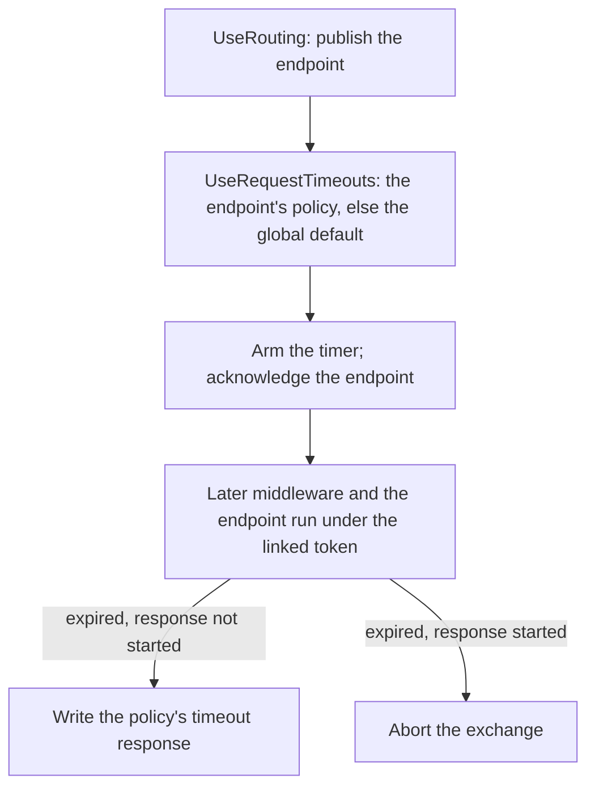

# Assimalign.Cohesion.Web.RequestTimeouts design

This page describes the boundaries and implementation shape of `Assimalign.Cohesion.Web.RequestTimeouts`.

> **Status:** Partial.

## Design intent

Arm the per-exchange abort primitive the protocol core already ships (#703:
`IHttpContext.RequestCancelled` + `Cancel` /`CancelAsync`) with a *policy layer*: a builder-time
global default, per-endpoint overrides on the #150 endpoint-metadata seam, and an ASP.NET-parity
translation of expiry into a 504 (or a clean protocol-level abort once the response has started).
The package is a plain Web feature library under the middleware-first composition model: one
`UseRequestTimeouts` verb, values captured at builder time, no service container, no request-time
service location, no transport changes.

## Why expiry does NOT trip the transport cancel while the response is writable

The issue that motivated this package sketched "on expiry call `IHttpContext.CancelAsync()` … write
the configured status if the response has not started." Those two halves are mutually exclusive on
the wire, which is the load-bearing discovery of this design:

- **`Cancel`/`CancelAsync` set the transport's** — `CancelRequested` flag, and **every transport's
  send path answers that flag by resetting the exchange instead of writing a response** —
  HTTP/1.1 writes nothing and ends the connection after the exchange
  (`Http1ConnectionContext.SendAsync`), HTTP/2 sends `RST_STREAM`, HTTP/3 resets the request
  stream. A 504 written after `CancelAsync()` is silently discarded.
- **The transport token cannot** — be re-armed, and `IHttpContext.RequestCancelled` is get-only and
  transport-owned — there is no supported way to trip it *without* the reset semantics, and
  adding one would be a transport change (an explicit non-goal).

So the two intents are split by response state:

| State at expiry | Action |
| --- | --- |
| Response not started | `Cancel` downstream *work* via the linked token; write the policy's status/payload imperatively on the still-writable exchange; the transport sends it normally. `CancelRequested` is deliberately **not** set. |
| Response started (streamed head committed) | The status is already on the wire — `CancelAsync()` is the only clean answer: h2/h3 reset the stream, h1 truncates and closes. This is exactly what the #703 primitive is for. |

"Response started" is probed through `IHttpResponseStreamingFeature.HasStarted` when the streaming
feature package is composed; on the default buffered path the response cannot start while the
handler is still running, so the probe's absence correctly means "writable."

## Cancellation delivery: a decorated context, not a token swap

ASP.NET's middleware swaps `HttpContext.RequestAborted` through its request-lifetime feature.
Cohesion deleted its request-lifetime feature library (the #703 context members are its successor),
and `RequestCancelled` has no setter. The equivalent seam here is **decoration at the middleware
boundary**: `UseRequestTimeouts` passes downstream a pass-through `IHttpContext` whose
`RequestCancelled` is `linked(transport token, timeout token)`.

That single decoration makes every existing consumer timeout-aware with no contract changes:

- **Handlers reading `context.RequestCancelled` observe** — the linked token.
- The pipeline's terminal runs a routed endpoint with `context.RequestCancelled` of the context
  it receives — the *decorated* one, since the middleware sits ahead of the terminal — so
  `IRouterRouteHandler` cancellation tokens trip too.
- **`Cancel`/`CancelAsync`/`Features`/`Items` forward to the** — real context, so shared state
  never forks. The middleware retained the original context and writes the timeout response
  on it.

The linked token also trips on a genuine client abort, preserving the primitive's original meaning
downstream.

## Timeout attribution (client aborts are never mislabeled)

A downstream `OperationCanceledException` is converted to a timeout response only when
`timeout source fired && !transport token cancelled`. A client abort therefore propagates unchanged
— the server loop already treats an escaping OCE as a clean per-connection drain — and when both
race, the client abort wins (nothing can be delivered anyway). A handler that swallows the
cancellation and completes keeps the response it produced, matching ASP.NET. The filter deliberately
keys off the middleware's own state, not `OperationCanceledException.CancellationToken`, because
the throwing token is often a *further-linked* token (one a handler or a client library linked off
the request token), not ours.

## Per-endpoint policy: reading the published endpoint

`UseRouting` selects the endpoint, publishes it as an `IRouteMatchFeature` and calls `next`; the
pipeline's terminal runs it (#1054). `UseRequestTimeouts` is registered between the two — the
position ASP.NET's timeout middleware occupies — and picks the effective policy when the exchange
reaches it:

- The published match's `RequestTimeoutMetadata` (last-wins over the bag) **replaces** the global
  default outright, a disabled policy included. With no metadata — or no match at all (404, 405) —
  the global default governs.
- The timer is armed **once**, with the effective policy, when the exchange reaches the
  middleware. The endpoint's budget belongs to the middleware and endpoint downstream of it, not
  to route-table evaluation or anything registered ahead. `SetTimeout` re-arms from the moment
  of the call, like `CancellationTokenSource.CancelAfter`.
- **CORS preflight.** Routing publishes the candidate endpoint of a CORS preflight with
  `IsPreflight` set; the candidate never runs for the preflight, so its policy is not applied (the
  global default governs the preflight) and it is not acknowledged.

Before #1054 routing matched **and** dispatched in one middleware, so this middleware had to sit
ahead of `UseRouting` and observe the router installing its match through a feature-collection
decorator, re-arming the timer at that moment. This document anticipated that splitting match from
dispatch would collapse the observation into a plain read of the match feature between the two
phases; that is what happened, and the public surface did not change.

Alternatives rejected:

- **`Match` again inside the timeout middleware** (`IRouter.Match` is public): correct but pays
  the full route-matching cost twice per request.
- **`Resolve` the endpoint policy only when the global timer fires:** cannot honor an endpoint
  policy *shorter* than the global default (the global timer fires too late), and cannot arm
  anything when no global default exists.
- **Teach the router about timeouts** (arm around `Handler.InvokeAsync`): routing routes; a
  cross-cutting policy inside the router is the wrong ownership and would splinter the policy
  surface across two packages.

### Fail closed when the middleware is missing or misordered

Registered ahead of `UseRouting`, the middleware sees no endpoint, so an endpoint's timeout would
silently stop applying and the endpoint would run under the global default, or unbounded when there
is none. `RequestTimeoutMetadata` therefore implements `IRouteMiddlewareMetadata`:
`RequiredMiddleware` is `UseRequestTimeouts` when the policy carries a timeout. The middleware
acknowledges every non-preflight endpoint it processes
(`context.AcknowledgeEndpointMiddleware("UseRequestTimeouts")`), whether or not it found a policy,
because routing checks every metadata item that names the middleware, including a group-level
timeout an endpoint-level override replaced. When routing dispatches an endpoint whose metadata
names `UseRequestTimeouts` and the request was never acknowledged, it throws
`InvalidOperationException` naming the endpoint and the middleware instead of running the endpoint
unbounded.

- **A disabling policy requires nothing** (`RequiredMiddleware` is `null` when `Timeout` is
  `null`, `RequestTimeoutMetadata.Disabled` included). Misordered, such an endpoint runs under the
  global default: bounded, the safe direction. Requiring the middleware would also fail every
  application that marks an endpoint disabled without using request timeouts at all.
- **Debugger suspension still acknowledges.** Enforcement is suspended there, not missing, so an
  endpoint with a timeout runs normally under an attached debugger.

## The timer: one unarmed CTS per exchange, TimeProvider-bound

Each governed exchange owns two sources: a timeout source constructed
`new CancellationTokenSource(Timeout.InfiniteTimeSpan, options.TimeProvider)` and the linked source
described above. Creating the timeout source *unarmed but with the provider* is deliberate:

- **the `(delay, TimeProvider)` constructor is what binds `CancelAfter` to the provider** — a
  bare CTS re-armed later would silently fall back to system timing;
- the source must exist even when no policy is in effect, because a handler's `SetTimeout` can
  arm it when neither the endpoint nor the global default has a timeout;
- the effective policy then arms it once, and disable is `CancelAfter(InfiniteTimeSpan)` — the
  same one-timer re-arm as every other transition, so there is no timer allocation churn per
  change.

`CancelAfter` after the source has fired is inherently a no-op, which yields the documented race
semantic of `Disable`/`SetTimeout` (effective only before expiry) — the same race ASP.NET documents
for `DisableRequestTimeout`. Cost when the middleware is registered but nothing arms: two small
allocations per request (the timeout source and the linked source).

## Policy and metadata shape

- **`RequestTimeoutPolicy`** — is an immutable init-only value object; a `null` `Timeout` *is* the
  disabled spelling (`RequestTimeoutPolicy.Disabled` is the shared instance). `Disable` is policy
  **data**, not an attribute — attributes would need reflection or a translation layer under
  AOT, and the metadata bag already gives last-wins override composition for free.
- `RequestTimeoutMetadata` is a **sealed concrete carrier with no interface of its own** per the
  repo's metadata-carrier discipline (`RouteNameMetadata`/`RouteHostMetadata` precedent): the
  sealed type is the contract, guaranteeing the validated, immutable policy consumers read. It
  implements routing's `IRouteMiddlewareMetadata` only to name the middleware that must honor it
  (see "Fail closed" above).
- **An endpoint policy **replaces**** — the effective policy outright (timeout *and* response
  members); policies do not merge member-by-member — merging invites "where did this status
  come from" archaeology.
- Applications declare it with the convention verbs (#1055) `WithRequestTimeout(TimeSpan)`,
  `WithRequestTimeout(RequestTimeoutPolicy)` and `DisableRequestTimeout()`: generic extension
  members over routing's `IRouterConventionBuilder`, so one verb serves a mapped route and a route
  group. Each appends a `RequestTimeoutMetadata`, which routing composes when the route table is
  built, outer group first; the last-wins read resolves the most specific declaration.
- **The timeout response** — `WriteResponse` (imperative, owns everything) beats
  `WriteProblemDetails` (RFC 9457 payload via `Web.ProblemDetails`) beats the bare status.
  Before writing, staged response state is reset (headers cleared, buffered body truncated) —
  the imperative analog of ASP.NET's `Response.Clear()`.

## Feature lifecycle

`IRequestTimeoutFeature` is installed on the *real* feature collection for the duration of the
middleware scope and removed before its cancellation sources are disposed, so later pipeline stages
can never resolve a feature with disposed state. When the middleware is not registered — or is
suspended for an attached debugger — no feature exists and `Features.Get<IRequestTimeoutFeature>()`
returns `null`, which is the discoverable "no timeout governance" signal.

## Ordering and composition constraints

- `UseRequestTimeouts` must be registered **after** `UseRouting` and before anything
  long-running it should govern: it reads the endpoint `UseRouting` published, and it wraps
  only its downstream. Registered ahead of `UseRouting`, the global default still governs every
  request, but an endpoint whose metadata carries a timeout fails at dispatch (see "Fail closed"
  above).
- **Registration is expected once** — per pipeline. Nesting is not harmful (the innermost scope's
  token is what downstream observes) but has no defined use.
- Debugger suspension (`Debugger.IsAttached`, checked per request) skips the entire scope —
  no timer, no decoration, no feature — mirroring ASP.NET. It still acknowledges the endpoint.

## AOT posture

No reflection anywhere: policy resolution is an `is` -test scan over the metadata bag, the problem
payload rides `Web.ProblemDetails` ' `Utf8JsonWriter` -based writer, timers are `TimeProvider`
/`CancellationTokenSource` plumbing, and the feature is resolved by type test. Nothing in the
package (or its tests) needs dynamic code.

## Non-goals

- **No connection/parse-phase timeouts.** Keep-alive, request-head, and body data-rate
  enforcement are transport limits (#791/#810, `HttpServerLimits`) — this package governs
  *application execution time* only, from the moment the exchange enters the middleware.
- **No attribute surface.** Policies attach as metadata objects at map time; an attribute
  translation belongs to whatever source-generated mapping layer arrives later (#796).
- **No per-route timer wheel or shared scheduler.** One CTS per governed exchange is the
  simplest correct thing; optimize only with evidence.
- **No 504 after the response has started** — physically impossible; the started path aborts.
- **No Microsoft.Extensions dependencies, no separate hosting wiring.** The package composes
  purely against the Web root's builder seams and ships to applications via `App.Web`.

## Declared dependencies

| Reference | Kind |
|---|---|
| `Assimalign.Cohesion.Web` | `CohesionProjectReference` |
| `Assimalign.Cohesion.Web.Routing` | `CohesionProjectReference` |
| `Assimalign.Cohesion.Web.ProblemDetails` | `CohesionProjectReference` |
| `Assimalign.Cohesion.Http.Streaming` | `CohesionProjectReference` |

[Assembly overview](index.md) · [Examples](examples/index.md)

## Sources

- **Primary source** — `cohesion/resources/Web/Assimalign.Cohesion.Web.RequestTimeouts/docs/DESIGN.md`.
- **Source** — `cohesion/resources/Web/Assimalign.Cohesion.Web.RequestTimeouts/src/Assimalign.Cohesion.Web.RequestTimeouts.csproj`.
