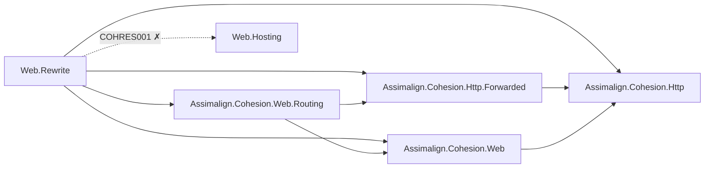
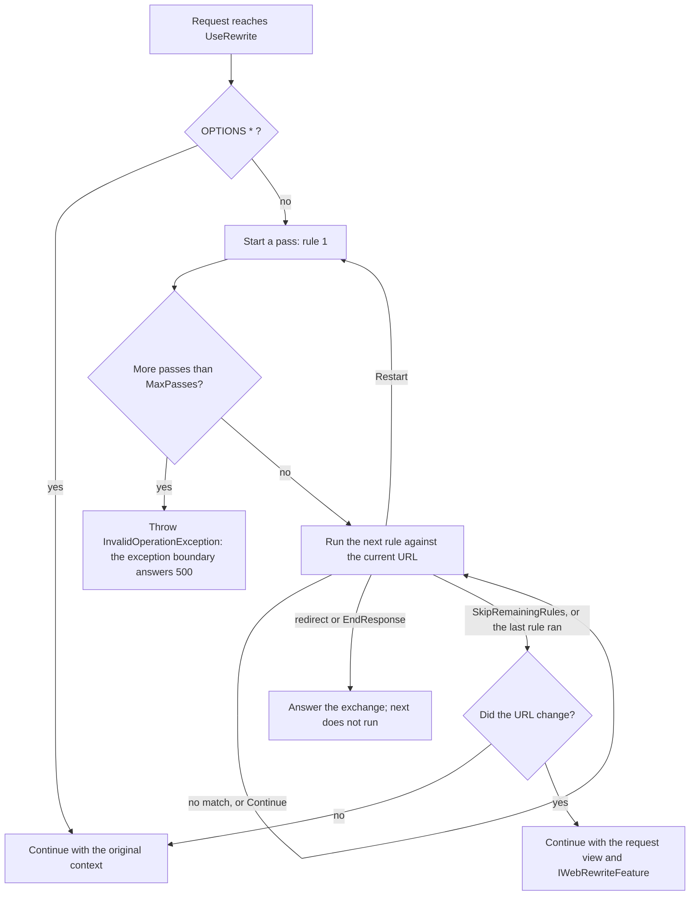

# Assimalign.Cohesion.Web.Rewrite design

This page describes the boundaries and implementation shape of `Assimalign.Cohesion.Web.Rewrite`.

> **Status:** Partial.

## Design intent

A Cohesion application terminates its own HTTP traffic. There is no IIS or nginx rewrite tier
assumed in front of it, so the URL work such a tier usually does has to be expressible in the
application: canonical URLs (scheme, host, trailing slash, case), migration of legacy paths, and
internal rewrites that map a public URL onto the resource that serves it. This package is that work
as one pipeline verb, `UseRewrite(rules => ...)`, over code-first rules registered at composition
time (#782).

The package owns the `UseRewrite` verb, the `RewriteOptions` rule list, the `IRewriteRule` and
`IRewriteContext` contracts for custom rules, the `IWebRewriteFeature` that keeps the original URL
readable, the `RewriteFlow` and `RewriteMatchTarget` enums, and the internal engine: the middleware,
the request view, the target parser and the built-in rules.

It references the Web root, `Web.Routing`, `Http` and `Http.Forwarded`, and nothing else. Like every
Web feature it never references `Web.Hosting` or a `Hosting*` library (`COHRES001`, `COHRES004`). In
the graph an arrow means "references"; the dotted edge is the reference the build rejects, because a
feature library never references the area's runtime module.

**Why `Web.Routing`.** The rewrite runs ahead of routing and uses none of the router's types. It
references the package for the path-branch view: inside `Map(path)` the rules read
`IWebPathBaseFeature` and `context.GetEffectivePath()`, and a rewrite publishes its own
`IWebPathBaseFeature` (see "Path branches"). Both lived in the Web root until #1379 moved them, with
`Map(path)` itself, to `Web.Routing` (owner decision 33: the root holds no feature contracts). The
reference adds nothing to an application's closure, since `App.Web` carries `Web.Routing` already.

## The decision this implements: a request view

`IHttpRequest` is immutable: `Path` and `Query` are get-only and owned by the transport. The Web
area's ADR 1 (`cohesion/docs/resources/Web/DECISIONS.md`, plan §7.4 decision 17) settled how a
rewrite still reaches the rest of the pipeline. **A rewrite hands the rest of the pipeline a request
view**: an `IHttpContext` whose `Request.Path` and `Request.Query` are the rewritten values and whose
every other member is the original's. The original values stay readable through
`IWebRewriteFeature`.

Two alternatives were rejected:

- **An effective-path feature** would have needed every reader of `Request.Path` and
  `Request.Query` (20 call sites in 10 packages, plus the endpoint generator's emitted binders) to
  migrate, and a reader that was missed would silently ignore the rewrite: routing and static files
  disagreeing on the path would be a security-relevant inconsistency.
- **A settable path on a transport feature** would have mutated shared transport state and broken
  `IHttpRequest`'s immutability for every consumer.

The view makes every existing reader correct without changing it, and it is the pattern
Web.Compression (`RequestDecompressionHttpContext`) and Web.RequestTimeouts
(`RequestTimeoutHttpContext`) already established.

### How the view is built

`RewriteHttpContext` wraps the context the middleware received. Its `Request` is a
`RewriteHttpRequest` that carries the rewritten `Path` and `Query` and forwards `Host`, `Method`,
`Scheme`, `Headers`, `Trailers` and `Body` to the request it wraps, which may itself be another view
(a decompressed body, for example). The request's `HttpContext` is the rewrite view, so a component
that reaches the exchange through the request stays on the rewritten URL. Every other context member
(`Response`, `Features`, `Items`, `ConnectionInfo`, `RequestCancelled`, `Cancel`) forwards, so
response state, features and cancellation never fork.

The middleware creates a view only when the rules changed the URL. A request no rule rewrote
continues with the context the middleware received, and so does a rewrite back to the same path
with the same query.

### `IWebRewriteFeature`

The first rewrite of a request publishes the feature with the request's path and query as the
middleware received them, which are the values the client sent. A later rewrite (a second
`UseRewrite`, or one inside a branch after one at the application level) keeps the first one's
originals. The feature lives only while the rest of the pipeline runs: the middleware removes it
when `next` returns, so it is present exactly where `Request` carries rewritten values.

### The pitfall the view carries

A component that holds a context across `next` sees the values of the context it holds. For the
middleware registered ahead of `UseRewrite` that is intended: an access log, the exception boundary
and the server's own request telemetry describe the URL the client sent. It is a trap for a
middleware that captures the context before the rewrite and expects to see the rewrite after `next`
returns. Two further consequences:

- **A URL built after the rewrite from `Request.Path` carries the rewritten path.** The cookie
  authentication handler's sign-in return URL is one such URL. Read `IWebRewriteFeature.OriginalPath`
  for the client's URL.
- **`context.Response.HttpContext` is the original context**, because the response is shared rather
  than wrapped. Reach the request through the context you were handed, not through the response.

The same holds for every view in the area, so it is documented here rather than worked around.

## Path branches

A path branch publishes `IWebPathBaseFeature`: the prefix it matched (`PathBase`) and the path below
it (`Path`), with `Request.Path` left whole. Inside a branch the rewrite works on the branch's terms
(ADR 1, decision 3):

- **The rules see the effective path**, the path below the prefix, and `IRewriteContext.PathBase`
  reports the prefix. A rule written inside `Map("/docs")` matches `/old/intro`, not
  `/docs/old/intro`.
- **A rewrite publishes a matching `IWebPathBaseFeature`**: the same `PathBase` over the rewritten
  path, in the slot the branch's own feature uses (the feature collection is keyed by the contract's
  name, so a reader resolves exactly one). `Request.Path` on the view is the path base followed by
  the rewritten path: `/docs/old/intro` rewritten to `/new/intro` reads `/docs/new/intro`. The
  branch's own feature comes back when `next` returns.
- **A redirect's target path is relative to the path base**: `/new/$1` in `Map("/docs")` answers
  `Location: /docs/new/...`. An absolute `http` or `https` target is written as it is. To redirect
  outside the branch, use an absolute URL.

An application-level rewrite ahead of a branch decides which branch runs, because `Map` matches the
effective path of the context it receives, which is the view.

## Rule evaluation

The rules run in registration order, each once, in a **pass**. Each rule sees the URL as the rules
before it left it, through `IRewriteContext.Path` and `Query`. A rule acts in one of these ways:

| Action | Rule evaluation | The pipeline |
| --- | --- | --- |
| None | Next rule | — |
| Rewrite, `RewriteFlow.Continue` (default) | Next rule, on the rewritten URL | Continues with the view |
| Rewrite, `RewriteFlow.SkipRemainingRules` | Ends | Continues with the view |
| Rewrite, `RewriteFlow.Restart` | A new pass from the first rule, on the rewritten URL | — |
| `SkipRemainingRules()` without a rewrite | Ends | Continues |
| Redirect | Ends | Ends with the redirect |
| `EndResponse()` | Ends | Ends with the rule's own response |

The diagram traces one request through the middleware; an arrow reads "goes to".

### Stopping and restarting

**A rule can stop evaluation**, the way ASP.NET Core's `SkipRemainingRules`, IIS's `stopProcessing`
and mod_rewrite's `[L]` do: a rewrite registered with `RewriteFlow.SkipRemainingRules`, or a
delegate rule calling `IRewriteContext.SkipRemainingRules()`, which is how a guard keeps a path out
of the rules below it. **A rule can also restart evaluation**, the way mod_rewrite's `[N]` and
nginx's `last` do, so an earlier rule applies to a later rule's output.

### Loop protection

Restart is the only way a rule set can loop, because a pass runs each rule once.
`RewriteOptions.MaxPasses` (default `10`, nginx's bound for the same loop) bounds the passes a
request may take. A request that would need more fails with an `InvalidOperationException` naming
the bound. A rule set that keeps restarting has a bug, and a `500` that surfaces it is better than a
request that spins or a silent half-rewrite. The bound is per middleware: a second `UseRewrite` has
its own, and there is no re-execution of the pipeline that could chain them.

The canonicalization helpers cannot loop the client either: each is idempotent, so the URL it
redirects to is one it leaves alone. A pair of hand-written redirects that point at each other is a
client-side loop the server cannot see; browsers stop it.

### Why the rules are synchronous

`IRewriteRule.Apply` returns nothing. Every rule kind this package ships decides from the request in
hand, and a synchronous rule costs no state machine on the path every request takes. A rule that
needs I/O (a redirect table in a database, say) is better written as its own middleware, which can
cache and fail on its own terms.

## Pattern rules

`AddRewrite` and `AddRedirect` take a pattern and a target. A string pattern is compiled once, at
registration, as an **interpreted**, culture-invariant, case-sensitive regular expression with a
one-second match timeout: the input is the client's URL, and the timeout bounds a backtracking
pattern. A caller-supplied `Regex` is used as it is, with its own options and timeout. That is how
to get `RegexOptions.NonBacktracking` (linear-time matching, no lookarounds or backreferences) or a
source-generated `[GeneratedRegex]` (compiled-speed matching under NativeAOT). The package never
creates a `RegexOptions.Compiled` regex: under NativeAOT it falls back to the interpreter anyway, and
it emits IL at run time under the JIT.

### What a pattern matches

`RewriteMatchTarget.Path` (the default) matches the path as routing sees it: percent-decoded,
starting with `/`, and inside a branch the path below the prefix. Unlike mod_rewrite and ASP.NET
Core, the leading `/` is kept, so a pattern reads like the URL. `RewriteMatchTarget.PathAndQuery`
matches the path, then `?` and the query when there is one. The raw query string is not carried on
`IHttpRequest`, so the query is rebuilt from the parsed collection: each key and value
percent-encoded, joined with `&` in enumeration order, a key with an empty value written without
`=`. This is the same rebuilding Web.HttpsPolicy's redirect does.

### Target syntax

A target is URL text: a path that starts with `/` (or with a substitution), an optional `?query`,
and for a redirect an optional `#fragment`. A redirect may instead target an absolute `http://` or
`https://` URL; a rewrite may not, because a rewrite changes which resource this application serves,
not which origin. `$n` and `${n}` substitute capture group `n` (`$0` is the whole match), `${name}`
a named group, and `$$` is a literal `$`. A `$` that starts none of these is literal, as in .NET
replacement patterns. Unlike .NET, a reference to a group the pattern does not define is an
`ArgumentException` at registration, not literal text, so a typo fails at startup.

A target without `?` keeps the request's query, a target with one replaces it, and a target that
ends in `?` removes it, as mod_rewrite does. There is no flag that merges the two queries; a
delegate rule can.

### The encoding model

The request path is decoded once by the transport, and nothing may decode it again: a second decode
turns a client's `%2541` into `A`, which is exactly the discrepancy path-traversal and filter-bypass
attacks look for (Web.StaticFiles depends on the transport decoding once). ASP.NET Core's rewriter
parses its substituted target as a URI component, so a decoded capture is decoded twice there. This
package treats the target as URL text and percent-encodes each capture for the part of the URL it
lands in:

| Capture from | Into the path | Into the query, fragment or authority |
| --- | --- | --- |
| The decoded path | Escaped except `/`, unreserved and sub-delimiter characters, `:` and `@` | Escaped except unreserved characters |
| The re-encoded query | As it is (already encoded) | As it is |

The expansion is then parsed back the way a transport parses a request target:
`HttpPath.FromUriComponent` for the path and `HttpQuery.Parse` for the query. Every value is decoded
exactly once, and a capture can never add a query parameter (`/search/a&admin=true` into `?q=$1`
stays one `q`), a fragment, or a host. A target's literal text is taken as written, with characters a
URL cannot carry (a space, non-ASCII text) percent-encoded at registration and a valid `%XX` kept.

A rewrite's literal text that decodes to a path no request can carry (a space, `?`, `#`, a control
character or NUL, which `HttpPath` rejects on every transport) is an `ArgumentException` at
registration, as is a literal query entry without a key. When a *capture* makes the target
undecodable, for example a query value with a space moved into the path, the rule answers
`400 Bad Request` and ends the exchange. That is what a transport answers for the same request
target sent directly, and the client's input is what made it invalid.

### Predicate and delegate rules

A predicate rule (`AddRewrite(predicate, target)`, `AddRedirect(predicate, target)`) has no pattern,
so its target is fixed: it is parsed once, at registration, and cannot substitute. A delegate rule
(`Add(context => ...)`) and a custom `IRewriteRule` act through `IRewriteContext`:

- `Rewrite(path, query, flow)` with a decoded `HttpPath`;
- `Redirect(location, status)` with a `Location` written as given (already encoded, not made
  relative to the path base);
- `SkipRemainingRules()`;
- `EndResponse()` after writing a response through `HttpContext`.

Actions are recorded and applied once the rule returns, so a rule that throws leaves the response
untouched. A rule that has redirected or ended the response can take no further action.

## Redirects

A redirect answers with the status and `Location` and nothing else. Being a `3xx`, it is below the
range `UseStatusCodePages` fills. The statuses are `301` and `308` for a permanent move and `302` and
`307` for a temporary one; `307` and `308` keep the request method and body (RFC 9110 §15.4), `301`
and `302` let a client switch a `POST` to `GET`. `AddRedirect` defaults to `302`, as ASP.NET Core
does, because a permanent redirect is cached by browsers and a mistaken one is hard to take back.
The canonicalization helpers default to `308`. Anything other than the four statuses is an
`ArgumentOutOfRangeException` at registration: `303` answers with a different resource rather than
moving this one, and the other `3xx` codes are not redirects a client follows.

The `Location` is percent-encoded: the path base and path through the path escaping above, the query
in its re-encoded form. Web.HttpsPolicy and Web.StaticFiles write the decoded path into `Location` as
it is, which is not a valid URI reference when the path holds a non-ASCII character or a literal `%`.
A shared redirect helper for the three is an open item in ADR 1 ("To revisit"); until then the
helper here stays internal.

A relative `Location` that starts with `//` is a network-path reference: a client reads its first
segment as a host. A capture can produce one (`/go//evil.example` matched by `^/go/(.*)$` into
`/$1`), so with no path base ahead of it the leading slashes collapse to one and the redirect stays
on this origin. A backslash, which browsers read as a slash, is always percent-encoded. A capture
substituted into the authority of an absolute target is fully escaped, so it cannot add a `/`, `@`
or `?`; a target that puts a capture in the host redirects to a host the client chose, which is the
rule author's decision.

## Canonicalization helpers

Each helper is a redirect rule that answers only when the URL is not already in its canonical form:

| Helper | Redirects when | To |
| --- | --- | --- |
| `AddRedirectToHttps` | the effective scheme is not `https` | `https://` + host + the HTTPS port (`443` omitted) |
| `AddRedirectToWww` | the host has no `www.` prefix | `www.` + host, scheme and port kept |
| `AddRedirectToNonWww` | the host has the `www.` prefix | the host without it |
| `AddRedirectToTrailingSlash` | the path has no trailing slash, is not the root, and its last segment has no `.` | the path + `/` |
| `AddRedirectToNoTrailingSlash` | the path ends in `/` and is not the root | the path without every trailing `/` |
| `AddRedirectToLowercase` | the path has an uppercase letter | the path in lowercase (invariant culture), the query untouched |

- **Effective values.** The scheme and host are `context.EffectiveScheme` and `context.EffectiveHost`
  (decision 3): behind a TLS-terminating proxy that `UseForwardedHeaders` trusts, a forwarded
  `https` counts as secure, so the HTTPS rule never redirects a proxied request in a loop, and the
  `Location` names the host the client addressed. Without forwarded-header resolution they are the
  wire values, and a client's own `X-Forwarded-Proto` changes nothing.
- **A host the rule can echo safely.** The host helpers write the request's host into the
  `Location`. A host that is not a DNS name or IP literal (a `/`, `@`, `\` or `?` an attacker put in
  `Host`) is left alone rather than echoed. `UseHostFiltering` ahead of `UseRewrite` is still the
  allowlist.
- **Hosts never redirected.** The `www` helpers skip `localhost`, `*.localhost` and IP literals, and
  take an optional list of the hosts they apply to, compared case-insensitively.
- **One redirect per helper.** The helpers run in registration order like every rule, and the first
  that applies answers. A URL that differs in scheme and case takes two hops. Folding several
  canonicalizations into one redirect would need a rule that knows the others; a delegate rule can
  build one.
- **Inside a branch** the path helpers work on the path below the prefix: the branch root is never
  given or stripped a trailing slash, and only the path below the prefix is lowercased.

## Ordering

`UseRewrite` runs ahead of everything that reads the path: `UseStaticFiles`, `UseRouting` and the
endpoint. It runs after `UseForwardedHeaders` and `UseHostFiltering`, so the helpers read the
client's scheme and a validated host, and after `UseHttpsRedirection` and `UseHsts`. It sits inside
the exception boundary and after `UseStatusCodePages`, so a fault in a rule becomes a
problem-details response and its `400` gets a body: row 9 of the area's
[middleware order](../../../../web/middleware-order.md).

Rules see the URL as the rules before them left it, so register redirects, the helpers included,
ahead of internal rewrites. A redirect evaluated after a rewrite sends the client to the rewritten
URL, exposing an internal path. This is the order mod_rewrite, IIS and ASP.NET Core rules follow
too.

With orchestration enabled, `Web.Hosting` answers the resource control plane (`/cohesion/v1/*`) and
the Web.Health endpoints ahead of the application's pipeline, so the rules never see those requests
and cannot rewrite, redirect or canonicalize them. With it disabled, the rules see every request.

## Telemetry and logging

The server starts a request's span and records its `url.path` before the pipeline runs, from the
context the transport created, so telemetry keeps the client's path. It reads `http.route` from the
endpoint feature after the pipeline returns, and the features are shared with the view, so the route
is the one the rewritten path matched: a request to `/legacy/orders/9` rewritten to `/orders/9`
reports `url.path=/legacy/orders/9` and `http.route=/orders/{id:int}`. `UseHttpLogging`, registered
ahead of `UseRewrite`, logs the client's path too. Middleware registered after `UseRewrite` that
logs the path logs the rewritten one, and reads `IWebRewriteFeature` for the original. The package
itself emits no log entries or spans: it has no logger seam of its own, and the rewrite is visible in
the route the request reports.

`UseHttpLogging` captures the request body by setting `Body` on the transport's `HttpRequest`;
registered after a view (this one, or request decompression), it sees the view instead and does not
capture the body. That is a limit of the logging middleware's downcast, not of the view.

## Error model

| When | What | Where it surfaces |
| --- | --- | --- |
| Registration | An invalid pattern, a malformed target, a reference to an undefined group, an absolute or fragment rewrite target, a rewrite target that decodes to an invalid path | `ArgumentException` from the `Add*` call, so at startup |
| Registration | A status other than `301`, `302`, `307` or `308`; an undefined `RewriteFlow` or `RewriteMatchTarget`; an HTTPS port outside 1–65535; `MaxPasses` below `1` | `ArgumentOutOfRangeException` |
| Request | Rules restart more than `MaxPasses` times | `InvalidOperationException`; the exception boundary answers `500` |
| Request | A capture makes the target decode to an invalid path or an empty query key | `400 Bad Request`, bodyless |
| Request | A string pattern's match exceeds its one-second timeout | `RegexMatchTimeoutException`; `500` |
| Request | A delegate rule acts after ending the exchange, or passes an invalid path, location or status | The `IRewriteContext` member's own exception |

The package defines no exception type of its own: every failure above is a configuration error or a
`400`, and the BCL types say so.

## AOT posture

Interpreted, `NonBacktracking` and source-generated regular expressions are all AOT-safe; `Compiled`
is never used. Composition is plain delegates and arrays built at registration, with no reflection,
no service container and no configuration binding. The Web NativeAOT guard
(`cohesion/resources/Web/Assimalign.Cohesion.Web.Hosting/samples/Assimalign.Cohesion.Web.AotGuard`)
publishes a rewrite and a redirect rule with trim and AOT warnings as errors and exercises both over
HTTP.

## Non-goals

- **Importing mod_rewrite or IIS rule files.** Rules are code, registered at composition time; a
  file format is a parser, a trust boundary and a second syntax, for configuration the application
  can express directly.
- **Rewriting the scheme or host.** A rewrite changes which resource is served, not how the request
  arrived; that is forwarded-header resolution's job.
- **Asynchronous rules.** See [why the rules are synchronous](#why-the-rules-are-synchronous).
- **A query-merging flag** (mod_rewrite's `[QSA]`). A delegate rule can merge queries in a line.
- **Rewriting the requests the control plane answers.** See [Ordering](#ordering).

## Extending

A rule the built-in kinds cannot express implements `IRewriteRule` and registers with
`RewriteOptions.Add`. It keeps no per-request state: one instance serves every request. It reads
`IRewriteContext.Path` and `Query`, never `HttpContext.Request.Path`, which keeps the value the
middleware received.

## Declared dependencies

| Reference | Kind |
|---|---|
| `Assimalign.Cohesion.Web` | `CohesionProjectReference` |
| `Assimalign.Cohesion.Web.Routing` | `CohesionProjectReference` |
| `Assimalign.Cohesion.Http` | `CohesionProjectReference` |
| `Assimalign.Cohesion.Http.Forwarded` | `CohesionProjectReference` |

[Assembly overview](index.md) · [Examples](examples/index.md)

## Sources

- **Primary source** — `cohesion/resources/Web/Assimalign.Cohesion.Web.Rewrite/docs/DESIGN.md`.
- **Source** — `cohesion/resources/Web/Assimalign.Cohesion.Web.Rewrite/src/Assimalign.Cohesion.Web.Rewrite.csproj`.
- **Decision record** — `cohesion/docs/resources/Web/DECISIONS.md` (ADR 1).
- **Middleware order** — `cohesion/docs/resources/Web/MIDDLEWARE_ORDER.md`.
