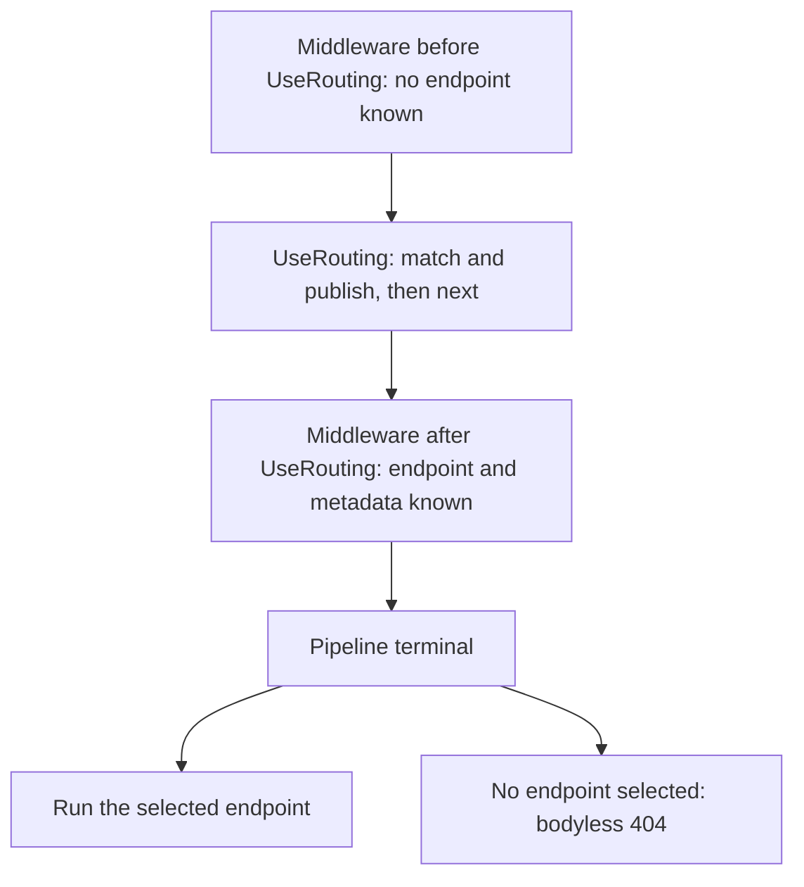
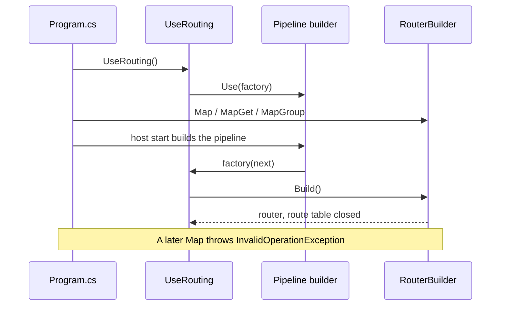

# Assimalign.Cohesion.Web.Routing design

This page describes the boundaries and implementation shape of `Assimalign.Cohesion.Web.Routing`.

> **Status:** Partial.

## Purpose

This library turns a set of registered route templates into a deterministic decision: given an
inbound `IHttpContext`, which handler (if any) should run, and — when none should — whether that is
a *no route* (404) or a *wrong method* (405) situation. It also carries the **endpoint metadata**
each route declares and surfaces the **route-match result** to the rest of the pipeline as a typed
feature. It is a foundation primitive: the typed-endpoint binding, content negotiation, named
routes, host matching and metadata consumers (issues #149, #787, #788, #796) all build on the
matcher, the typed route values, and the metadata seam defined here, so their behavior must be
predictable, standards-aware, and reflection-free. (The controller and function programming models,
#151, were set aside on 2026-07-10 when the Web area went middleware-first.)

Scope of this library:

- **`Route`** — **template parsing** into an immutable `RoutePattern` (`Patterns/`).
- **`Route`** — **parameter policies / constraints** (`Policies/`) evaluated during matching.
- **A **route** (`Route`) that** — binds a pattern, the HTTP methods it accepts, a handler, and
  its **endpoint metadata**.
- **A **router** (`Router`) that** — evaluates routes against a request with correct precedence
  and HTTP method semantics.
- **An **endpoint metadata bag**** — (`IRouterRouteMetadataCollection`) and a **route-match feature**
  (`IRouteMatchFeature`) — the reflection-free seam auth, docs, and observability consume (#150).
  Metadata objects (the bag and the built-in carriers) live under `Metadata/` in the
  `Assimalign.Cohesion.Web.Routing.Metadata` namespace, mirroring the `Patterns`/`Policies` areas.
  The read contract `IRouterRouteMetadataCollection` stays in `Abstractions/` at the root namespace
  with the other routing interfaces.
- **Host-constrained matching** (`RouteHostMetadata` in `Metadata/`, carrying the
  `RouteHostConstraint` value object from `ValueObjects/` at the root namespace), evaluated during
  candidate selection off the metadata bag (#788).
- **`Route` groups** (`IRouterGroupBuilder`, via `MapGroup`) — builder-time composition of a path
  prefix, shared parameter policies, and shared endpoint metadata onto child routes (#786).
- **Named routes and outbound URL generation** (`RouteNameMetadata` in `Metadata/`,
  `ILinkGenerator`) — the inverse direction: from a route name (or route values) back to a path
  or absolute URI (#787).
- **Minimal **pipeline integration** (`UseRouting`)** — so a web application can dispatch through
  the router.

## The matcher pipeline

```text
raw template ──RoutePatternParser──▶ RoutePattern ──┐
                                                     ├─▶ Route ──┐
     HttpMethod[] ─────────────────────────────────-┘           ├─▶ Router ──▶ RouteMatch
                                                                 │
     IRouterRouteHandler ────────────────────────────────────---┘
```

- **`RoutePattern`** is the parsed, immutable shape of a template: an ordered list of path
  segments (literals, separators, parameters), the parameters and their inline policies,
  defaults, required values, and the precomputed inbound/outbound precedence.
- **`Route`** pairs a pattern with the set of HTTP methods it accepts, the handler to
  invoke, and its endpoint metadata. Matching is split into two phases (see below).
- **`Router`** owns the collection of routes and produces a `RouteMatch` for a request.

### Two-phase matching (path, then method)

`IRouterRoute` exposes matching as two operations rather than one:

- **`TryMatchPath(context, out values)`** — matches the request **path** and validates parameter
  policies, **ignoring** the HTTP method.
- **`TryMatch(context, out values)`** — the full match: `TryMatchPath` **and** the request method
  is accepted.

Splitting the phases is what lets the router tell a genuine 404 apart from a 405. If any route
matches the path but none accepts the method, the correct response is `405 Method Not Allowed` with
an `Allow` header — not `404 Not Found`. A single combined predicate (the original design)
collapsed both into "no match" and could never produce a 405. This split is the seam the whole
405-vs-404 behavior hangs on.

## Precedence ordering (fix for the insertion-order defect)

Each `RoutePattern` carries an `InboundPrecedence` (a `decimal`) computed by `RoutePrecedence`.
Every segment contributes one digit at a decreasing decimal place, where a **lower** digit is **more
specific**:

| `Segment` kind                         | Digit |
|--------------------------------------|-------|
| Literal                              | 1     |
| Constrained parameter / multi-part   | 2     |
| Unconstrained parameter              | 3     |
| Constrained catch-all                | 4     |
| Unconstrained catch-all              | 5     |

So `/api/status` = `1.1`, `/api/{id:int}` = `1.2`, `/api/{id}` = `1.3`. **Lower is more specific
and must be evaluated first.**

The original `Router` computed precedence but never used it — it matched routes in **insertion
order** and returned the first hit. That meant registering `/api/{id}` before `/api/status` shadowed
the literal: a request for `/api/status` matched the parameter route. `Router` now sorts its
candidates **once at construction** by ascending `InboundPrecedence`, breaking ties first by **host
rank** (host-constrained routes ahead of unconstrained ones — see the host-constrained matching
section) and then by **registration order** (a stable, deterministic total order via the
`PrecedenceKey` comparer). `Routes` still enumerates in registration order; only the internal
evaluation list is reordered.

Method acceptance can still override raw precedence: the router walks candidates in precedence order
and returns the first whose path **and** method both match. A higher-precedence route that matches
the path but not the method does not block a lower-precedence route that matches both — it only
contributes to the `Allow` set if nothing ends up matching.

## HTTP method semantics

### Multiple methods per route

A `Route` accepts a **set** of methods (`Methods`), not a single one. Constructors accept either a
single `HttpMethod` (the common case) or an `IEnumerable<HttpMethod>`. Duplicate methods are
de-duplicated at construction. An **empty** method set means "accept any method" — useful for
catch-all/fallback routes.

### 405 vs 404 and the `Allow` header

`Router.Match` returns a `RouteMatch` with one of three `RouteMatchStatus` values:

- **`Matched`** — a route matched path and method; `Route` and `Values` are populated.
- **`MethodNotAllowed`** — one or more routes matched the path but none accepted the method;
  `AllowedMethods` holds the union of methods those routes accept, and `ToAllowHeaderValue()`
  formats them as an RFC 9110 `Allow` header (`"GET, POST, HEAD"`).
- **`NoMatch`** — nothing matched the path.

`RouteMatch` is a `readonly struct` so the common path allocates nothing beyond the captured route
values.

### HEAD falls back to GET

Per RFC 9110 §9.3.2 a `HEAD` request is answered identically to `GET` (headers only, no body). A
route that maps `GET` but not `HEAD` therefore **accepts** `HEAD`: the router's method- acceptance
check treats `HEAD` as satisfied by a `GET` mapping when `HEAD` is not explicitly mapped.
Symmetrically, a `405` `Allow` header for a `GET` -capable path advertises `HEAD`. An explicit
`HEAD` route still wins for `HEAD` requests, and a `HEAD` -only route does **not** answer `GET`.

The fallback lives in `Router`, not in `Route`. `Route.TryMatch` /`AcceptsMethod` report *exact*
membership so the route's declared surface stays honest; the router layers the RFC synthesis on top.
This keeps `Methods` a truthful description of what was registered while still serving HEAD
correctly end-to-end.

## Host-constrained matching (#788)

Routes can constrain the hosts they serve (multi-tenant hosts, admin-on-internal-host patterns) by
attaching `RouteHostMetadata` to their endpoint metadata (#150):

See the [source-backed usage examples](examples/index.md).

### `Constraint` grammar (`RouteHostConstraint`)

Each pattern is `host[:port]`, where `host` takes one of four forms:

| Form | Example | Matches |
|---|---|---|
| Exact host | `api.example.com` | that host only |
| Wildcard subdomain | `*.example.com` | `api.example.com`, `a.b.example.com` — **not** the apex `example.com` |
| Any host | `*` | every host (useful combined with a port: `*:5000`) |
| IPv6 literal | `[::1]`, `[2001:db8::1]:443` | brackets are the canonical form; comparison strips them, so `::1` denotes the same constraint |

- **Host comparison is **case-insensitive**** — (RFC 9110 §4.2.3 / RFC 3986 §3.2.2); ports compare exactly.
- **A port constraint requires** — the port to be **explicit** in the request's `Host` value. A request
  whose host omits the port (an implied scheme default) does not satisfy a port-constrained route —
  the matcher compares against the Host header as sent, mirroring ASP.NET `RequireHost`.
- **The constraints in one `RouteHostMetadata` are **OR-combined**** — the request host must satisfy any
  one of them.
- **Patterns are parsed **once,** — at metadata construction** (`RouteHostConstraint.Parse`/`TryParse`);
  a malformed pattern throws `RoutePatternException` at the producer, never at match time. The
  parser and matcher are span-based `IndexOf`/`EndsWith` scans — no regex, no reflection, AOT-safe.
- **The `host[:port]` **structural split** — and port parse are shared** with the `Http` layer, not
  reimplemented here: `RouteHostConstraint` delegates both to the public `HttpHost.TrySplitHostPort` /
  `HttpHost.TryParsePort` (#890). This is the same primitive `HttpHostMatcher` (#781) validates
  against, so host **selection** here and host **allowlist validation** there cannot drift on what
  a given wire value means — the bracket rules, single-colon rule, and 1–65535 port range are one
  copy of the logic.
- **The port-unconstrained leniency (deliberate, pinned).** The shared helper is the *structural*
  split only; port digits are validated as a separate step. A route that constrains no port skips
  that step entirely, so an otherwise well-formed request host carrying a **junk or out-of-range
  port** (`example.com:abc`, `example.com:0`) still matches on its host component alone. Selection
  can afford this leniency where the `Http` validation primitive (`HttpHost.TryGetComponents`,
  which fuses the port validation into the split) deliberately rejects the same value. The leniency
  is bounded to a present-but-invalid port: a *structurally* malformed authority (`example.com:`,
  `[::1`, `[::1]x`) fails the shared split and never matches, even a port-unconstrained route.
  `RouteHostConstraintTests` pins both the leniency and its structural boundary.

### Selection semantics (selects, never validates)

The router resolves each route's `RouteHostMetadata` **once at construction** — last-wins via
`GetMetadata<T>()`, so an endpoint-level declaration overrides a group-level one rather than
combining with it — and evaluates the constraints at the top of candidate selection, before path
matching:

- **A candidate whose constraints the request host does not satisfy is **skipped entirely**** — it
  cannot match, and it does **not** contribute its methods to a 405 `Allow` set. A request from a
  non-matching host falls through to the remaining candidates and, when nothing else matches,
  yields a plain `NoMatch` (404) — never a 405 advertising methods the host cannot reach.
- **A candidate whose host** — matches proceeds through the normal path → method phases, so a matching
  host with the wrong method still produces a correct 405 with `Allow`.
- **An **empty** host list (`new RouteHostMetadata()`) declares no constraint** — the route matches any
  host and ranks as unconstrained.

Host evaluation lives in `Router`, not in `Route.TryMatch` /`TryMatchPath` — the same division as
the HEAD-falls-back-to-GET synthesis: the route's two matching phases stay an honest description of
path and method, and candidate-selection concerns layer on top in the router.

**Composition with #781 (host-filtering middleware).** This feature *selects* among routes by host;
it never rejects a request. Validating the request host against an allowlist (→ 400) is the separate
host-filtering middleware's job (#781). The two compose: the middleware guards the edge, and
whatever it admits is routed — possibly onto host-constrained endpoints — by this matcher. Neither
duplicates the other.

### Ordering (the documented tie-break)

Candidate order is, in priority: **path precedence** (ascending `InboundPrecedence`), then **host
rank** (host-constrained ahead of unconstrained), then **registration order**. Concretely:

- **Host rank only breaks *ties* in path precedence** — a literal route still beats a host-constrained
  parameter route for the path the literal names.
- **Two routes with the same pattern, one host-constrained** — the constrained one is evaluated first
  for every request; requests from other hosts fall through to the open one.
- **Two host-constrained ties (e.g** — exact `api.example.com` vs wildcard `*.example.com`) keep
  registration order — exactness deliberately adds no further rank, matching ASP.NET's host
  matcher, which likewise only distinguishes "declares hosts" from "does not".

## Endpoint metadata (#150)

### Intent

Authorization, content negotiation, OpenAPI/documentation and observability all need to answer "what
policy applies to *this* endpoint?" The wrong way to do that under NativeAOT is to reflect over
handler-method attributes at request time — reflection is exactly what trimming and AOT make
unreliable. The right way is to make metadata an **explicit, first-class property of the route**,
populated at build/map time and read back by type at request time.

`IRouterRouteMetadataCollection` is that property. It is:

- **Immutable.** Contents are fixed at construction; there is no `Add`/`Remove`. Composition
  (e.g. a route group merging its metadata into each child) is done by building a *new* collection
  from concatenated items, never by mutating a shared one. Immutability makes a route safe to
  share across concurrent requests without copying.
- **Ordered.** Items keep their registration order. Order is the composition primitive: producers
  layer broader-scope metadata first and narrower-scope metadata last.
- **Typed and reflection-free.** `GetMetadata<T>()` and `GetOrderedMetadata<T>()` resolve purely by
  `is`-tests (assignability), never by reflection, dynamic activation, or attribute scanning. This
  is the Lane-F AOT guardrail: metadata is discovered, never inferred at runtime.

### `GetMetadata<T>` is last-wins

`GetMetadata<T>()` scans **from the end** and returns the first (i.e. last-registered) item
assignable to `T`. This gives the intuitive "most specific declaration wins" behavior when metadata
is layered by scope:

```text
[ group-level AuthMetadata("members"), endpoint-level AuthMetadata("admins") ]
GetMetadata<AuthMetadata>()  ->  AuthMetadata("admins")   // endpoint overrides group
```

`GetOrderedMetadata<T>()` returns **all** matches in registration order, for consumers that
genuinely aggregate. Both accept `where T : class` so the return type is a clean nullable reference,
matching the well-established endpoint-metadata idiom.

### Why a public concrete companion, not a fully-hidden impl

The repo convention is interface-first with `internal` implementations. Value-carrying collections
that downstream code must *construct* are the sanctioned exception, and the library already applies
it (`RouteValueDictionary` is public concrete; `HttpFeatureCollection` is a public concrete
companion to `IHttpFeatureCollection`). `RouterRouteMetadataCollection` follows the same pattern:
`IRouterRouteMetadataCollection` is the read contract consumers depend on, and the public sealed
`RouterRouteMetadataCollection` is the constructor producers (route mapping, route groups, source
generators — some in *other* assemblies) use to build the bag. It rejects `null` items, copies its
source array defensively, and exposes a value-type `Enumerator` for allocation-free `foreach`,
mirroring `RouteValueDictionary.Enumerator` in this same library.

### Metadata items are sealed carriers, not interface-per-concept

The bag's *item* types (e.g. `RouteHostMetadata`) are **sealed concrete data carriers, and the
sealed type is the contract** — there is deliberately no `IRouteHostMetadata` -style interface per
metadata concept. This rejects the ASP.NET convention (`IHostMetadata`, `IHttpMethodMetadata`, …
one interface per concept, attributes implementing them) for three reasons:

- **A data carrier has no behavioral variance to abstract.** Each metadata item is an immutable
  record of declared policy with exactly one plausible implementation; an interface pair per
  concept doubles the public surface without enabling anything.
- **The sealed type guarantees invariants consumers snapshot.** `Router` resolves host constraints
  once at construction; a sealed carrier guarantees the parse-once, immutable list that snapshot
  relies on, where an interface would admit implementations whose contents drift after resolution.
- **The attribute scenario is served better by translation.** Under AOT, the decorator/binding
  layer (#151/#796) translates attributes into carrier construction at map time (the source
  generator emits `new RouteHostMetadata(...)`); attributes implementing metadata interfaces —
  ASP.NET's reason for the convention — would push parsing into attribute property getters.

Type-keyed lookup is unaffected: `GetMetadata<RouteHostMetadata>()` is the same `is` -test scan, and
last-wins layering works identically. **Family rule:** new built-in metadata concepts ship as one
sealed carrier; an interface is introduced only when a second implementation demonstrably needs to
exist. The named-route carrier `RouteNameMetadata` (#787) follows the same rule.

### Metadata lives on the route

`IRouterRoute.Metadata` exposes the bag. `Route` accepts it through metadata-aware constructors; the
pre-existing constructors default to `RouterRouteMetadataCollection.Empty`, so `Metadata` is
**never null**. This keeps the addition additive: existing call sites that build a `Route` without
metadata compile and behave unchanged, and the matcher (`Route.TryMatch`/`TryMatchPath`) is
untouched by the metadata seam.

## `Route`-match state as a typed feature (#150)

### `From` `Items` strings to `Features` types

`Route` match state was previously stashed in `IHttpContext.Items` under two magic-string keys. That
is the loosely-typed, ad-hoc extensibility channel; route match state is neither ad-hoc nor
loosely-typed. It now lives in the strongly-typed `IHttpContext.Features` collection as a single
`IRouteMatchFeature`:

See the [source-backed usage examples](examples/index.md).

`Metadata` is surfaced directly on the feature because, in this routing model, **the matched route
*is* the endpoint** — there is no separate `Endpoint` type to indirect through. Consumers therefore
read one feature and reach the endpoint-metadata seam without a second hop. The feature's `Values`
carry the **typed** route values produced by type constraints (#789), so a consumer reading
`feature.Values["id"]` for `/{id:int}` gets a boxed `int` without re-parsing.

Both `Router.RouteAsync` and the `UseRouting` middleware install the feature via `SetRouteMatch` on
a successful match. Resolution is type-keyed (`context.Features.Get<IRouteMatchFeature>()`), so
there are no shared string constants across assemblies and no reflection — `Get<TFeature>()` is an
`OfType` scan.

### `Extension` surface

`HttpContextRoutingExtensions` is the ergonomic skin over the feature:

| Member | Returns | Notes |
|---|---|---|
| `SetRouteMatch(route, values)` | `void` | Installs/replaces the `IRouteMatchFeature`. |
| `GetRouteMatch()` | `IRouteMatchFeature?` | The whole feature, or `null` when unmatched. |
| `TryGetRoute(out route)` | `bool` | `Matched` route, from the feature. |
| `TryGetRouteValues(out values)` | `bool` | Captured values, from the feature. |
| `GetEndpointMetadata()` | `IRouterRouteMetadataCollection` | `Matched` route's metadata, or `Empty`. |
| `GetEndpointMetadata<T>()` | `T?` | Last-wins metadata lookup for the matched endpoint. |

When nothing has matched, the `GetEndpointMetadata*` accessors degrade to `Empty` /`null` rather
than throwing — metadata queries are safe to make unconditionally.

## `Route` groups (#786)

### Registration-time composition — the group disappears before the router exists

`IRouterBuilder.MapGroup(prefix)` (an `extension(...)` member in `RouterBuilderExtensions`) returns
an `IRouterGroupBuilder` — the `MapGroup` equivalent. A group composes three things onto its
children: a **path prefix**, **shared parameter policies**, and **shared endpoint metadata**. The
defining property is *when* composition happens: at **child registration**. Each `group.Map(...)`
joins the group's prefix and the child template as **raw text**, re-parses the composed template
through `RoutePatternParser`, and maps one ordinary fully-composed `Route` into the underlying
`IRouterBuilder`. The router never sees a group; there is no per-request prefix matching, no group
node in the match path, and a grouped route costs exactly what a directly-mapped route costs at
request time.

**Why raw-text re-parse, not segment-list splicing.** The alternative — parsing prefix and child
separately and concatenating their `RoutePatternPathSegment` lists via `RoutePatternFactory` — would
bypass the parser's cross-segment validation (duplicate parameter names, catch-all-must-be- last,
separator rules), forcing the group to re-implement those rules and inevitably drift from the
parser. Re-parsing the joined text makes the parser's existing semantics *the* conflict rules for
composition: a parameter name duplicated between prefix and child (`{id}` + `{id:int}`), a
catch-all prefix followed by child segments (`files/{*path}` + `download`), or malformed syntax all
throw `RoutePatternException` exactly as they would for a hand-written template. The cost is one
extra parse per registered child — builder-time only, and negligible.

Prefixes are templates, not strings-with-slashes: `{tenant}/api` is a valid group prefix and its
parameters capture route values like any other. Inputs are normalized (leading `~/` or `/` and
trailing `/` trimmed) so `MapGroup("/api/")` + `Map(GET, "/orders/")` composes cleanly to
`api/orders`. An **empty child template** maps the prefix itself (`GET /api/v1`); an **empty
prefix** creates a pure configuration group that only shares policies/metadata.

### Precedence falls out of composition

Because the prefix segments are part of the composed `RoutePattern`,
`RoutePrecedence.ComputeInbound` scores the full path — a literal contributed through a group
outranks a parameter at the same depth regardless of which was registered first or whether either
came from a group. No group-aware code exists in `Router` or `RoutePrecedence`.

### Deterministic sharing: policies freeze, metadata composes at build (#1055)

The two kinds of shared state follow different rules, because they are consumed at different times.

**Parameter policies are a snapshot that freezes.** A child resolves its inline policies when its
template is parsed, at registration. A nested group copies its parent's policy map
(`RouteParameterPolicyMap`'s copy constructor) at creation, so siblings and parents stay isolated; a
root group starts from `RouteParameterPolicyMap.CreateDefault()`. Once a group registers its first
child route **or** nested group, its policies freeze and later `WithParameterPolicy` calls throw
`InvalidOperationException`. Without the freeze, a policy registered after the third of five
children would silently apply only to the last two.

**Metadata is composed when the route table is built.** Before #1055, metadata froze the same way,
which was the deliberate divergence from ASP.NET's `RouteGroupBuilder`. #1055 reverses that. With
typed endpoints returning a convention builder, and feature verbs (`RequireRateLimiting`,
`CacheOutput`) attaching metadata to groups and routes alike, a freeze would force every policy
declaration to precede every `Map`, which is the ordering hazard conventions exist to remove. Each
grouped route carries a `DeferredRouteMetadata` that holds the route's own items and a reference to
its group, and `RouterBuilder.Build` resolves it once, at startup. Resolution walks the group chain
through parent references rather than snapshots, so metadata added to a parent after nesting still
reaches the nested group's routes. The result is order-independent:

- a group's metadata reaches children mapped before and after the call;
- a route's metadata can be attached after it is mapped (`app.MapGet(...).WithName("x")`);
- metadata attached after the build throws, because it could no longer apply.

The cost the original design avoided is a build-time flush plus mutable pending state. Both are
contained in one internal type, and routes stay immutable once built.

### Endpoint convention builders (#1055)

Every `Map` that maps a route from a template returns an `IRouterRouteBuilder`:
`IRouterBuilder.Map(method, template, handler)` (a `RouterBuilderExtensions` member), every group
`Map` overload, and Web.Api's raw and source-generated `Map*`. Groups and route builders share one
contract, `IRouterConventionBuilder.WithMetadata`, so a feature ships its policy verb once, as a
generic extension member that works for routes and groups and keeps the receiver's builder type for
chaining:

See the [source-backed usage examples](examples/index.md).

Routing ships its own two verbs the same way: `WithName` (a `RouteNameMetadata`, route builders
only) and `RequireHost` (a `RouteHostMetadata`, routes and groups). A verb is plain metadata
composition, and ordering follows the rules above. `IRouterBuilder.Map(IRouterRoute)` still maps a
finished route whose metadata is fixed; it returns the router builder, as before.

Feature packages ship theirs over the same contract: `RequireRateLimiting`/`DisableRateLimiting`
(Web.RateLimiting), `WithRequestTimeout`/`DisableRequestTimeout` (Web.RequestTimeouts),
`CacheOutput`/`DisableOutputCache` (Web.Caching), and `WithHttpLogging` (Web.Diagnostics).

**Why not a mutable route.** `Route` stays immutable and receives its metadata collection at
construction. The deferred collection is the only mutable piece, and it becomes immutable at build.
Anything that reads metadata before the build (a test constructing a `Router` directly) resolves it
at that read, so a route never observes two different metadata sets.

### Override rules (child over group, always)

- **Metadata:** each child's `IRouterRouteMetadataCollection` is built by concatenation — outer
  group items, then inner group items, then route-level items. The bag's last-wins
  `GetMetadata<T>` therefore resolves the most specific declaration, and `GetOrderedMetadata<T>`
  exposes the full broad-to-narrow layering (this is precisely the composition the #150 design
  anticipated). Routes with no metadata at any level share `RouterRouteMetadataCollection.Empty`.
  Groups add no metadata types of their own: shared items are the same **sealed concrete
  carriers** the bag always holds (see "Metadata items are sealed carriers"), so built-ins compose
  through groups with their documented semantics — e.g. a group-level
  `RouteHostMetadata` host-constrains every child, and a child-level `RouteHostMetadata`
  *replaces* (never merges with) the group's, because the router resolves that carrier last-wins.
- **Parameter policies:** `WithParameterPolicy` registers by inline name into the group's map;
  registering a name again (a built-in's, or an outer group's) replaces it for this group's
  children — dictionary-assignment semantics, deterministic. A single route can override the
  group by passing a configure action to the full `Map` overload, which acts on a *copy* of the
  group map scoped to that route only. Unknown policy references in a composed template still
  fail at `Route` construction (builder time), never at request time.

## Pipeline integration (`UseRouting`)

When the pipeline is built, the `UseRouting` middleware factory builds the application's router (see
"Router lifecycle" below). For each request the middleware **selects** the endpoint and calls
`next`. It never runs the endpoint and never short-circuits (#1054). The pipeline's terminal runs
whatever was selected, through the root's `IWebEndpointFeature`.



The middleware calls `router.Match(context)` once and publishes the result:

- `Matched` → `SetRouteMatch` publishes the route as an `IRouteMatchFeature`, which is also the
  exchange's `IWebEndpointFeature`, with the route's template for telemetry (below). The terminal
  invokes the handler with the request's `RequestCancelled` token.
- `MethodNotAllowed` → a 405 endpoint is published. It is an `IWebEndpointFeature` only, not a route
  match, so metadata consumers see no endpoint. The terminal sets `405` and the `Allow` header.
- A **CORS preflight** to a path that no route accepts `OPTIONS` on → routing matches again with the
  method named in `Access-Control-Request-Method` (`IRouter.Match(context, method)`). A candidate
  is published as an `IRouteMatchFeature` with `IsPreflight` set, so CORS can read its metadata.
  The candidate never runs for the preflight: if no middleware answers it, the terminal answers
  the plain `OPTIONS` request with `405` and `Allow`. A path with an explicit `OPTIONS` route handles
  the request itself, with no preflight flag.
- `NoMatch` → any endpoint an earlier selection published is cleared, so the request reaches the
  terminal's 404 rather than a stale endpoint.

`HEAD` keeps being served by a `GET` route (the matcher's rule, unchanged).

`IRouter.RouteAsync` still matches **and** dispatches in one call for callers that use the router
directly without the middleware, so a direct `RouteAsync` also produces a correct 405 with `Allow`.

### Fallback routes (#1056)

`MapFallback(handler)` maps `{**path:nonfile}` for `GET` (and `HEAD` through the `GET` rule), marked
with an internal `RouteFallbackMetadata`. The router treats the marker two ways:

- **Evaluated last.** Fallback candidates sort after every other route, ahead of precedence. A
  fallback registered first still loses to an application catch-all at the same precedence.
  Fallbacks rank among themselves by ordinary precedence, so `MapFallback("admin/{**path:nonfile}", …)`
  wins for `/admin/*` over the site-wide fallback.
- **Never part of a 405.** A request whose path only a fallback matched, with a method the fallback
  does not accept, is a 404. Otherwise every `POST` to an unknown path would become a
  `405 Allow: GET, HEAD`. A real route's 405 is unaffected.

The `nonfile` built-in policy keeps a fallback from answering a request for a missing asset. It
rejects a value whose last segment has a file extension (`/app.js`, `/v1.2/readme.md`), accepts the
directory form (`/v1.2/`, the site root), and so leaves missing files to the 404. `Web.StaticFiles`
builds `MapFallbackToFile("index.html")` on `MapFallback`; `Web.Api` adds
`app.MapFallback(middleware)`.

**Omitted catch-alls match.** The site root reaches the fallback because an omitted catch-all
captures no value, as "Parameter policies" and the link generator's collapsing rule already stated.
The inbound matcher used to reject an empty catch-all, so `/files/{**path}` did not match the
`/files` URL the link generator produces for it. That inconsistency is fixed with #1056.

### Why dispatch is implicit, at the pipeline terminal

The endpoint runs at the pipeline's terminal; there is no `UseEndpoints` step. An explicit dispatch
middleware would silently turn every existing application into a 404 server: its routes would match
and publish, and nothing would run them. The terminal belongs to the pipeline builder
(`WebApplication` in Web.Hosting), and COHRES002 forbids Web.Hosting from referencing Web.Routing.
So the selected endpoint reaches the terminal through a root seam, `IWebEndpointFeature`, which
carries the delegate to run and the route template telemetry names it by. The route, its values and
its metadata stay in Web.Routing's `IRouteMatchFeature`. `RouteMatchFeature` implements both
contracts.

### The route template the server's telemetry reports (#1064)

The default server names each request's span `GET /orders/{id}` and tags it, and its
`http.server.request.duration` measurement, with `http.route`. It reads the template from
`IWebEndpointFeature.RouteTemplate` once the exchange is finalized, the same seam the terminal
runs, so routing needs no telemetry code and no reference to the hosting module:

- A matched route (and a preflight's candidate) publishes its pattern's raw text with a leading
  `/`. `/users/{id}`, `users/{id}` and `~/users/{id}` report alike, and a group's composed
  template, which group composition stores without one (`api/orders/{id:int}`), reads as a path.
  The template is computed once per `RoutePattern` (`TelemetryTemplate`), not per request.
- The 405 endpoint publishes none: no single route was selected.
- A route without a `RoutePattern` (a custom `IRouterRoute`) publishes none.

Rejected: routing tagging `Activity.Current` itself. It needs no root member, but the duration
metric must carry `http.route` when no span exists (a metrics-only listener), the current activity
can be a child that a middleware started, and the span's naming would move into routing.

### Endpoint metadata consumers and ordering

Middleware that applies endpoint policies reads the published endpoint through
`context.GetEndpointMetadata<T>()`. It must therefore be registered **after** `UseRouting`. The
supported order is:

```text
UseRouting → UseCors → UseAuthorization → UseRequestTimeouts → UseRateLimiting → UseAntiforgery
           → UseOutputCache → (endpoint)
```

The area's [middleware order](../../../../web/middleware-order.md) places these and the middleware
ahead of `UseRouting`.

Before #1054, routing was terminal, and these consumers intercepted
`Features.Set(IRouteMatchFeature)` through a feature-collection wrapper (or, for output caching,
matched a second time). That only allowed synchronous policies and was invisible in the pipeline
order. Those workarounds are removed.

**Fail closed on a missing policy middleware.** Metadata whose silent absence would weaken a safety
property implements `IRouteMiddlewareMetadata` and names the middleware that honors it, for example
`UseRateLimiting`. That middleware calls `context.AcknowledgeEndpointMiddleware(name)` once it has
applied the endpoint's policy. When the terminal dispatches the endpoint, any such metadata the
request never acknowledged throws `InvalidOperationException` naming the endpoint and the missing
middleware. The endpoint is not run without its policy. This catches both a missing middleware and
one registered ahead of `UseRouting`, which silently disabled endpoint rate limits in an application
migrated from terminal routing. Metadata that only tunes optional behavior (output caching, access
logging) does not implement the interface.

The check follows the same last-wins read as the consumers: among items of one runtime type, only
the last places a requirement. A group that requires a rate limit and a route that disables it
therefore run without `UseRateLimiting`, and the reverse still fails closed. Checking every item
would reject exactly the group-plus-override shape the convention verbs make routine.

### Migration from terminal routing (#1054)

- **Middleware registered after `UseRouting` now runs for matched requests.** Before, it ran only
  for requests no route matched. A middleware placed after `UseRouting` as a "not found" fallback
  should check `context.GetRouteMatch()`, or move ahead of `UseRouting`.
- **405 is answered at the terminal.** Middleware registered after `UseRouting` also runs for it.
- **Policy middleware moves after `UseRouting`.** `UseRateLimiting`, `UseRequestTimeouts` and
  `UseOutputCache` read the published endpoint. Registered ahead of `UseRouting`, an endpoint's rate
  limit or timeout fails its requests at dispatch. Output caching keeps only its base policy there:
  it never stores a response from an endpoint that carries `OutputCacheMetadata`, so an opt-out still
  holds but an opt-in has no effect.
- **Compression follows the cache.** `UseResponseCompression` must sit inside `UseOutputCache`, so in
  an application that caches it moves after `UseRouting` too (Web.Caching DESIGN, "Ordering").
- **Custom pipeline builders** must honor `IWebEndpointFeature` at their terminal: run the endpoint
  when present, and apply their unhandled-request behavior otherwise.

### Per-application router state (the isolation rule) (#789)

**Routing state is per application, never process-wide.** Each web application owns exactly one
`IRouterFeature` (the `internal RouterFeature`), which holds that application's `IRouterBuilder`
and the immutable `IRouter` built from it once, at startup. The wiring guarantees a single builder
per app:

- **`AddRouting()`** — (builder time) registers the per-application `RouterFeature` as an `IHttpFeature`.
  Because it is one DI singleton per application, two applications get two distinct features.
- **`UseRouting()`** — (pipeline time) resolves that **same** feature off the application context
  (`builder.Context.Features`) and returns its `Builder`. `MapGet`/`Map` (in `Web.Api`) resolve the
  same feature the same way. So `AddRouting`, `UseRouting`, and `MapGet` all map into and match
  against one per-application builder. `UseRouting` throws if `AddRouting` was not called first.
- When the pipeline is built, the middleware factory takes the router from that same feature and
  its request delegate closes over it, so requests match against exactly the table the application
  mapped into. The host still seeds the feature onto every request's `context.Features`, which is
  where request-time readers such as `GetLinkGenerator()` find it.

This replaces the original defect: `UseRouting()` returned a process-wide
`static RouterBuilder.Shared` while `AddRouting()` registered a *different* per-app builder. Routes
mapped through `UseRouting()` therefore landed in a static that every application in the process
shared — breaking Cohesion's multi-service in-process hosting, where several `WebApplication` s must
keep isolated route tables. The static is deleted; there is no shared builder anywhere in the
library. `PerApplicationRouterStateTests` proves two applications in one process serve only their
own routes.

### Router lifecycle: built once, at startup (#1051)

An application's router is built exactly once, when its request pipeline is built at startup, and
its route table is closed from then on. Before #1051 the router was built lazily, and without
synchronization, on the first request: a route-table error (a duplicate route name, a named route
without a pattern) failed every request instead of the start, and a route mapped after the first
request was silently ignored — contradicting the build-time guarantee in "Uniqueness fails at build
time" below.

The sequence below shows the three steps, all of which run before the first request: `UseRouting`
registers a middleware factory, `Program.cs` maps routes, and the host's pipeline build invokes the
factory, which builds the router and closes the route table.



- **The trigger is the pipeline builder, not the host.** `UseRouting` registers its middleware
  through the component-factory overload of `IWebApplicationPipelineBuilder.Use`. The pipeline
  builder invokes that factory once, when it composes the pipeline — the Web host does that at
  startup, when it resolves the servers that serve the pipeline — and the factory reads
  `IRouterFeature.Router`, which builds the router. The request delegate the factory returns closes
  over that router, so a request never builds, locks, or looks up the router feature.
- **Building closes the route table.** `RouterBuilder.Build()` builds one router: the first call
  closes the builder and builds, later calls return the same router, and `Map` afterwards throws
  `InvalidOperationException` naming the route. `Build` and `Map` share one lock, so concurrent
  first calls build once and a `Map` racing the build is either in the table or rejected. A failed
  build keeps the table closed and fails the same way on every later call; the exception is not
  cached.
- **Errors surface as a failed start.** A duplicate route name throws from the pipeline build, so
  the host's `StartAsync` fails. `WebApplication` resolves its servers, whose default server builds
  the pipeline, before it starts any service, so the host ends `Failed` with nothing to roll back.
  An invalid template fails earlier still: `Route` parses its template when it is constructed,
  which is during `Map`.
- **Request-time readers** of `IRouterFeature.Router` (`GetLinkGenerator()`, output caching) get the
  router built at startup. In an application without `UseRouting`, the first such read builds it,
  still exactly once.

**Why this seam.** Three alternatives were rejected:

- *Web.Hosting calls into routing at startup.* Web.Hosting may not reference feature libraries
  (COHRES002), and Web.Routing may reference neither Web.Hosting nor any `Hosting*` library
  (COHRES001, COHRES004).
- *A new root lifecycle contract*, such as a freeze or application-starting hook on
  `IWebApplication` or on a feature. It adds public surface for something the root contract already
  provides: the component-factory `Use` overload is a composition-time callback that runs exactly
  when the pipeline is composed. The root's XML docs now state that contract.
- *Lazy construction made thread-safe.* It fixes the race but not the failure mode, because errors
  would still surface on the first request.

### Cancellation (#1051)

`UseRouting` hands a matched route's handler the request's own `IHttpContext.RequestCancelled`
token, and `IRouter.RouteAsync` passes its caller's token through. `UseRouting` used to allocate a
linked `CancellationTokenSource` per request that added nothing over the request token; it is gone.
Passing the context's token, rather than one captured elsewhere, matters when middleware decorates
the context: request timeouts wrap it so that `RequestCancelled` is the timeout-linked token, and
that is the token the handler sees.

`RouterRouteHandler` adapts a `WebApplicationMiddleware`, which takes no token, so it honors its
token at the boundary: an already-cancelled token returns a cancelled task without starting the
middleware, and a running middleware observes cancellation through `RequestCancelled`. The Web
host's pipeline treats its own `ExecuteAsync` token the same way.

## Parameter policies (constraints)

Inline constraints (`{id:int}`, `{id:range(1,10)}`, `{id:regex(...)}`, required-value, …) are
resolved through a `RouteParameterPolicyMap` and evaluated **inside** `TryMatchPath`. A failed
constraint means the path did not match *for that route*, so a more general route can still pick the
request up (e.g. `/api/{id:int}` rejects `/api/abc`, which then falls through to `/api/{id}`).
Unknown policy references fail fast at `Route` construction, not at request time.

Policies constrain a value **when one is present** — they do not make the value required. An omitted
optional (or catch-all) parameter captures no value, so its policies are skipped:
`/api/items/{id:int?}` matches `/api/items` (no `id` captured) and `/api/items/7` (typed `int`),
but still rejects `/api/items/abc`. This mirrors the outbound direction, where the link generator
skips policy validation for parameters whose segments collapse.

### The constraint model: validators vs. typed conversions (#789)

`RouteParameterPolicy` is the public extension point. The concrete built-ins are `internal sealed`
(under `Internal/Policies/`) and are surfaced **only by name** through `RouteParameterPolicyMap` —
consumers never reference them as types, which keeps the public policy surface to the two base
classes plus `RouteParameterPolicyContext` and `RouteParameterPolicyMap`. There are two kinds:

- **Validators** derive from `RouteParameterPolicy` and only accept/reject the raw text; the value
  stays a `string`. Built-ins: `alpha`, `length(n)` / `length(min,max)`, `minlength(n)`,
  `maxlength(n)`, `min(n)`, `max(n)`, `range(min,max)`, `regex(...)`, `when(key=value)`.
- **Typed conversions** derive from `TypedRouteParameterPolicy`, which both validates **and**
  converts. Built-ins: `int`, `long`, `decimal`, `double`, `float`, `bool`, `guid`, `datetime`.

The typed-conversion contract is the crux of the #789 fix. Previously a type constraint was just a
regex (`int` == `^-?\d+$`): it *validated* the shape but the matched value stayed a string, so
every binding layer above had to re-parse it — and the regex accepted values the CLR type could not
hold (e.g. an `int` that overflows `Int32`). Now:

- **`TypedRouteParameterPolicy.Applies`** — is **sealed** and owns a single-parse / write-back protocol:
  it parses the raw text **once** (always with `CultureInfo.InvariantCulture`) via the derived
  type's `TryConvert`, and on success calls `context.SetParameterValue(typed)` to replace the string
  in the `RouteValueDictionary` with the strongly-typed value. On failure the candidate is rejected.
- **So after a successful** — match, `values["id"]` for `/{id:int}` is a boxed `int`, not `"42"`.
  Consumers (results, binding, auth) read the typed value with no second parse. This is what
  "constraints produce typed route values" means.
- **Because conversion happens in** — place on the shared `RouteValueDictionary`, a later validator on the
  same parameter (e.g. `{id:int:min(1)}`) sees the already-typed value; validators read it back
  through `Convert.ToString(value, InvariantCulture)`, so order (`int:min` vs `min:int`) does not
  matter.

**Custom typed conversion.** A custom constraint contributes typed conversion the same way the
built-ins do: derive from `TypedRouteParameterPolicy`, implement `ConversionType` + `TryConvert`,
and register it through a `RouteParameterPolicyMap` (`map.Add("version", _ => new …Policy())`). No
reflection or `TypeConverter` is involved, keeping the path AOT-safe.

Values that are already the target type (a typed default, or a re-evaluated candidate) are accepted
without re-parsing (`ConversionType.IsInstanceOfType`), so conversion is genuinely once-per-value.

## Named routes and outbound URL generation (#787)

### Intent

Link generation is the inverse of matching: from a route (addressed by name or by values) and a set
of route values back to a URL. Without it, `Location` headers, HATEOAS links, and redirect targets
are hand-built strings that silently drift from the route table. The generator makes the route table
the single source of truth in **both** directions — and `OutboundPrecedence`, computed since the
pattern model landed, finally has a consumer.

### Names are metadata, not a route property

A route is named by adding a `RouteNameMetadata` item to its endpoint metadata — not by a
constructor parameter or a mutable `Name` property. The alternatives were rejected deliberately:

- **A constructor parameter would** — multiply the already-wide `Route` constructor surface and would
  not compose: a route group (#786) could not contribute or override a name after the fact.
- **Metadata composes for free** — Groups concatenate metadata into a new collection, and
  `GetMetadata<T>()` is last-wins, so an endpoint-level name overrides a group-level one with no
  additional machinery. Naming rides the same #150 seam every other per-endpoint policy rides.

`RouteNameMetadata` follows the family rule for bag items ("Metadata items are sealed carriers, not
interface-per-concept" above): it is **one sealed concrete carrier in `Metadata/`, and the sealed
type is the contract** — there is deliberately no `IRouteNameMetadata` interface. The link generator
keys `GetMetadata<RouteNameMetadata>()` on the carrier directly, and the sealed type guarantees the
validated, immutable name its build-time index snapshots.

### Uniqueness fails at build time

Route names are **unique per router, compared case-insensitively**. The name index is built inside
`RouterLinkGenerator`, which the `Router` constructor creates eagerly — so a duplicate name (or a
named route that exposes no pattern) throws `InvalidOperationException` when the route table is
built (`RouterBuilder.Build()` / `Router` construction), never at request time. For an application
that is its start: `UseRouting` builds the router when the pipeline is built (#1051; see "Router
lifecycle" above). Per-application isolation (#789) scopes uniqueness naturally: two applications in
one process can both have a route named `user`.

### The `ILinkGenerator` surface

`ILinkGenerator` is exposed as `IRouter.LinkGenerator` (the router owns the route table; the
generator is its outbound view) and, at request time, through
`HttpContextRoutingExtensions.GetLinkGenerator()`, which resolves the per-application
`IRouterFeature`. Two addressing modes:

- **By name** (`TryGetPathByName` / `GetPathByName` / `…UriByName`) — the name resolves exactly one
  route; generation succeeds or fails on that route alone.
- **By values** (`TryGetPathByValues` / `TryGetUriByValues`) — every pattern-based route whose
  parameters, required values, and policies the supplied values can satisfy is a candidate.
  Candidates are evaluated in **descending `OutboundPrecedence`** order (for generation, *higher*
  is more specific: literals 5 … unconstrained catch-all 1 — the mirror image of the inbound
  table), with **registration order breaking ties** so selection is a deterministic total order.
  The first candidate that generates wins; a candidate that fails (missing parameter, violated
  constraint) falls through to the next.

Absolute URIs are composed from an explicit `HttpScheme` (`Http`/`Https` only) and `HttpHost` — the
generator never guesses an authority from ambient state.

### Generation semantics

`For` a chosen pattern, each parameter resolves to the **supplied value first, the pattern default
second**; a parameter with neither must be optional or a catch-all, and its segment **collapses**. A
collapsed segment must only be followed by collapsed segments — a hole in the middle of a path fails
generation rather than producing a wrong URL. Inside a multi-part segment, a trailing optional with
no value drops together with its preceding separator (`{name}.{ext?}` → `report`), which mirrors
how the matcher treats the omitted form.

Two symmetry rules make generated URLs canonical and round-trippable:

- **Trailing defaults trim.** A trailing run of segments whose values equal their defaults is
  removed (`{controller=Home}/{action=Index}` with `{controller=Store}` → `/Store`; all-default →
  `/`). Matching re-applies the defaults, so generate→match restores the same values.
- **Policies re-validate on generation** (with a null `HttpContext`, which the policy contract
  explicitly permits — validators and typed conversions never touch it). A URL is only generated
  from a route it would inbound-match; `/api/{id:int}` refuses to generate for `id=abc`, and in
  by-values mode the failure falls through to a less specific candidate such as `/api/{id}`.

### Encoding (path vs query)

Parameter values are percent-encoded **per path segment** (`Uri.EscapeDataString`); literals are
authored template text and pass through untouched. Catch-alls follow the two-form rule: `{*path}`
treats the whole value as one segment and encodes `/` as `%2F`; `{**path}` keeps `/` as segment
separators and encodes each piece. The transports deliberately never decode `%2F` (`UrlDecoder`
skips it, as Kestrel does, so an encoded slash cannot fabricate a segment boundary) — which means
`{**path}` is the identity-round-trip form for slash-containing values, while `{*path}` keeps an
embedded slash opaque end-to-end.

Supplied values that are not template parameters append as a **query string** in supplied order (the
`RouteValueDictionary` preserves insertion order), with both keys and values query-encoded. Null
surplus values are skipped.

### `IRouterRoute.Pattern`

Outbound generation needs the parsed pattern, so `IRouterRoute` now exposes `RoutePattern? Pattern`
. It is nullable by design: a fully custom matcher without a pattern is legal, is skipped by the
generator, and cannot carry a route name (addressing a route that cannot be generated is a
configuration error and throws at build time). This was chosen over type-testing for the concrete
`Route` inside the generator, which would have silently dropped wrapped/decorated routes (the shape
#786 groups may produce) out of link generation.

## Error model: template errors name the problem (#1051)

Every invalid template throws `RoutePatternException`. Its `Pattern` is the template, and its
message names the template, the part of it that is wrong, and the fix:

> The route template '/orders/{id' is invalid. The parameter '{id' is not closed: the template ends
> before its closing '}'. End the parameter with '}'.

Each error path records its specific reason where the problem is found, quoting the offending
segment, parameter, or literal, and `RoutePatternParser.Parse` prefixes the template. Before #1051
every path produced an empty message: nineteen recorded an empty reason, with the intended wording
left commented out, and two threw an empty message directly. The classes of error, each pinned by a
row in `RoutePatternParserTests`:

| Class | Example |
|---|---|
| Empty segment | `api//status` |
| Unmatched `{` or `}` | `api/{`, `orders}`, `ord}ers` |
| Unescaped `{` inside a parameter | `{id:regex(^\d{3}$)}` |
| Parameter not closed | `{id:int`, `{id{` |
| Empty parameter, or a parameter with no name | `{}`, `{*}` |
| Invalid or repeated parameter name | `{a*b}`, `{id}/{ID}` |
| Optional catch-all, or optional with a default | `{*path?}`, `{id=5?}` |
| Catch-all not last, or sharing its segment | `{**path}/extra`, `x{*path}` |
| Optional parameter misplaced in a multi-part segment | `{name}{ext?}`, `{name}-{ext?}`, `{name?}.{ext}` |
| Adjacent parameters | `{name}{ext}` |
| `?` in literal text | `orders?page=1` |
| `~` not followed by `/` | `~orders` |

Route groups re-parse the composed template (see "Route groups"), so a conflict between a prefix and
a child, such as a repeated parameter name, reports through the same messages.

## AOT posture

- **No reflection, no runtime** — code generation, no dynamic activation anywhere in the match path or the
  metadata seam — the library is `IsAotCompatible` and trim-safe.
- **Parameter policies are explicit** — objects resolved through a map, not reflected constructors.
- **Endpoint-metadata discovery (`GetMetadata<T>`, feature** — resolution) is `is`-test / `OfType` based, so
  it is safe for #796 (source-generated binding) to emit metadata objects at build time and for #790
  (auth) to read them at request time under NativeAOT and trimming.
- **Typed conversion (`{id:int}` →** — boxed `int`) is done by parsing built-in BCL `TryParse` methods
  under the invariant culture — no reflection, no `TypeConverter`, no runtime code generation — so it
  is AOT/trim-safe. Custom conversions plug in the same way (`TypedRouteParameterPolicy`).
- **Link generation is equally reflection-free** — values are stringified with
  `Convert.ToString(…, InvariantCulture)`, encoded with `Uri.EscapeDataString`, and policies are
  re-validated through the same explicit policy objects the matcher resolves by name.
- **Source-generated endpoint **binding** (turning** — a matched route into typed handler arguments) is
  intentionally out of scope here and is delivered by the analyzer work in #796; the matcher produces a
  `RouteValueDictionary` whose type-constrained values are already typed and lets that layer bind the rest.

## Lifecycle and immutability

- **`RoutePattern`, `Route`, and `IRouterRouteMetadataCollection`** — are immutable once constructed.
- **`Router`** — snapshots its routes into an immutable list and precomputes the precedence-ordered
  evaluation array in its constructor. A router instance is therefore safe to share across
  concurrent requests; there is no per-request mutable router state.
- `RouterBuilder` builds one router. The first `Build()` closes the route table; later calls return
  the same router, and `Map` afterwards throws `InvalidOperationException` (#1051, "Router
  lifecycle" above).
- **`RouteMatch`** — is an immutable value; the only mutable per-request outputs are the
  `RouteValueDictionary` and the installed `IRouteMatchFeature`.
- **Metadata construction throws `ArgumentException`** — on a `null` item so a malformed metadata list fails
  at the producer, not at a later consumer.

## Family relationships / fan-out

The endpoint-metadata seam (#150) is consumed by:

- **`Route` groups (`MapGroup`, delivered here — #786)** — compose group metadata into each child route
  by concatenating into a new `RouterRouteMetadataCollection` (last-wins makes endpoint-level
  override group-level). See the route-groups section above.
- **#788 Host-based matching** — delivered here: `RouteHostMetadata` rides the bag and the matcher
  consults it during candidate selection (see the host-constrained matching section).
- **#790 Auth scheme model / handlers** — read authorization metadata off the matched endpoint via
  `GetEndpointMetadata<T>()`.
- **#796 Source-generated binding** — emits metadata objects at build time instead of reflecting over
  handler signatures at runtime, and binds the typed route values this library now produces.

## Delivered here

- **#789 Typed route values, expanded constraints, per-application router state** — see the constraint
  model and per-application router state sections above. The additive routing items #786/#787/#788
  build on the route model and match feature here and were intentionally held until #789 merged.
- **#786 `Route` groups (`MapGroup`)** — builder-time prefix/policy/metadata composition; see the
  route-groups section above.
- **#788 Host-based route matching** — see the host-constrained matching section above:
  `RouteHostConstraint` (parsed value object), `RouteHostMetadata` (the sealed
  endpoint-metadata carrier), and the router's host-aware candidate selection and ordering.
- **#787 Named routes + link generation** — see the outbound URL generation section above.
  `OutboundPrecedence` is live code now; route names ride the #150 metadata seam and duplicate
  names fail when the route table is built.
- **#1051 Startup router build, template error messages, cancellation** — see "Router lifecycle",
  "Cancellation", and the error-model section above.

## Non-goals (delivered elsewhere in the routing epic #28)

- **Request-host validation (allowlist → 400)** — the host-filtering middleware, #781. Host
  constraints here *select* routes; they never reject a request.
- **Source-generated binding + validation** — #796.
- **Result writers / content negotiation** — #149.
- **A separate `IEndpoint`/`Endpoint` type** — the matched route is the endpoint. Named routes
  (#787) did not require one — a name is metadata, and the generator addresses routes directly —
  so it remains un-introduced.
- **Ambient-value link generation** — the generator takes explicit values only; it does not reach
  into the current request's matched values to fill gaps. Explicitness keeps generation
  deterministic and testable; a request-aware convenience can layer on top later if the API
  programming models need it.

## Standards

- **RFC 3986** — URI path syntax (segment splitting, percent-encoding expectations); §3.2.2
  host case-insensitivity and bracketed IPv6 literal form.
- **RFC 9110** — HTTP semantics: §9.3.2 (HEAD as GET), §15.5.6 (405 + `Allow`), §4.2.3
  (case-insensitive host comparison), method case-sensitivity.

## Declared dependencies

| Reference | Kind |
|---|---|
| `Assimalign.Cohesion.Web` | `CohesionProjectReference` |

[Assembly overview](index.md) · [Examples](examples/index.md)

## Sources

- **Primary source** — `cohesion/resources/Web/Assimalign.Cohesion.Web.Routing/docs/DESIGN.md`.
- **Source** — `cohesion/resources/Web/Assimalign.Cohesion.Web.Routing/src/Assimalign.Cohesion.Web.Routing.csproj`.
