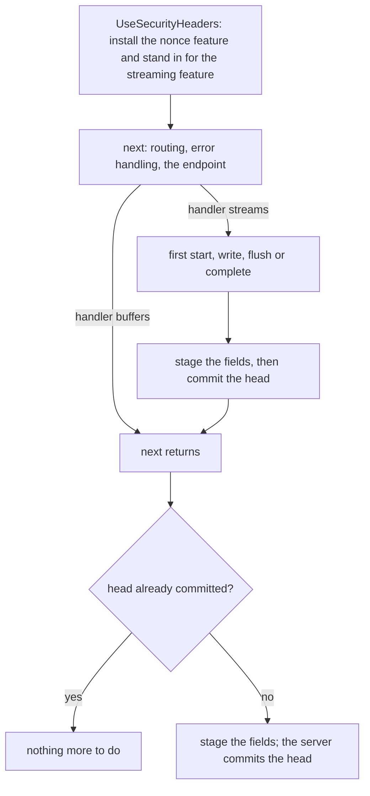
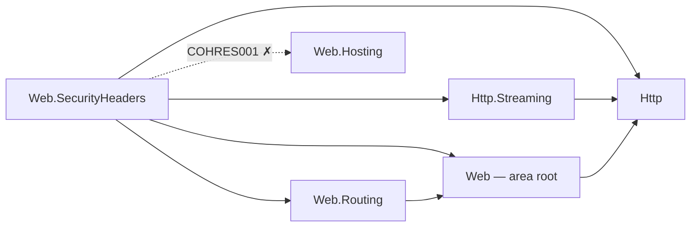

# Assimalign.Cohesion.Web.SecurityHeaders design

This page describes the boundaries and implementation shape of `Assimalign.Cohesion.Web.SecurityHeaders`.

> **Status:** Partial.

## Design intent

Browsers enforce a set of response fields that limit what a page can do to its user: whether a
response may be sniffed into another media type, framed by another site, leak its URL through
`Referer`, load scripts from arbitrary origins, share a browsing context group with a cross-origin
opener, or use the camera. None of them are emitted unless a server says so. This package says so,
with safe defaults on every response and opt-in policies for the rest (issue #1058, owner decision 4
of the HTTP/Web program: in v1).

The package owns one pipeline verb (`UseSecurityHeaders`), one policy type, validating builders for
the two fields with a real grammar (Content Security Policy and Permissions Policy), a framing
policy, four enumerations, one sealed endpoint-metadata carrier with three convention verbs, and one
typed feature that carries the per-request nonce. Everything is composed at builder time;
request-time work is a presence check and an assignment per field, plus one string join when a
policy carries a nonce.

## Why a new package, and not HttpsPolicy

`Web.HttpsPolicy` already emits one security header, HSTS. It stays where it is: HSTS is a statement
about the transport (it is only valid over TLS, RFC 6797 §7.2, and it is excluded on loopback),
while everything here is a statement about the document and applies to every response regardless of
scheme. Folding them together would give one package two unrelated emission rules. The fields here
are also the set other stacks group as "security headers" (Helmet,
NetEscapades.AspNetCore.SecurityHeaders), which is what an application author looks for.

## The fields and their defaults

| Field | Default | Configured by |
| --- | --- | --- |
| `X-Content-Type-Options: nosniff` | on | `SecurityHeadersPolicy.ContentTypeOptions` |
| `Content-Security-Policy: frame-ancestors 'none'` | on | `SecurityHeadersPolicy.Framing` (`FramingPolicy`) |
| `X-Frame-Options: DENY` | on | `SecurityHeadersPolicy.Framing` (same policy) |
| `Referrer-Policy: strict-origin-when-cross-origin` | on | `SecurityHeadersPolicy.ReferrerPolicy` |
| `Content-Security-Policy` directives | opt-in | `SecurityHeadersPolicy.ContentSecurityPolicy` |
| `Content-Security-Policy-Report-Only` | opt-in | `SecurityHeadersPolicy.ContentSecurityPolicyReportOnly` |
| `Cross-Origin-Opener-Policy` | opt-in | `SecurityHeadersPolicy.CrossOriginOpenerPolicy` |
| `Cross-Origin-Embedder-Policy` | opt-in | `SecurityHeadersPolicy.CrossOriginEmbedderPolicy` |
| `Cross-Origin-Resource-Policy` | opt-in | `SecurityHeadersPolicy.CrossOriginResourcePolicy` |
| `Permissions-Policy` | opt-in | `SecurityHeadersPolicy.PermissionsPolicy` |

The defaults are the ones that cannot break a working page: `nosniff` only stops a user agent from
guessing, frame denial only affects pages nobody meant to embed, and
`strict-origin-when-cross-origin` is what current browsers already do. A full CSP, the cross-origin
isolation fields, and a Permissions Policy all change what a page may load or do, so each is a
deliberate, per-application decision.

## When the fields are written

This is the decision the rest of the design hangs on. The Web stack has no response-starting
callback (`Web.Compression`'s design records the same gap), and a response head is committed in one
of two places:

- **Buffered responses** (the default) are written to `IHttpResponse.Body`. The server runs the
  whole pipeline and only then calls the transport's `SendAsync`, which commits the head. Anything
  set before the pipeline returns reaches the wire.
- **Streamed responses** go through `IHttpResponseStreamingFeature` (`Http.Streaming`). The first
  `StartAsync`, `WriteAsync`, `FlushAsync` or `CompleteAsync` commits the head, inside the handler,
  before control returns to any middleware.

The middleware therefore stages the fields at the last moment the head can still change, on
whichever path commits it:

- **After `next`, for a buffered response.** The middleware stages the fields once the downstream
  pipeline has returned. That is also after an exception boundary registered inside it has reset the
  faulted response (`UseErrorHandling` clears the headers before writing its problem response), so
  the error page carries the fields. `UseHsts` applies its field after `next` for the same reason.
- **Just before the first write, for a streamed response.** While `next` runs, the middleware
  replaces the transport's `IHttpResponseStreamingFeature` with a decorator that reports the same
  feature `Name`, so it takes the transport feature's slot, and that stages the fields immediately
  before delegating the first start, write, flush or complete. `context.Response.Streaming`,
  Server-Sent Events and the `HasStarted` checks of other middleware all resolve the decorator. The
  transport's feature is put back when the middleware returns.

### Alternatives rejected

- **Stage before `next`.** It is the simplest option, and it is wrong twice. The exception boundary
  clears the headers of a faulted response, so error pages would lose every field. And nothing would
  know, when it is time to commit, whether a field present on the response was set by this
  middleware or by the application, which is the whole of the no-clobber rule. The endpoint is not
  known before `next` either, so an override could not apply.
- **Stage before `next` and again after it.** This keeps the error page, but it needs a record of
  every value staged so a later pass can tell an application's value from its own, and an
  application that removes a field would see it come back. Staging once, at commit time, makes
  "present" mean "the application set it" with no bookkeeping.
- **A transport response interceptor (`IHttpExchangeInterceptor.BeforeResponseHeadAsync`).** That
  hook is the transport's own head-commit point, and its documentation names security headers as a
  use. It is registered on the server's listener options, which only the hosting layer composes, so
  using it would mean a second, hosting-side registration for every application, or a feature
  library reaching into `Web.Hosting`, which `COHRES001` forbids. `Web.Compression` declined the
  same hook for the same reason. The streaming decorator gives the same timing from inside the
  pipeline.

### What does not get the fields

- **A response a middleware ahead of `UseSecurityHeaders` writes.** It never passes through the
  middleware. That is why the documented position is the front of the pipeline, behind only
  `UseHttpLogging`, which writes no response.
- **A head committed some other way.** The middleware only stages an uncommitted head. If a
  middleware ahead of it started the response, or a handler replaced the streaming feature with one
  that does not delegate to the decorator, the fields are not added.
- **Responses the server produces itself.** A transport-level rejection (`413`, `431`, a malformed
  request) never becomes an exchange. When the pipeline faults with no exception boundary in it, the
  server clears the headers and sends a bare `500`.
- **`304 Not Modified`.** A `304` freshens a response the user agent has already stored, and RFC
  9111 §4.3.4 replaces only the stored fields the `304` carries. The stored response already has the
  fields of the response that created it. Re-emitting them would change nothing, except that a fresh
  nonce would replace the stored policy's nonce while the stored body still carries the old one in
  its `nonce` attributes, and every inline script would stop running. So a `304` gets no fields.

## Never clobber a field the application set

A field that is present when the middleware stages the headers was set by something downstream: a
handler, another middleware, or a nested `UseSecurityHeaders`. It is kept. Setting a policy property
to `null` or `false` only stops the middleware from emitting that field; it never removes one
something else set. `SecurityHeadersPolicy.OverwriteExistingHeaders` reverses this: every field the
policy emits replaces whatever is there.

Framing gets one extra rule, because it is expressed by two fields that interact. A user agent that
implements `frame-ancestors` ignores `X-Frame-Options` when an enforced policy carries the directive
(HTML Standard, "check a navigation response's adherence to X-Frame-Options"). If an application
sets `X-Frame-Options: SAMEORIGIN` to allow same-origin framing and the middleware then added its
default `frame-ancestors 'none'`, the default would silently override the application's choice in
every current browser. So the application owns framing once it has set `X-Frame-Options` or an
enforced `Content-Security-Policy` whose directives include `frame-ancestors` (matched by name,
ASCII case-insensitively, across a comma-separated policy list). The middleware then emits neither
framing field and leaves `frame-ancestors` out of its own policy. An application CSP without
`frame-ancestors` does not take ownership: the middleware still emits `X-Frame-Options`, so
clickjacking protection is kept without contradicting the application's policy.

## The endpoint override model

`SecurityHeadersMetadata` is a sealed carrier in the routing metadata bag, attached with convention
verbs that work on routes and groups alike
(`extension<TBuilder>(TBuilder) where TBuilder : IRouterConventionBuilder`):

| Verb | Metadata | Effect for the endpoint |
| --- | --- | --- |
| `WithSecurityHeaders(policy => ...)` | `new SecurityHeadersMetadata(Action<SecurityHeadersPolicy>)` | adjust a copy of the pipeline's policy |
| `WithSecurityHeaders(policy)` | `new SecurityHeadersMetadata(SecurityHeadersPolicy)` | replace the pipeline's policy (a copy, compiled at map time) |
| `DisableSecurityHeaders()` | `SecurityHeadersMetadata.Disabled` | emit nothing |

**Adjust is the common case.** "Like every other page, but partners may frame it" should not mean
re-declaring the application's CSP on the endpoint. An adjustment receives a copy of the policy
configured on the `UseSecurityHeaders` that serves the request, so it depends on that middleware. It
is compiled the first time the middleware stages a response for the endpoint, then cached per
metadata instance in that middleware; the route table bounds the cache. The cost is that an
exception thrown by the adjustment surfaces on that first request rather than at startup, the same
trade `Web.RateLimiting` makes for an unknown policy name. A replacement does not depend on the
pipeline, so it is copied and compiled when the metadata is created, and an invalid value fails at
map time.

**Resolution.** The override is read, last-wins, from the endpoint `UseRouting` published, at the
moment the fields are staged. By then the endpoint is known, wherever the middleware sits. A
route-level declaration overrides a group-level one.

**Coexistence with responses that never reach an endpoint.** The rule is simple: a request routed to
an endpoint gets that endpoint's policy on every response it produces, its error page included (the
boundary renders the error after routing published the endpoint); everything else, which means
unmatched requests and their `404`, `405`s, static files served ahead of routing, and short-circuits
before routing, gets the pipeline's own policy. The candidate endpoint a CORS preflight publishes
never runs for the preflight, so its override does not apply to the preflight response, matching
`Web.Diagnostics`.

**Why not `IRouteMiddlewareMetadata`.** Rate-limit and timeout metadata make routing fail an
endpoint whose middleware never acknowledged it, because a silently missing policy weakens a
guarantee. That contract requires the middleware to acknowledge the endpoint between `UseRouting`
and dispatch. This middleware belongs ahead of `UseRouting`, so it covers responses that never reach
an endpoint, and from there it cannot acknowledge anything before dispatch. It reads the override
afterwards instead, which is the same reason `HttpLoggingMetadata` does not implement the interface.
The failure mode of a missing `UseSecurityHeaders` is an application with no security headers on any
response, not one endpoint quietly losing its policy.

## The Content Security Policy builder

A free-form CSP string fails silently: a user agent drops what it cannot parse and enforces the
rest, so a typo weakens the policy and nothing reports it. The builder makes those mistakes fail
when the policy is built:

- **Directives are typed.** Every fetch directive, `base-uri`, `form-action`, `sandbox`,
  `upgrade-insecure-requests`, `report-to` and `report-uri` has its own method, and re-setting one
  replaces it in place, because CSP itself would ignore the second occurrence.
  `Directive(name, value)` covers directives the builder does not model, with the generic CSP3
  directive grammar enforced.
- **Sources are typed.** Keywords come from methods (`Self()`, `StrictDynamic()`, …), so their
  quotes are always right. A bare keyword name passed as a host (`Host("self")`) is refused: CSP
  would read it as a host named `self`, which is never what was meant. Host and scheme sources are
  checked against the CSP3 `host-source` and `scheme-source` grammar, hash digests against
  `base64-value`, and `'none'` must stand alone.
- **Nothing a caller passes can split the policy.** Every check rejects `;`, `,`, whitespace where
  the grammar has none, control characters and non-ASCII, so no configured value can inject a
  directive, a policy, or a header line.
- **`frame-ancestors` is not on the builder.** Framing is owned by `FramingPolicy`, which emits the
  directive together with the matching `X-Frame-Options`; a second source of truth could disagree
  with it. The framing directive is appended to the enforced policy, and never to the report-only
  one, so clickjacking protection stays enforced while a policy is trialed in report-only mode.

`X-Frame-Options` is derived, not configured: `DENY` for `FramingPolicy.Deny`, `SAMEORIGIN` for
`FramingPolicy.SameOrigin`, and absent for any other ancestor list, which the field cannot express
(its `ALLOW-FROM` form is obsolete and ignored by current user agents).

### The nonce

`ContentSecurityPolicySourceListBuilder.Nonce()` adds a placeholder. When the policy is compiled,
the serialized policy is split around each placeholder, so rendering it for a response is one
`string.Join` with that exchange's nonce, and a policy without a placeholder is a constant string.

- **Generation.** The default `ISecurityHeadersFeature` draws 128 bits from `RandomNumberGenerator`
  and base64-encodes them (CSP3 §7.1 asks for at least 128 bits). It is generated on first read, so
  a policy without a nonce source, and a handler that never asks, cost nothing. The first value
  published wins if two tasks of one exchange race to read it.
- **Exposure.** Handlers read `context.Features.Get<ISecurityHeadersFeature>()!.Nonce` and stamp it
  on their `<script nonce>` and `<style nonce>` elements. The same value goes into every nonce
  source of both the enforced and the report-only policy.
- **One nonce per exchange.** The middleware reuses an `ISecurityHeadersFeature` that is already
  installed, either a nested `UseSecurityHeaders` or an application's own implementation (a test
  that needs a fixed value, for example). A supplied nonce that is not a CSP `base64-value` fails
  the exchange with `InvalidOperationException` rather than be written into a header.
- **Caching.** A cached body embeds the nonce of the request that produced it. Do not output-cache a
  response whose markup carries a nonce; use hash sources for cacheable inline content. `304`s get
  no fields for the same reason (above).

## Permissions Policy

The `Permissions-Policy` field is an RFC 9651 Structured Field Dictionary.
`PermissionsPolicyBuilder` builds it with the Structured Field toolkit in
`Assimalign.Cohesion.Http`, so key and string syntax are canonical and validated there, and the
builder adds the policy-level checks: feature names follow the RFC 9651 key grammar, and allowlist
entries are serialized origins (`scheme://host[:port]`, with an optional `*.` subdomain wildcard).
The four forms map to `Disable` (`()`), `AllowAll` (`*`), `AllowSelf` (`(self ...)`) and
`AllowOrigins` (`("..." ...)`).

## Ordering

`UseHttpLogging` → `UseSecurityHeaders` → `UseForwardedHeaders` → `UseHostFiltering` →
`UseHttpsRedirection` → `UseHsts` → `UseErrorHandling` → `UseStaticFiles` → `UseRouting` → policy
middleware → endpoint. The area's [middleware order](../../../../web/middleware-order.md) places
every Web middleware.

- **At the front**, so every response that passes through the pipeline gets the fields, the
  rejections of the middleware after it included. Only `UseHttpLogging`, which writes no response,
  goes ahead of it, and since this middleware reads no client identity it can precede
  `UseForwardedHeaders`.
- **Ahead of `UseErrorHandling`**, so the boundary's error page is written before the fields are
  staged. Registered after the boundary, the middleware's own turn ends with the fault propagating
  and the boundary then clears the response.
- **Ahead of `UseRouting`** is fine: endpoint overrides still apply, because they are read when the
  fields are staged, after routing has run.

## Family map

The package references the Web root (pipeline abstractions), Web.Routing (endpoint metadata and the
convention-builder seam), the Http core (header keys, the feature collection, the Structured Field
toolkit), and Http.Streaming (the streaming feature it stands in for). It references no hosting
library.

The dotted edge is the reference `COHRES001` rejects: like every Web feature library, this one never
references the runtime module, and its composition is dependency-free (values captured at builder
time, no container, no configuration binding). Applications get it through the `App.Web` shared
framework.

## Error model

There is no package exception root; every failure is a BCL argument or state exception thrown when
the policy is composed:

- `ArgumentException` for a value outside its grammar (a host source, digest, directive name or
  value, sandbox keyword, reporting endpoint, feature name, origin, ancestor source) and for an
  empty or `'none'`-mixed source list.
- `ArgumentOutOfRangeException` for an undefined enumeration value, thrown when the policy is
  compiled: at `UseSecurityHeaders` for the pipeline's policy, at map time for a replacement.
- `InvalidOperationException` for a CSP or Permissions Policy built with nothing in it, and, at
  request time, for an application-supplied nonce outside the CSP grammar.

The only request-time failures are that nonce check and an exception thrown by an endpoint
adjustment on its first use. Both fail the exchange; neither is caught, so the exception boundary or
the server answers it.

## AOT posture

No reflection, no runtime code generation, no configuration binding. Enumerations map to their
tokens through switch expressions. Field values are computed once when a policy is compiled; per
response the middleware does feature-collection lookups, header presence checks and assignments, and
one `string.Join` for a nonce-bearing policy. The Structured Field serializer and
`RandomNumberGenerator` are AOT-safe.

## Non-goals

- **HSTS.** It stays in `Web.HttpsPolicy` (`UseHsts`), for the reasons above.
- **Reporting endpoints.** `report-to` names an endpoint, and the application declares it in its own
  `Reporting-Endpoints` field. The `report-to` parameters of COOP and COEP, and their `-Report-Only`
  variants, are not modeled.
- **`Referrer-Policy` fallback lists.** The field may list several tokens for older user agents; the
  policy emits one.
- **Request-dependent policies.** An endpoint adjustment is cached, so it cannot depend on the
  request. An application that needs a per-request policy sets the fields itself in the handler;
  they are never clobbered.
- **Removing fields set elsewhere.** A policy property set to `null` stops this middleware from
  emitting the field; it does not strip one set downstream.
- **Deprecated fields.** `X-XSS-Protection` (removed from current browsers, and harmful in old
  ones), `Expect-CT` and `Feature-Policy` are not emitted.

## Scope-creep candidates (recorded, not taken)

- A per-response policy override on `ISecurityHeadersFeature`, for middleware-only branches that
  need a different policy without routing.
- Hash-source helpers that compute the digest of a known inline script at startup.
- Typed `require-trusted-types-for` and `trusted-types` directives (the `Directive` escape hatch
  covers them today).

## Testing

`tests/SecurityHeadersEndToEndTests.cs` drives the middleware over the in-memory
`WebApplicationTestFactory`: the defaults and their opt-outs, every opt-in field with its exact wire
value, an unmatched route's `404`, a short-circuiting middleware, the exception boundary's error
page, a static file and its `304`, the no-clobber and framing-ownership rules,
`OverwriteExistingHeaders`, the nonce (matching the handler's, unique per request, 128 bits, shared
by both policies, supplied by the application, never read without a nonce source, refused when
outside the grammar), streamed responses over HTTP/1.1 (chunked framing proves the handler committed
the head) and HTTP/2, and composition-time validation.
`tests/SecurityHeadersRouteConventionTests.cs` covers the overrides through the real router: adjust,
replace (copied at map time), disable, group-versus-route precedence, the override on an endpoint's
error and streamed responses, the CORS preflight, an adjustment compiled once, and map-time
validation. The builder, framing and feature suites cover serialization and every grammar rule in
isolation.

## Declared dependencies

| Reference | Kind |
|---|---|
| `Assimalign.Cohesion.Web` | `CohesionProjectReference` |
| `Assimalign.Cohesion.Web.Routing` | `CohesionProjectReference` |
| `Assimalign.Cohesion.Http` | `CohesionProjectReference` |
| `Assimalign.Cohesion.Http.Streaming` | `CohesionProjectReference` |

[Assembly overview](index.md) · [Examples](examples/index.md)

## Sources

- **Primary source** — `cohesion/resources/Web/Assimalign.Cohesion.Web.SecurityHeaders/docs/DESIGN.md`.
- **Source** — `cohesion/resources/Web/Assimalign.Cohesion.Web.SecurityHeaders/src/Assimalign.Cohesion.Web.SecurityHeaders.csproj`.
