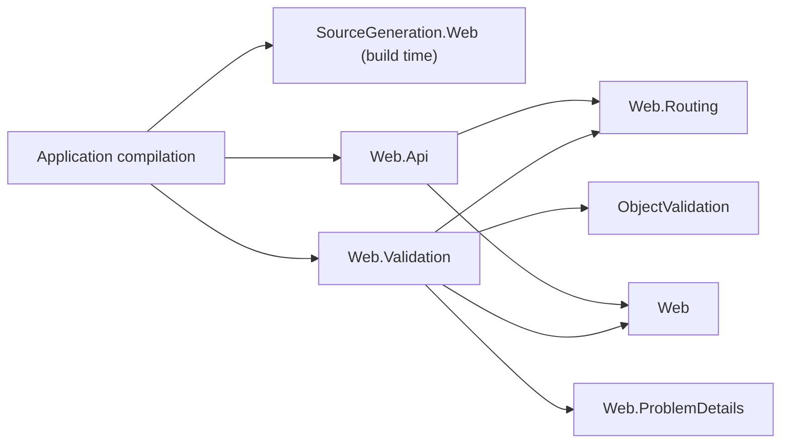

# Assimalign.Cohesion.Web.Validation design

This page describes the boundaries and implementation shape of `Assimalign.Cohesion.Web.Validation`.

> **Status:** Partial.

## Design intent

A typed endpoint binds a request-body model and hands it to its handler. Binding failures (an
unparseable scalar, a malformed body) are already answered `400` before the handler runs; an invalid
value — a body that parses but breaks the application's rules — was not, so every handler repeated
the same checks and wrote its own error. This package validates the bound model with the
application's `Assimalign.Cohesion.ObjectValidation` validators and answers an invalid one the way
binding failures are answered, before the handler runs (#1060).

It owns three things: the registration (`AddValidation`), the per-request decision and the `400`
(`context.ValidateAsync`), and the endpoint metadata that turns validation off or on
(`ValidationMetadata`, `DisableValidation()`, `RequireValidation()`). The call into it is emitted by
the Web endpoint-binding generator.

## History and placement

Request validation was descoped from `Web.Api` by owner decision on 2026-07-20: an opt-in seam
threading an ObjectValidation validator through `IValidator`-carrying `Map*` overloads and an
`EndpointValidationMetadata` carrier was implemented on the #796 branch and removed before merge, so
`Web.Api` carries no ObjectValidation dependency. The owner then approved #1060 in the HTTP/Web
Phase 2 lineup, which brings validation back.

**Placement — a separate package, not `Web.Api`** (the integrator's recommendation, pending owner
review). The descoping decision is kept literally: `Web.Api` still references neither
ObjectValidation nor this package. The integration lives here and reaches typed endpoints the way
antiforgery does: the generator, which references nothing at run time, emits the call when the
consuming compilation can name this package's entry point, and emits nothing otherwise.

- **An application without the package** compiles and runs exactly as before; `Web.Api`'s own
  surface and dependency graph do not change.
- **The validation engine is replaceable at the package boundary:** the generated call names
  `HttpContextValidationExtensions.ValidateAsync<T>`, not an ObjectValidation type.
- **Every `Sdk.Web` application has the package** through `App.Web`, so typed endpoints validate as
  soon as a validator is registered; until `AddValidation` is called, the emitted call returns
  immediately.

The alternative — `Web.Api` referencing ObjectValidation and owning the call — would reverse the
2026-07-20 decision without the owner's say, and would put the engine in the dependency closure of
every endpoint-mapping consumer.

The graph shows the references around the package. Arrows mean "references"; `Web.Api` and
`Web.Validation` do not reference each other, and the generated thunk in the application calls both.



## Registration

`AddValidation(Action<EndpointValidationOptions>)` builds the options, then freezes them into an
application feature (`EndpointValidationFeature`, an `IHttpFeature` the host seeds onto every
exchange): the default (`Enabled`, on unless set off) and a `FrozenDictionary<Type, IValidator>`.
The options are read once, when `AddValidation` returns, and registering again replaces the
feature. No service container, configuration binding, middleware or request-time service location
is involved, per the Web area's dependency-free composition rule.

| Verb | Keys the validator by | Notes |
| --- | --- | --- |
| `AddProfile<T>(IValidationProfile<T>)` | `typeof(T)` | Builds a `Validator` over the one profile with `ContinueThroughValidationChain = true`, so every failing rule of every member is reported. The profile is configured once, here. |
| `AddValidator(IValidator)` | each `IValidationProfile.ValidationType` in `Profiles` | For a validator built elsewhere (`Validator.Create`, `IValidatorFactory.CreateValidator`). A validator with no profiles is rejected with `ArgumentException`: it cannot name its type. |
| `AddValidator<T>(IValidator)` | `typeof(T)` | For a hand-written `IValidator` that declares no profiles. |

A second validator for a type is an `InvalidOperationException` at registration, not a silent
replacement. Lookup is exact on the type the value is bound as: no base-type or interface matching,
which would need runtime type inspection. A validator is shared by every request, so it must be safe
to use concurrently.

## The generated call

When the consuming compilation resolves
`Assimalign.Cohesion.Web.Validation.HttpContextValidationExtensions` — accessible, with a public
static generic `ValidateAsync` — the generator emits, for an endpoint that binds a request-body
model, after every parameter is bound and before the handler is invoked:

```text
if (__arg0 is { } __validated0 && !await global::Assimalign.Cohesion.Web.Validation.HttpContextValidationExtensions.ValidateAsync<global::Customer>(context, __validated0, context.RequestCancelled))
{
    return;
}
```

- **After binding.** A binding failure on any parameter is answered first; validation runs only on
  a fully bound request.
- **The type argument** is the declared type without its top-level nullable annotation, or the
  underlying type of a `Nullable<T>`. The pattern test unwraps the value, so a `null` body is not
  validated.
- **Bodies only.** Only a model bound from the body is validated: route, query, header and form
  values are scalars, which have their own binding rules, and a body bound as a string or primitive
  is not a model. Form models do not exist — whole-object form binding is a `Web.Api` non-goal.
- **Static form, fully qualified.** The call is the static form of the extension member, so the
  generated file needs no `using` for the package.

## The per-request decision

`context.ValidateAsync<T>(value, cancellationToken)` returns `true` when the request may proceed and
`false` when it has written the `400`. It decides in this order:

1. **A `null` value** is not validated: the handler runs.
2. **No `AddValidation` feature** on the exchange: the handler runs.
3. **The endpoint's `ValidationMetadata`, else the application's default** decides whether
   validation is on. Off: the handler runs.
4. **No validator registered for `typeof(T)`:** the handler runs.
5. **`IValidator.Validate(value)`.** A valid value lets the handler run; an invalid one is written
   as `400 application/problem+json` and the method returns `false`.

The endpoint's `ValidationMetadata` is read last-wins from the endpoint `UseRouting` published
(`context.GetEndpointMetadata<ValidationMetadata>()`): a route's declaration overrides its group's,
either overrides the application's default, and with no declaration the default decides. Both
states are instances of the one sealed carrier (`ValidationMetadata.Required` and
`ValidationMetadata.Disabled`), following the Web.Routing endpoint-metadata family rule, so a route
can require validation under a group that disables it. Unlike antiforgery, the metadata places no
requirement on the pipeline: there is no middleware, so nothing has to acknowledge the endpoint.

Validation runs synchronously (`IValidator.Validate`), not through `ValidateAsync`, which
ObjectValidation implements with `Task.Run`: a thread-pool hop per request for CPU-bound work.

## The failure payload

`ProblemDetails.FromStatus(400, "One or more validation errors occurred.")` with an `errors`
extension member (RFC 9457 §3.2): a map from key to a `string[]` of messages, the shape the generated
thunk writes for binding failures, so a client parses both the same way.

| Error source | Key | Why |
| --- | --- | --- |
| A rule's default source, its member selector `p => p.Address.City` | `Address.City` | The member path a client names; the selector parameter is noise |
| A source the profile set (`error.Source = "name"`) | `name` | The author chose the key, for example the JSON property name |
| No source (an error about the value as a whole) | `""` | The empty key, the model-level convention clients already handle |

Keys are CLR member names as the profile declares them, not JSON property names: the JSON naming
policy lives in `Web.Serialization`'s internal options, and a profile that wants JSON names sets its
sources. Messages keep the order the rules ran: ObjectValidation records errors on a stack, so the
map reverses them. A nested profile (`ChildRules`, `UseProfile`) reports under its parent member
because ObjectValidation composes nested sources (`p => p.Address.City`; see the
[ObjectValidation design](../../../libraries/object-validation/assimalign-cohesion-objectvalidation/design.md));
under `RuleForEach` the key names the collection member without an element index.

A validator built with `ThrowExceptionOnFailure` throws `ValidationFailureException`, which carries
no errors. The request is still invalid, so it is answered `400` with an empty `errors` map rather
than escaping to the exception boundary as a `500`.

## AOT posture

`IsAotCompatible` holds with no reflection: validators are keyed by `typeof(T)` values the
generated code supplies, the frozen dictionary lookup is by `Type` identity, and the generic call is
instantiated over the bound type at compile time. ObjectValidation reads members through the
expression trees' resolved `PropertyInfo`/`FieldInfo` metadata without compiling them. The problem
payload is written by `Web.ProblemDetails`' `Utf8JsonWriter` writer.

## Non-goals

- **Validating scalars and returned values.** Route, query, header and form values bind with their
  own rules; a returned value is the application's own.
- **Attribute-driven validation** (data annotations). Rules live in ObjectValidation profiles,
  registered per type; there is no attribute scan.
- **Asynchronous rules.** The engine's rules are synchronous.
- **JSON-path keys and collection indices** in the `errors` map (see "The failure payload").
- **Describing the `400`** in the endpoint description metadata. Like the binding `400`, it is an
  outcome the thunk produces on its own; a documentation adapter adds it by policy.

## Declared dependencies

| Reference | Kind |
|---|---|
| `Assimalign.Cohesion.Web` | `CohesionProjectReference` |
| `Assimalign.Cohesion.Web.Routing` | `CohesionProjectReference` |
| `Assimalign.Cohesion.Web.ProblemDetails` | `CohesionProjectReference` |
| `Assimalign.Cohesion.Http` | `CohesionProjectReference` |
| `Assimalign.Cohesion.ObjectValidation` | `CohesionProjectReference` |

[Assembly overview](index.md) · [Examples](examples/index.md)

## Sources

- **Primary source** — `cohesion/resources/Web/Assimalign.Cohesion.Web.Validation/docs/DESIGN.md`.
- **Source** — `cohesion/resources/Web/Assimalign.Cohesion.Web.Validation/src/Assimalign.Cohesion.Web.Validation.csproj`.
- **Decision order and payload** — `cohesion/resources/Web/Assimalign.Cohesion.Web.Validation/src/Extensions/HttpContextValidationExtensions.cs` and `cohesion/resources/Web/Assimalign.Cohesion.Web.Validation/src/Internal/ValidationErrorMap.cs`.
