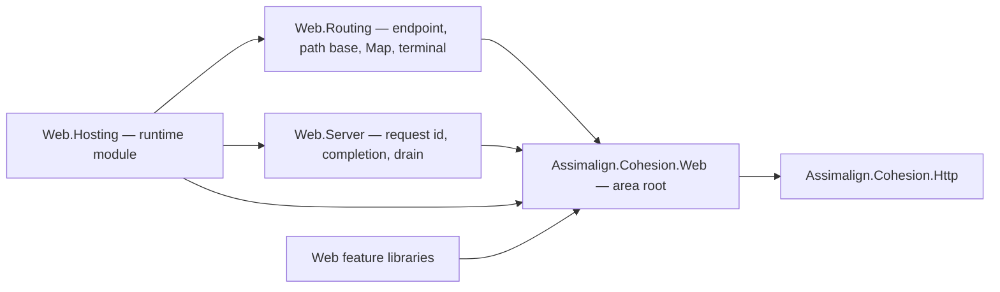

# Assimalign.Cohesion.Web design

This page describes the boundaries and implementation shape of `Assimalign.Cohesion.Web`.

> **Status:** Partial.

## Design intent

`Assimalign.Cohesion.Web` is the Web area root: the composition seams every Web library builds
against — the application/builder contracts (`IWebApplication`, `IWebApplicationBuilder`,
`IWebApplicationContext`), the middleware-first pipeline (`IWebApplicationPipeline`,
`IWebApplicationPipelineBuilder`, `IWebApplicationMiddleware`, the `WebApplicationMiddleware`
delegate), and the server seam (`IWebApplicationServer`). Feature packages compose against these;
the runtime module (`Web.Hosting`) implements them; the build-enforced hosting-isolation rule
(`resources/Web/README.md`, `.claude/rules/resource-areas.md`) keeps every library off the runtime
module (COHRES001). Since its 2026-10-09 relaxation (COHRES002) the runtime module may reference a
Web library it needs; no feature depends on it either way.

The root is deliberately **contracts-only**. Features — their models, options, builder verbs, and
middleware — live in per-concern `Assimalign.Cohesion.Web.<Feature>` packages, never here
(precedent: authentication's model and builder surface live in `Web.Authentication`;
forwarded-headers resolution lives in `Web.ForwardedHeaders`). The separation is what it protects:
the root stays small and stable so every feature library can reference it without inheriting anyone
else's surface, and a feature's dependency cost is always opt-in. The breakdown signal — this file's
reason to exist — is the root absorbing anything feature- or model-specific; that is an architecture
conversation, not a convenience call.

The root references `Assimalign.Cohesion.Http` and no `Assimalign.Cohesion.Hosting*` library (O34).
`IWebApplication` exposes `Context`, `StartAsync`, and `StopAsync`; `IWebApplicationBuilder`
supplies Web registration verbs and `Build()`. Background-work registration belongs to the concrete
`WebApplicationBuilder` in `Web.Hosting`. DI, configuration, and logging integration remain
builder-time hosting concerns.

## No feature contracts in the root (#1379)

The owner's rule of 2026-10-09 (HTTP/Web program plan §7.4, decision 20, extended to this root by
decision 33) is that an area root holds base contracts and composition seams only. An
`IHttpFeature` contract is neither: it is the per-exchange surface of whichever package publishes
it. The root used to declare five, because when they were designed COHRES002 kept the runtime module
off every Web library but the root, so the root was the only place both the publisher and the
runtime could see. Decision 32 relaxed COHRES002, and the five moved to their publishers' packages:

| Contract | Publisher | New home | Why there |
|---|---|---|---|
| `IWebEndpointFeature` | `UseRouting` | [`Web.Routing`](../assimalign-cohesion-web-routing/index.md) | routing selects the endpoint; the standard terminal that runs it (`WebApplicationTerminal`) moved with it |
| `IWebPathBaseFeature` | `Map(path)` | [`Web.Routing`](../assimalign-cohesion-web-routing/index.md) | the non-rejoining branches end in that terminal, so they and their path-base view moved too |
| `IWebRequestIdFeature` | `Web.Hosting`'s telemetry | [`Web.Server`](../assimalign-cohesion-web-server/index.md) | the server publishes it; COHRES001 rules out `Web.Hosting` itself as the home, because its readers are feature libraries |
| `IWebResponseCompletionFeature` | `Web.Hosting` | [`Web.Server`](../assimalign-cohesion-web-server/index.md) | as above |
| `IWebServerDrainFeature` | `Web.Hosting` | [`Web.Server`](../assimalign-cohesion-web-server/index.md) | as above |

The root's position after the move, with every arrow meaning "references":

The root references only Http. `Web.Routing` and `Web.Server` reference the root, and `Web.Hosting`
references all three: it ends its pipeline in routing's terminal and installs the server features.
Feature libraries reference the root and, when they read one of these features, the package that
declares it.

**Namespaces.** The `Web.Server` contracts keep `Assimalign.Cohesion.Web`: the new package pins its
`RootNamespace` to the family name, as `Web.Api`, `Web.Forms` and `Web.ProblemDetails` do, so every
reader compiles unchanged. The `Web.Routing` types take `Assimalign.Cohesion.Web.Routing`, because
`Web.Routing` already declares that namespace across its code and the rules require its
`Abstractions/` and `Extensions/` types to declare its `RootNamespace` (`general-rules.md`, "Every
project pins its `RootNamespace`"). A call site of `Map(path)`, `MapWhen`, `GetPathBase`,
`GetEffectivePath`, `WebApplicationTerminal`, `IWebEndpointFeature` or `IWebPathBaseFeature` adds
`using Assimalign.Cohesion.Web.Routing;`, which most applications already have for `UseRouting`.
`UseWhen` and `Run` stay in this assembly and namespace, but moved from
`WebApplicationBranchingExtensions` into `WebApplicationExtensions` (that class name now belongs to
`Web.Routing`'s branching type, which declares neither member). Extension-form calls
(`app.UseWhen(...)`, `app.Run(...)`) compile unchanged; a static-form call
(`WebApplicationBranchingExtensions.UseWhen(app, ...)`) must name `WebApplicationExtensions`, and a
binary compiled against the old class must be rebuilt.

## The pipeline model (middleware-first)

The Web area composes request handling as an onion of middleware over `IHttpContext` — fluent
`.Use(...)` registration, `Task InvokeAsync(IHttpContext, WebApplicationMiddleware next)` execution,
registration order = execution order. There is deliberately no return-value result model (the
`IResult` abstraction was withdrawn pre-merge, 2026-07-10 direction): middleware either writes the
response and stops calling `next`, or cooperates by attaching typed features to
`IHttpContext.Features` for downstream stages. That feature-collection seam — not request-time
service location — is the area's extensibility mechanism, which is why the pipeline contracts here
stay this small.

`WebApplicationExtensions` carries the composition sugar the root owns: the inline
`Use(Func<IHttpContext, WebApplicationMiddleware, Task>)` adapter that bridges application lambdas
onto the core `Use(Func<WebApplicationMiddleware, WebApplicationMiddleware>)` registration form, the
`UseWhen` segment, and `Run`. The inline lambda receives the exchange and the next middleware; it
continues the pipeline by invoking that next middleware, or answers the exchange itself by not
invoking it. Middleware runs in registration order, the verb returns the same builder for chaining,
and a `null` middleware is rejected with `ArgumentNullException` at registration.

That core form is a component factory: the pipeline builder invokes it once, when it builds the
pipeline, and the delegate it returns runs for each request. The factory body is therefore the
composition-time seam for work that must fail at startup rather than on a request, without a
dependency on the hosting runtime: `UseRouting` builds the application's route table there (#1051).

## Segments and terminal middleware (#1056)

| Verb | Runs when | Rejoins the main pipeline |
|---|---|---|
| `UseWhen(predicate, segment)` | `predicate(context)` is true | yes; the segment's `next` is the rest of the pipeline |
| `Run(terminal)` | always, where registered | no; nothing after it runs |

A `UseWhen` segment is collected by an internal `WebApplicationBranchBuilder` and composed by the
containing pipeline when that pipeline is built. Every registration is kept in the component-factory
shape that takes the application context, so middleware that needs the context at composition time
(`UseStaticFiles` reads the web root) composes inside a segment exactly as it does on the
application.

These two verbs depend on nothing but the pipeline builder, which is why they stay in the root. The
branches that do not rejoin, `Map(path)` and `MapWhen`, are `Web.Routing`'s: each is a `UseWhen`
segment that ends in `Run(WebApplicationTerminal.InvokeAsync)`, so routing composes them against the
root's public seams without a second internal builder. Their design (the path-base view, the
segment-boundary prefix match, and why branches hold middleware rather than routes) is in
[Web.Routing's design](../assimalign-cohesion-web-routing/design.md#pipeline-branching-and-the-terminal-1056-1379).

## Endpoints and the pipeline terminal

The endpoint contract (`IWebEndpointFeature`) and the standard terminal (`WebApplicationTerminal`)
are `Web.Routing`'s since #1379. The contract the root still states is the pipeline builder's: an
`IWebApplicationPipelineBuilder` composes its middleware around a terminal, and a builder whose
pipeline should run selected endpoints ends in `WebApplicationTerminal.InvokeAsync`.
`WebApplication` in `Web.Hosting` does, which is one of the two reasons `Web.Hosting` references
`Web.Routing`.

## Application lifecycle services

The concrete `WebApplicationBuilder.AddService` in `Web.Hosting` accepts an `IHostService` instance
or a factory over the final concrete `WebApplicationContext`. The factory runs once at build time.
The root builder has no service-registration member or hosting-library reference; no area-owned
service abstraction is introduced (O34).

Application services and Web servers form two ordered phases rather than one interleaved list:
services start first in service-registration order, then servers start in server-registration order.
Host shutdown reverses the full sequence, so every server drains before application services stop.
This ordering holds regardless of whether an `AddService` call appeared before or after an
`AddServer` call in the fluent composition.

## Server lifecycle contract

`IWebApplicationServer.StartAsync` is the endpoint-acquisition boundary: it does not complete until
every listener is bound and ready to accept. Binding failures propagate through startup instead of
surfacing later from an accept loop. `StopAsync` is the symmetric release boundary and does not
complete until the endpoints are released. Hosted restart constructs a fresh server/listener
instance after the prior instance stops; a disposed listener is not rebound.

The per-exchange features a server publishes — the request id, response completion and the drain
signal — are `Web.Server`'s contracts since #1379; their design is in
[Web.Server's design](../assimalign-cohesion-web-server/design.md). A custom server may omit any of
them, so their readers handle an absent feature.

`IWebApplicationBuilder.AddServer` accepts that contracts-only server directly or through a factory
over the final `IWebApplicationContext`. The Hosting implementation supplies its own lifecycle
adapter, so a server is not required to reference or implement Hosting's `IHostService`. Multiple
servers start in registration order and stop in reverse order; `IWebApplicationContext.Servers`
exposes the original server objects rather than their runtime adapters.

`AddPipeline` is the complete user-pipeline replacement seam. A Hosting runtime may still place
fixed runtime terminals ahead of the supplied pipeline; replacing user dispatch does not replace
host-owned lifecycle or management surfaces.

## Ordering is registration order

Middleware ordering is positional. Some features carry hard ordering contracts — for example
`Web.ForwardedHeaders` must be registered before anything that consumes client identity — and each
feature package documents its own. Formal, enforceable ordering rules are the open #26/#145 work;
the root intentionally ships no enforcement mechanism ahead of them. The area's
[middleware order](../../../../web/middleware-order.md) merges the packages' contracts into one
reference order.

## AOT posture

Contracts and delegate plumbing only — no reflection, no runtime codegen (`IsAotCompatible=true`).

## Non-goals

- **Feature models, feature contracts or middleware.** Per-concern packages own them, an
  `IHttpFeature` contract included; the root absorbing a feature is the architecture smell this
  design guards against.
- **DI/configuration/logging integration.** `Web.Hosting` composes those, builder-time
  only.
- **A return-value result model.** Withdrawn by design; the pipeline is middleware-first.

## Declared dependencies

| Reference | Kind |
|---|---|
| `Assimalign.Cohesion.Http` | `CohesionProjectReference` |

[Assembly overview](index.md) · [Examples](examples/index.md)

## Sources

- **Primary source** — `cohesion/resources/Web/Assimalign.Cohesion.Web/docs/DESIGN.md`.
- **Source** — `cohesion/resources/Web/Assimalign.Cohesion.Web/src/Assimalign.Cohesion.Web.csproj`.
- **Composition verbs** — `cohesion/resources/Web/Assimalign.Cohesion.Web/src/Extensions/WebApplicationExtensions.cs`.
