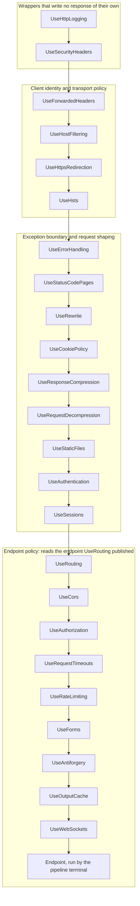

# Middleware order

Web middleware runs in registration order, and this page gives the one order every Web middleware fits into, with the reason for each position.

> **Status:** Implemented. The order is guidance: only endpoint metadata fails closed, and enforced ordering is open work (#26, #145).

Each Web package documents its own position, but read one at a time, five of them claim the front
of the pipeline. This page merges those constraints into one order and says why each middleware
goes where it does. The Web NativeAOT guard
(`cohesion/resources/Web/Assimalign.Cohesion.Web.Hosting/samples/Assimalign.Cohesion.Web.AotGuard/Program.cs`)
registers its middleware in this order.

## The order

An application registers the middleware it uses in this order and leaves out the rest. In the
diagram an arrow reads "runs before"; the table gives the reason for each position.



| # | Verb | Package | Why it goes here |
|---:|---|---|---|
| 1 | `UseHttpLogging` | [Web.Diagnostics](../dotnet-apis/resources/web/assimalign-cohesion-web-diagnostics/index.md) | First, so the exchanges every later middleware rejects are logged too. It writes its entry after the pipeline unwinds, when `UseForwardedHeaders` has already attached the forwarded identity, so running ahead of that middleware loses nothing. |
| 2 | `UseSecurityHeaders` | [Web.SecurityHeaders](../dotnet-apis/resources/web/assimalign-cohesion-web-securityheaders/index.md) | Ahead of every middleware that writes a response, so rejections, redirects and the boundary's error page all carry the fields. It reads no client identity, so it may run ahead of `UseForwardedHeaders`. |
| 3 | `UseForwardedHeaders` | [Web.ForwardedHeaders](../dotnet-apis/resources/web/assimalign-cohesion-web-forwardedheaders/index.md) | Ahead of every middleware that reads the effective scheme, host or client address on the way in. Leave it out when no proxy sits in front of the application. |
| 4 | `UseHostFiltering` | [Web.HostFiltering](../dotnet-apis/resources/web/assimalign-cohesion-web-hostfiltering/index.md) | Validates the effective host, so it follows `UseForwardedHeaders`. It runs ahead of everything that uses the host: the redirect `Location`, absolute URLs, cache keys. |
| 5 | `UseHttpsRedirection` | [Web.HttpsPolicy](../dotnet-apis/resources/web/assimalign-cohesion-web-httpspolicy/index.md) | Redirects a plaintext request before anything does work for it, building the `Location` from the validated host. |
| 6 | `UseHsts` | [Web.HttpsPolicy](../dotnet-apis/resources/web/assimalign-cohesion-web-httpspolicy/index.md) | Ahead of the exception boundary, so the header survives a reset error response. |
| 7 | `UseErrorHandling` | [Web.ErrorHandling](../dotnet-apis/resources/web/assimalign-cohesion-web-errorhandling/index.md) | The exception boundary: a fault anywhere after it becomes a problem-details response. See [the CORS trade-off](#the-cors-trade-off). |
| 8 | `UseStatusCodePages` | [Web.ErrorHandling](../dotnet-apis/resources/web/assimalign-cohesion-web-errorhandling/index.md) | Inside the boundary and ahead of the middleware whose bodyless `4xx`/`5xx` responses it fills in, including the `404` and `405` from routing. |
| 9 | `UseRewrite` | [Web.Rewrite](../dotnet-apis/resources/web/assimalign-cohesion-web-rewrite/index.md) | Ahead of everything that reads the path (static files, routing, the endpoint), so they all see the rewritten URL; middleware ahead of it, and the server's request telemetry, keep the client's. Inside the boundary and after status-code pages, so a fault in a rule becomes a problem-details response and its `400` gets a body. After `UseForwardedHeaders` and `UseHostFiltering`, so its canonicalization redirects read the client's scheme and a validated host. Inside it, register redirects ahead of internal rewrites. |
| 10 | `UseCookiePolicy` | [Web.CookiePolicy](../dotnet-apis/resources/web/assimalign-cohesion-web-cookiepolicy/index.md) | Ahead of every middleware that writes a cookie: sessions, the authentication cookie, antiforgery. Its `Secure` decision reads the effective scheme. |
| 11 | `UseResponseCompression` | [Web.Compression](../dotnet-apis/resources/web/assimalign-cohesion-web-compression/index.md) | Here when the application does not use output caching. With `UseOutputCache` it moves after the cache (row 23). |
| 12 | `UseRequestDecompression` | [Web.Compression](../dotnet-apis/resources/web/assimalign-cohesion-web-compression/index.md) | Ahead of every middleware that reads the request body. |
| 13 | `UseStaticFiles` | [Web.StaticFiles](../dotnet-apis/resources/web/assimalign-cohesion-web-staticfiles/index.md) | Ahead of `UseRouting`, so an existing file is served without routing or authentication. |
| 14 | `UseAuthentication` | [Web.Authentication](../dotnet-apis/resources/web/assimalign-cohesion-web-authentication/index.md) | Anywhere ahead of `UseAuthorization`. In this position, branches and middleware ahead of routing also see `context.User`. |
| 15 | `UseSessions` | [Web.Sessions](../dotnet-apis/resources/web/assimalign-cohesion-web-sessions/index.md) | After `UseCookiePolicy`, which applies the policy to the session cookie. The session loads on first use, so a request that never touches it costs nothing. |
| 16 | `UseRouting` | [Web.Routing](../dotnet-apis/resources/web/assimalign-cohesion-web-routing/index.md) | Publishes the matched endpoint and calls `next`; the pipeline terminal runs the endpoint. Every middleware after it can read the endpoint. |
| 17 | `UseCors` | [Web.Cors](../dotnet-apis/resources/web/assimalign-cohesion-web-cors/index.md) | Ahead of every middleware that can reject a preflight. A preflight carries no credentials, so authorization would answer it `401`, a rate limit `429` and antiforgery `400`. |
| 18 | `UseAuthorization` | [Web.Authorization](../dotnet-apis/resources/web/assimalign-cohesion-web-authorization/index.md) | After authentication, and ahead of output caching so an unauthorized request is never served from the cache. |
| 19 | `UseRequestTimeouts` | [Web.RequestTimeouts](../dotnet-apis/resources/web/assimalign-cohesion-web-requesttimeouts/index.md) | Ahead of the work it bounds. The rate limiter waits for a permit on the request's cancellation token, so a timeout here also cuts off a request still queued for a permit. |
| 20 | `UseRateLimiting` | [Web.RateLimiting](../dotnet-apis/resources/web/assimalign-cohesion-web-ratelimiting/index.md) | Ahead of the expensive middleware, so excess requests are rejected before any body is read or token decrypted. |
| 21 | `UseForms` | [Web.Forms](../dotnet-apis/resources/web/assimalign-cohesion-web-forms/index.md) | Optional, because it parses every request. It goes after the limits, so rejected requests are never parsed, and ahead of `UseAntiforgery`, which reuses the parsed form. |
| 22 | `UseAntiforgery` | [Web.Antiforgery](../dotnet-apis/resources/web/assimalign-cohesion-web-antiforgery/index.md) | After the limits, and inside the timeout so its form read is bounded. |
| 23 | `UseOutputCache` | [Web.Caching](../dotnet-apis/resources/web/assimalign-cohesion-web-caching/index.md) | After authorization. `UseResponseCompression` comes right after it, so the cache stores and replays the compressed bytes. Ahead of `UseWebSockets` safely: it passes every protocol switch (an `Upgrade` request, a `CONNECT`) through untouched, never answering a handshake from the cache or storing a taken-over exchange. |
| 24 | `UseWebSockets` | [Web.WebSockets](../dotnet-apis/resources/web/assimalign-cohesion-web-websockets/index.md) | After `UseForwardedHeaders`, whose effective scheme and host its same-origin check reads, and ahead of every endpoint that accepts a socket. Last, so host filtering, authorization and rate limiting apply to a handshake first; it refuses a cross-site or malformed handshake before the endpoint runs. Map socket endpoints with `MapWebSocket`, which routes the HTTP/1.1 `GET` and the HTTP/2 and HTTP/3 `CONNECT` handshakes alike (a `MapGet` socket fails over HTTP/2) and applies the default policy itself when this middleware is absent. A request timeout cancels a socket's endpoint when it fires, so WebSocket endpoints disable it (`DisableRequestTimeout()`). |

## The order in code

The whole order, with the configuration the verbs that require it take. `UseRouting`,
`UseAuthorization` and `UseAntiforgery` also need their builder registrations (`AddRouting`,
`AddAuthorization`, `AddAntiforgery`); the last two fail application start without one.

```csharp
using System.Net;

using Assimalign.Cohesion.Logging;
using Assimalign.Cohesion.Web;
using Assimalign.Cohesion.Web.Antiforgery;
using Assimalign.Cohesion.Web.Authentication;
using Assimalign.Cohesion.Web.Authorization;
using Assimalign.Cohesion.Web.Caching;
using Assimalign.Cohesion.Web.Compression;
using Assimalign.Cohesion.Web.CookiePolicy;
using Assimalign.Cohesion.Web.Cors;
using Assimalign.Cohesion.Web.Diagnostics;
using Assimalign.Cohesion.Web.ErrorHandling;
using Assimalign.Cohesion.Web.ForwardedHeaders;
using Assimalign.Cohesion.Web.HostFiltering;
using Assimalign.Cohesion.Web.Hosting;
using Assimalign.Cohesion.Web.HttpsPolicy;
using Assimalign.Cohesion.Web.RateLimiting;
using Assimalign.Cohesion.Web.RequestTimeouts;
using Assimalign.Cohesion.Web.Rewrite;
using Assimalign.Cohesion.Web.Routing;
using Assimalign.Cohesion.Web.SecurityHeaders;
using Assimalign.Cohesion.Web.Sessions;
using Assimalign.Cohesion.Web.StaticFiles;
using Assimalign.Cohesion.Web.WebSockets;

// app is the built WebApplication; loggerFactory is the application's composed ILoggerFactory.
app.UseHttpLogging(loggerFactory);
app.UseSecurityHeaders();
app.UseForwardedHeaders(options =>
{
    options.Headers = ForwardedHeaderNames.XForwarded;
    options.KnownNetworks.Add(IPNetwork.Parse("10.0.0.0/8"));
});
app.UseHostFiltering(options => options.AllowedHosts.Add("example.com"));
app.UseHttpsRedirection();
app.UseHsts();
app.UseErrorHandling();
app.UseStatusCodePages();
app.UseRewrite(rules => rules.AddRewrite("^/legacy/(.*)$", "/$1"));
app.UseCookiePolicy();
app.UseRequestDecompression();
app.UseStaticFiles();
app.UseAuthentication();
app.UseSessions();
app.UseRouting();
app.UseCors();
app.UseAuthorization();
app.UseRequestTimeouts();
app.UseRateLimiting();
app.UseForms();
app.UseAntiforgery();
app.UseOutputCache();
app.UseResponseCompression();   // row 11 instead when the application does not cache
app.UseWebSockets();
```

## What fails closed, and what does not

Endpoint metadata that needs a middleware to enforce it fails the endpoint at dispatch when that
middleware is missing or registered ahead of `UseRouting`; the exception names the middleware. This
covers CORS, authorization, request timeouts, rate limiting and antiforgery (see
[endpoint metadata consumers and ordering](../dotnet-apis/resources/web/assimalign-cohesion-web-routing/design.md#endpoint-metadata-consumers-and-ordering)).
Nothing checks the order of any other two middleware. A `UseCookiePolicy` registered after
`UseSessions`, or a `UseHostFiltering` registered ahead of `UseForwardedHeaders`, runs without error
and quietly weakens what it protects. Enforced ordering is the open #26/#145 work.

## The CORS trade-off

A fault that propagates through `UseCors` to a boundary registered earlier (row 7) becomes an error
page without CORS headers. A browser then hides the response from a cross-origin caller. An API
whose cross-origin callers must read error responses registers `UseErrorHandling` directly after
`UseCors` instead, which keeps the CORS headers on the error page
(`UseCors_ExceptionBoundaryBehindCors_ShouldKeepCorsHeadersOnFault` in the
[CORS end-to-end tests](../dotnet-apis/resources/web/assimalign-cohesion-web-cors/examples/cors-end-to-end-tests.md)).
The cost: middleware registered ahead of `UseCors` is then outside the boundary. A response-start
hook in the Web root would remove the trade-off (the known limit in
[Web.Cors's design](../dotnet-apis/resources/web/assimalign-cohesion-web-cors/design.md#written-before-and-after-the-rest-of-the-pipeline)).

## Outside this order

- **The runtime's control plane** — For a resource with orchestration enabled, `Web.Hosting` runs
  the resource control-plane middleware ahead of the application's pipeline and passes every other
  request into it. It is not part of this order.
- **Branches** — `Map`, `MapWhen` and `UseWhen` run after whatever is registered ahead of them. A
  branch registered ahead of `UseRouting` sees no endpoint, and its own pipeline registers any of
  these middleware it needs.
- **Application middleware** — Including Web.Query's `UseQueryValidation` and
  `UseQueryConditionals`, it goes after the endpoint policy middleware, closest to the endpoint,
  unless it has to answer before one of them.

For what each feature family does, see [Middleware](middleware.md). Return to [Web](index.md).

## Sources

- **Merged order** — `cohesion/docs/resources/Web/MIDDLEWARE_ORDER.md`.
- **Guard registration** — `cohesion/resources/Web/Assimalign.Cohesion.Web.Hosting/samples/Assimalign.Cohesion.Web.AotGuard/Program.cs`.
- **Fail-closed dispatch** — `cohesion/resources/Web/Assimalign.Cohesion.Web.Routing/docs/DESIGN.md`.
- **CORS trade-off** — `cohesion/resources/Web/Assimalign.Cohesion.Web.Cors/docs/DESIGN.md` and `cohesion/resources/Web/Assimalign.Cohesion.Web.Cors/tests/CorsEndToEndTests.cs`.
- **Verb signatures** — the `src/Extensions/` sources of each package in the table, and `cohesion/resources/Web/Assimalign.Cohesion.Web.ForwardedHeaders/src/ForwardedHeadersOptions.cs`.
